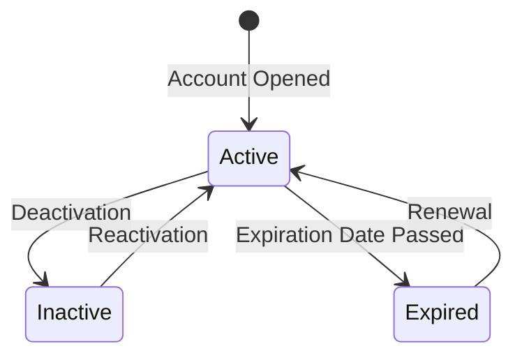
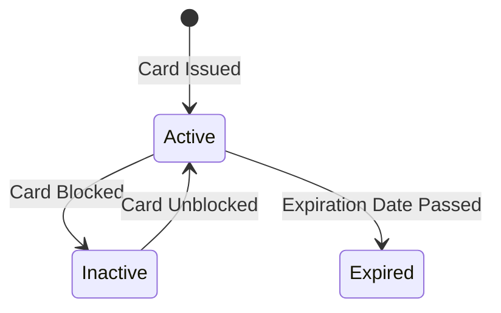
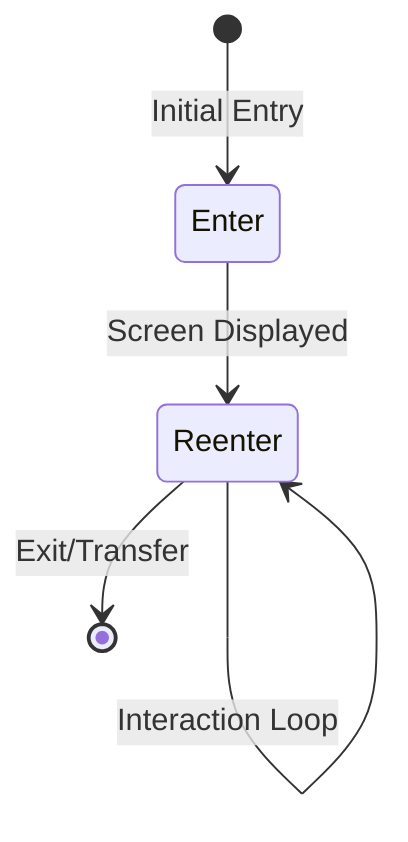
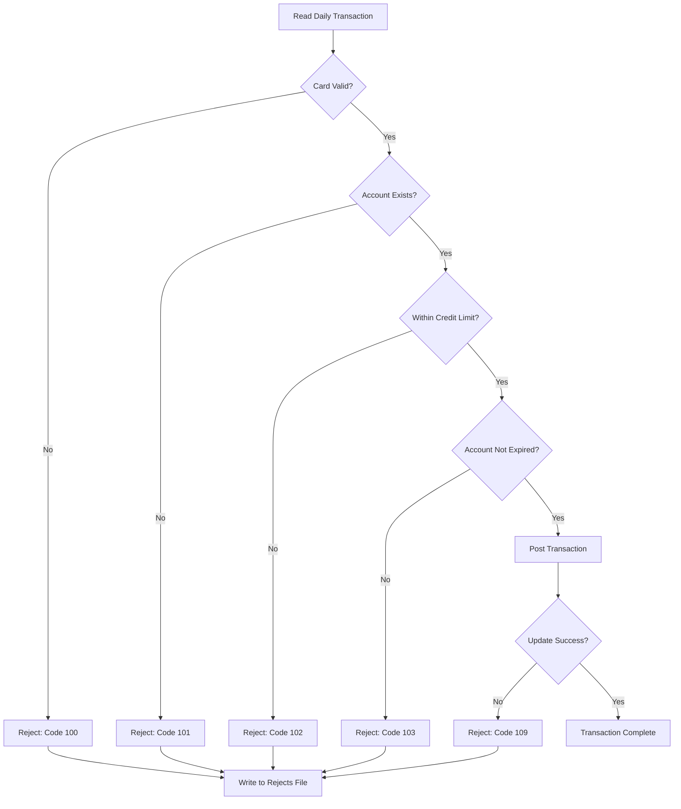

# CardDemo Business Rules Catalog

## Overview

This document catalogs the business rules extracted from the CardDemo COBOL codebase. Rules are categorized by type and include source code references, triggering conditions, and code excerpts where applicable.

---

## Rule Categories

| Category | Description | Count |
|----------|-------------|-------|
| Validation | Input format, range, and required field checks | 25+ |
| Calculation | Balance, interest, and limit computations | 8 |
| State Transition | Entity status changes | 6 |
| Authorization | Role-based access control | 5 |
| Temporal | Date-based validations and expirations | 4 |
| Limit/Threshold | Credit and overlimit checks | 3 |
| Sequence | ID generation and processing order | 3 |
| Rejection | Batch processing failure codes | 5 |

---

## Validation Rules

### Authentication Validation

| Rule ID | Rule Name | Description | Source | Code Excerpt |
|---------|-----------|-------------|--------|--------------|
| BR-V001 | User ID Required | User ID cannot be empty for login | `COSGN00C.cbl:118-122` | `WHEN USERIDI OF COSGN0AI = SPACES OR LOW-VALUES` |
| BR-V002 | Password Required | Password cannot be empty for login | `COSGN00C.cbl:123-127` | `WHEN PASSWDI OF COSGN0AI = SPACES OR LOW-VALUES` |
| BR-V003 | Password Match | Entered password must match stored value | `COSGN00C.cbl:223` | `IF SEC-USR-PWD = WS-USER-PWD` |
| BR-V004 | User Exists | User ID must exist in security file | `COSGN00C.cbl:247-251` | Response code 13 = NOTFND |

### Account Validation

| Rule ID | Rule Name | Description | Source | Code Excerpt |
|---------|-----------|-------------|--------|--------------|
| BR-V005 | Account ID Numeric | Account ID must be 11-digit numeric | `COCRDUPC.cbl:740-746` | `IF CC-ACCT-ID IS NOT NUMERIC` |
| BR-V006 | Account ID Non-Zero | Account ID cannot be all zeros | `COCRDUPC.cbl:725-727` | `CC-ACCT-ID-N EQUAL ZEROS` |
| BR-V007 | Account Exists | Account must exist in ACCTDAT file | `COBIL00C.cbl:359-364` | `WHEN DFHRESP(NOTFND) ... 'Account ID NOT found...'` |
| BR-V008 | Account ID Required | Account ID must be provided for operations | `COBIL00C.cbl:159-164` | `WHEN ACTIDINI OF COBIL0AI = SPACES OR LOW-VALUES` |

### Card Validation

| Rule ID | Rule Name | Description | Source | Code Excerpt |
|---------|-----------|-------------|--------|--------------|
| BR-V009 | Card Number Numeric | Card number must be 16-digit numeric | `COCRDUPC.cbl:784-791` | `IF CC-CARD-NUM IS NOT NUMERIC` |
| BR-V010 | Card Number Non-Zero | Card number cannot be all zeros | `COCRDUPC.cbl:768-770` | `CC-CARD-NUM-N EQUAL ZEROS` |
| BR-V011 | Card Name Alphabetic | Embossed name can only contain alphabets and spaces | `COCRDUPC.cbl:822-837` | `INSPECT CARD-NAME-CHECK CONVERTING LIT-ALL-ALPHA-FROM TO LIT-ALL-SPACES-TO` |
| BR-V012 | Card Status Y/N | Card active status must be Y or N | `COCRDUPC.cbl:846-872` | `88 CARD-STATUS-MUST-BE-YES-NO VALUE 'Card Active Status must be Y or N'` |
| BR-V013 | Expiry Month 1-12 | Card expiry month must be between 1 and 12 | `COCRDUPC.cbl:877-907` | `88 CARD-EXPIRY-MONTH-NOT-VALID VALUE 'Card expiry month must be between 1 and 12'` |
| BR-V014 | Expiry Year Valid | Card expiry year must be in valid range | `COCRDUPC.cbl:913-944` | `88 CARD-EXPIRY-YEAR-NOT-VALID VALUE 'Invalid card expiry year'` |
| BR-V015 | Card Exists | Card must exist in CARDDAT file | `CBTRN02C.cbl:380-391` | `INVALID KEY MOVE 100 TO WS-VALIDATION-FAIL-REASON` |

### Transaction Validation

| Rule ID | Rule Name | Description | Source | Code Excerpt |
|---------|-----------|-------------|--------|--------------|
| BR-V016 | Valid Card for Transaction | Card number must exist in cross-reference | `CBTRN02C.cbl:380-391` | `MOVE 'INVALID CARD NUMBER FOUND' TO WS-VALIDATION-FAIL-REASON-DESC` |
| BR-V017 | Account for Card | Account linked to card must exist | `CBTRN02C.cbl:393-400` | `MOVE 'ACCOUNT RECORD NOT FOUND' TO WS-VALIDATION-FAIL-REASON-DESC` |
| BR-V018 | Confirmation Y/N | Payment confirmation must be Y or N | `COBIL00C.cbl:173-190` | `WHEN OTHER MOVE 'Invalid value. Valid values are (Y/N)...'` |

### Customer Validation (from COACTUPC)

| Rule ID | Rule Name | Description | Source | Code Excerpt |
|---------|-----------|-------------|--------|--------------|
| BR-V019 | SSN Format | SSN must be 9-digit numeric, not starting with 000, 666, or 900-999 | `COACTUPC.cbl:117-146` | `88 INVALID-SSN-PART1 VALUES 0, 666, 900 THRU 999` |
| BR-V020 | Phone Format | Phone must follow (xxx)xxx-xxxx format | `COACTUPC.cbl:82-115` | US phone number structure |
| BR-V021 | State Code Valid | State code must be valid US state | `CSLKPCDY.cpy:1012-1069` | `88 VALID-US-STATE-CODE VALUES 'AL', 'AK', ...` |
| BR-V022 | ZIP Code Valid | ZIP must match state code pattern | `CSLKPCDY.cpy:1071-1313` | `88 VALID-US-STATE-ZIP-CD2-COMBO VALUES...` |
| BR-V023 | Phone Area Code Valid | Phone area code must be valid NANPA code | `CSLKPCDY.cpy:24-520` | `88 VALID-PHONE-AREA-CODE VALUES '201', '202', ...` |

---

## Calculation Rules

| Rule ID | Rule Name | Description | Source | Code Excerpt |
|---------|-----------|-------------|--------|--------------|
| BR-C001 | Interest Rate Lookup | Interest rate determined by group, type, and category | `CVTRA02Y.cpy:4-10` | DIS-GROUP-KEY composite lookup |
| BR-C002 | Category Balance Update | Category balance updated by adding transaction amount | `CBTRN02C.cbl:527` | `ADD DALYTRAN-AMT TO TRAN-CAT-BAL` |
| BR-C003 | Account Balance Update | Current balance updated by adding transaction amount | `CBTRN02C.cbl:547` | `ADD DALYTRAN-AMT TO ACCT-CURR-BAL` |
| BR-C004 | Cycle Credit Update | Cycle credit incremented for positive transactions | `CBTRN02C.cbl:548-549` | `IF DALYTRAN-AMT >= 0 ADD DALYTRAN-AMT TO ACCT-CURR-CYC-CREDIT` |
| BR-C005 | Cycle Debit Update | Cycle debit incremented for negative transactions | `CBTRN02C.cbl:550-552` | `ELSE ADD DALYTRAN-AMT TO ACCT-CURR-CYC-DEBIT` |
| BR-C006 | Bill Payment Balance | Payment amount subtracted from current balance | `COBIL00C.cbl:234` | `COMPUTE ACCT-CURR-BAL = ACCT-CURR-BAL - TRAN-AMT` |
| BR-C007 | Temp Balance Check | Projected balance = cycle credits - cycle debits + transaction | `CBTRN02C.cbl:403-405` | `COMPUTE WS-TEMP-BAL = ACCT-CURR-CYC-CREDIT - ACCT-CURR-CYC-DEBIT + DALYTRAN-AMT` |
| BR-C008 | Transaction ID Generation | New transaction ID = last transaction ID + 1 | `COBIL00C.cbl:217-219` | `ADD 1 TO WS-TRAN-ID-NUM` |

---

## State Transition Rules

### Account Status Transitions



| Rule ID | Rule Name | Description | Source |
|---------|-----------|-------------|--------|
| BR-S001 | Account Active/Inactive | Account status can be Y (active) or N (inactive) | `CVACT01Y.cpy:6` |
| BR-S002 | Account Expiration Check | Transactions rejected if account expired | `CBTRN02C.cbl:414-420` |

### Card Status Transitions



| Rule ID | Rule Name | Description | Source |
|---------|-----------|-------------|--------|
| BR-S003 | Card Active/Inactive | Card active status must be Y or N | `CVACT02Y.cpy:10` |
| BR-S004 | Card Status Change | Status change requires confirmation | `COCRDUPC.cbl:987-991` |

### Program Context Transitions



| Rule ID | Rule Name | Description | Source |
|---------|-----------|-------------|--------|
| BR-S005 | Program Enter | Context = 0 for initial program entry | `COCOM01Y.cpy:30` |
| BR-S006 | Program Reenter | Context = 1 for subsequent interactions | `COCOM01Y.cpy:31` |

---

## Authorization Rules

| Rule ID | Rule Name | Description | Source | Code Excerpt |
|---------|-----------|-------------|--------|--------------|
| BR-A001 | Admin Menu Routing | Admin users (type 'A') route to COADM01C | `COSGN00C.cbl:230-234` | `IF CDEMO-USRTYP-ADMIN EXEC CICS XCTL PROGRAM ('COADM01C')` |
| BR-A002 | User Menu Routing | Regular users (type 'U') route to COMEN01C | `COSGN00C.cbl:235-239` | `ELSE EXEC CICS XCTL PROGRAM ('COMEN01C')` |
| BR-A003 | Menu Option Filtering | Menu options filtered by user type flag | `COMEN02Y.cpy:98` | `CDEMO-MENU-OPT-USRTYPE PIC X(01)` |
| BR-A004 | Admin Functions | User management restricted to admin users | `COADM02Y.cpy:28-44` | Admin menu contains user CRUD options |
| BR-A005 | User Type Values | User type must be 'A' (Admin) or 'U' (User) | `COCOM01Y.cpy:27-28` | `88 CDEMO-USRTYP-ADMIN VALUE 'A'. 88 CDEMO-USRTYP-USER VALUE 'U'.` |

---

## Temporal Rules

| Rule ID | Rule Name | Description | Source | Code Excerpt |
|---------|-----------|-------------|--------|--------------|
| BR-T001 | Transaction Before Expiration | Transaction date must be before account expiration | `CBTRN02C.cbl:414-420` | `IF ACCT-EXPIRAION-DATE >= DALYTRAN-ORIG-TS (1:10)` |
| BR-T002 | Month Range 1-12 | Expiry month must be between 1 and 12 | `COCRDUPC.cbl:898` | `IF VALID-MONTH` |
| BR-T003 | Year Range Valid | Expiry year must be in acceptable range (1950-2099) | `COCRDUPC.cbl:932-934` | `IF VALID-YEAR` |
| BR-T004 | Timestamp Format | Timestamps in DB2 format: YYYY-MM-DD-HH.MM.SS.FFFFFF | `CBTRN02C.cbl:149-174` | DB2-FORMAT-TS structure |

---

## Limit/Threshold Rules

| Rule ID | Rule Name | Description | Source | Code Excerpt |
|---------|-----------|-------------|--------|--------------|
| BR-L001 | Credit Limit Check | Transaction cannot exceed credit limit | `CBTRN02C.cbl:407-413` | `IF ACCT-CREDIT-LIMIT >= WS-TEMP-BAL CONTINUE ELSE MOVE 102 TO WS-VALIDATION-FAIL-REASON` |
| BR-L002 | Zero/Negative Balance Block | Cannot pay if balance is zero or negative | `COBIL00C.cbl:198-205` | `IF ACCT-CURR-BAL <= ZEROS ... 'You have nothing to pay...'` |
| BR-L003 | FICO Score Range | FICO score must be 3-digit number (300-850) | `CVCUS01Y.cpy:22` | `CUST-FICO-CREDIT-SCORE PIC 9(03)` |

---

## Sequence/Order Rules

| Rule ID | Rule Name | Description | Source | Code Excerpt |
|---------|-----------|-------------|--------|--------------|
| BR-Q001 | Transaction ID Sequence | New transaction ID = highest existing ID + 1 | `COBIL00C.cbl:212-219` | `MOVE HIGH-VALUES TO TRAN-ID ... ADD 1 TO WS-TRAN-ID-NUM` |
| BR-Q002 | Batch Processing Order | Daily transactions processed sequentially | `CBTRN02C.cbl:202-219` | `PERFORM UNTIL END-OF-FILE = 'Y'` |
| BR-Q003 | Validation Before Posting | All validations must pass before transaction posts | `CBTRN02C.cbl:211-216` | `IF WS-VALIDATION-FAIL-REASON = 0 PERFORM 2000-POST-TRANSACTION` |

---

## Rejection/Exception Rules

### Batch Rejection Codes

| Code | Rule ID | Description | Trigger | Source |
|------|---------|-------------|---------|--------|
| 100 | BR-R001 | Invalid Card Number | Card not found in cross-reference | `CBTRN02C.cbl:385-387` |
| 101 | BR-R002 | Account Not Found | Account linked to card does not exist | `CBTRN02C.cbl:397-399` |
| 102 | BR-R003 | Overlimit Transaction | Transaction would exceed credit limit | `CBTRN02C.cbl:410-412` |
| 103 | BR-R004 | Transaction After Expiration | Account expired before transaction date | `CBTRN02C.cbl:417-419` |
| 109 | BR-R005 | Account Update Failed | Could not rewrite account record | `CBTRN02C.cbl:556-558` |

### Rejection Processing Flow



---

## Business Rule Decision Tables

### Bill Payment Decision

| Balance | Confirmation | Action | Message |
|---------|--------------|--------|---------|
| <= 0 | Any | Reject | "You have nothing to pay" |
| > 0 | Empty | Prompt | "Confirm to make a bill payment" |
| > 0 | Y/y | Process | Create transaction, update balance |
| > 0 | N/n | Cancel | Clear screen |
| > 0 | Other | Error | "Invalid value. Valid values are (Y/N)" |

### User Authentication Decision

| User ID | Password | User Found | Password Match | Action |
|---------|----------|------------|----------------|--------|
| Empty | Any | - | - | Error: "Please enter User ID" |
| Provided | Empty | - | - | Error: "Please enter Password" |
| Provided | Provided | No | - | Error: "User not found" |
| Provided | Provided | Yes | No | Error: "Wrong Password" |
| Provided | Provided | Yes | Yes (Admin) | Transfer to COADM01C |
| Provided | Provided | Yes | Yes (User) | Transfer to COMEN01C |

### Card Update Validation

| Field | Condition | Valid | Message |
|-------|-----------|-------|---------|
| Card Name | Contains non-alpha chars | No | "Card name can only contain alphabets and spaces" |
| Card Status | Not Y or N | No | "Card Active Status must be Y or N" |
| Expiry Month | < 1 or > 12 | No | "Card expiry month must be between 1 and 12" |
| Expiry Year | Out of range | No | "Invalid card expiry year" |

---

## Rule Implementation Patterns

### Validation Pattern (COBOL)

```cobol
* Pattern: Field validation with error flag and message
IF FIELD-TO-VALIDATE = SPACES OR LOW-VALUES
   SET INPUT-ERROR           TO TRUE
   SET FLG-FIELD-BLANK       TO TRUE
   IF WS-RETURN-MSG-OFF
      SET ERROR-MESSAGE-FLAG TO TRUE
   END-IF
   GO TO VALIDATION-EXIT
END-IF

IF FIELD-TO-VALIDATE IS NOT NUMERIC
   SET INPUT-ERROR           TO TRUE
   SET FLG-FIELD-NOT-OK      TO TRUE
   IF WS-RETURN-MSG-OFF
      MOVE 'Error message' TO WS-RETURN-MSG
   END-IF
   GO TO VALIDATION-EXIT
END-IF
```

### 88-Level Condition Pattern

```cobol
* Pattern: State flags using 88-level conditions
05 WS-STATUS-FLAG           PIC X(01).
   88 STATUS-VALID          VALUE LOW-VALUES.
   88 STATUS-INVALID        VALUE '0'.
   88 STATUS-BLANK          VALUE 'B'.

* Usage:
IF STATUS-VALID
   CONTINUE
ELSE
   IF STATUS-BLANK
      MOVE 'Field required' TO MESSAGE
   ELSE
      MOVE 'Invalid value' TO MESSAGE
   END-IF
END-IF
```

---

## Source File Index

| Source File | Rule Types | Rule Count |
|-------------|------------|------------|
| COSGN00C.cbl | Authentication | 4 |
| COCRDUPC.cbl | Card Validation | 6 |
| COACTUPC.cbl | Account/Customer Validation | 10+ |
| COBIL00C.cbl | Payment Validation, Calculation | 5 |
| CBTRN02C.cbl | Batch Validation, Rejection | 8 |
| CBACT01C.cbl | Account batch creation | - |
| CBACT02C.cbl | Account batch refresh | - |
| CBACT03C.cbl | Account batch update | - |
| CBACT04C.cbl | Account batch maintenance | - |
| CBEXPORT.cbl | Data export processing | - |
| CBIMPORT.cbl | Data import processing | - |
| CBSTM03A.CBL | Statement generation (part A) | - |
| CBSTM03B.CBL | Statement generation (part B) | - |
| COCOM01Y.cpy | Authorization, State | 4 |
| CSLKPCDY.cpy | Reference Data Validation | 3 |
| CVACT01Y.cpy | Account State | 1 |
| CVACT02Y.cpy | Card State | 1 |
