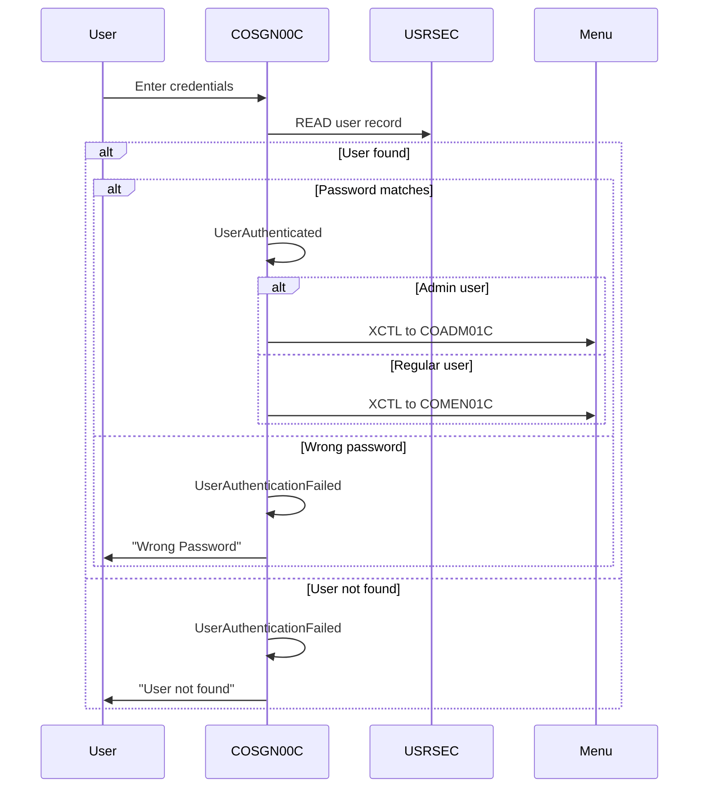
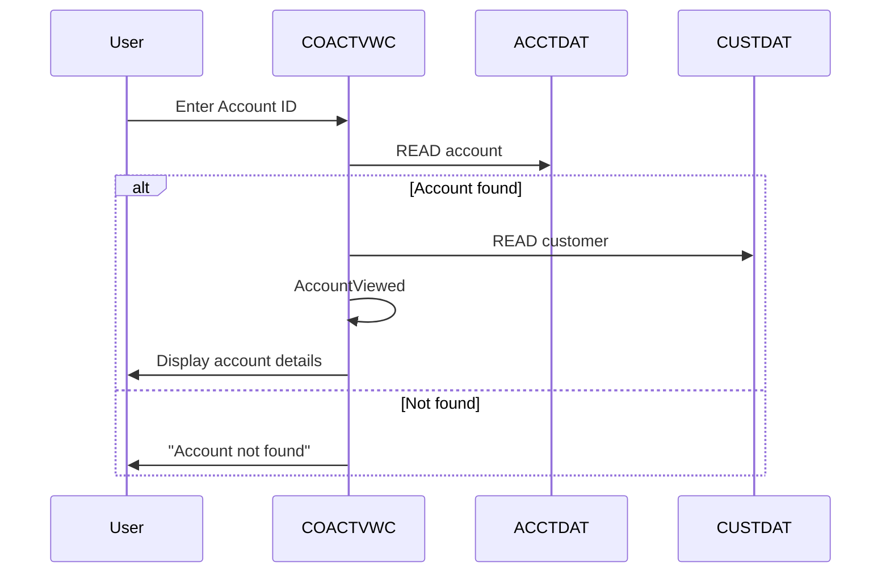
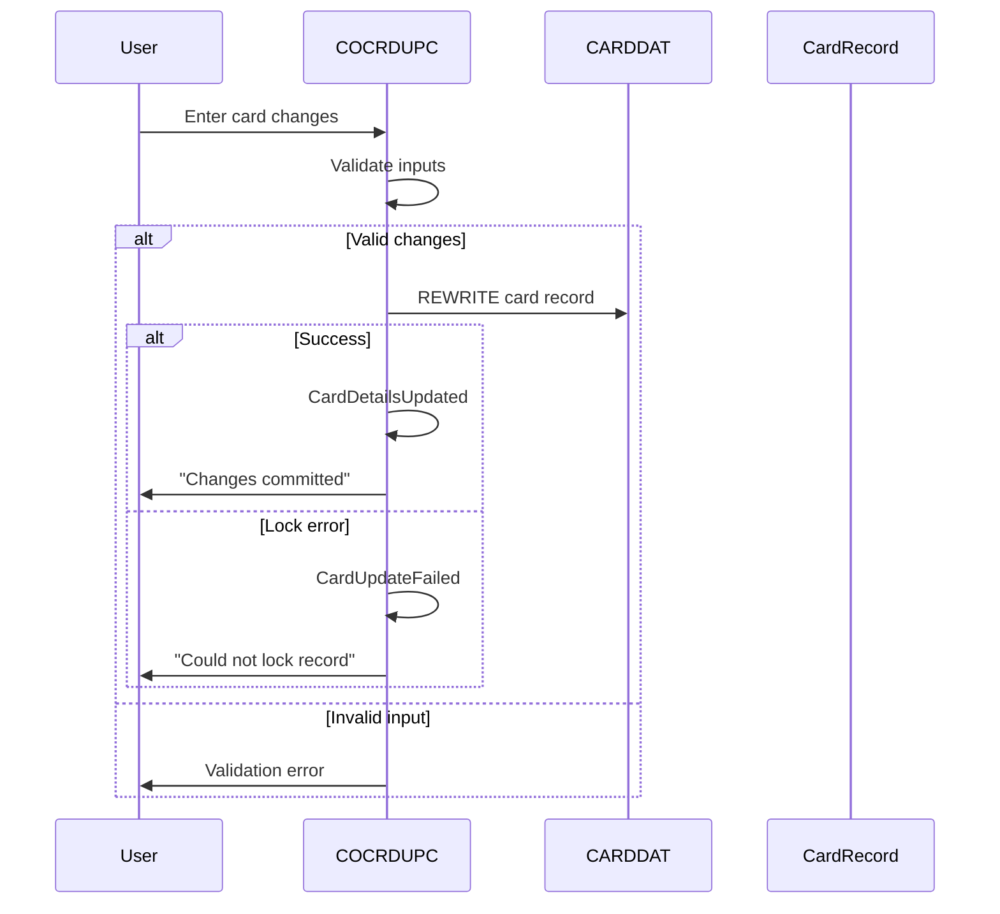
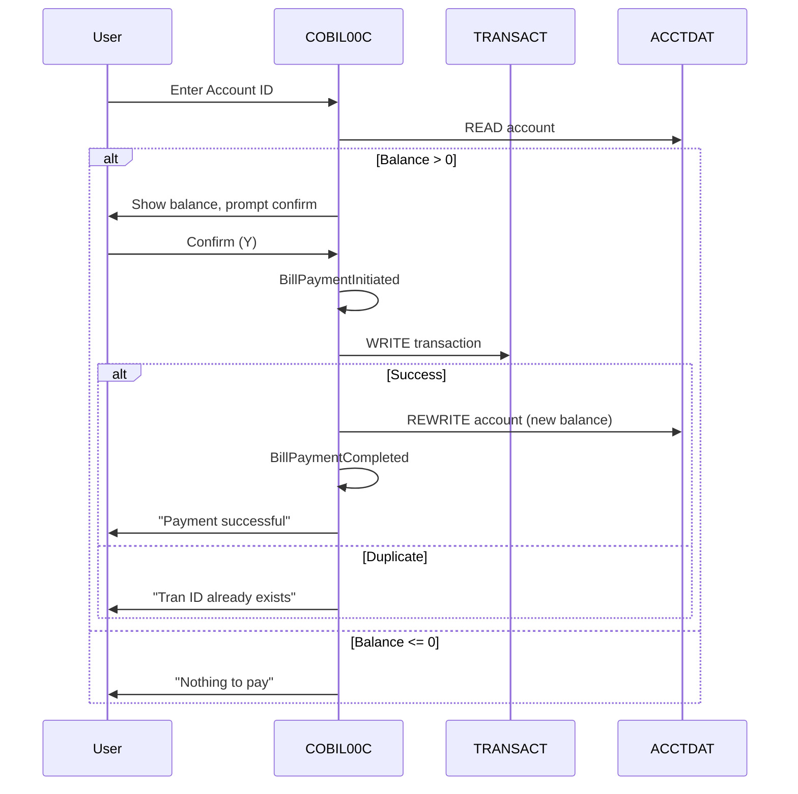
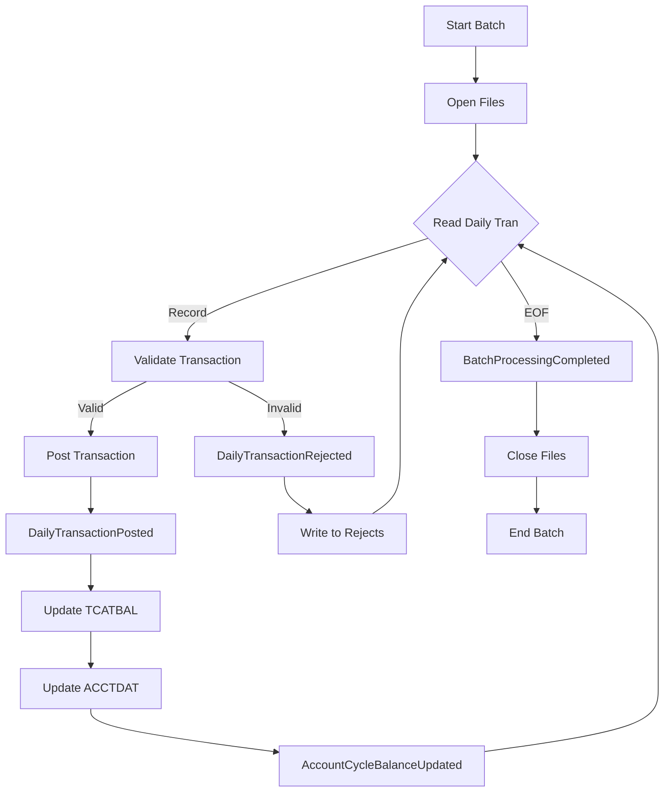
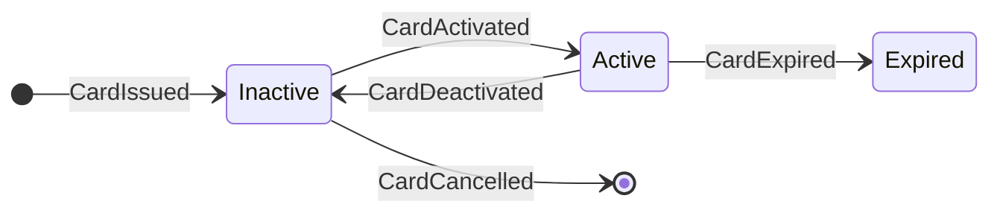
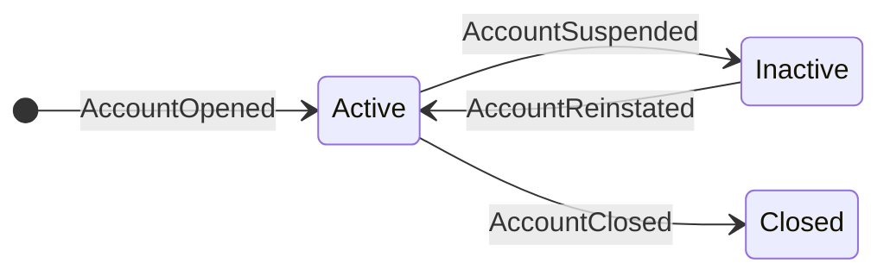
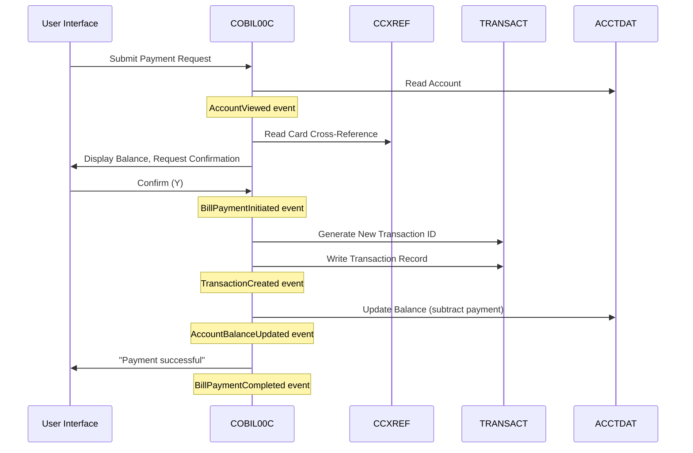
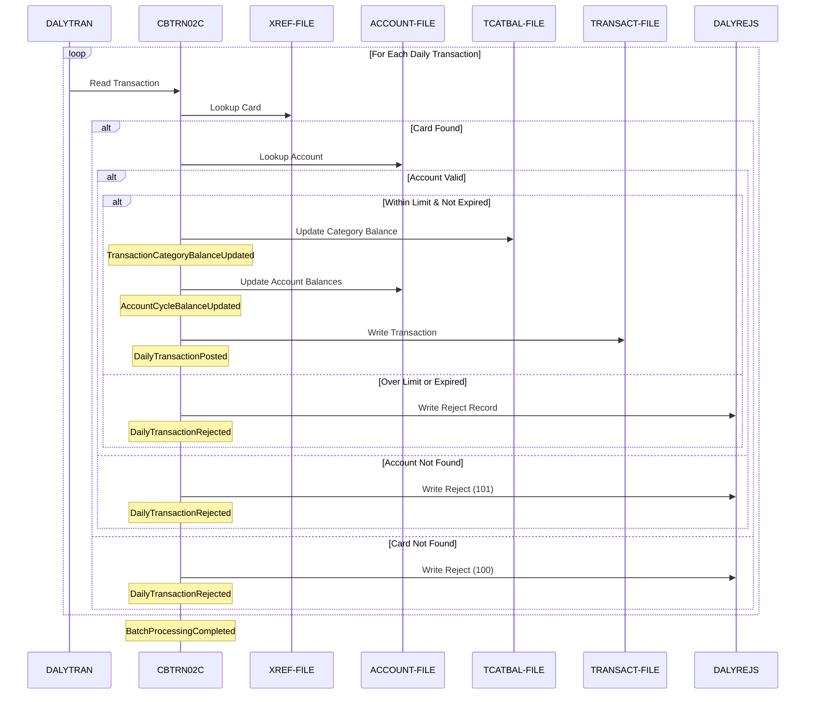

# CardDemo Domain Events Catalog

## Table of Contents

- [Overview](#overview)
- [Event Summary](#event-summary)
- [Online Domain Events](#online-domain-events)
  - [Authentication Events](#authentication-events)
  - [Account Events](#account-events)
  - [Card Events](#card-events)
  - [Transaction Events (Online)](#transaction-events-online)
  - [User Management Events](#user-management-events)
- [Batch Domain Events](#batch-domain-events)
  - [Transaction Posting Events](#transaction-posting-events)
- [State Transition Events](#state-transition-events)
  - [Card Status Transitions](#card-status-transitions)
  - [Account Status Transitions](#account-status-transitions)
- [Event Flow Diagrams](#event-flow-diagrams)
  - [Bill Payment Event Flow](#bill-payment-event-flow)
  - [Batch Posting Event Flow](#batch-posting-event-flow)
- [Event Aggregation by Aggregate](#event-aggregation-by-aggregate)
- [Event Source References](#event-source-references)
- [Event-Driven Architecture Considerations](#event-driven-architecture-considerations)

---

## Overview

This document catalogs the domain events identified in the CardDemo application. Domain events represent significant state changes or actions that occur within the system. Events are categorized by their origin (online vs. batch) and the aggregate they affect.

---

## Event Summary

| Category | Event Count | Primary Source |
|----------|-------------|----------------|
| Authentication Events | 3 | COSGN00C.cbl |
| Account Events | 4 | COACTVWC.cbl, COBIL00C.cbl |
| Card Events | 3 | COCRDUPC.cbl |
| Transaction Events | 6 | COBIL00C.cbl, CBTRN02C.cbl |
| User Management Events | 4 | COUSR01C-03C.cbl |
| Batch Processing Events | 3 | CBTRN02C.cbl |

---

## Online Domain Events

### Authentication Events



| Event | Trigger | Payload | Source | Line |
|-------|---------|---------|--------|------|
| **UserAuthenticated** | Successful login (password match) | userId, userType, timestamp | `COSGN00C.cbl` | 222-240 |
| **UserAuthenticationFailed** | Wrong password | userId, failureReason="Wrong Password" | `COSGN00C.cbl` | 241-246 |
| **UserNotFound** | User ID not in USRSEC | userId, failureReason="User not found" | `COSGN00C.cbl` | 247-251 |

**Event Payload - UserAuthenticated:**
```
{
  userId: SEC-USR-ID (8 chars),
  userType: SEC-USR-TYPE ('A' or 'U'),
  fromProgram: CDEMO-FROM-PROGRAM,
  timestamp: CURRENT-DATE
}
```

---

### Account Events



| Event | Trigger | Payload | Source | Line |
|-------|---------|---------|--------|------|
| **AccountViewed** | Successful account lookup | accountId, userId, viewTimestamp | `COACTVWC.cbl` | Various |
| **AccountUpdated** | Account record rewritten | accountId, changedFields, userId | `COACTUPC.cbl` | Various |
| **AccountBalanceUpdated** | Balance changed (payment, posting) | accountId, previousBalance, newBalance | `COBIL00C.cbl` | 234 |
| **AccountLookupFailed** | Account not found | accountId, reason | `COBIL00C.cbl` | 359-364 |

---

### Card Events



| Event | Trigger | Payload | Source | Line |
|-------|---------|---------|--------|------|
| **CardDetailsUpdated** | Card record successfully rewritten | cardNum, changedFields (name, status, expiry), userId | `COCRDUPC.cbl` | 990-999 |
| **CardActivated** | Card status changed N to Y | cardNum, accountId | `COCRDUPC.cbl` | Status update |
| **CardDeactivated** | Card status changed Y to N | cardNum, accountId, reason | `COCRDUPC.cbl` | Status update |

**Event Payload - CardDetailsUpdated:**
```
{
  cardNum: CARD-NUM (16 chars),
  accountId: CARD-ACCT-ID,
  changes: {
    embossedName: { old, new },
    activeStatus: { old, new },
    expirationDate: { old, new }
  },
  userId: CDEMO-USER-ID,
  timestamp: CURRENT-DATE
}
```

---

### Transaction Events (Online)



| Event | Trigger | Payload | Source | Line |
|-------|---------|---------|--------|------|
| **BillPaymentInitiated** | User confirms payment (Y) | accountId, amount, userId | `COBIL00C.cbl` | 210-211 |
| **BillPaymentCompleted** | Transaction written, balance updated | transactionId, accountId, amount | `COBIL00C.cbl` | 523-532 |
| **BillPaymentFailed** | Transaction write error | accountId, reason, errorCode | `COBIL00C.cbl` | 533-547 |
| **TransactionCreated** | New transaction record written | transactionId, full TRAN-RECORD | `COBIL00C.cbl` | 512-520 |

**Event Payload - BillPaymentCompleted:**
```
{
  transactionId: TRAN-ID (16 chars),
  accountId: ACCT-ID,
  amount: TRAN-AMT,
  transactionType: '02' (Credit),
  transactionCategory: 2,
  source: 'POS TERM',
  description: 'BILL PAYMENT - ONLINE',
  cardNum: XREF-CARD-NUM,
  merchantId: 999999999,
  merchantName: 'BILL PAYMENT',
  originTimestamp: WS-TIMESTAMP,
  processTimestamp: WS-TIMESTAMP,
  previousBalance: oldBalance,
  newBalance: 0
}
```

---

### User Management Events

| Event | Trigger | Payload | Source |
|-------|---------|---------|--------|
| **UserCreated** | New user added to USRSEC | userId, firstName, lastName, userType | `COUSR01C.cbl` |
| **UserUpdated** | User record modified | userId, changedFields | `COUSR02C.cbl` |
| **UserDeleted** | User removed from USRSEC | userId, deletedBy | `COUSR03C.cbl` |
| **UserListViewed** | Admin views user list | viewedBy, userCount | `COUSR00C.cbl` |

---

## Batch Domain Events

### Transaction Posting Events



| Event | Trigger | Payload | Source | Line |
|-------|---------|---------|--------|------|
| **DailyTransactionPosted** | Transaction passes validation and is written | transactionId, accountId, amount, typeCode, categoryCode | `CBTRN02C.cbl` | 424-444 |
| **DailyTransactionRejected** | Transaction fails validation | transactionId, rejectionCode, rejectionReason | `CBTRN02C.cbl` | 446-465 |
| **AccountCycleBalanceUpdated** | Account balances updated after posting | accountId, cycleCredit, cycleDebit, currentBalance | `CBTRN02C.cbl` | 545-560 |
| **TransactionCategoryBalanceUpdated** | Category balance recalculated | accountId, typeCode, categoryCode, newBalance | `CBTRN02C.cbl` | 467-543 |
| **BatchProcessingCompleted** | All daily transactions processed | transactionCount, rejectCount, returnCode | `CBTRN02C.cbl` | 227-233 |

**Event Payload - DailyTransactionPosted:**
```
{
  transactionId: TRAN-ID,
  accountId: XREF-ACCT-ID,
  cardNum: DALYTRAN-CARD-NUM,
  typeCode: TRAN-TYPE-CD,
  categoryCode: TRAN-CAT-CD,
  source: TRAN-SOURCE,
  description: TRAN-DESC,
  amount: TRAN-AMT,
  merchant: {
    id: TRAN-MERCHANT-ID,
    name: TRAN-MERCHANT-NAME,
    city: TRAN-MERCHANT-CITY,
    zip: TRAN-MERCHANT-ZIP
  },
  originTimestamp: TRAN-ORIG-TS,
  processTimestamp: TRAN-PROC-TS (DB2 format)
}
```

**Event Payload - DailyTransactionRejected:**
```
{
  transactionId: DALYTRAN-ID,
  cardNum: DALYTRAN-CARD-NUM,
  rejectionCode: WS-VALIDATION-FAIL-REASON,
  rejectionReason: WS-VALIDATION-FAIL-REASON-DESC,
  originalRecord: DALYTRAN-RECORD (350 bytes)
}
```

**Rejection Codes:**
| Code | Event Subtype | Reason |
|------|---------------|--------|
| 100 | CardValidationFailed | Invalid card number |
| 101 | AccountLookupFailed | Account not found |
| 102 | OverlimitRejected | Transaction exceeds credit limit |
| 103 | ExpiredAccountRejected | Account expired |
| 109 | AccountUpdateFailed | Could not update account record |

---

## State Transition Events

### Card Status Transitions



| From State | To State | Event | Trigger |
|------------|----------|-------|---------|
| - | Inactive | CardIssued | New card created |
| Inactive | Active | CardActivated | Status changed to 'Y' |
| Active | Inactive | CardDeactivated | Status changed to 'N' |
| Active | Expired | CardExpired | Expiration date passed |

### Account Status Transitions



| From State | To State | Event | Trigger |
|------------|----------|-------|---------|
| - | Active | AccountOpened | New account created |
| Active | Inactive | AccountSuspended | Status set to 'N' |
| Inactive | Active | AccountReinstated | Status set to 'Y' |
| Active | Closed | AccountClosed | Account terminated |

---

## Event Flow Diagrams

### Bill Payment Event Flow



### Batch Posting Event Flow



---

## Event Aggregation by Aggregate

### Account Aggregate Events
- AccountViewed
- AccountUpdated
- AccountBalanceUpdated
- AccountCycleBalanceUpdated
- AccountLookupFailed
- AccountSuspended
- AccountReinstated

### Card Aggregate Events
- CardDetailsUpdated
- CardActivated
- CardDeactivated
- CardExpired
- CardValidationFailed

### Transaction Aggregate Events
- TransactionCreated
- DailyTransactionPosted
- DailyTransactionRejected
- BillPaymentInitiated
- BillPaymentCompleted
- BillPaymentFailed

### User Aggregate Events
- UserAuthenticated
- UserAuthenticationFailed
- UserNotFound
- UserCreated
- UserUpdated
- UserDeleted

### Batch Process Events
- BatchProcessingCompleted
- TransactionCategoryBalanceUpdated

### Additional Batch Programs (Not Yet Event-Mapped)

The following batch programs also produce domain-relevant state changes but are not yet fully mapped to domain events:

| Program | Domain Actions |
|---------|---------------|
| CBACT02C.cbl | Account data refresh (triggers AccountUpdated events) |
| CBACT03C.cbl | Account record updates (triggers AccountUpdated events) |
| CBACT04C.cbl | Account maintenance (triggers AccountUpdated events) |
| CBEXPORT.cbl | Data export to sequential files (read-only, no state changes) |
| CBIMPORT.cbl | Data import from sequential files (triggers bulk entity creation events) |
| CBSTM03A.CBL | Statement generation part A (read-only reporting) |
| CBSTM03B.CBL | Statement generation part B (read-only reporting) |

---

## Event Source References

| Event | Source Program | COBOL Paragraph/Section |
|-------|----------------|------------------------|
| UserAuthenticated | COSGN00C.cbl | READ-USER-SEC-FILE |
| BillPaymentCompleted | COBIL00C.cbl | WRITE-TRANSACT-FILE |
| CardDetailsUpdated | COCRDUPC.cbl | 9200-WRITE-PROCESSING |
| DailyTransactionPosted | CBTRN02C.cbl | 2000-POST-TRANSACTION |
| DailyTransactionRejected | CBTRN02C.cbl | 2500-WRITE-REJECT-REC |
| AccountCycleBalanceUpdated | CBTRN02C.cbl | 2800-UPDATE-ACCOUNT-REC |
| TransactionCategoryBalanceUpdated | CBTRN02C.cbl | 2700-UPDATE-TCATBAL |
| BatchProcessingCompleted | CBTRN02C.cbl | PROCEDURE DIVISION (main) |

---

## Event-Driven Architecture Considerations

### Event Sourcing Potential
The CardDemo application maintains state through file updates rather than event sourcing, but the identified events could form the basis for an event-sourced architecture during modernization:

1. **Transaction events** are naturally immutable and append-only
2. **Balance updates** could be derived from transaction events
3. **State changes** (card status, account status) could be event-driven

### Integration Points
Events that would be valuable for external system integration:
- BillPaymentCompleted - Trigger confirmation notifications
- DailyTransactionRejected - Alert for failed transactions
- CardDeactivated - Fraud detection integration
- UserAuthenticated - Audit logging

### Event Consumers
Potential consumers in a modernized architecture:
- Notification Service (email, SMS)
- Fraud Detection System
- Audit/Compliance Logging
- Real-time Analytics
- Customer Portal Updates
