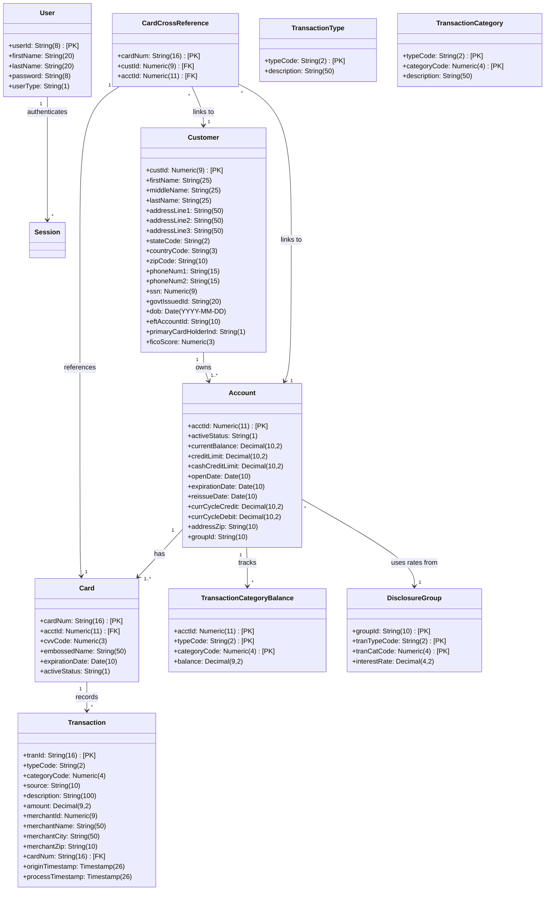
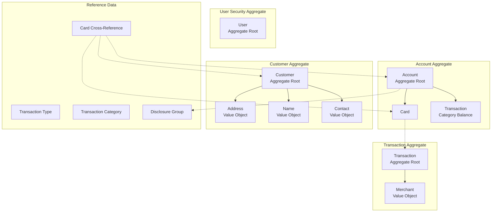

# CardDemo Domain Model

## Table of Contents

- [Executive Summary](#executive-summary)
- [Domain Model Overview](#domain-model-overview)
- [Core Domain Entities](#core-domain-entities)
  - [1. Account (Aggregate Root)](#1-account-aggregate-root)
  - [2. Customer (Aggregate Root)](#2-customer-aggregate-root)
  - [3. Card (Entity - Child of Account)](#3-card-entity---child-of-account)
  - [4. Transaction (Event Entity)](#4-transaction-event-entity)
  - [5. User (Security Entity)](#5-user-security-entity)
  - [6. Card Cross-Reference (Junction Entity)](#6-card-cross-reference-junction-entity)
- [Supporting Entities (Reference Data)](#supporting-entities-reference-data)
  - [Transaction Category Balance](#transaction-category-balance)
  - [Disclosure Group (Interest Rates)](#disclosure-group-interest-rates)
  - [Transaction Type](#transaction-type)
  - [Transaction Category](#transaction-category)
- [Value Objects](#value-objects)
- [Aggregate Boundaries](#aggregate-boundaries)
- [Data File Mapping](#data-file-mapping)
- [Entity Lifecycle States](#entity-lifecycle-states)
  - [Batch Program Inventory](#batch-program-inventory)
- [Source File References](#source-file-references)

---

## Executive Summary

This document presents the domain model extracted from the CardDemo COBOL mainframe application. CardDemo is a credit card processing demonstration system that manages accounts, cards, customers, transactions, and user authentication through CICS online transactions and batch processing.

## Domain Model Overview



---

## Core Domain Entities

### 1. Account (Aggregate Root)

**Source**: `app/cpy/CVACT01Y.cpy:4`
**Record Length**: 300 bytes
**VSAM File**: ACCTDAT

The Account entity represents a credit card account and serves as an aggregate root in the domain model.

| Field | COBOL Definition | Business Meaning |
|-------|------------------|------------------|
| ACCT-ID | PIC 9(11) | Unique account identifier (primary key) |
| ACCT-ACTIVE-STATUS | PIC X(01) | Account status flag (Y=Active, N=Inactive) |
| ACCT-CURR-BAL | PIC S9(10)V99 | Current account balance (signed decimal) |
| ACCT-CREDIT-LIMIT | PIC S9(10)V99 | Maximum credit limit |
| ACCT-CASH-CREDIT-LIMIT | PIC S9(10)V99 | Maximum cash advance limit |
| ACCT-OPEN-DATE | PIC X(10) | Account opening date (YYYY-MM-DD) |
| ACCT-EXPIRAION-DATE | PIC X(10) | Account expiration date |
| ACCT-REISSUE-DATE | PIC X(10) | Last card reissue date |
| ACCT-CURR-CYC-CREDIT | PIC S9(10)V99 | Current cycle credit total |
| ACCT-CURR-CYC-DEBIT | PIC S9(10)V99 | Current cycle debit total |
| ACCT-ADDR-ZIP | PIC X(10) | Account holder's ZIP code |
| ACCT-GROUP-ID | PIC X(10) | Disclosure/billing group identifier |

**Aggregate Boundary**: Account contains:
- Multiple Cards (1:N relationship via CARD-ACCT-ID)
- Multiple Transaction Category Balances (1:N per type/category)
- Embedded cycle totals (value objects)

---

### 2. Customer (Aggregate Root)

**Source**: `app/cpy/CVCUS01Y.cpy:4`
**Record Length**: 500 bytes
**VSAM File**: CUSTDAT

| Field | COBOL Definition | Business Meaning |
|-------|------------------|------------------|
| CUST-ID | PIC 9(09) | Unique customer identifier |
| CUST-FIRST-NAME | PIC X(25) | Customer's first name |
| CUST-MIDDLE-NAME | PIC X(25) | Customer's middle name |
| CUST-LAST-NAME | PIC X(25) | Customer's last name |
| CUST-ADDR-LINE-1 | PIC X(50) | Address line 1 |
| CUST-ADDR-LINE-2 | PIC X(50) | Address line 2 |
| CUST-ADDR-LINE-3 | PIC X(50) | Address line 3 |
| CUST-ADDR-STATE-CD | PIC X(02) | State code (e.g., TX, CA) |
| CUST-ADDR-COUNTRY-CD | PIC X(03) | Country code (e.g., USA) |
| CUST-ADDR-ZIP | PIC X(10) | ZIP/Postal code |
| CUST-PHONE-NUM-1 | PIC X(15) | Primary phone number |
| CUST-PHONE-NUM-2 | PIC X(15) | Secondary phone number |
| CUST-SSN | PIC 9(09) | Social Security Number |
| CUST-GOVT-ISSUED-ID | PIC X(20) | Government-issued ID |
| CUST-DOB-YYYY-MM-DD | PIC X(10) | Date of birth |
| CUST-EFT-ACCOUNT-ID | PIC X(10) | EFT/Bank account for payments |
| CUST-PRI-CARD-HOLDER-IND | PIC X(01) | Primary cardholder indicator |
| CUST-FICO-CREDIT-SCORE | PIC 9(03) | FICO credit score (300-850) |

**Embedded Value Objects**:
- Name (first, middle, last)
- Address (line1-3, state, country, ZIP)
- Contact (phone1, phone2)
- Identity (SSN, govtId, DOB)
- Financial Profile (FICO, EFT account)

---

### 3. Card (Entity - Child of Account)

**Source**: `app/cpy/CVACT02Y.cpy:4`
**Record Length**: 150 bytes
**VSAM File**: CARDDAT

| Field | COBOL Definition | Business Meaning |
|-------|------------------|------------------|
| CARD-NUM | PIC X(16) | Card number (primary key) |
| CARD-ACCT-ID | PIC 9(11) | Parent account foreign key |
| CARD-CVV-CD | PIC 9(03) | CVV security code |
| CARD-EMBOSSED-NAME | PIC X(50) | Name embossed on card |
| CARD-EXPIRAION-DATE | PIC X(10) | Card expiration date |
| CARD-ACTIVE-STATUS | PIC X(01) | Active flag (Y/N) |

---

### 4. Transaction (Event Entity)

**Source**: `app/cpy/CVTRA05Y.cpy:4`
**Record Length**: 350 bytes
**VSAM File**: TRANSACT

Transactions are immutable event records capturing financial activity.

| Field | COBOL Definition | Business Meaning |
|-------|------------------|------------------|
| TRAN-ID | PIC X(16) | Unique transaction identifier |
| TRAN-TYPE-CD | PIC X(02) | Transaction type (DB/CR/FE/IN) |
| TRAN-CAT-CD | PIC 9(04) | Category within type |
| TRAN-SOURCE | PIC X(10) | Originating channel |
| TRAN-DESC | PIC X(100) | Transaction description |
| TRAN-AMT | PIC S9(09)V99 | Transaction amount |
| TRAN-MERCHANT-ID | PIC 9(09) | Merchant identifier |
| TRAN-MERCHANT-NAME | PIC X(50) | Merchant business name |
| TRAN-MERCHANT-CITY | PIC X(50) | Merchant city |
| TRAN-MERCHANT-ZIP | PIC X(10) | Merchant ZIP code |
| TRAN-CARD-NUM | PIC X(16) | Card used for transaction |
| TRAN-ORIG-TS | PIC X(26) | Origination timestamp |
| TRAN-PROC-TS | PIC X(26) | Processing timestamp |

**Transaction Types** (from `CVTRA03Y.cpy`):
- `DB` - Debit (purchases, cash advances)
- `CR` - Credit (payments, refunds)
- `FE` - Fee (annual fees, late fees)
- `IN` - Interest (finance charges)

---

### 5. User (Security Entity)

**Source**: `app/cpy/CSUSR01Y.cpy:17`
**Record Length**: 80 bytes
**VSAM File**: USRSEC

| Field | COBOL Definition | Business Meaning |
|-------|------------------|------------------|
| SEC-USR-ID | PIC X(08) | User login identifier |
| SEC-USR-FNAME | PIC X(20) | User's first name |
| SEC-USR-LNAME | PIC X(20) | User's last name |
| SEC-USR-PWD | PIC X(08) | User password |
| SEC-USR-TYPE | PIC X(01) | User role type |

**User Types** (from `COCOM01Y.cpy:27-28`):
```cobol
88 CDEMO-USRTYP-ADMIN         VALUE 'A'.
88 CDEMO-USRTYP-USER          VALUE 'U'.
```

---

### 6. Card Cross-Reference (Junction Entity)

**Source**: `app/cpy/CVACT03Y.cpy:4`
**Record Length**: 50 bytes
**VSAM File**: CCXREF

Links cards to customers and accounts for lookup operations.

| Field | COBOL Definition | Business Meaning |
|-------|------------------|------------------|
| XREF-CARD-NUM | PIC X(16) | Card number |
| XREF-CUST-ID | PIC 9(09) | Customer identifier |
| XREF-ACCT-ID | PIC 9(11) | Account identifier |

---

## Supporting Entities (Reference Data)

### Transaction Category Balance

**Source**: `app/cpy/CVTRA01Y.cpy:4`
**Record Length**: 50 bytes

Tracks pre-computed balance rollups by account, type, and category.

| Field | COBOL Definition | Business Meaning |
|-------|------------------|------------------|
| TRANCAT-ACCT-ID | PIC 9(11) | Account identifier |
| TRANCAT-TYPE-CD | PIC X(02) | Transaction type |
| TRANCAT-CD | PIC 9(04) | Transaction category |
| TRAN-CAT-BAL | PIC S9(09)V99 | Category balance |

### Disclosure Group (Interest Rates)

**Source**: `app/cpy/CVTRA02Y.cpy:4`
**Record Length**: 50 bytes

Configures interest rates by billing group, transaction type, and category.

| Field | COBOL Definition | Business Meaning |
|-------|------------------|------------------|
| DIS-ACCT-GROUP-ID | PIC X(10) | Account group identifier |
| DIS-TRAN-TYPE-CD | PIC X(02) | Transaction type |
| DIS-TRAN-CAT-CD | PIC 9(04) | Category code |
| DIS-INT-RATE | PIC S9(04)V99 | Interest rate (percentage) |

### Transaction Type

**Source**: `app/cpy/CVTRA03Y.cpy:4`
**Record Length**: 60 bytes

| Field | COBOL Definition | Business Meaning |
|-------|------------------|------------------|
| TRAN-TYPE | PIC X(02) | Type code |
| TRAN-TYPE-DESC | PIC X(50) | Type description |

### Transaction Category

**Source**: `app/cpy/CVTRA04Y.cpy:4`
**Record Length**: 60 bytes

| Field | COBOL Definition | Business Meaning |
|-------|------------------|------------------|
| TRAN-TYPE-CD | PIC X(02) | Parent type code |
| TRAN-CAT-CD | PIC 9(04) | Category code |
| TRAN-CAT-TYPE-DESC | PIC X(50) | Category description |

---

## Value Objects

### Money
Represented as signed packed decimal with 2 decimal places.
- Account-level amounts (balances, limits, cycle totals): `PIC S9(10)V99` (from `CVACT01Y.cpy`)
  - Range: -9,999,999,999.99 to +9,999,999,999.99
- Transaction-level amounts and category balances: `PIC S9(09)V99` (from `CVTRA05Y.cpy`, `CVTRA01Y.cpy`)
  - Range: -999,999,999.99 to +999,999,999.99
- Used for: balances, limits, amounts
- Precision: 2 decimal places

> **Note**: The PIC width difference (`S9(10)` vs `S9(09)`) between account and transaction amounts is an intentional design choice in the original COBOL source, not a documentation error.

### Date
Represented as: `PIC X(10)` in format `YYYY-MM-DD`
- Used for: open dates, expiration dates, DOB

### Timestamp
Represented as: `PIC X(26)` in DB2 format `YYYY-MM-DD-HH.MM.SS.FFFFFF`
- Used for: transaction timestamps

### Name
Composite value object from Customer:
- firstName: PIC X(25)
- middleName: PIC X(25)
- lastName: PIC X(25)

### Address
Composite value object from Customer:
- line1-3: PIC X(50) each
- stateCode: PIC X(2)
- countryCode: PIC X(3)
- zipCode: PIC X(10)

### Merchant
Composite value object from Transaction:
- merchantId: PIC 9(9)
- merchantName: PIC X(50)
- merchantCity: PIC X(50)
- merchantZip: PIC X(10)

---

## Aggregate Boundaries



---

## Data File Mapping

| Domain Entity | VSAM File | Key Structure | Access Pattern |
|---------------|-----------|---------------|----------------|
| Account | ACCTDAT | ACCT-ID (11 digits) | KSDS by account ID |
| Card | CARDDAT | CARD-NUM (16 chars) | KSDS by card number |
| Customer | CUSTDAT | CUST-ID (9 digits) | KSDS by customer ID |
| Transaction | TRANSACT | TRAN-ID (16 chars) | KSDS by transaction ID |
| Card Cross-Reference | CCXREF | XREF-CARD-NUM | KSDS with AIX by account |
| Transaction Cat Balance | TCATBAL | ACCT-ID + TYPE + CAT | KSDS composite key |
| Disclosure Group | DISCGRP | GROUP-ID + TYPE + CAT | KSDS composite key |
| User | USRSEC | SEC-USR-ID (8 chars) | KSDS by user ID |
| Daily Transaction | DALYTRAN | DALYTRAN-ID | Sequential input |

---

## Entity Lifecycle States

### Account Status
- **Active** - Account is in good standing
- **Inactive** - Account is suspended or closed

### Card Status
- **Y (Active)** - Card can be used for transactions
- **N (Inactive)** - Card is blocked/deactivated

### User Type
- **A (Admin)** - Full system access, user management
- **U (User)** - Standard access, account operations

### Transaction Status (Batch Processing)
- **Pending** - In daily transaction file awaiting posting
- **Posted** - Successfully written to transaction file
- **Rejected** - Failed validation, written to rejects file

### Batch Program Inventory

| Program | Purpose | Primary Data Files |
|---------|---------|-------------------|
| CBACT01C.cbl | Account file creation/seeding | ACCTDAT |
| CBACT02C.cbl | Account file data refresh | ACCTDAT |
| CBACT03C.cbl | Account file record update | ACCTDAT |
| CBACT04C.cbl | Account file maintenance utility | ACCTDAT |
| CBCUS01C.cbl | Customer file maintenance | CUSTDAT |
| CBTRN01C.cbl | Basic transaction posting | DALYTRAN, TRANSACT |
| CBTRN02C.cbl | Transaction posting with validation | DALYTRAN, TRANSACT, ACCTDAT, TCATBAL |
| CBTRN03C.cbl | Interest calculation | ACCTDAT, TCATBAL, DISCGRP |
| CBEXPORT.cbl | Data export (VSAM to sequential) | All VSAM files |
| CBIMPORT.cbl | Data import (sequential to VSAM) | All VSAM files |
| CBSTM03A.CBL | Statement generation (part A) | TRANSACT, ACCTDAT |
| CBSTM03B.CBL | Statement generation (part B) | TRANSACT, ACCTDAT |

---

## Source File References

| Copybook | Purpose | Lines |
|----------|---------|-------|
| COCOM01Y.cpy | COMMAREA - Session state contract | 47 |
| CVACT01Y.cpy | Account record structure | 20 |
| CVACT02Y.cpy | Card record structure | 14 |
| CVACT03Y.cpy | Card cross-reference structure | 11 |
| CVCUS01Y.cpy | Customer record structure | 26 |
| CSUSR01Y.cpy | User security record structure | 26 |
| CVTRA01Y.cpy | Transaction category balance | 13 |
| CVTRA02Y.cpy | Disclosure group (rates) | 13 |
| CVTRA03Y.cpy | Transaction type | 10 |
| CVTRA04Y.cpy | Transaction category | 12 |
| CVTRA05Y.cpy | Transaction record | 21 |
| CVTRA06Y.cpy | Daily transaction (staging) | 21 |
| COMEN02Y.cpy | Main menu options | 101 |
| COADM02Y.cpy | Admin menu options | 62 |
| CVCRD01Y.cpy | Card edit working storage (AID keys, navigation, search fields) | 46 |
| CUSTREC.cpy | Customer record variant (alternate customer data structure) | 26 |
| CVTRA07Y.cpy | Transaction reporting structures (report headers, detail lines, totals) | 73 |
| CVEXPORT.cpy | Multi-record export layout (customer, account, transaction, card) | 103 |
| CODATECN.cpy | Date conversion utilities | 52 |
| COTTL01Y.cpy | Title line definitions for screen formatting | 27 |
| CSDAT01Y.cpy | Date formatting utilities | 58 |
| CSLKPCDY.cpy | Lookup validation data (phone area codes, state codes, ZIP codes) | 1318 |
| CSMSG01Y.cpy | Common application messages (thank you, invalid key) | 24 |
| CSMSG02Y.cpy | Additional common messages | 35 |
| CSSETATY.cpy | BMS attribute setting constants | 30 |
| CSSTRPFY.cpy | String processing flags and utilities | 85 |
| CSUTLDPY.cpy | Utility display working storage | 375 |
| CSUTLDWY.cpy | Utility work area | 89 |
| COSTM01.CPY | Transaction altered layout for reporting (TRNX-RECORD) | 38 |
| UNUSED1Y.cpy | Unused (reserved placeholder) | 10 |
