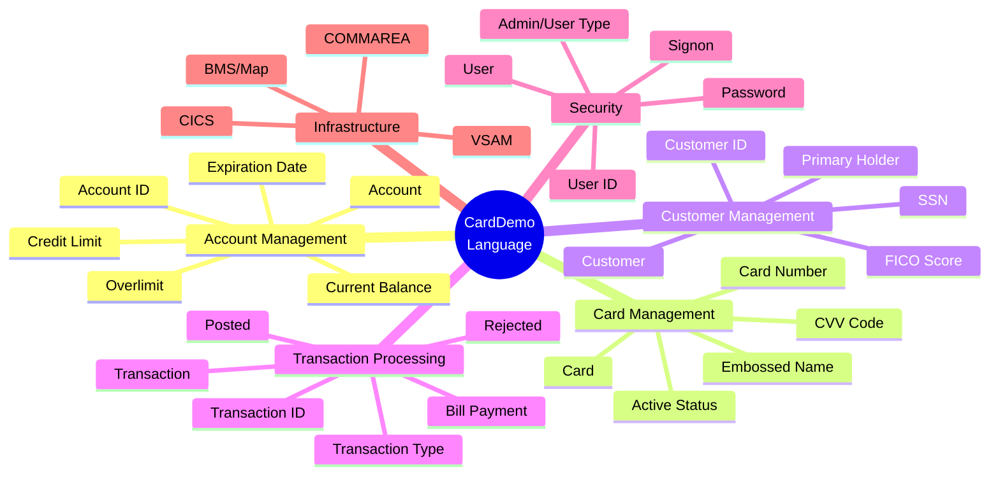

# CardDemo Ubiquitous Language Glossary

## Overview

This glossary defines the ubiquitous language used throughout the CardDemo application. Terms are extracted from COBOL copybooks, program variables, error messages, and paragraph names. Each term includes its definition, domain area, and source code reference.

---

## Core Domain Terms

### Account Management

| Term | Definition | Domain Area | Source Reference |
|------|------------|-------------|------------------|
| **Account** | A credit card account representing a line of credit extended to a customer | Account Management | `CVACT01Y.cpy:4` |
| **Account ID** | 11-digit unique identifier for an account (ACCT-ID) | Account Management | `CVACT01Y.cpy:5` |
| **Active Status** | Flag indicating if account/card is currently usable (Y/N) | Account Management | `CVACT01Y.cpy:6` |
| **Current Balance** | Outstanding balance owed on the account | Account Management | `CVACT01Y.cpy:7` |
| **Credit Limit** | Maximum amount that can be charged to the account | Account Management | `CVACT01Y.cpy:8` |
| **Cash Credit Limit** | Maximum amount for cash advances (subset of credit limit) | Account Management | `CVACT01Y.cpy:9` |
| **Open Date** | Date when the account was opened | Account Management | `CVACT01Y.cpy:10` |
| **Expiration Date** | Date when account/card expires | Account Management | `CVACT01Y.cpy:11` |
| **Reissue Date** | Date when card was last reissued | Account Management | `CVACT01Y.cpy:12` |
| **Current Cycle Credit** | Total credits applied in current billing cycle | Account Management | `CVACT01Y.cpy:13` |
| **Current Cycle Debit** | Total debits applied in current billing cycle | Account Management | `CVACT01Y.cpy:14` |
| **Group ID** | Identifier linking account to a disclosure/billing group | Account Management | `CVACT01Y.cpy:16` |
| **Overlimit** | Condition where transaction would exceed credit limit | Account Management | `CBTRN02C.cbl:411` |

### Card Management

| Term | Definition | Domain Area | Source Reference |
|------|------------|-------------|------------------|
| **Card** | Physical or virtual payment instrument linked to an account | Card Management | `CVACT02Y.cpy:4` |
| **Card Number** | 16-digit unique identifier for a card | Card Management | `CVACT02Y.cpy:5` |
| **CVV Code** | 3-digit security code on card back | Card Management | `CVACT02Y.cpy:7` |
| **Embossed Name** | Cardholder name printed on card | Card Management | `CVACT02Y.cpy:8` |
| **Card Active Status** | Flag indicating card usability (Y=active, N=inactive) | Card Management | `CVACT02Y.cpy:10` |
| **Primary Card Holder** | Customer designated as main account holder | Card Management | `CVCUS01Y.cpy:21` |
| **Card Cross-Reference** | Lookup table linking cards to accounts and customers | Card Management | `CVACT03Y.cpy:4` |

### Customer Management

| Term | Definition | Domain Area | Source Reference |
|------|------------|-------------|------------------|
| **Customer** | Person or entity holding one or more credit card accounts | Customer Management | `CVCUS01Y.cpy:4` |
| **Customer ID** | 9-digit unique identifier for a customer | Customer Management | `CVCUS01Y.cpy:5` |
| **SSN** | Social Security Number for identity verification | Customer Management | `CVCUS01Y.cpy:17` |
| **Government Issued ID** | Alternative identity document number | Customer Management | `CVCUS01Y.cpy:18` |
| **FICO Score** | Credit score (300-850) indicating creditworthiness | Customer Management | `CVCUS01Y.cpy:22` |
| **EFT Account** | Bank account linked for electronic fund transfers | Customer Management | `CVCUS01Y.cpy:20` |
| **Date of Birth** | Customer's birth date for identity verification | Customer Management | `CVCUS01Y.cpy:19` |

### Transaction Processing

| Term | Definition | Domain Area | Source Reference |
|------|------------|-------------|------------------|
| **Transaction** | A single financial event recorded against an account | Transaction Processing | `CVTRA05Y.cpy:4` |
| **Transaction ID** | 16-character unique identifier for a transaction | Transaction Processing | `CVTRA05Y.cpy:5` |
| **Transaction Type** | Category of transaction (DB=Debit, CR=Credit, FE=Fee, IN=Interest) | Transaction Processing | `CVTRA05Y.cpy:6` |
| **Transaction Category** | Sub-classification within a transaction type | Transaction Processing | `CVTRA05Y.cpy:7` |
| **Transaction Source** | Channel through which transaction originated | Transaction Processing | `CVTRA05Y.cpy:8` |
| **Transaction Amount** | Monetary value of the transaction | Transaction Processing | `CVTRA05Y.cpy:10` |
| **Origin Timestamp** | Date/time when transaction was initiated | Transaction Processing | `CVTRA05Y.cpy:16` |
| **Process Timestamp** | Date/time when transaction was posted | Transaction Processing | `CVTRA05Y.cpy:17` |
| **Daily Transaction** | Staging record awaiting batch posting | Transaction Processing | `CVTRA06Y.cpy:4` |
| **Posted Transaction** | Transaction successfully written to master file | Transaction Processing | `CBTRN02C.cbl:424` |
| **Rejected Transaction** | Transaction that failed validation | Transaction Processing | `CBTRN02C.cbl:446` |
| **Bill Payment** | Credit transaction paying account balance | Transaction Processing | `COBIL00C.cbl:223` |

### Transaction Types

| Term | Definition | Domain Area | Source Reference |
|------|------------|-------------|------------------|
| **Debit (DB)** | Transaction that increases account balance (purchases, cash advances) | Transaction Types | `CVTRA03Y.cpy` |
| **Credit (CR)** | Transaction that decreases account balance (payments, refunds) | Transaction Types | `CVTRA03Y.cpy` |
| **Fee (FE)** | Charges applied to account (annual fees, late fees) | Transaction Types | `CVTRA03Y.cpy` |
| **Interest (IN)** | Finance charges calculated on balances | Transaction Types | `CVTRA03Y.cpy` |

### Merchant Information

| Term | Definition | Domain Area | Source Reference |
|------|------------|-------------|------------------|
| **Merchant** | Business where transaction occurred | Merchant | `CVTRA05Y.cpy:11-14` |
| **Merchant ID** | 9-digit unique identifier for merchant | Merchant | `CVTRA05Y.cpy:11` |
| **Merchant Name** | Business name of merchant | Merchant | `CVTRA05Y.cpy:12` |
| **Merchant City** | Location city of merchant | Merchant | `CVTRA05Y.cpy:13` |
| **Merchant ZIP** | Postal code of merchant | Merchant | `CVTRA05Y.cpy:14` |

### Interest and Rates

| Term | Definition | Domain Area | Source Reference |
|------|------------|-------------|------------------|
| **Disclosure Group** | Rate configuration grouping accounts | Interest/Rates | `CVTRA02Y.cpy:4` |
| **Interest Rate** | Percentage rate charged on balances | Interest/Rates | `CVTRA02Y.cpy:9` |
| **Transaction Category Balance** | Pre-computed balance by account/type/category | Interest/Rates | `CVTRA01Y.cpy:4` |

### Security and Authentication

| Term | Definition | Domain Area | Source Reference |
|------|------------|-------------|------------------|
| **User** | System user with login credentials | Security | `CSUSR01Y.cpy:17` |
| **User ID** | 8-character login identifier | Security | `CSUSR01Y.cpy:18` |
| **Password** | 8-character authentication credential | Security | `CSUSR01Y.cpy:21` |
| **User Type** | Role designation (A=Admin, U=User) | Security | `CSUSR01Y.cpy:22` |
| **Admin User** | User with full system privileges | Security | `COCOM01Y.cpy:27` |
| **Regular User** | User with standard operational access | Security | `COCOM01Y.cpy:28` |
| **Signon** | Authentication process to access system | Security | `COSGN00C.cbl:5` |

### Session and Navigation

| Term | Definition | Domain Area | Source Reference |
|------|------------|-------------|------------------|
| **COMMAREA** | Communication area passing data between programs | Session | `COCOM01Y.cpy:19` |
| **From Program** | Program that invoked current transaction | Session | `COCOM01Y.cpy:22` |
| **To Program** | Target program for transfer | Session | `COCOM01Y.cpy:24` |
| **Program Context** | State indicator (0=Enter, 1=Reenter) | Session | `COCOM01Y.cpy:29` |
| **Enter** | First entry into a program/screen | Session | `COCOM01Y.cpy:30` |
| **Reenter** | Return to program after previous interaction | Session | `COCOM01Y.cpy:31` |

---

## Menu and Screen Terms

| Term | Definition | Domain Area | Source Reference |
|------|------------|-------------|------------------|
| **Main Menu** | Primary navigation screen for standard users | Navigation | `COMEN02Y.cpy:19` |
| **Admin Menu** | Administrative functions menu | Navigation | `COADM02Y.cpy:19` |
| **Account View** | Screen displaying account details | Navigation | `COMEN02Y.cpy:27` |
| **Account Update** | Screen for modifying account information | Navigation | `COMEN02Y.cpy:33` |
| **Credit Card List** | Screen showing cards for an account | Navigation | `COMEN02Y.cpy:39` |
| **Credit Card View** | Screen displaying card details | Navigation | `COMEN02Y.cpy:45` |
| **Credit Card Update** | Screen for modifying card information | Navigation | `COMEN02Y.cpy:51` |
| **Transaction List** | Screen showing transaction history | Navigation | `COMEN02Y.cpy:57` |
| **Transaction View** | Screen displaying transaction details | Navigation | `COMEN02Y.cpy:63` |
| **Transaction Add** | Screen for creating transactions | Navigation | `COMEN02Y.cpy:70` |
| **Transaction Reports** | Reporting interface | Navigation | `COMEN02Y.cpy:76` |
| **Bill Payment** | Screen for paying account balance | Navigation | `COMEN02Y.cpy:82` |
| **User List** | Admin screen showing system users | Navigation | `COADM02Y.cpy:28` |
| **User Add** | Admin screen for creating users | Navigation | `COADM02Y.cpy:33` |
| **User Update** | Admin screen for modifying users | Navigation | `COADM02Y.cpy:38` |
| **User Delete** | Admin screen for removing users | Navigation | `COADM02Y.cpy:43` |

---

## Validation and Error Terms

| Term | Definition | Domain Area | Source Reference |
|------|------------|-------------|------------------|
| **Input OK** | Validation passed successfully | Validation | `COCRDUPC.cbl:643` |
| **Input Error** | Validation failed | Validation | `COCRDUPC.cbl:173` |
| **Not Numeric** | Value contains non-numeric characters | Validation | `COCRDUPC.cbl:784` |
| **Blank** | Required field not provided | Validation | `COCRDUPC.cbl:815` |
| **Invalid Key** | Unrecognized function key pressed | Validation | `CSMSG01Y.cpy:22` |
| **Not Found** | Record lookup returned no results | Validation | `COSGN00C.cbl:249` |
| **Duplicate** | Attempting to create existing record | Validation | `COBIL00C.cbl:533` |
| **Rejection Code** | Numeric code indicating validation failure reason | Validation | `CBTRN02C.cbl:181` |

---

## Validation Rejection Codes

| Code | Meaning | Source Reference |
|------|---------|------------------|
| 100 | Invalid card number found | `CBTRN02C.cbl:385` |
| 101 | Account record not found | `CBTRN02C.cbl:397` |
| 102 | Overlimit transaction | `CBTRN02C.cbl:410` |
| 103 | Transaction after account expiration | `CBTRN02C.cbl:417` |
| 109 | Account update failed during posting | `CBTRN02C.cbl:556` |

---

## Batch Processing Terms

| Term | Definition | Domain Area | Source Reference |
|------|------------|-------------|------------------|
| **Batch** | Processing of multiple transactions in sequence | Batch Processing | `CBTRN02C.cbl:2` |
| **Daily Transaction File** | Input file containing transactions to post | Batch Processing | `CBTRN02C.cbl:29` |
| **Transaction File** | Master file of posted transactions | Batch Processing | `CBTRN02C.cbl:34` |
| **Rejects File** | Output file for failed transactions | Batch Processing | `CBTRN02C.cbl:46` |
| **Posting** | Process of recording transaction to master files | Batch Processing | `CBTRN02C.cbl:424` |
| **Validation Trailer** | Error information appended to rejected records | Batch Processing | `CBTRN02C.cbl:178` |
| **Transaction Count** | Running total of processed records | Batch Processing | `CBTRN02C.cbl:185` |
| **Reject Count** | Running total of failed records | Batch Processing | `CBTRN02C.cbl:186` |

---

## Technical Infrastructure Terms

| Term | Definition | Domain Area | Source Reference |
|------|------------|-------------|------------------|
| **CICS** | Customer Information Control System - transaction processor | Infrastructure | All CO*.cbl |
| **VSAM** | Virtual Storage Access Method - file storage | Infrastructure | All files |
| **KSDS** | Key Sequenced Data Set - indexed file organization | Infrastructure | File SELECT statements |
| **Alternate Index (AIX)** | Secondary access path for VSAM files | Infrastructure | `COBIL00C.cbl:42` |
| **BMS** | Basic Mapping Support - screen definitions | Infrastructure | COPY statements |
| **Mapset** | Collection of screen maps | Infrastructure | `COCRDUPC.cbl:224` |
| **Map** | Single screen definition | Infrastructure | `COCRDUPC.cbl:226` |
| **DFHCOMMAREA** | CICS communication area | Infrastructure | Linkage sections |
| **RESP/RESP2** | CICS response codes | Infrastructure | All online programs |
| **ABEND** | Abnormal end of program | Infrastructure | `CBTRN02C.cbl:707` |

---

## File Names

| Logical Name | Physical Purpose | Source Reference |
|--------------|------------------|------------------|
| ACCTDAT | Account master file | `COBIL00C.cbl:41` |
| CARDDAT | Card master file | `COCRDUPC.cbl:251` |
| CUSTDAT | Customer master file | Various |
| TRANSACT | Transaction master file | `COBIL00C.cbl:40` |
| CCXREF | Card cross-reference file | Various |
| CXACAIX | Cross-reference alternate index by account | `COBIL00C.cbl:42` |
| USRSEC | User security file | `COSGN00C.cbl:39` |
| DALYTRAN | Daily transaction input (batch) | `CBTRN02C.cbl:29` |
| DALYREJS | Daily transaction rejects (batch) | `CBTRN02C.cbl:46` |
| TCATBALF | Transaction category balance file | `CBTRN02C.cbl:57` |

---

## Program Names

| Program | Full Name | Purpose |
|---------|-----------|---------|
| COSGN00C | CardDemo Signon | User authentication |
| COADM01C | CardDemo Admin Menu | Admin menu display |
| COMEN01C | CardDemo Main Menu | User menu display |
| COACTVWC | CardDemo Account View | Display account details |
| COACTUPC | CardDemo Account Update | Modify account/customer |
| COCRDLIC | CardDemo Card List | List cards for account |
| COCRDSLC | CardDemo Card Select | Select card for viewing |
| COCRDUPC | CardDemo Card Update | Modify card details |
| COTRN00C | CardDemo Transaction List | List transactions |
| COTRN01C | CardDemo Transaction View | View transaction details |
| COTRN02C | CardDemo Transaction Add | Create new transaction |
| COBIL00C | CardDemo Bill Payment | Process bill payments |
| CORPT00C | CardDemo Reports | Generate reports |
| COUSR00C | CardDemo User List | List system users |
| COUSR01C | CardDemo User Add | Create new user |
| COUSR02C | CardDemo User Update | Modify user |
| COUSR03C | CardDemo User Delete | Remove user |
| CBTRN01C | CardDemo Batch Trans Post | Basic transaction posting |
| CBTRN02C | CardDemo Batch Trans Post | Posting with validation |
| CBTRN03C | CardDemo Interest Calc | Calculate interest |
| CBACT01C-04C | CardDemo Account Batch | Account file maintenance |
| CBCUS01C | CardDemo Customer Batch | Customer file maintenance |

---

## Transaction IDs

| TRAN ID | Associated Program | Purpose |
|---------|-------------------|---------|
| CC00 | COSGN00C | Signon transaction |
| CADM | COADM01C | Admin menu |
| CM00 | COMEN01C | Main menu |
| CAVW | COACTVWC | Account view |
| CAUP | COACTUPC | Account update |
| CCLI | COCRDLIC | Card list |
| CCDL | COCRDSLC | Card select |
| CCUP | COCRDUPC | Card update |
| CTL0 | COTRN00C | Transaction list |
| CTV0 | COTRN01C | Transaction view |
| CTA0 | COTRN02C | Transaction add |
| CB00 | COBIL00C | Bill payment |
| CRPT | CORPT00C | Reports |

---

## Glossary by Domain Area

