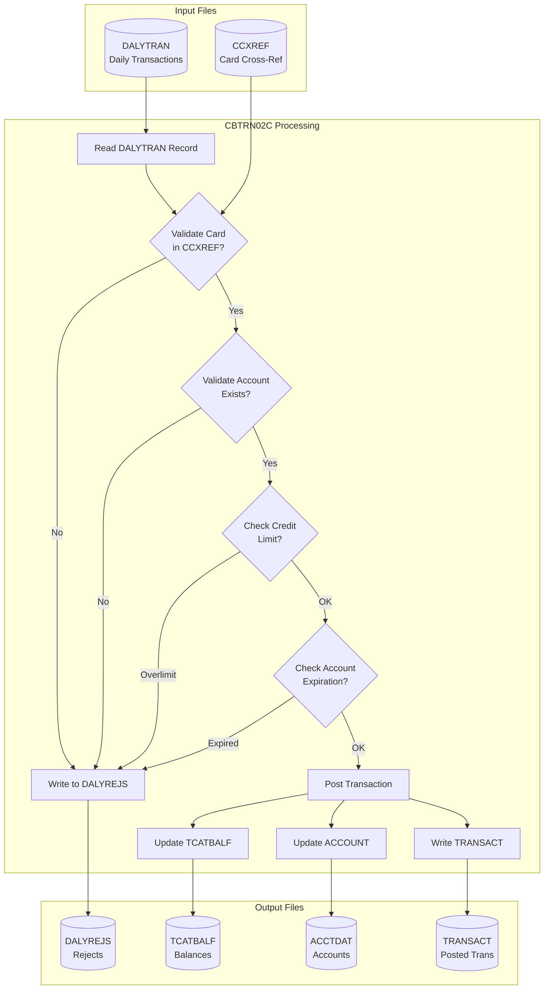
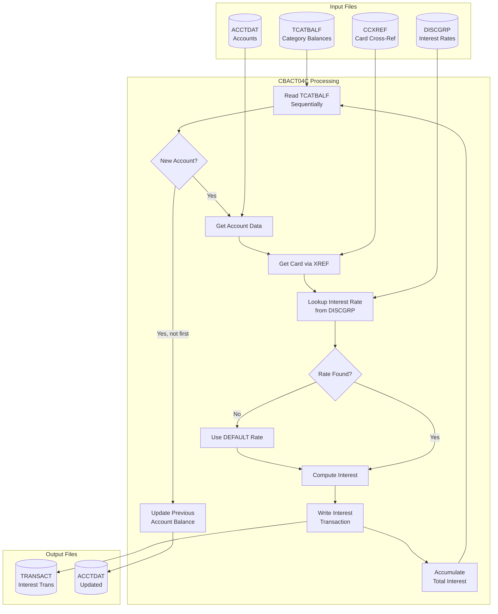
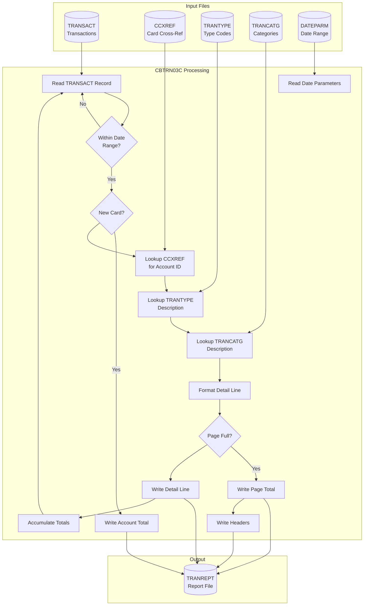

# CardDemo Data Lineage

## Document Information

| Attribute | Value |
|-----------|-------|
| **Version** | 1.0 |
| **Last Updated** | 2026-02-05 |
| **Source Analysis** | RE-002 Data Model Extraction |
| **Programs Analyzed** | CBTRN02C, CBTRN03C, CBACT04C |

---

## 1. Batch Processing Overview

CardDemo uses a daily batch cycle to process transactions, calculate interest, and generate reports. This document traces how data flows through the batch programs.

### 1.1 High-Level Batch Flow

```
┌─────────────────────────────────────────────────────────────────────────┐
│                        DAILY BATCH CYCLE                                │
└─────────────────────────────────────────────────────────────────────────┘

    ┌──────────────┐      ┌──────────────┐      ┌──────────────┐
    │   DALYTRAN   │      │   TRANSACT   │      │   TRANREPT   │
    │ (Daily Input)│      │(Posted Trans)│      │   (Reports)  │
    └──────┬───────┘      └──────────────┘      └──────────────┘
           │                     ▲                     ▲
           │                     │                     │
           ▼                     │                     │
    ┌──────────────┐             │              ┌──────────────┐
    │  CBTRN02C    │─────────────┘              │  CBTRN03C    │
    │  (Posting)   │                            │ (Reporting)  │
    └──────┬───────┘                            └──────┬───────┘
           │                                           │
           │ Updates                                   │ Reads
           ▼                                           │
    ┌──────────────┐      ┌──────────────┐            │
    │   ACCTDAT    │◄─────│  CBACT04C    │            │
    │  (Accounts)  │      │  (Interest)  │            │
    └──────────────┘      └──────┬───────┘            │
           ▲                     │                     │
           │                     │ Reads               │
           │              ┌──────┴──────┐             │
           └──────────────│  TCATBALF   │◄────────────┘
                          │ (Balances)  │
                          └─────────────┘
```

---

## 2. CBTRN02C - Transaction Posting

**Source:** `app/cbl/CBTRN02C.cbl`
**Purpose:** Post daily transactions from input file to transaction master

### 2.1 Input/Output Summary

```
┌─────────────────────────────────────────────────────────────────┐
│                        CBTRN02C                                 │
├─────────────────┬───────────────────────────────────────────────┤
│ INPUTS          │ OUTPUTS                                       │
├─────────────────┼───────────────────────────────────────────────┤
│ DALYTRAN (seq)  │ TRANSACT (KSDS) - Posted transactions         │
│ CCXREF (KSDS)   │ DALYREJS (seq) - Rejected transactions        │
│ ACCTFILE (KSDS) │ ACCTFILE (KSDS) - Updated account balances    │
│                 │ TCATBALF (KSDS) - Updated category balances   │
└─────────────────┴───────────────────────────────────────────────┘
```

### 2.2 Data Flow Diagram



### 2.3 Detailed Field Transformations

#### Input → Output Mapping (DALYTRAN → TRANSACT)

| Source Field | Target Field | Transformation |
|--------------|--------------|----------------|
| DALYTRAN-ID | TRAN-ID | Direct copy |
| DALYTRAN-TYPE-CD | TRAN-TYPE-CD | Direct copy |
| DALYTRAN-CAT-CD | TRAN-CAT-CD | Direct copy |
| DALYTRAN-SOURCE | TRAN-SOURCE | Direct copy |
| DALYTRAN-DESC | TRAN-DESC | Direct copy |
| DALYTRAN-AMT | TRAN-AMT | Direct copy |
| DALYTRAN-MERCHANT-ID | TRAN-MERCHANT-ID | Direct copy |
| DALYTRAN-MERCHANT-NAME | TRAN-MERCHANT-NAME | Direct copy |
| DALYTRAN-MERCHANT-CITY | TRAN-MERCHANT-CITY | Direct copy |
| DALYTRAN-MERCHANT-ZIP | TRAN-MERCHANT-ZIP | Direct copy |
| DALYTRAN-CARD-NUM | TRAN-CARD-NUM | Direct copy |
| DALYTRAN-ORIG-TS | TRAN-ORIG-TS | Direct copy |
| (System time) | TRAN-PROC-TS | Generated: CURRENT-DATE formatted as DB2 timestamp |

**Timestamp Generation (CBTRN02C:692-704):**
```cobol
MOVE FUNCTION CURRENT-DATE TO COBOL-TS
MOVE COB-YYYY TO DB2-YYYY
MOVE COB-MM   TO DB2-MM
MOVE COB-DD   TO DB2-DD
...
-- Format: YYYY-MM-DD-HH.MM.SS.nnnnnn
```

#### Account Update Logic (CBTRN02C:545-560)

```cobol
ADD DALYTRAN-AMT TO ACCT-CURR-BAL
IF DALYTRAN-AMT >= 0
   ADD DALYTRAN-AMT TO ACCT-CURR-CYC-CREDIT
ELSE
   ADD DALYTRAN-AMT TO ACCT-CURR-CYC-DEBIT
END-IF
```

| Condition | Field Updated | Formula |
|-----------|---------------|---------|
| Any transaction | ACCT-CURR-BAL | += DALYTRAN-AMT |
| Positive amount | ACCT-CURR-CYC-CREDIT | += DALYTRAN-AMT |
| Negative amount | ACCT-CURR-CYC-DEBIT | += DALYTRAN-AMT |

#### Transaction Category Balance Update (CBTRN02C:467-542)

```cobol
-- Key construction
MOVE XREF-ACCT-ID TO TRANCAT-ACCT-ID
MOVE DALYTRAN-TYPE-CD TO TRANCAT-TYPE-CD
MOVE DALYTRAN-CAT-CD TO TRANCAT-CD

-- Balance update
ADD DALYTRAN-AMT TO TRAN-CAT-BAL
```

If TCATBALF record doesn't exist, it is created with initial balance equal to transaction amount.

### 2.4 Validation Rules

| Code | Rule | Location | Error Description |
|------|------|----------|-------------------|
| 100 | Card lookup | CBTRN02C:380-392 | INVALID CARD NUMBER FOUND |
| 101 | Account lookup | CBTRN02C:393-399 | ACCOUNT RECORD NOT FOUND |
| 102 | Credit limit | CBTRN02C:403-413 | OVERLIMIT TRANSACTION |
| 103 | Account expiration | CBTRN02C:414-420 | TRANSACTION RECEIVED AFTER ACCT EXPIRATION |

**Credit Limit Check Formula (CBTRN02C:403-413):**
```cobol
COMPUTE WS-TEMP-BAL = ACCT-CURR-CYC-CREDIT
                    - ACCT-CURR-CYC-DEBIT
                    + DALYTRAN-AMT

IF ACCT-CREDIT-LIMIT >= WS-TEMP-BAL
   -- Accept transaction
ELSE
   MOVE 102 TO WS-VALIDATION-FAIL-REASON
   MOVE 'OVERLIMIT TRANSACTION' TO WS-VALIDATION-FAIL-REASON-DESC
END-IF
```

### 2.5 Reject File Layout

```
Position  Length  Field
--------  ------  -----
1-350     350     Original DALYTRAN record
351-354   4       Validation failure code (9(04))
355-430   76      Validation failure description
```

---

## 3. CBACT04C - Interest Calculation

**Source:** `app/cbl/CBACT04C.cbl`
**Purpose:** Calculate monthly interest charges based on category balances

### 3.1 Input/Output Summary

```
┌─────────────────────────────────────────────────────────────────┐
│                        CBACT04C                                 │
├─────────────────┬───────────────────────────────────────────────┤
│ INPUTS          │ OUTPUTS                                       │
├─────────────────┼───────────────────────────────────────────────┤
│ TCATBALF (seq)  │ TRANSACT (seq) - Interest transactions        │
│ CCXREF (KSDS)   │ ACCTFILE (KSDS) - Updated account balances    │
│ DISCGRP (KSDS)  │                                               │
│ ACCTFILE (KSDS) │                                               │
│ PARM-DATE       │                                               │
└─────────────────┴───────────────────────────────────────────────┘
```

### 3.2 Data Flow Diagram



### 3.3 Interest Calculation Formula

**Core Formula (CBACT04C:462-470):**
```cobol
COMPUTE WS-MONTHLY-INT
 = ( TRAN-CAT-BAL * DIS-INT-RATE) / 1200
```

**Derivation:**
```
Monthly Interest = (Category Balance × Annual Rate%) / 12 / 100
                 = (Category Balance × Annual Rate%) / 1200
```

| Variable | Source | Description |
|----------|--------|-------------|
| TRAN-CAT-BAL | TCATBALF | Running balance for transaction category |
| DIS-INT-RATE | DISCGRP | Annual interest rate as percentage (e.g., 18.00 = 18%) |
| WS-MONTHLY-INT | Calculated | Monthly interest amount |

**Example:**
```
Category Balance: $1,000.00
Annual Rate: 18.00%
Monthly Interest = ($1,000.00 × 18.00) / 1200 = $15.00
```

### 3.4 Interest Transaction Generation

**Generated Transaction Fields (CBACT04C:473-515):**

| Field | Value | Source |
|-------|-------|--------|
| TRAN-ID | PARM-DATE + Sequence | Concatenated: e.g., "2024-01-15000001" |
| TRAN-TYPE-CD | '01' | Hard-coded (Interest charge type) |
| TRAN-CAT-CD | '05' | Hard-coded (Interest category) |
| TRAN-SOURCE | 'System' | Hard-coded |
| TRAN-DESC | 'Int. for a/c ' + ACCT-ID | Concatenated description |
| TRAN-AMT | WS-MONTHLY-INT | Calculated interest |
| TRAN-MERCHANT-ID | 0 | N/A for interest |
| TRAN-MERCHANT-NAME | SPACES | N/A for interest |
| TRAN-MERCHANT-CITY | SPACES | N/A for interest |
| TRAN-MERCHANT-ZIP | SPACES | N/A for interest |
| TRAN-CARD-NUM | XREF-CARD-NUM | From cross-reference lookup |
| TRAN-ORIG-TS | CURRENT-DATE | System timestamp |
| TRAN-PROC-TS | CURRENT-DATE | System timestamp |

### 3.5 Account Update After Interest Calculation

**Account Balance Update (CBACT04C:350-370):**
```cobol
ADD WS-TOTAL-INT TO ACCT-CURR-BAL
MOVE 0 TO ACCT-CURR-CYC-CREDIT
MOVE 0 TO ACCT-CURR-CYC-DEBIT
```

| Action | Purpose |
|--------|---------|
| Add total interest to balance | Increase account balance by accumulated interest |
| Reset cycle credits to 0 | Start new billing cycle |
| Reset cycle debits to 0 | Start new billing cycle |

### 3.6 Interest Rate Fallback

**Default Rate Lookup (CBACT04C:436-460):**
```cobol
IF DISCGRP-STATUS = '23'      -- Record not found
    MOVE 'DEFAULT' TO FD-DIS-ACCT-GROUP-ID
    PERFORM 1200-A-GET-DEFAULT-INT-RATE
END-IF
```

When the account's specific disclosure group rate is not found, the program falls back to a 'DEFAULT' group rate.

---

## 4. CBTRN03C - Transaction Reporting

**Source:** `app/cbl/CBTRN03C.cbl`
**Purpose:** Generate daily transaction report with totals

### 4.1 Input/Output Summary

```
┌─────────────────────────────────────────────────────────────────┐
│                        CBTRN03C                                 │
├─────────────────┬───────────────────────────────────────────────┤
│ INPUTS          │ OUTPUTS                                       │
├─────────────────┼───────────────────────────────────────────────┤
│ TRANSACT (seq)  │ TRANREPT (seq) - Formatted report             │
│ CCXREF (KSDS)   │                                               │
│ TRANTYPE (KSDS) │                                               │
│ TRANCATG (KSDS) │                                               │
│ DATEPARM (seq)  │                                               │
└─────────────────┴───────────────────────────────────────────────┘
```

### 4.2 Data Flow Diagram



### 4.3 Report Layout (CVTRA07Y.cpy)

**Report Header:**
```
DALYREPT                              Daily Transaction Report
Date Range: YYYY-MM-DD to YYYY-MM-DD
```

**Column Headers:**
```
Transaction ID   Account ID  Transaction Type   Tran Category                       Tran Source          Amount
-------------------------------------------------------------------------------------------------------------------------------------------
```

**Detail Line Format:**
```
Position  Length  Field                Format
--------  ------  -------------------  ----------------
1-16      16      TRAN-REPORT-TRANS-ID X(16)
18-28     11      TRAN-REPORT-ACCOUNT-ID X(11)
30-31     2       TRAN-REPORT-TYPE-CD  X(02)
32        1       '-'
33-47     15      TRAN-REPORT-TYPE-DESC X(15)
49-52     4       TRAN-REPORT-CAT-CD   9(04)
53        1       '-'
54-82     29      TRAN-REPORT-CAT-DESC X(29)
84-93     10      TRAN-REPORT-SOURCE   X(10)
98-113    16      TRAN-REPORT-AMT      -ZZZ,ZZZ,ZZZ.ZZ
```

**Totals:**
```
Page Total.........................................  +ZZZ,ZZZ,ZZZ.ZZ
Account Total......................................  +ZZZ,ZZZ,ZZZ.ZZ
Grand Total........................................  +ZZZ,ZZZ,ZZZ.ZZ
```

### 4.4 Data Enrichment

The report enriches transaction data with lookups:

| Source Field | Lookup File | Result Field |
|--------------|-------------|--------------|
| TRAN-CARD-NUM | CCXREF | XREF-ACCT-ID (displayed) |
| TRAN-TYPE-CD | TRANTYPE | TRAN-TYPE-DESC |
| TRAN-TYPE-CD + TRAN-CAT-CD | TRANCATG | TRAN-CAT-TYPE-DESC |

---

## 5. Complete Batch Workflow

### 5.1 Daily Processing Sequence

```
┌─────────────────────────────────────────────────────────────────────────┐
│                    COMPLETE DAILY BATCH CYCLE                           │
└─────────────────────────────────────────────────────────────────────────┘

Step 1: Data Refresh (Optional)
┌─────────────────────────────────────────────────────────────────────────┐
│  scripts/run_full_batch.sh                                              │
│  - ACCTFILE.jcl: Refresh account master data                            │
│  - CARDFILE.jcl: Refresh card master data                               │
│  - CUSTFILE.jcl: Refresh customer master data                           │
│  - XREFFILE.jcl: Refresh cross-reference data                           │
└─────────────────────────────────────────────────────────────────────────┘
                                    │
                                    ▼
Step 2: Transaction Posting
┌─────────────────────────────────────────────────────────────────────────┐
│  scripts/run_posting.sh                                                 │
│  CBTRN02C: Post daily transactions                                      │
│  - Input:  DALYTRAN (daily transaction file)                            │
│  - Output: TRANSACT (posted transactions)                               │
│            DALYREJS (rejected transactions)                             │
│  - Update: ACCTDAT (account balances)                                   │
│            TCATBALF (category balances)                                 │
└─────────────────────────────────────────────────────────────────────────┘
                                    │
                                    ▼
Step 3: Interest Calculation (End of Billing Cycle)
┌─────────────────────────────────────────────────────────────────────────┐
│  scripts/run_interest_calc.sh                                           │
│  CBACT04C: Calculate and post interest charges                          │
│  - Input:  TCATBALF (category balances)                                 │
│            DISCGRP (interest rates)                                     │
│            CCXREF (card cross-reference)                                │
│            ACCTDAT (account data)                                       │
│  - Output: TRANSACT (interest transactions)                             │
│  - Update: ACCTDAT (add interest, reset cycle)                          │
└─────────────────────────────────────────────────────────────────────────┘
                                    │
                                    ▼
Step 4: Reporting
┌─────────────────────────────────────────────────────────────────────────┐
│  CBTRN03C: Generate transaction reports                                 │
│  - Input:  TRANSACT (all transactions)                                  │
│            CCXREF, TRANTYPE, TRANCATG (lookups)                         │
│            DATEPARM (reporting date range)                              │
│  - Output: TRANREPT (formatted report)                                  │
└─────────────────────────────────────────────────────────────────────────┘
```

### 5.2 Data State Changes by Step

| Step | File | State Change |
|------|------|--------------|
| 2 | TRANSACT | Empty → Contains posted daily transactions |
| 2 | ACCTDAT.ACCT-CURR-BAL | += Transaction amounts |
| 2 | ACCTDAT.ACCT-CURR-CYC-CREDIT | += Positive transactions |
| 2 | ACCTDAT.ACCT-CURR-CYC-DEBIT | += Negative transactions |
| 2 | TCATBALF.TRAN-CAT-BAL | += Transaction amounts by category |
| 2 | DALYREJS | Empty → Contains rejected transactions |
| 3 | TRANSACT | += Interest transactions |
| 3 | ACCTDAT.ACCT-CURR-BAL | += Total interest charges |
| 3 | ACCTDAT.ACCT-CURR-CYC-CREDIT | Reset to 0 |
| 3 | ACCTDAT.ACCT-CURR-CYC-DEBIT | Reset to 0 |
| 4 | TRANREPT | Empty → Contains formatted report |

---

## 6. Derived Fields and Calculations

### 6.1 Summary of Calculated Fields

| Field | Formula | Program | Location |
|-------|---------|---------|----------|
| Available Credit | ACCT-CREDIT-LIMIT - (ACCT-CURR-CYC-CREDIT - ACCT-CURR-CYC-DEBIT) | CBTRN02C | :403-406 |
| Monthly Interest | (TRAN-CAT-BAL × DIS-INT-RATE) / 1200 | CBACT04C | :464-465 |
| Page Total | SUM(TRAN-AMT) per page | CBTRN03C | :287-288 |
| Account Total | SUM(TRAN-AMT) per account | CBTRN03C | :287-288 |
| Grand Total | SUM(Page Totals) | CBTRN03C | :297 |
| Processing Timestamp | CURRENT-DATE formatted | CBTRN02C | :692-704 |
| Transaction ID | PARM-DATE ∥ WS-TRANID-SUFFIX | CBACT04C | :476-480 |

### 6.2 Business Rules Embedded in Code

| Rule | Location | Description |
|------|----------|-------------|
| Credit limit enforcement | CBTRN02C:403-413 | Reject if projected balance exceeds limit |
| Account expiration check | CBTRN02C:414-420 | Reject if account expired before transaction date |
| Interest rate fallback | CBACT04C:436-460 | Use 'DEFAULT' group if specific rate not found |
| Cycle reset on interest calc | CBACT04C:353-354 | Zero out cycle credits/debits after interest posting |
| Card-to-account resolution | All batch programs | Lookup CCXREF to find ACCT-ID from CARD-NUM |

---

## 7. Error Handling and Rejection Flows

### 7.1 Validation Error Codes

| Code | Meaning | Action |
|------|---------|--------|
| 100 | Invalid card number | Write to DALYREJS |
| 101 | Account not found | Write to DALYREJS |
| 102 | Over credit limit | Write to DALYREJS |
| 103 | Account expired | Write to DALYREJS |

### 7.2 I/O Error Handling

All batch programs use consistent error handling:
```cobol
IF file-STATUS NOT = '00'
    DISPLAY 'ERROR...'
    MOVE file-STATUS TO IO-STATUS
    PERFORM 9910-DISPLAY-IO-STATUS
    PERFORM 9999-ABEND-PROGRAM
END-IF
```

Programs call CEE3ABD with abend code 999 on fatal errors.

---

## 8. Data Quality Observations

### 8.1 Referential Integrity Gaps

| Gap | Risk | Recommendation |
|-----|------|----------------|
| No FK enforcement CARD→ACCOUNT | Orphan cards possible | Add DB constraint in modernized schema |
| No FK enforcement TRANSACTION→CARD | Invalid card references | Add validation in service layer |
| CCXREF can have stale references | Lookup failures in batch | Implement cascade delete or archive |

### 8.2 Data Consistency Considerations

1. **TCATBALF vs TRANSACT Totals:** Category balances in TCATBALF should match sum of transactions in TRANSACT for each account/type/category combination

2. **ACCT-CURR-BAL vs Transaction Sum:** Account current balance should equal sum of all posted transactions plus initial balance

3. **Cycle Credits/Debits Reset:** Cycle fields are zeroed during interest calculation, so mid-cycle queries need transaction aggregation for accurate totals
