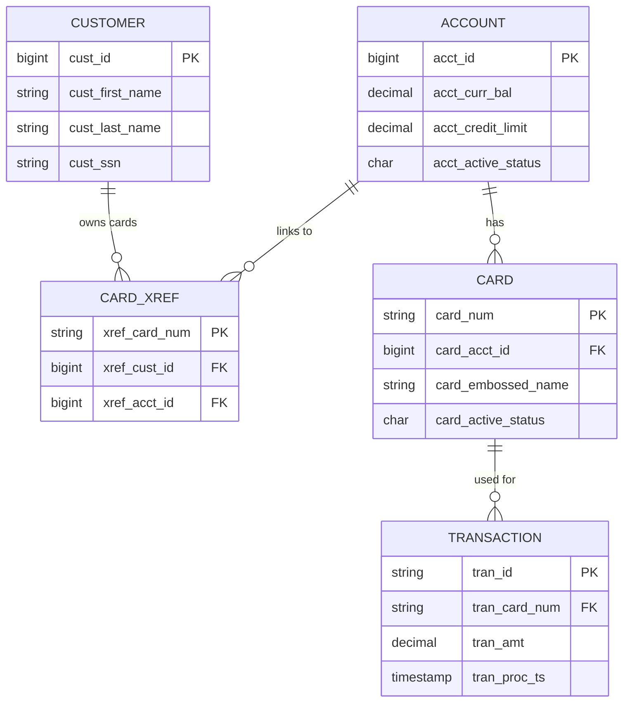
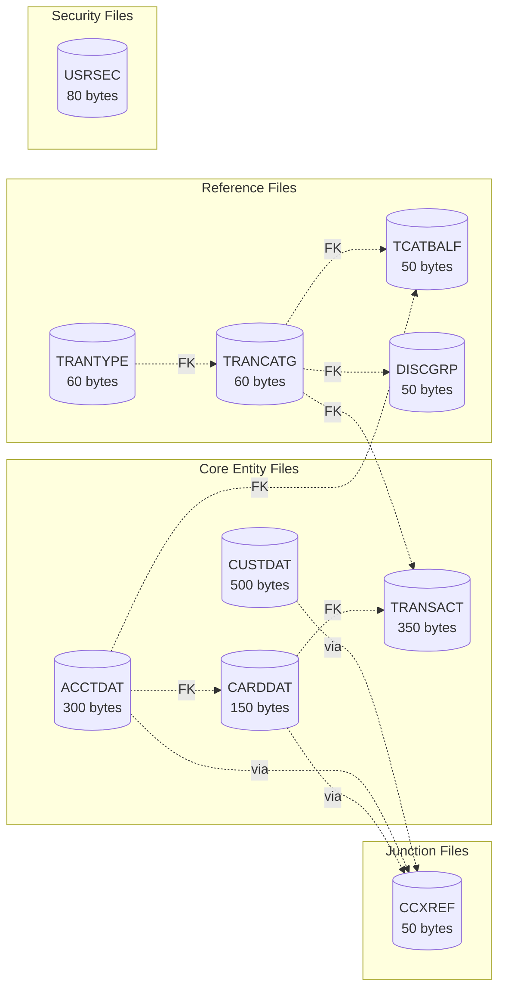
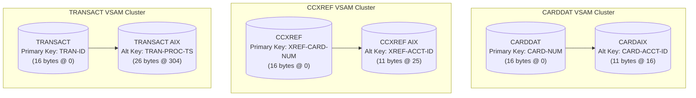
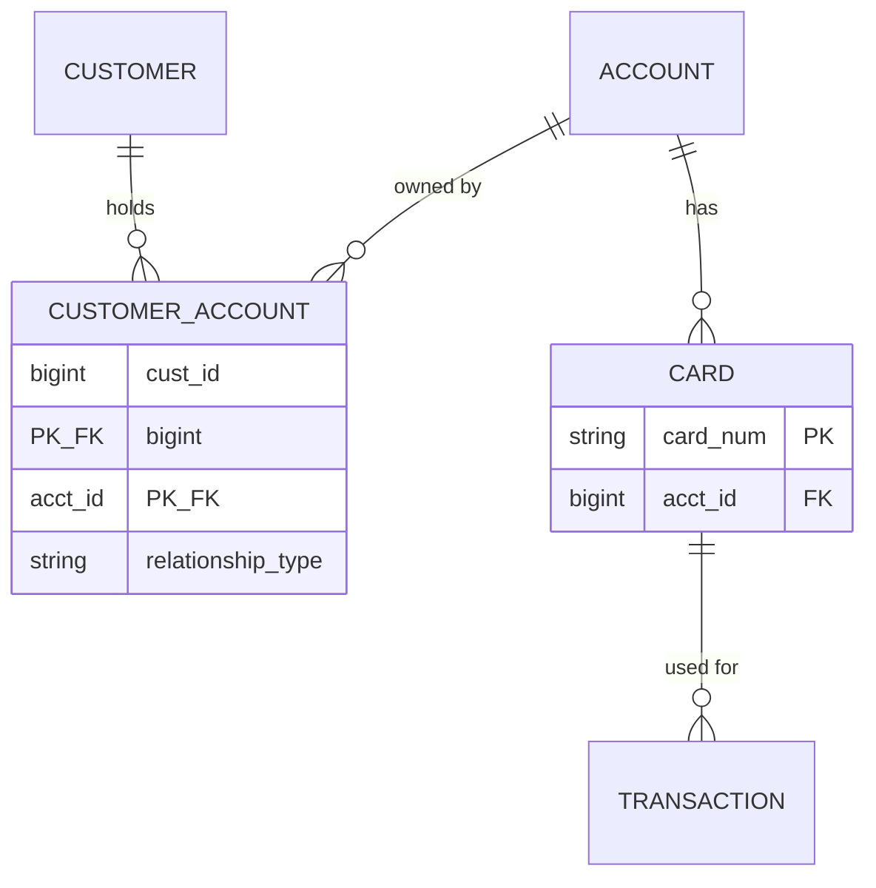

# CardDemo Entity-Relationship Diagram

## Document Information

| Attribute | Value |
|-----------|-------|
| **Version** | 1.0 |
| **Last Updated** | 2026-02-05 |
| **Format** | Mermaid erDiagram |

---

## Complete ER Diagram

```mermaid
erDiagram
    CUSTOMER ||--o{ CARD_XREF : "has cards via"
    ACCOUNT ||--o{ CARD_XREF : "linked to"
    ACCOUNT ||--o{ CARD : "owns"
    CARD ||--o{ TRANSACTION : "generates"
    ACCOUNT ||--o{ TRAN_CAT_BAL : "has balances"
    DISCLOSURE_GROUP ||--o{ TRAN_CAT_BAL : "defines rates for"
    TRAN_TYPE ||--o{ TRAN_CATEGORY : "contains"
    TRAN_CATEGORY ||--o{ TRANSACTION : "classifies"
    TRAN_CATEGORY ||--o{ TRAN_CAT_BAL : "tracks"
    TRAN_CATEGORY ||--o{ DISCLOSURE_GROUP : "has rates in"

    CUSTOMER {
        bigint cust_id PK "9(09)"
        varchar cust_first_name "X(25)"
        varchar cust_middle_name "X(25)"
        varchar cust_last_name "X(25)"
        varchar cust_addr_line_1 "X(50)"
        varchar cust_addr_line_2 "X(50)"
        varchar cust_addr_line_3 "X(50)"
        char cust_addr_state_cd "X(02)"
        char cust_addr_country_cd "X(03)"
        varchar cust_addr_zip "X(10)"
        varchar cust_phone_num_1 "X(15)"
        varchar cust_phone_num_2 "X(15)"
        char cust_ssn "9(09)"
        varchar cust_govt_issued_id "X(20)"
        date cust_dob "X(10)"
        varchar cust_eft_account_id "X(10)"
        char cust_pri_card_holder_ind "X(01)"
        smallint cust_fico_credit_score "9(03)"
    }

    ACCOUNT {
        bigint acct_id PK "9(11)"
        char acct_active_status "X(01)"
        decimal acct_curr_bal "S9(10)V99"
        decimal acct_credit_limit "S9(10)V99"
        decimal acct_cash_credit_limit "S9(10)V99"
        date acct_open_date "X(10)"
        date acct_expiration_date "X(10)"
        date acct_reissue_date "X(10)"
        decimal acct_curr_cyc_credit "S9(10)V99"
        decimal acct_curr_cyc_debit "S9(10)V99"
        varchar acct_addr_zip "X(10)"
        varchar acct_group_id FK "X(10)"
    }

    CARD {
        varchar card_num PK "X(16)"
        bigint card_acct_id FK "9(11)"
        char card_cvv_cd "9(03)"
        varchar card_embossed_name "X(50)"
        date card_expiration_date "X(10)"
        char card_active_status "X(01)"
    }

    CARD_XREF {
        varchar xref_card_num PK "X(16)"
        bigint xref_cust_id FK "9(09)"
        bigint xref_acct_id FK "9(11)"
    }

    TRANSACTION {
        varchar tran_id PK "X(16)"
        char tran_type_cd FK "X(02)"
        smallint tran_cat_cd FK "9(04)"
        varchar tran_source "X(10)"
        varchar tran_desc "X(100)"
        decimal tran_amt "S9(09)V99"
        bigint tran_merchant_id "9(09)"
        varchar tran_merchant_name "X(50)"
        varchar tran_merchant_city "X(50)"
        varchar tran_merchant_zip "X(10)"
        varchar tran_card_num FK "X(16)"
        timestamp tran_orig_ts "X(26)"
        timestamp tran_proc_ts "X(26)"
    }

    TRAN_CAT_BAL {
        bigint trancat_acct_id PK_FK "9(11)"
        char trancat_type_cd PK_FK "X(02)"
        smallint trancat_cd PK_FK "9(04)"
        decimal tran_cat_bal "S9(09)V99"
    }

    DISCLOSURE_GROUP {
        varchar dis_acct_group_id PK "X(10)"
        char dis_tran_type_cd PK_FK "X(02)"
        smallint dis_tran_cat_cd PK_FK "9(04)"
        decimal dis_int_rate "S9(04)V99"
    }

    TRAN_TYPE {
        char tran_type PK "X(02)"
        varchar tran_type_desc "X(50)"
    }

    TRAN_CATEGORY {
        char tran_type_cd PK_FK "X(02)"
        smallint tran_cat_cd PK "9(04)"
        varchar tran_cat_type_desc "X(50)"
    }

    USER_SECURITY {
        varchar sec_usr_id PK "X(08)"
        varchar sec_usr_fname "X(20)"
        varchar sec_usr_lname "X(20)"
        varchar sec_usr_pwd "X(08)"
        char sec_usr_type "X(01)"
    }
```

---

## Simplified ER Diagram (Core Entities Only)



---

## Reference Data Relationships

```mermaid
erDiagram
    TRAN_TYPE ||--o{ TRAN_CATEGORY : "contains"
    TRAN_CATEGORY ||--o{ DISCLOSURE_GROUP : "has rates"
    TRAN_CATEGORY ||--o{ TRAN_CAT_BAL : "aggregates"
    TRAN_CATEGORY ||--o{ TRANSACTION : "classifies"

    TRAN_TYPE {
        char tran_type PK
        string tran_type_desc
    }

    TRAN_CATEGORY {
        char tran_type_cd PK_FK
        int tran_cat_cd PK
        string tran_cat_type_desc
    }

    DISCLOSURE_GROUP {
        string dis_acct_group_id PK
        char dis_tran_type_cd PK_FK
        int dis_tran_cat_cd PK_FK
        decimal dis_int_rate
    }

    TRAN_CAT_BAL {
        bigint trancat_acct_id PK
        char trancat_type_cd PK
        int trancat_cd PK
        decimal tran_cat_bal
    }

    TRANSACTION {
        string tran_id PK
        char tran_type_cd FK
        int tran_cat_cd FK
        decimal tran_amt
    }
```

---

## Physical File Relationships (VSAM)



---

## Alternate Index Relationships



---

## Cardinality Summary Table

| Parent | Child | Cardinality | Notes |
|--------|-------|-------------|-------|
| CUSTOMER | CARD_XREF | 1:N | One customer can have multiple cards |
| ACCOUNT | CARD_XREF | 1:N | One account can have multiple cards |
| ACCOUNT | CARD | 1:N | One account owns multiple cards |
| CARD | TRANSACTION | 1:N | One card generates many transactions |
| ACCOUNT | TRAN_CAT_BAL | 1:N | Balances tracked per category |
| TRAN_TYPE | TRAN_CATEGORY | 1:N | Types subdivide into categories |
| TRAN_CATEGORY | TRANSACTION | 1:N | Categories classify transactions |
| TRAN_CATEGORY | TRAN_CAT_BAL | 1:N | Categories tracked per account |
| TRAN_CATEGORY | DISCLOSURE_GROUP | 1:N | Rates vary by group |

---

## Modernization Note: Normalized Schema

The current CCXREF design is denormalized. A normalized version would split this into:



This eliminates the redundant card-customer-account association stored in each CCXREF record.
