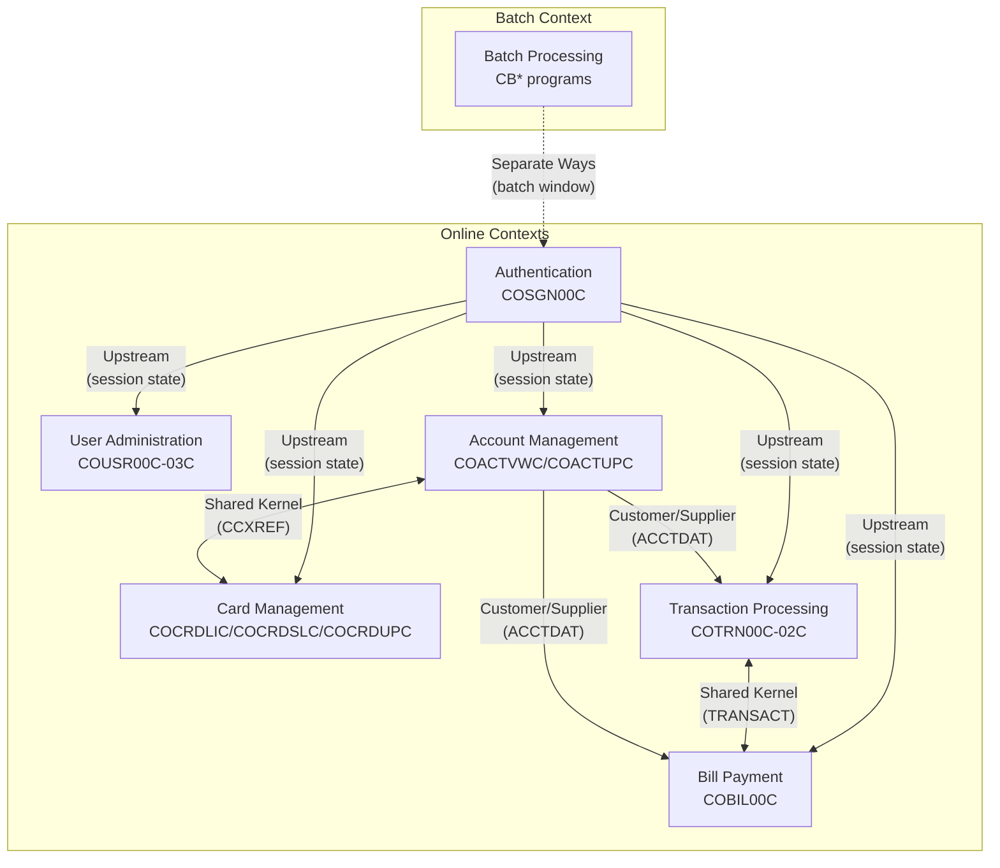

# CardDemo Context Map

## Executive Summary

This document presents the bounded context map extracted from the CardDemo mainframe application using Domain-Driven Design (DDD) principles. The analysis identifies **7 distinct bounded contexts** that represent cohesive business capabilities within the credit card processing system. Understanding these contexts is essential for microservices decomposition and modernization planning.

---

## Bounded Context Inventory

### Context Summary

| # | Context Name | Programs | Primary Data | Responsibility |
|---|--------------|----------|--------------|----------------|
| 1 | Authentication | COSGN00C | USRSEC (R) | User login, session establishment |
| 2 | User Administration | COUSR00C-03C | USRSEC (RW) | User CRUD operations |
| 3 | Account Management | COACTVWC, COACTUPC | ACCTDAT, CUSTDAT, CARDDAT | Account viewing and updates |
| 4 | Card Management | COCRDLIC, COCRDSLC, COCRDUPC | CARDDAT, CCXREF | Card lifecycle management |
| 5 | Transaction Processing | COTRN00C, COTRN01C, COTRN02C | TRANSACT, ACCTDAT | Transaction entry and inquiry |
| 6 | Bill Payment | COBIL00C | ACCTDAT, TRANSACT | Payment processing |
| 7 | Batch Processing | CBTRN01C-03C, CBACT01C-04C, CBCUS01C | All files | Nightly batch operations |

---

## Detailed Context Descriptions

### 1. Authentication Context

**Transaction ID**: CC00
**Program**: COSGN00C
**Source**: `app/cbl/COSGN00C.cbl:23`

**Responsibility**: Authenticates users against the USRSEC file and establishes session state in the COMMAREA. Routes users to appropriate menus based on user type (Admin vs. User).

**Data Access**:
| File | Access | Purpose |
|------|--------|---------|
| USRSEC | READ | Validate user credentials |

**Outbound Navigation**:
- Admin users → COADM01C (Admin Menu)
- Regular users → COMEN01C (User Menu)
- PF3 → Session termination

**Key Code Pattern** (`COSGN00C.cbl:230-240`):
```cobol
IF CDEMO-USRTYP-ADMIN
    EXEC CICS XCTL PROGRAM ('COADM01C')
        COMMAREA(CARDDEMO-COMMAREA)
    END-EXEC
ELSE
    EXEC CICS XCTL PROGRAM ('COMEN01C')
        COMMAREA(CARDDEMO-COMMAREA)
    END-EXEC
END-IF
```

**Relationship**: **Upstream** to all other online contexts. Establishes the session state (CDEMO-USER-ID, CDEMO-USER-TYPE) that all downstream contexts depend on.

---

### 2. User Administration Context

**Transaction ID**: CA00 (via menu)
**Programs**: COUSR00C, COUSR01C, COUSR02C, COUSR03C
**Source**: `app/cbl/COUSR00C.cbl`, `app/cbl/COUSR01C.cbl`, `app/cbl/COUSR02C.cbl`, `app/cbl/COUSR03C.cbl`

**Responsibility**: Full CRUD operations on user security records. Restricted to Admin users only via COADM01C menu.

**Program Functions**:
| Program | Function | Menu Option |
|---------|----------|-------------|
| COUSR00C | User List (Browse) | Option 1 |
| COUSR01C | User Add | Option 2 |
| COUSR02C | User Update | Option 3 |
| COUSR03C | User Delete | Option 4 |

**Data Access**:
| File | Access | Operations |
|------|--------|------------|
| USRSEC | READ | Browse, lookup |
| USRSEC | WRITE | Add new users |
| USRSEC | REWRITE | Update existing |
| USRSEC | DELETE | Remove users |

**Relationship**: **Downstream** from Authentication (requires admin session). **Conformist** pattern - fully dependent on Authentication for access control.

---

### 3. Account Management Context

**Transaction ID**: CM00 (via menu)
**Programs**: COACTVWC, COACTUPC
**Source**: `app/cbl/COACTVWC.cbl`, `app/cbl/COACTUPC.cbl`

**Responsibility**: Display and update credit card account information including balances, limits, and related customer data.

**Program Functions**:
| Program | Function | Menu Option |
|---------|----------|-------------|
| COACTVWC | Account View | Option 1 |
| COACTUPC | Account Update | Option 2 |

**Data Access**:
| File | Access | Purpose |
|------|--------|---------|
| ACCTDAT | READ/UPDATE | Account master data |
| CUSTDAT | READ | Customer demographics |
| CARDDAT | READ | Associated card info |
| CCXREF (AIX) | READ | Card-to-account lookup |

**Relationship**:
- **Shared Kernel** with Card Management via CCXREF
- **Customer/Supplier** with Transaction Processing (account data flows downstream)

---

### 4. Card Management Context

**Transaction ID**: CM00 (via menu)
**Programs**: COCRDLIC, COCRDSLC, COCRDUPC
**Source**: `app/cbl/COCRDLIC.cbl`, `app/cbl/COCRDSLC.cbl`, `app/cbl/COCRDUPC.cbl`

**Responsibility**: Card lifecycle management including listing, searching, viewing, and updating card status and attributes.

**Program Functions**:
| Program | Function | Menu Option |
|---------|----------|-------------|
| COCRDLIC | Credit Card List | Option 3 |
| COCRDSLC | Credit Card View | Option 4 |
| COCRDUPC | Credit Card Update | Option 5 |

**Data Access**:
| File | Access | Purpose |
|------|--------|---------|
| CARDDAT | READ/WRITE | Card master data |
| CCXREF | READ | Cross-reference lookup |
| ACCTDAT | READ | Parent account validation |

**Relationship**: **Shared Kernel** with Account Management - both contexts share the CCXREF cross-reference file and maintain consistency across card-account relationships.

---

### 5. Transaction Processing Context

**Transaction ID**: CM00 (via menu)
**Programs**: COTRN00C, COTRN01C, COTRN02C
**Source**: `app/cbl/COTRN00C.cbl`, `app/cbl/COTRN01C.cbl`, `app/cbl/COTRN02C.cbl`

**Responsibility**: Transaction inquiry, viewing details, and adding new transactions to the system.

**Program Functions**:
| Program | Function | Menu Option |
|---------|----------|-------------|
| COTRN00C | Transaction List | Option 6 |
| COTRN01C | Transaction View | Option 7 |
| COTRN02C | Transaction Add | Option 8 |

**Data Access**:
| File | Access | Purpose |
|------|--------|---------|
| TRANSACT | READ/WRITE | Transaction records |
| ACCTDAT | READ | Account validation |
| CCXREF | READ | Card-to-account lookup |

**Relationship**:
- **Customer/Supplier** with Account Management - depends on account data
- **Shared Kernel** with Bill Payment - both write to TRANSACT file

---

### 6. Bill Payment Context

**Transaction ID**: CM00 (via menu)
**Program**: COBIL00C
**Source**: `app/cbl/COBIL00C.cbl`

**Responsibility**: Process bill payments by reducing account balances and creating payment transaction records.

**Data Access**:
| File | Access | Purpose |
|------|--------|---------|
| ACCTDAT | READ/REWRITE | Update account balance |
| TRANSACT | READ/WRITE | Create payment record, get next ID |
| CCXREF (AIX) | READ | Validate account ownership |

**Key Business Rules**:
- Payment amount reduces ACCT-CURR-BAL
- Payment creates CR (credit) transaction record
- Account balance cannot go negative beyond certain threshold

**Relationship**:
- **Shared Kernel** with Transaction Processing - shares TRANSACT file
- **Customer/Supplier** with Account Management - updates account state

---

### 7. Batch Processing Context

**Programs**: CBTRN01C, CBTRN02C, CBTRN03C, CBACT01C, CBACT02C, CBACT03C, CBACT04C, CBCUS01C, CBEXPORT, CBIMPORT
**Source**: `app/cbl/CB*.cbl`

**Responsibility**: Nightly batch operations including transaction posting, interest calculation, data maintenance, and import/export.

**Program Functions**:
| Program | Function | Schedule |
|---------|----------|----------|
| CBACT01C | Account file read | On-demand |
| CBACT02C | Account file update | Nightly |
| CBACT03C | Account add | On-demand |
| CBACT04C | Account delete | On-demand |
| CBCUS01C | Customer maintenance | On-demand |
| CBTRN01C | Transaction read | Nightly |
| CBTRN02C | Interest calculation | Nightly |
| CBTRN03C | Transaction posting | Nightly |
| CBEXPORT | Data export (EBCDIC) | On-demand |
| CBIMPORT | Data import (ASCII) | On-demand |

**Data Access**: All VSAM files with batch I/O patterns

**Relationship**: **Separate Ways** - Batch context operates independently from online contexts with its own lifecycle and timing. Data consistency maintained through sequential batch windows.

---

## Context Relationship Diagram



---

## DDD Relationship Types Explained

### Upstream/Downstream

The Authentication context is **upstream** to all other online contexts. It produces the session state (user credentials, user type) that downstream contexts consume. Downstream contexts are **conformist** - they accept the session contract as-is without modification.

### Shared Kernel

Two pairs of contexts share data structures:

1. **Account Management ↔ Card Management**: Share the CCXREF cross-reference file. Changes to card-account relationships must be coordinated between both contexts.

2. **Transaction Processing ↔ Bill Payment**: Share the TRANSACT file. Both contexts write transaction records and must follow the same record format and ID generation scheme.

### Customer/Supplier

Account Management acts as **supplier** to:
- Transaction Processing (provides account validation)
- Bill Payment (provides account balance for updates)

The supplier context (Account Management) may evolve independently; consumers must adapt.

### Separate Ways

Batch Processing operates on a **Separate Ways** pattern:
- No real-time integration with online contexts
- Operates during defined batch windows
- Has its own data consistency model (file-based batch)
- May have different error handling and recovery patterns

---

## Data Ownership Matrix

| Data Store | Owner Context | Reader Contexts | Writer Contexts |
|------------|---------------|-----------------|-----------------|
| USRSEC | Authentication | User Admin | User Admin |
| ACCTDAT | Account Management | Card Mgmt, Transaction, Bill Payment | Account Mgmt, Bill Payment, Batch |
| CARDDAT | Card Management | Account Mgmt | Card Mgmt, Batch |
| CUSTDAT | Account Management | Account Mgmt | Batch |
| TRANSACT | Transaction Processing | Bill Payment, Transaction | Transaction, Bill Payment, Batch |
| CCXREF | Card Management | Account Mgmt, Transaction, Bill Payment | Card Mgmt, Batch |

---

## Microservices Mapping Recommendations

### Proposed Service Boundaries

| Bounded Context | Microservice | API Base Path | Notes |
|-----------------|--------------|---------------|-------|
| Authentication | `auth-service` | `/api/v1/auth` | JWT issuer, session management |
| User Administration | `user-service` | `/api/v1/users` | Admin-only CRUD |
| Account Management | `account-service` | `/api/v1/accounts` | May merge with Customer |
| Card Management | `card-service` | `/api/v1/cards` | Strong candidate for separation |
| Transaction Processing | `transaction-service` | `/api/v1/transactions` | Read-heavy, event sourcing candidate |
| Bill Payment | `payment-service` | `/api/v1/payments` | Command-oriented, idempotent |
| Batch Processing | `batch-jobs` | N/A (scheduled) | Kubernetes CronJobs or Azure Functions |

### Anti-Corruption Layer Considerations

For modernization, implement ACLs at these boundaries:

1. **CCXREF Shared Kernel**: Replace with API calls between `account-service` and `card-service`
2. **TRANSACT Shared Kernel**: Use event-driven architecture (Kafka/EventBridge) for transaction events
3. **USRSEC Consumer**: Replace file reads with OAuth2/JWT token validation

### Database Decomposition

| Service | Primary Data Store | Technology Options |
|---------|-------------------|-------------------|
| auth-service | users, sessions | PostgreSQL + Redis cache |
| account-service | accounts, customers | PostgreSQL or Aurora |
| card-service | cards, xref | PostgreSQL |
| transaction-service | transactions | PostgreSQL + read replicas |
| payment-service | payments | PostgreSQL (ACID required) |
| batch-jobs | staging tables | Same as source services |

---

## Cross-References

- **Domain Model**: See [DOMAIN-MODEL.md](../01-domain-model/DOMAIN-MODEL.md) for entity definitions
- **Data Model**: See [DATA-MODEL.md](../02-data-model/DATA-MODEL.md) for VSAM file structures
- **Navigation Flows**: See [NAVIGATION-FLOWS.md](./NAVIGATION-FLOWS.md) for user journey mapping
- **COMMAREA Specification**: See [COMMAREA-SPECIFICATION.md](./COMMAREA-SPECIFICATION.md) for state contract details

---

## Source File References

| Context | Source Files |
|---------|-------------|
| Authentication | `app/cbl/COSGN00C.cbl` |
| User Administration | `app/cbl/COUSR00C.cbl`, `COUSR01C.cbl`, `COUSR02C.cbl`, `COUSR03C.cbl` |
| Account Management | `app/cbl/COACTVWC.cbl`, `COACTUPC.cbl` |
| Card Management | `app/cbl/COCRDLIC.cbl`, `COCRDSLC.cbl`, `COCRDUPC.cbl` |
| Transaction Processing | `app/cbl/COTRN00C.cbl`, `COTRN01C.cbl`, `COTRN02C.cbl` |
| Bill Payment | `app/cbl/COBIL00C.cbl` |
| Batch Processing | `app/cbl/CBTRN01C.cbl`, `CBTRN02C.cbl`, `CBTRN03C.cbl`, `CBACT01C.cbl`, `CBACT02C.cbl`, `CBACT03C.cbl`, `CBACT04C.cbl`, `CBCUS01C.cbl`, `CBEXPORT.cbl`, `CBIMPORT.cbl` |
| Menu Configuration | `app/cpy/COADM02Y.cpy`, `COMEN02Y.cpy` |
| COMMAREA | `app/cpy/COCOM01Y.cpy` |
