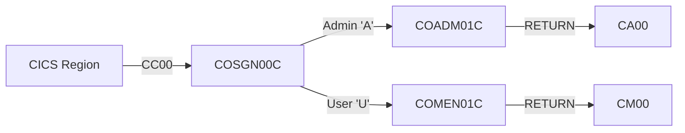
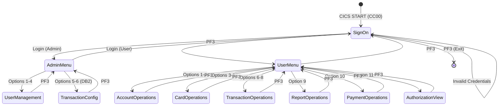
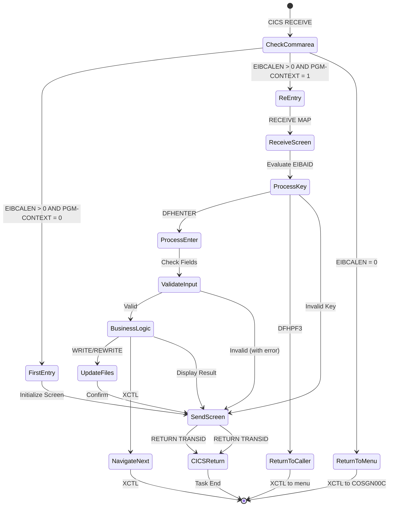
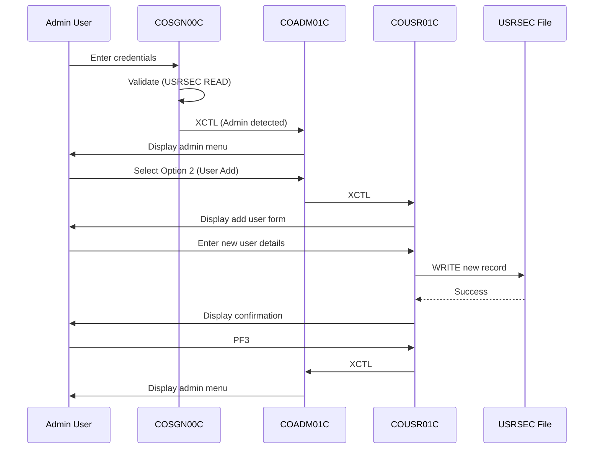
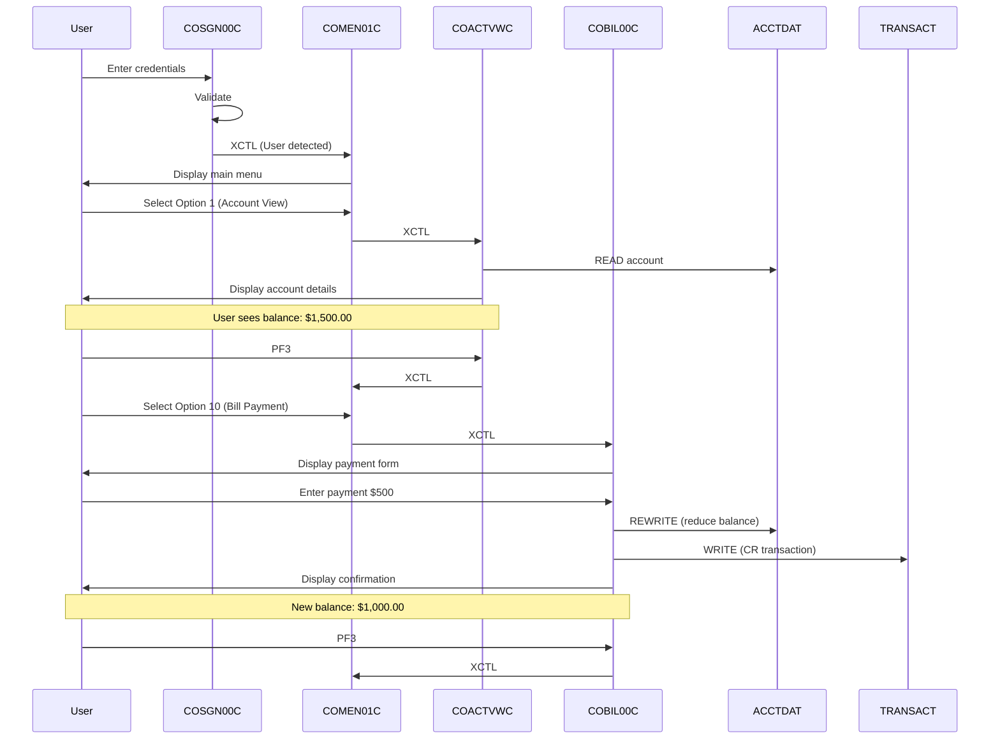
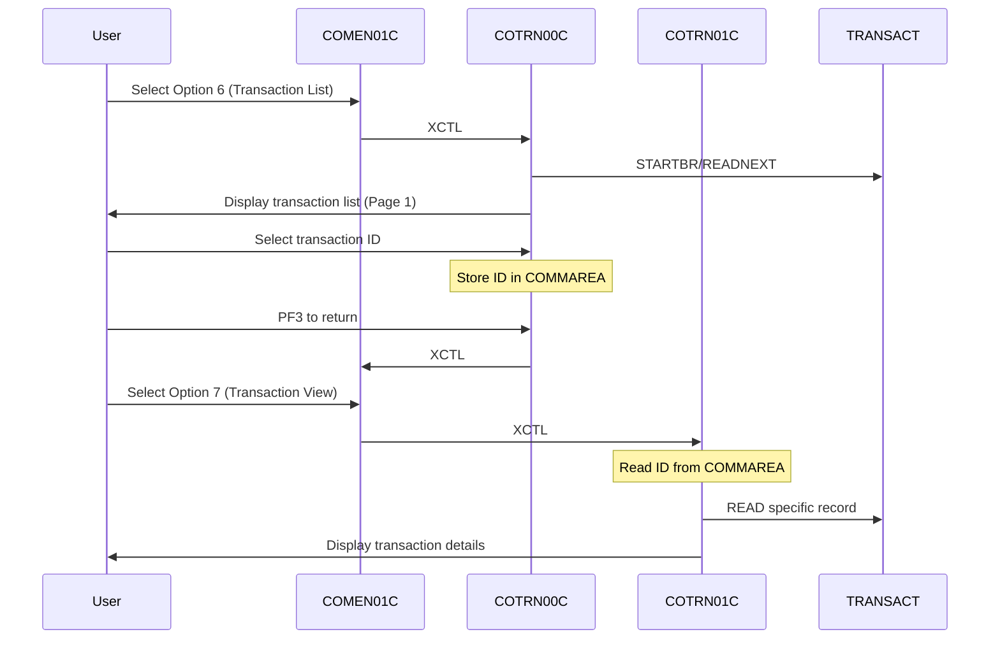

# CardDemo Navigation Flows

## Overview

This document maps the complete navigation structure of the CardDemo CICS application, including transaction IDs, program relationships, user journeys, and state machine representations. Understanding these flows is essential for modernizing the application's frontend routing and user experience.

---

## Transaction ID Mapping

| Transaction ID | Program | Description | Entry Point |
|----------------|---------|-------------|-------------|
| CC00 | COSGN00C | Sign-on Screen | Initial application entry |
| CA00 | COADM01C | Admin Menu | Post-login (Admin users) |
| CM00 | COMEN01C | User Menu | Post-login (Regular users) |
| CU00 | COUSR00C | User List (Browse) | Admin Menu Option 1 |
| CU01 | COUSR01C | User Add | Admin Menu Option 2 |
| CU02 | COUSR02C | User Update | Admin Menu Option 3 |
| CU03 | COUSR03C | User Delete | Admin Menu Option 4 |
| CAVW | COACTVWC | Account View | User Menu Option 1 |
| CAUP | COACTUPC | Account Update | User Menu Option 2 |
| CCLI | COCRDLIC | Credit Card List | User Menu Option 3 |
| CCDL | COCRDSLC | Credit Card View | User Menu Option 4 |
| CCUP | COCRDUPC | Credit Card Update | User Menu Option 5 |
| CT00 | COTRN00C | Transaction List | User Menu Option 6 |
| CT01 | COTRN01C | Transaction View | User Menu Option 7 |
| CT02 | COTRN02C | Transaction Add | User Menu Option 8 |
| CR00 | CORPT00C | Transaction Reports | User Menu Option 9 |
| CB00 | COBIL00C | Bill Payment | User Menu Option 10 |

### Transaction Flow



---

## Program Navigation Graph

### Complete Navigation Map

```mermaid
graph TB
    subgraph "Entry"
        CC00[CC00: COSGN00C<br/>Sign-On]
    end

    subgraph "Admin Path"
        CA00[CA00: COADM01C<br/>Admin Menu]
        COUSR00C[COUSR00C<br/>User List]
        COUSR01C[COUSR01C<br/>User Add]
        COUSR02C[COUSR02C<br/>User Update]
        COUSR03C[COUSR03C<br/>User Delete]
        COTRTLIC[COTRTLIC<br/>Trans Type List]
        COTRTUPC[COTRTUPC<br/>Trans Type Update]
    end

    subgraph "User Path"
        CM00[CM00: COMEN01C<br/>Main Menu]
        COACTVWC[COACTVWC<br/>Account View]
        COACTUPC[COACTUPC<br/>Account Update]
        COCRDLIC[COCRDLIC<br/>Card List]
        COCRDSLC[COCRDSLC<br/>Card View]
        COCRDUPC[COCRDUPC<br/>Card Update]
        COTRN00C[COTRN00C<br/>Transaction List]
        COTRN01C[COTRN01C<br/>Transaction View]
        COTRN02C[COTRN02C<br/>Transaction Add]
        CORPT00C[CORPT00C<br/>Reports]
        COBIL00C[COBIL00C<br/>Bill Payment]
        COPAUS0C[COPAUS0C<br/>Pending Auth]
    end

    %% Entry routing
    CC00 -->|"XCTL (Admin)"| CA00
    CC00 -->|"XCTL (User)"| CM00

    %% Admin menu options
    CA00 -->|"Option 1"| COUSR00C
    CA00 -->|"Option 2"| COUSR01C
    CA00 -->|"Option 3"| COUSR02C
    CA00 -->|"Option 4"| COUSR03C
    CA00 -->|"Option 5"| COTRTLIC
    CA00 -->|"Option 6"| COTRTUPC

    %% User menu options
    CM00 -->|"Option 1"| COACTVWC
    CM00 -->|"Option 2"| COACTUPC
    CM00 -->|"Option 3"| COCRDLIC
    CM00 -->|"Option 4"| COCRDSLC
    CM00 -->|"Option 5"| COCRDUPC
    CM00 -->|"Option 6"| COTRN00C
    CM00 -->|"Option 7"| COTRN01C
    CM00 -->|"Option 8"| COTRN02C
    CM00 -->|"Option 9"| CORPT00C
    CM00 -->|"Option 10"| COBIL00C
    CM00 -->|"Option 11"| COPAUS0C

    %% Return paths (PF3)
    COUSR00C -.->|"PF3"| CA00
    COUSR01C -.->|"PF3"| CA00
    COUSR02C -.->|"PF3"| CA00
    COUSR03C -.->|"PF3"| CA00
    CA00 -.->|"PF3"| CC00

    COACTVWC -.->|"PF3"| CM00
    COACTUPC -.->|"PF3"| CM00
    COCRDLIC -.->|"PF3"| CM00
    COCRDSLC -.->|"PF3"| CM00
    COCRDUPC -.->|"PF3"| CM00
    COTRN00C -.->|"PF3"| CM00
    COTRN01C -.->|"PF3"| CM00
    COTRN02C -.->|"PF3"| CM00
    CORPT00C -.->|"PF3"| CM00
    COBIL00C -.->|"PF3"| CM00
    CM00 -.->|"PF3"| CC00
```



---

## Menu Structure Analysis

### Admin Menu (COADM01C via COADM02Y.cpy)

**Source**: `app/cpy/COADM02Y.cpy:19-54`

| Option | Label | Program | Status |
|--------|-------|---------|--------|
| 1 | User List (Security) | COUSR00C | Active |
| 2 | User Add (Security) | COUSR01C | Active |
| 3 | User Update (Security) | COUSR02C | Active |
| 4 | User Delete (Security) | COUSR03C | Active |
| 5 | Transaction Type List/Update (Db2) | COTRTLIC | DB2 Extension |
| 6 | Transaction Type Maintenance (Db2) | COTRTUPC | DB2 Extension |

**Menu Configuration** (`COADM02Y.cpy:22`):
```cobol
05 CDEMO-ADMIN-OPT-COUNT           PIC 9(02) VALUE 6.
```

### User Menu (COMEN01C via COMEN02Y.cpy)

**Source**: `app/cpy/COMEN02Y.cpy:19-91`

| Option | Label | Program | Access Type |
|--------|-------|---------|-------------|
| 1 | Account View | COACTVWC | User |
| 2 | Account Update | COACTUPC | User |
| 3 | Credit Card List | COCRDLIC | User |
| 4 | Credit Card View | COCRDSLC | User |
| 5 | Credit Card Update | COCRDUPC | User |
| 6 | Transaction List | COTRN00C | User |
| 7 | Transaction View | COTRN01C | User |
| 8 | Transaction Add | COTRN02C | User |
| 9 | Transaction Reports | CORPT00C | User |
| 10 | Bill Payment | COBIL00C | User |
| 11 | Pending Authorization View | COPAUS0C | User |

**Menu Configuration** (`COMEN02Y.cpy:21`):
```cobol
05 CDEMO-MENU-OPT-COUNT           PIC 9(02) VALUE 11.
```

---

## State Machine Diagrams

### Application-Level State Machine



### Individual Program State Machine

Each program follows the pseudo-conversational pattern:



---

## XCTL vs RETURN TRANSID Patterns

### XCTL (Transfer Control)

Used for immediate program-to-program navigation within the same task.

**Pattern**: Menu → Child Program
```cobol
MOVE WS-TRANID    TO CDEMO-FROM-TRANID
MOVE WS-PGMNAME   TO CDEMO-FROM-PROGRAM
MOVE ZEROS        TO CDEMO-PGM-CONTEXT
EXEC CICS XCTL
    PROGRAM(CDEMO-MENU-OPT-PGMNAME(WS-OPTION))
    COMMAREA(CARDDEMO-COMMAREA)
END-EXEC
```

**Usage**: `app/cbl/COMEN01C.cbl:184-187`

### RETURN TRANSID (Pseudo-Conversational)

Used to end the current task and start a new task when user responds.

**Pattern**: Screen Display → User Response
```cobol
EXEC CICS RETURN
    TRANSID(WS-TRANID)
    COMMAREA(CARDDEMO-COMMAREA)
    LENGTH(LENGTH OF CARDDEMO-COMMAREA)
END-EXEC
```

**Usage**: `app/cbl/COSGN00C.cbl:98-102`

### Comparison

| Aspect | XCTL | RETURN TRANSID |
|--------|------|----------------|
| Task Continuation | Same task | New task |
| Storage | Preserved | Only COMMAREA preserved |
| User Interaction | None | Wait for user input |
| EIBCALEN | Populated immediately | Populated on next entry |
| Typical Use | Menu routing | Screen display/response |

---

## User Journey Maps

### Journey 1: Admin User Login → Create New User



### Journey 2: Regular User Login → View Account → Pay Bill



### Journey 3: Transaction Inquiry Flow



---

## Screen Flow Mapping

### BMS Mapset to Program Mapping

| Mapset | Map | Program | Screen Purpose |
|--------|-----|---------|----------------|
| COSGN00 | COSGN0A | COSGN00C | Sign-on screen |
| COADM01 | COADM1A | COADM01C | Admin menu |
| COMEN01 | COMEN1A | COMEN01C | User menu |
| COUSR00 | COUSR0A | COUSR00C | User list |
| COUSR01 | COUSR1A | COUSR01C | User add |
| COUSR02 | COUSR2A | COUSR02C | User update |
| COUSR03 | COUSR3A | COUSR03C | User delete |
| COACTVW | CACTVWA | COACTVWC | Account view |
| COACTUP | CACTUPA | COACTUPC | Account update |
| COCRDLI | CCRDLIA | COCRDLIC | Card list |
| COCRDSL | CCRDSLA | COCRDSLC | Card search/view |
| COCRDUP | CCRDUPA | COCRDUPC | Card update |
| COTRN00 | COTRN0A | COTRN00C | Transaction list |
| COTRN01 | COTRN1A | COTRN01C | Transaction view |
| COTRN02 | COTRN2A | COTRN02C | Transaction add |
| COBIL00 | COBIL0A | COBIL00C | Bill payment |
| CORPT00 | CORPT0A | CORPT00C | Reports |

---

## Navigation Key Mappings

### Standard Function Keys

| Key | Action | Notes |
|-----|--------|-------|
| ENTER | Process/Submit | Primary action key |
| PF1 | Help | Not implemented in all screens |
| PF3 | Return/Exit | Return to previous menu |
| PF7 | Page Up | For list screens |
| PF8 | Page Down | For list screens |
| CLEAR | Cancel | Clear screen and return |

### Key Handling Pattern

```cobol
EVALUATE EIBAID
    WHEN DFHENTER
        PERFORM PROCESS-ENTER-KEY
    WHEN DFHPF3
        PERFORM RETURN-TO-CALLING-PROGRAM
    WHEN DFHPF7
        PERFORM PAGE-UP
    WHEN DFHPF8
        PERFORM PAGE-DOWN
    WHEN OTHER
        MOVE CCDA-MSG-INVALID-KEY TO WS-MESSAGE
        PERFORM SEND-SCREEN
END-EVALUATE
```

---

## Modernization Implications

### Frontend Routing Strategy

| Legacy Pattern | Modern Equivalent |
|----------------|-------------------|
| XCTL navigation | React Router / Vue Router |
| Menu options | Navigation sidebar/tabs |
| PF3 return | Browser back button / breadcrumbs |
| COMMAREA state | Redux/Vuex/URL parameters |
| BMS screens | React/Vue components |

### Proposed Route Structure

```
/                          → Redirect to /login
/login                     → COSGN00C equivalent
/admin                     → COADM01C equivalent
/admin/users               → COUSR00C equivalent
/admin/users/new           → COUSR01C equivalent
/admin/users/:id/edit      → COUSR02C equivalent
/admin/users/:id/delete    → COUSR03C equivalent
/dashboard                 → COMEN01C equivalent
/accounts                  → COACTVWC equivalent
/accounts/:id              → Account detail view
/accounts/:id/edit         → COACTUPC equivalent
/cards                     → COCRDLIC equivalent
/cards/:cardNum            → COCRDSLC equivalent
/cards/:cardNum/edit       → COCRDUPC equivalent
/transactions              → COTRN00C equivalent
/transactions/:id          → COTRN01C equivalent
/transactions/new          → COTRN02C equivalent
/payments                  → COBIL00C equivalent
/reports                   → CORPT00C equivalent
```

### Navigation State Management

**Legacy (COMMAREA)**:
- State passed between programs
- Pseudo-conversational pattern
- Server-side state management

**Modern (Client-Side)**:
```javascript
// React Router with state
navigate('/accounts/12345678901', {
  state: {
    from: '/dashboard',
    customerId: '123456789'
  }
});

// URL parameters for key identifiers
// /cards/1234567890123456?acctId=12345678901
```

### Authentication Flow Modernization

| Legacy Step | Modern Step |
|-------------|-------------|
| CC00 transaction start | `/login` page load |
| USRSEC file read | POST `/api/v1/auth/login` |
| COMMAREA user state | JWT token in localStorage |
| XCTL to menu | React Router redirect |
| PF3 logout | Clear token, redirect to login |

---

## Cross-References

- **Context Map**: See [CONTEXT-MAP.md](./CONTEXT-MAP.md) for bounded context definitions
- **COMMAREA Specification**: See [COMMAREA-SPECIFICATION.md](./COMMAREA-SPECIFICATION.md) for state contract details
- **Domain Model**: See [DOMAIN-MODEL.md](../01-domain-model/DOMAIN-MODEL.md) for entity definitions
- **BMS Mapsets**: See `app/bms/` directory for screen definitions

---

## Source File References

| Component | Source |
|-----------|--------|
| Sign-on Program | `app/cbl/COSGN00C.cbl` |
| Admin Menu | `app/cbl/COADM01C.cbl`, `app/cpy/COADM02Y.cpy` |
| User Menu | `app/cbl/COMEN01C.cbl`, `app/cpy/COMEN02Y.cpy` |
| User Management | `app/cbl/COUSR00C.cbl`, `COUSR01C.cbl`, `COUSR02C.cbl`, `COUSR03C.cbl` |
| Account Programs | `app/cbl/COACTVWC.cbl`, `COACTUPC.cbl` |
| Card Programs | `app/cbl/COCRDLIC.cbl`, `COCRDSLC.cbl`, `COCRDUPC.cbl` |
| Transaction Programs | `app/cbl/COTRN00C.cbl`, `COTRN01C.cbl`, `COTRN02C.cbl` |
| Bill Payment | `app/cbl/COBIL00C.cbl` |
| Reports | `app/cbl/CORPT00C.cbl` |
| COMMAREA | `app/cpy/COCOM01Y.cpy` |
