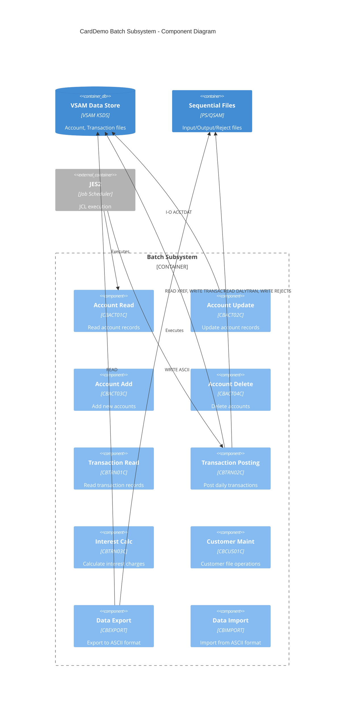
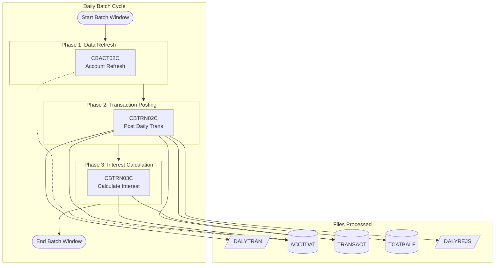
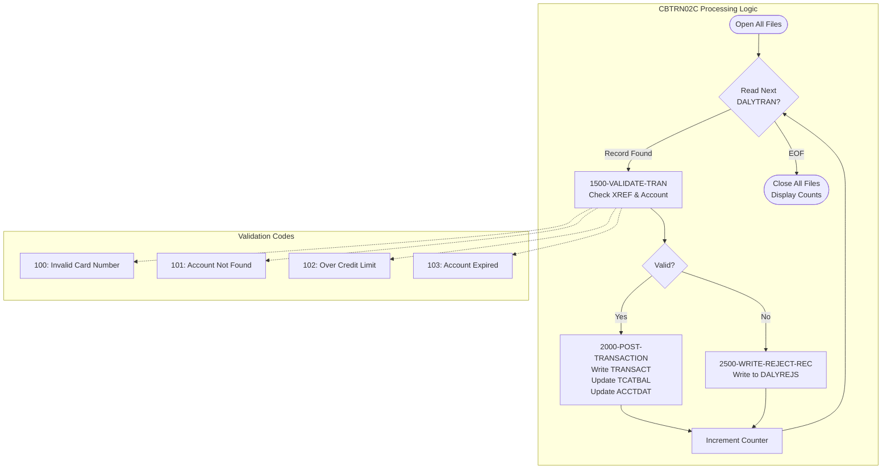
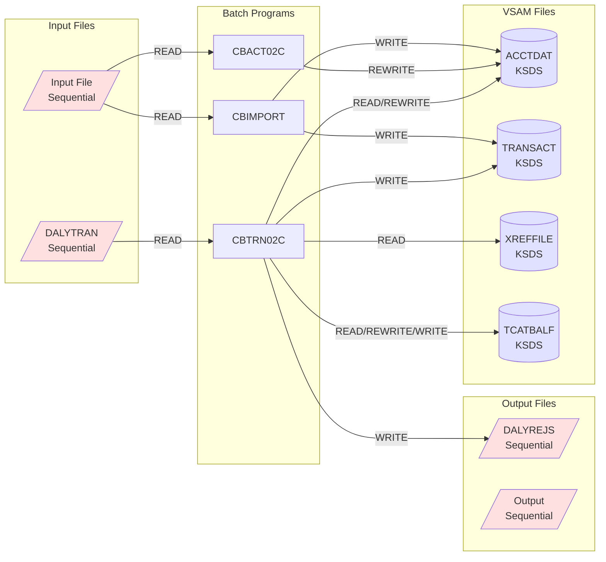
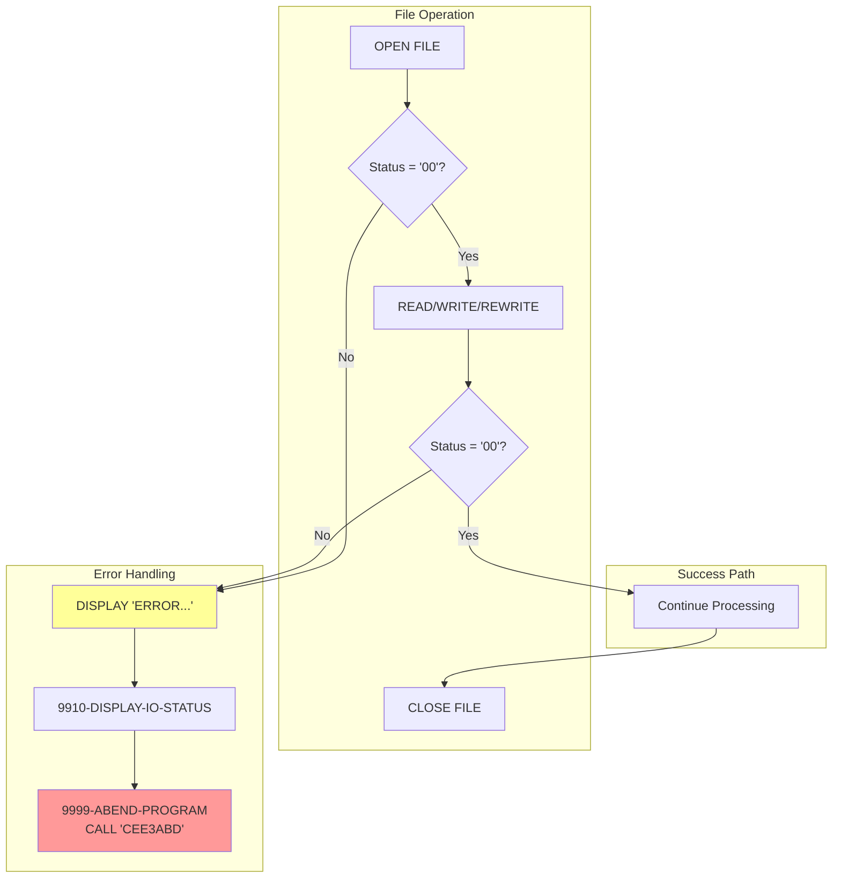
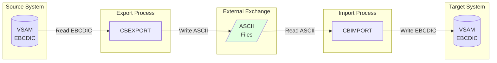

# C4 Level 3: Batch Subsystem Component Diagram

## Batch Subsystem Component Architecture

---

## Alternative: Mermaid Flowchart Version

```mermaid
flowchart TB
    subgraph JES2["JES2 Job Scheduler"]
        JCL[/"JCL Jobs"/]
    end

    subgraph BatchSubsystem["Batch Subsystem"]
        direction TB

        subgraph AccountOps["Account Maintenance"]
            ACT01["CBACT01C<br/>Account Read"]
            ACT02["CBACT02C<br/>Account Update"]
            ACT03["CBACT03C<br/>Account Add"]
            ACT04["CBACT04C<br/>Account Delete"]
        end

        subgraph TransOps["Transaction Processing"]
            TRN01["CBTRN01C<br/>Transaction Read"]
            TRN02["CBTRN02C<br/>Daily Posting"]
            TRN03["CBTRN03C<br/>Interest Calc"]
        end

        subgraph CustOps["Customer Maintenance"]
            CUS01["CBCUS01C<br/>Customer Maint"]
        end

        subgraph DataExchange["Data Exchange"]
            EXPORT["CBEXPORT<br/>Export to ASCII"]
            IMPORT["CBIMPORT<br/>Import from ASCII"]
        end
    end

    subgraph DataStores["Data Stores"]
        subgraph VSAM["VSAM Files"]
            ACCTDAT[(ACCTDAT)]
            TRANSACT[(TRANSACT)]
            XREFFILE[(XREFFILE)]
            CUSTDAT[(CUSTDAT)]
            TCATBALF[(TCATBALF)]
        end

        subgraph Sequential["Sequential Files"]
            DALYTRAN[/DALYTRAN<br/>Daily Trans Input/]
            DALYREJS[/DALYREJS<br/>Rejected Trans/]
            ASCII[/ASCII Files/]
        end
    end

    %% JCL to Programs
    JCL --> ACT01
    JCL --> ACT02
    JCL --> ACT03
    JCL --> ACT04
    JCL --> TRN01
    JCL --> TRN02
    JCL --> TRN03
    JCL --> CUS01
    JCL --> EXPORT
    JCL --> IMPORT

    %% Account operations
    ACT01 -->|"INPUT"| ACCTDAT
    ACT02 -->|"I-O"| ACCTDAT
    ACT03 -->|"OUTPUT"| ACCTDAT
    ACT04 -->|"I-O"| ACCTDAT

    %% Transaction operations
    TRN01 -->|"INPUT"| TRANSACT
    TRN02 -->|"INPUT"| DALYTRAN
    TRN02 -->|"INPUT"| XREFFILE
    TRN02 -->|"I-O"| ACCTDAT
    TRN02 -->|"OUTPUT"| TRANSACT
    TRN02 -->|"I-O"| TCATBALF
    TRN02 -->|"OUTPUT"| DALYREJS

    TRN03 -->|"INPUT"| TRANSACT
    TRN03 -->|"I-O"| ACCTDAT

    %% Customer operations
    CUS01 -->|"I-O"| CUSTDAT

    %% Data exchange
    EXPORT -->|"INPUT"| ACCTDAT
    EXPORT -->|"INPUT"| TRANSACT
    EXPORT -->|"OUTPUT"| ASCII

    IMPORT -->|"INPUT"| ASCII
    IMPORT -->|"OUTPUT"| ACCTDAT
    IMPORT -->|"OUTPUT"| TRANSACT

    %% Styling
    classDef acct fill:#bfb,stroke:#333
    classDef tran fill:#bbf,stroke:#333
    classDef cust fill:#fbf,stroke:#333
    classDef exch fill:#ff9,stroke:#333
    classDef vsam fill:#e0e0ff
    classDef seq fill:#ffe0e0

    class ACT01,ACT02,ACT03,ACT04 acct
    class TRN01,TRN02,TRN03 tran
    class CUS01 cust
    class EXPORT,IMPORT exch
    class ACCTDAT,TRANSACT,XREFFILE,CUSTDAT,TCATBALF vsam
    class DALYTRAN,DALYREJS,ASCII seq
```

---

## Daily Batch Workflow

---

## CBTRN02C Transaction Posting Detail

---

## Batch File I/O Patterns

---

## Error Handling Flow

---

## Job Dependencies

```mermaid
gantt
    title Daily Batch Schedule
    dateFormat HH:mm
    axisFormat %H:%M

    section Account Ops
    CBACT02C (Account Refresh)    :a1, 00:00, 30m

    section Transaction Posting
    CBTRN02C (Daily Posting)      :a2, after a1, 60m

    section Interest Calc
    CBTRN03C (Interest)           :a3, after a2, 45m

    section Optional
    CBEXPORT (Export)             :a4, after a3, 30m
```

---

## Data Exchange Components

---

## Cross-References

- **Full Documentation**: [C4-L3-COMPONENT.md](../C4-L3-COMPONENT.md)
- **CICS Components**: [component-cics.md](./component-cics.md)
- **Data Flow**: [data-flow.md](./data-flow.md)
- **Source**: `app/cbl/CB*.cbl`, `app/jcl/*.jcl`
