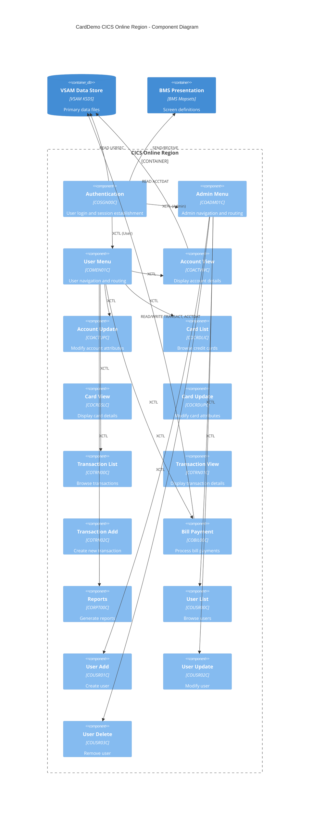
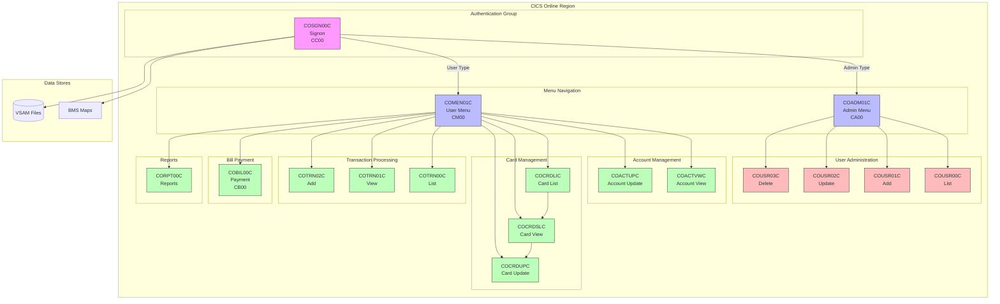
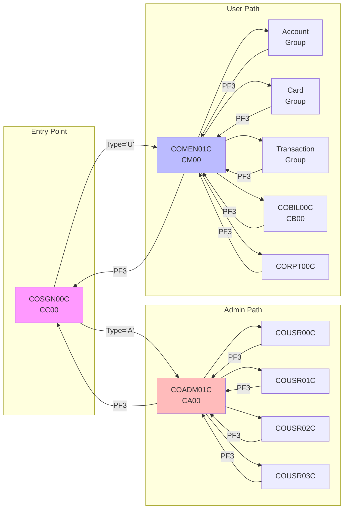
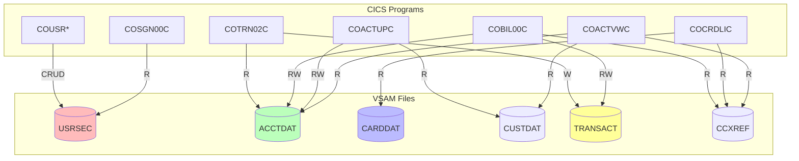
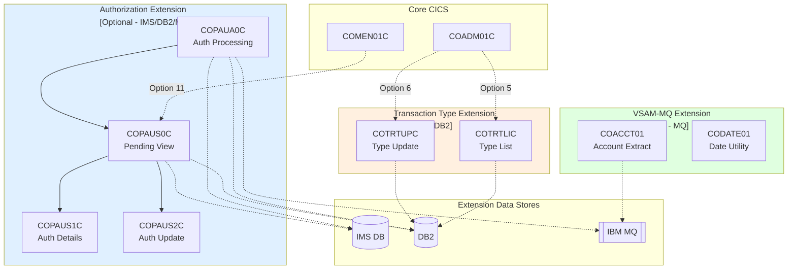
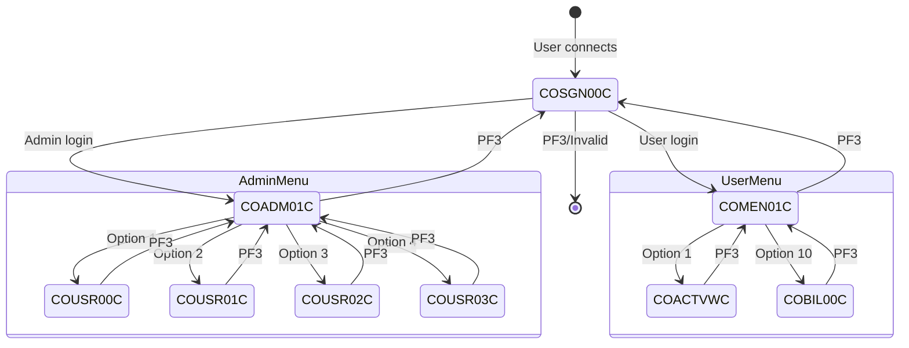

# C4 Level 3: CICS Online Component Diagram

## CICS Region Component Architecture

---

## Alternative: Mermaid Flowchart Version

---

## Program Navigation Flow

---

## Component-VSAM Relationship

---

## Optional Extension Components

---

## Component State Machine

---

## Cross-References

- **Full Documentation**: [C4-L3-COMPONENT.md](../C4-L3-COMPONENT.md)
- **Batch Components**: [component-batch.md](./component-batch.md)
- **Data Flow**: [data-flow.md](./data-flow.md)
- **Source**: `app/cbl/CO*.cbl`, `app/cpy/COCOM01Y.cpy`
