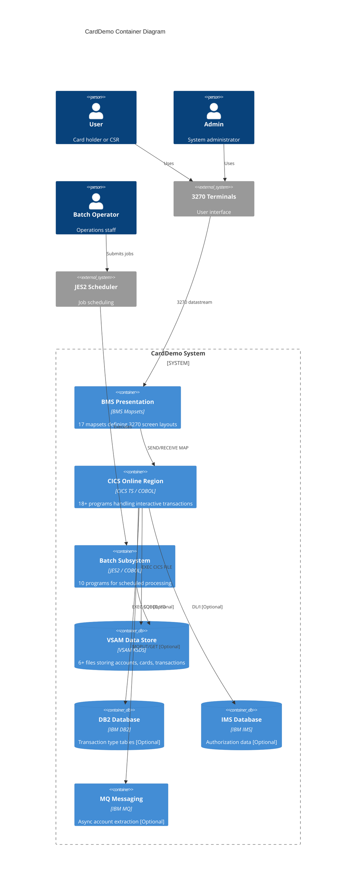
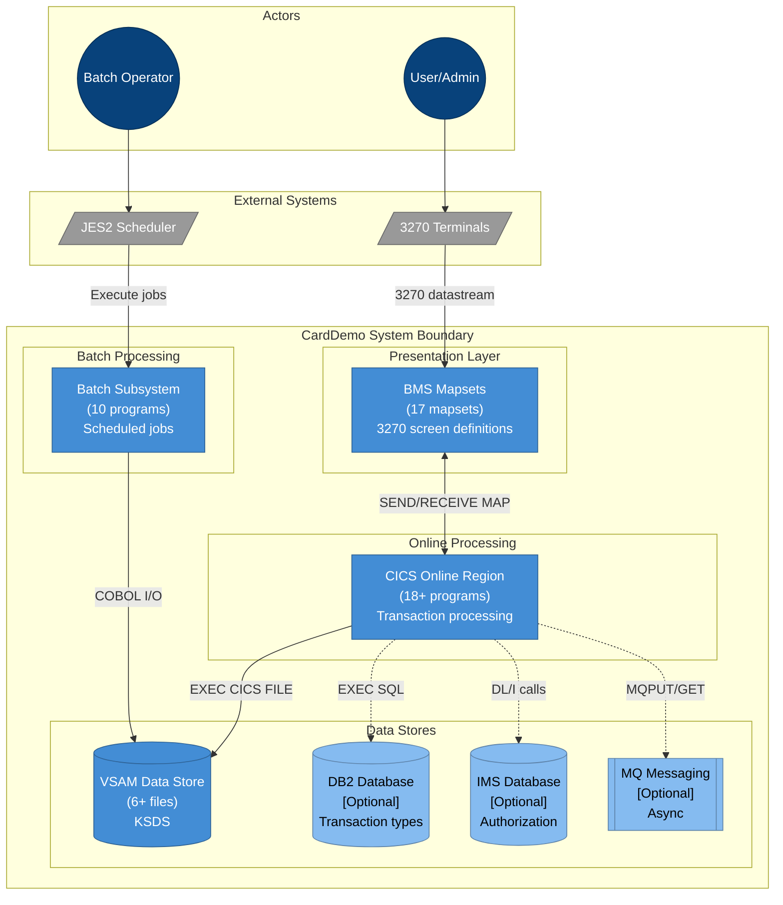
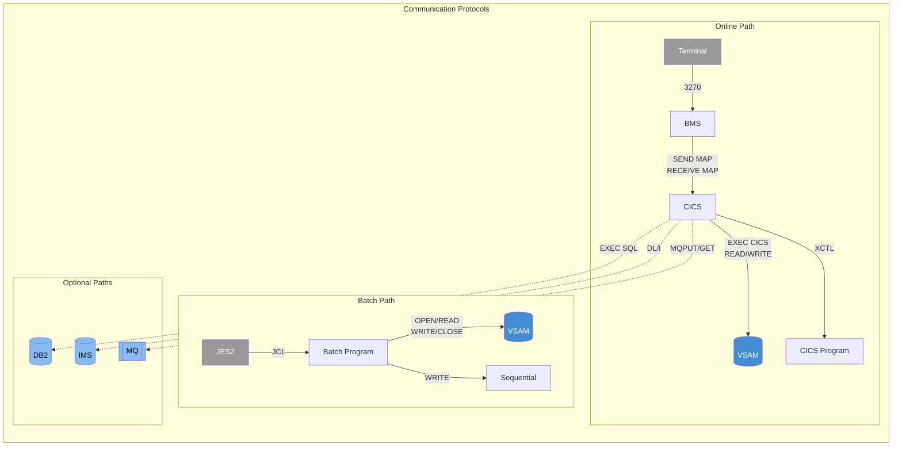
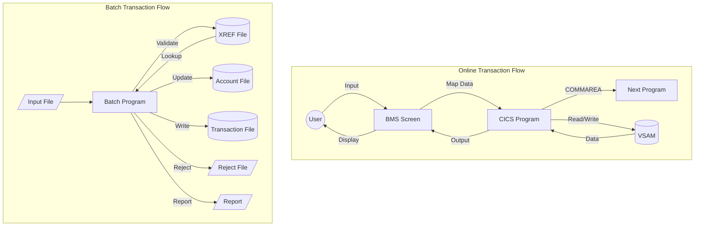
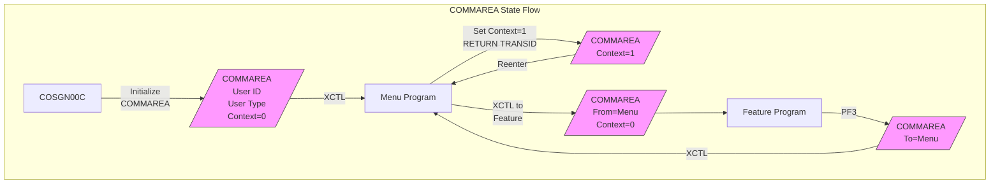
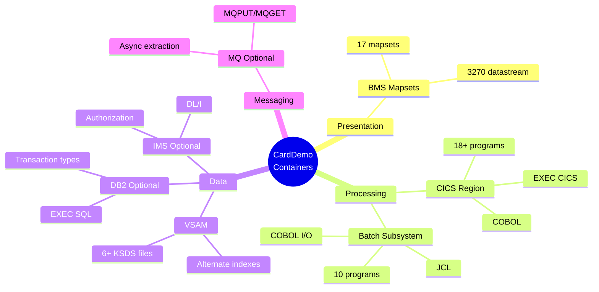

# C4 Level 2: Container Diagram

## CardDemo Container Architecture



---

## Alternative: Mermaid Flowchart Version



---

## Container Communication Matrix



---

## Data Flow Between Containers



---

## State Management



---

## VSAM File Relationships

```mermaid
erDiagram
    ACCTDAT ||--o{ CCXREF : "has cards via"
    CARDDAT ||--|| CCXREF : "cross-referenced"
    ACCTDAT ||--o{ TRANSACT : "has transactions"
    CARDDAT ||--o{ TRANSACT : "records against"
    CUSTDAT ||--o{ ACCTDAT : "owns"
    USRSEC ||--|| CICS_SESSION : "authenticates"

    ACCTDAT {
        numeric ACCT-ID PK
        numeric ACCT-CURR-BAL
        numeric ACCT-CREDIT-LIMIT
        date ACCT-EXPIRATION-DATE
    }

    CARDDAT {
        numeric CARD-NUM PK
        char CARD-STATUS
        date CARD-EXPIRY
    }

    CCXREF {
        numeric CARD-NUM PK
        numeric ACCT-ID AIX
    }

    TRANSACT {
        char TRAN-ID PK
        numeric TRAN-AMT
        timestamp TRAN-ORIG-TS
    }

    CUSTDAT {
        numeric CUST-ID PK
        char CUST-NAME
    }

    USRSEC {
        char USER-ID PK
        char USER-PWD
        char USER-TYPE
    }
```

---

## Technology Stack Summary



---

## Cross-References

- **Full Documentation**: [C4-L2-CONTAINER.md](../C4-L2-CONTAINER.md)
- **System Context Diagram**: [system-context.md](./system-context.md)
- **Component Diagrams**: [component-cics.md](./component-cics.md), [component-batch.md](./component-batch.md)
- **Source**: `app/cbl/`, `app/bms/`, `app/cpy/`
