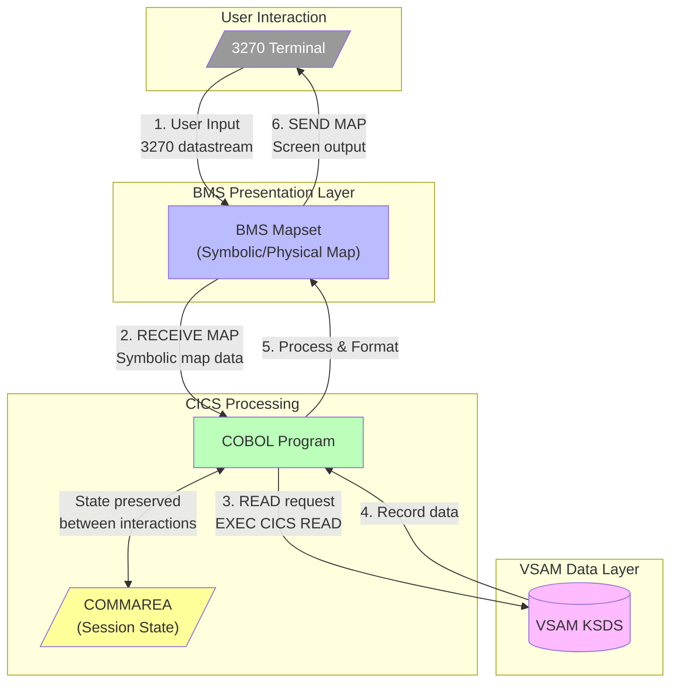
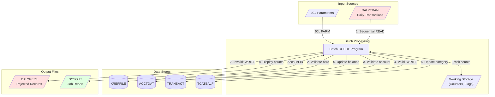
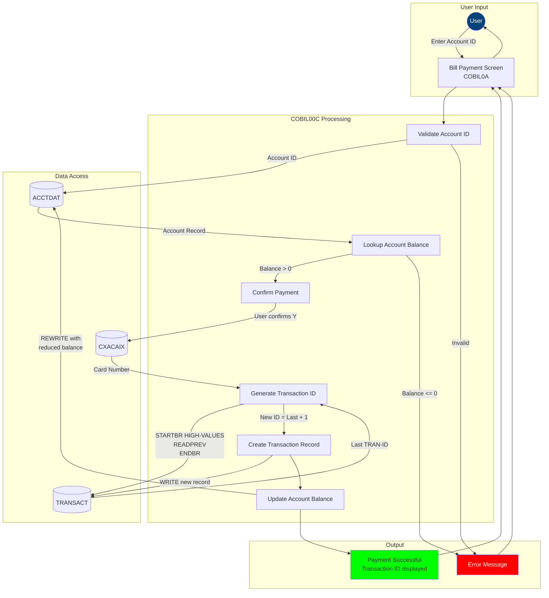
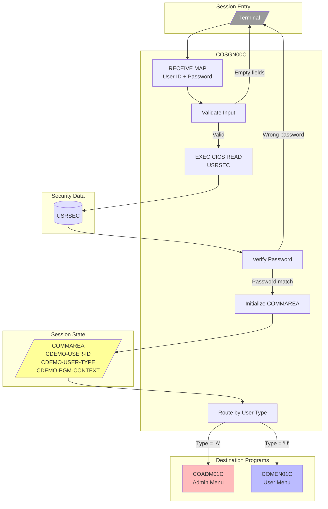
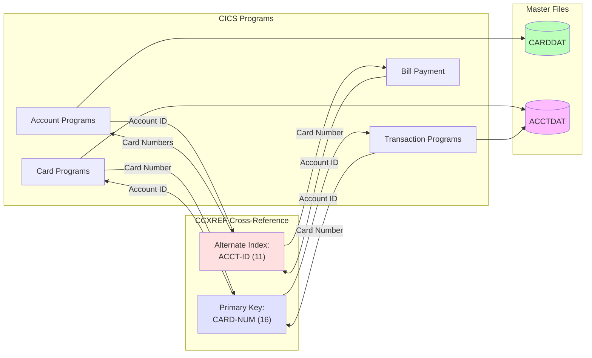
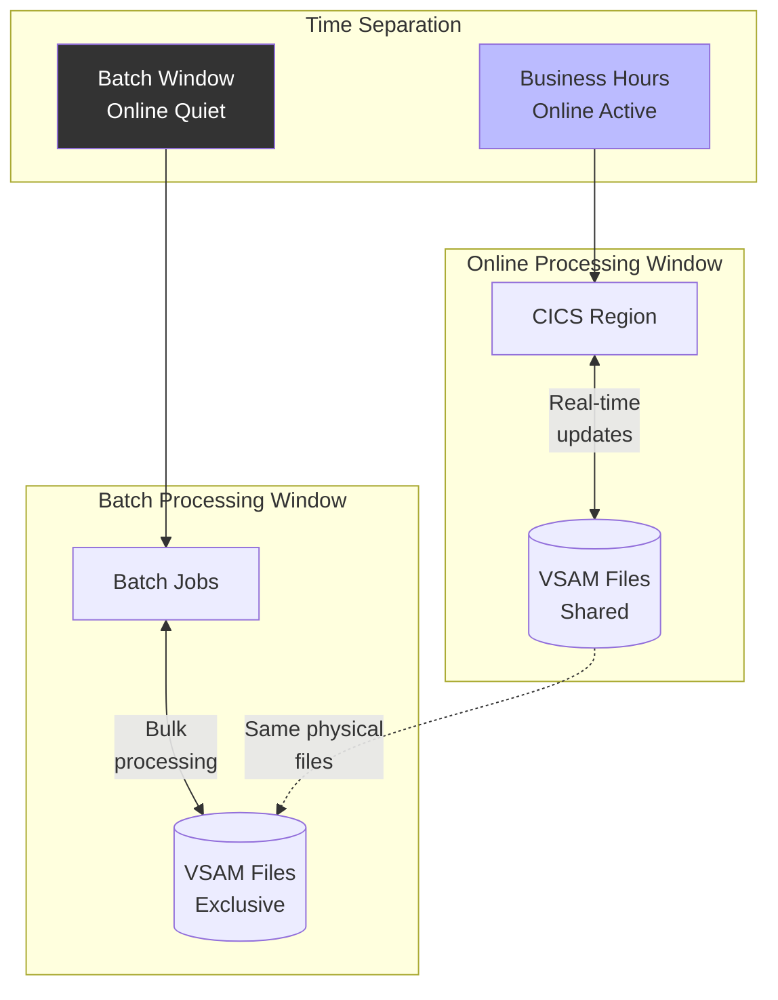
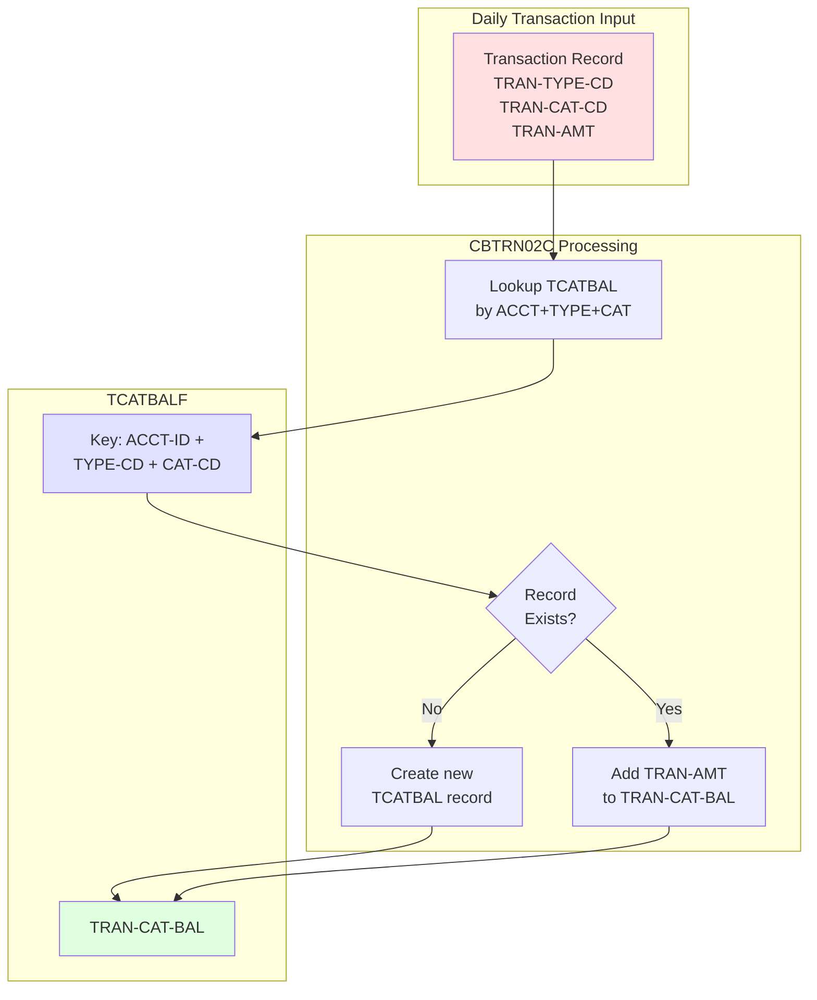
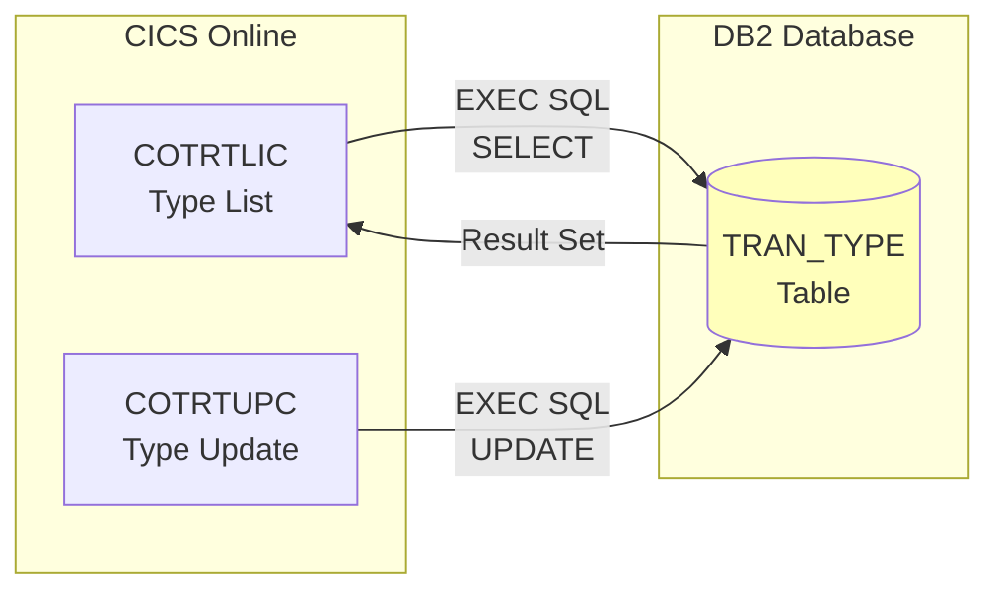
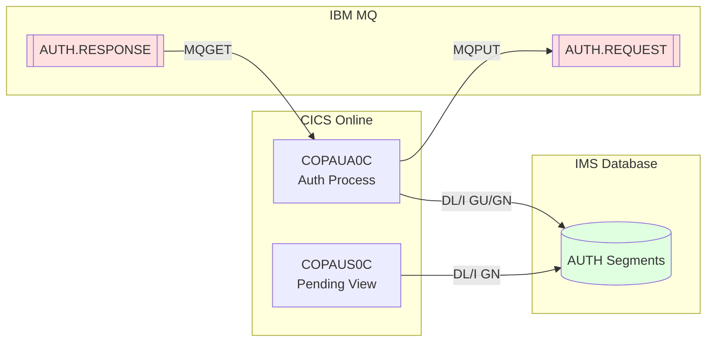

# Cross-Container Data Flow Diagram

## CardDemo Data Flow Architecture

This document illustrates how data flows between the major containers in the CardDemo application.

---

## Online Transaction Data Flow

---

## Batch Processing Data Flow

---

## Bill Payment Complete Data Flow

---

## Authentication Data Flow

---

## VSAM Cross-Reference Data Flow

---

## Online-Batch Data Separation

---

## Transaction Category Balance Flow

---

## Optional Extension Data Flows

### DB2 Transaction Type Flow

### IMS Authorization Flow

---

## Cross-References

- **CICS Components**: [component-cics.md](./component-cics.md)
- **Batch Components**: [component-batch.md](./component-batch.md)
- **Container View**: [container.md](./container.md)
- **Data Model**: [../../02-data-model/DATA-MODEL.md](../../02-data-model/DATA-MODEL.md)
- **Source**: `app/cbl/COBIL00C.cbl`, `app/cbl/CBTRN02C.cbl`, `app/cbl/COSGN00C.cbl`
