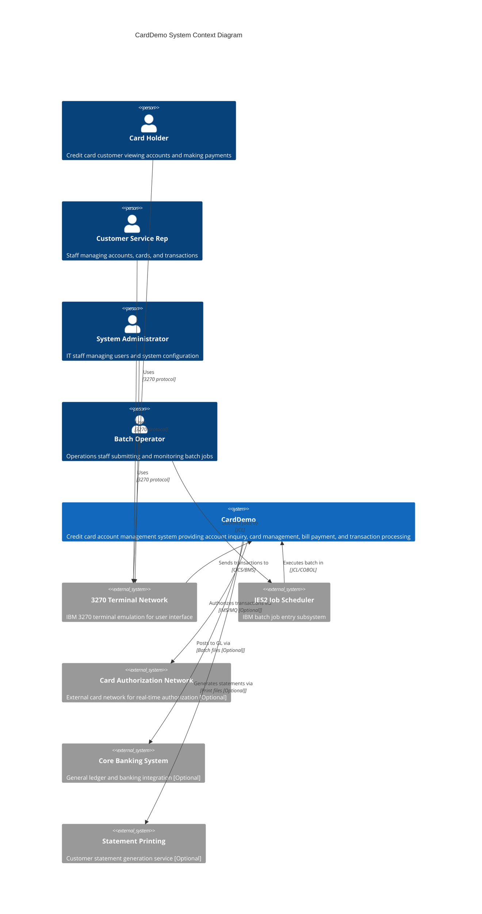
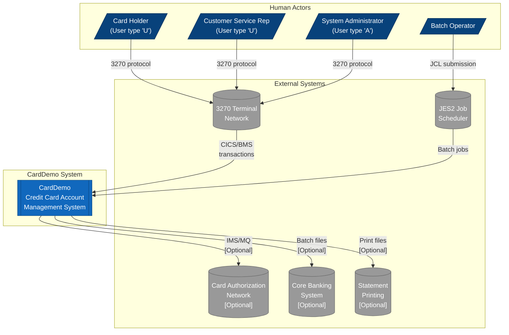
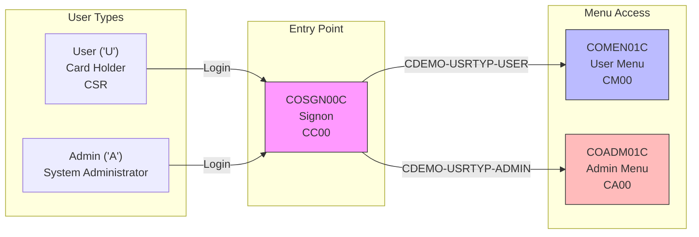
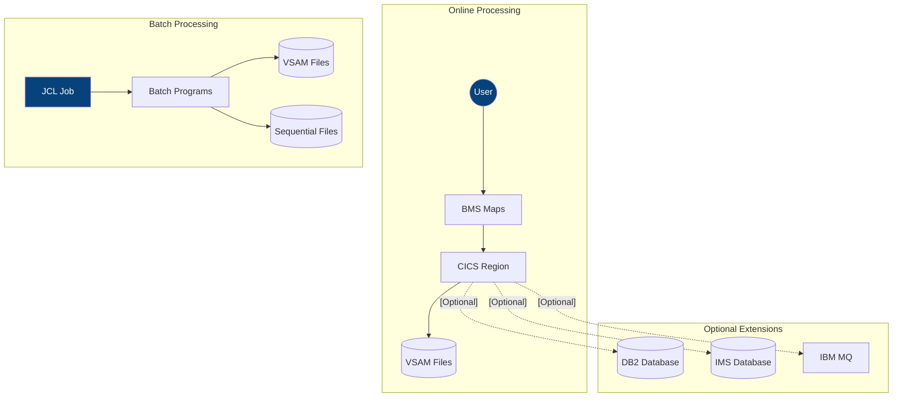
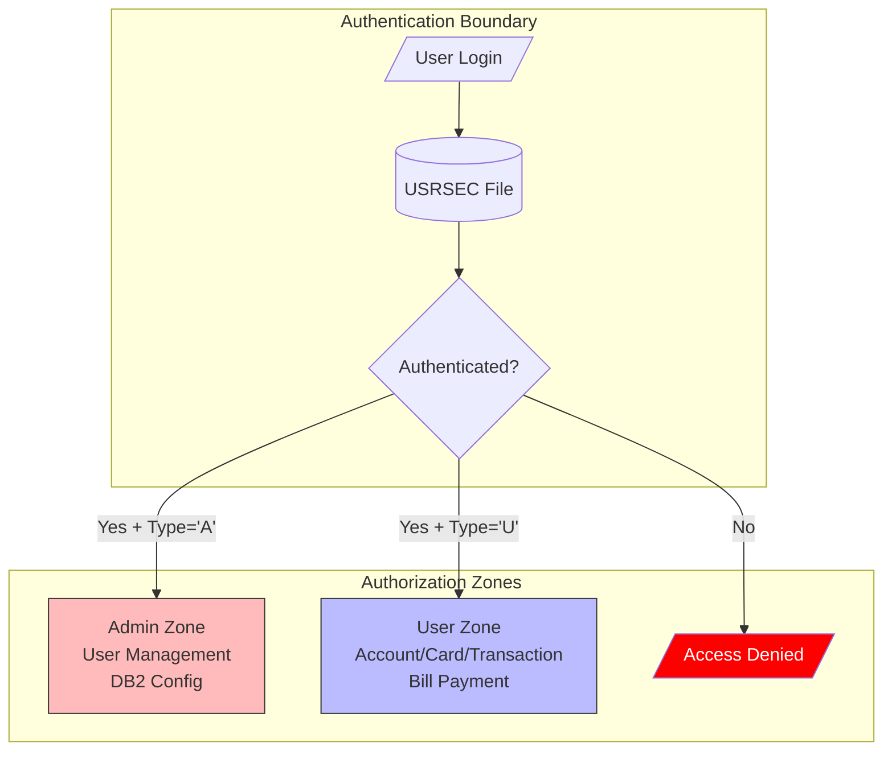

# C4 Level 1: System Context Diagram

## CardDemo System Context

---

## Alternative: Mermaid Flowchart Version

For environments that don't support C4 notation:

---

## Actor Interaction Summary

---

## Data Flow Context

---

## Security Context

---

## Cross-References

- **Full Documentation**: [C4-L1-SYSTEM-CONTEXT.md](../C4-L1-SYSTEM-CONTEXT.md)
- **Container Diagram**: [container.md](./container.md)
- **Source**: `app/cpy/COCOM01Y.cpy:26-28`, `app/cbl/COSGN00C.cbl:230-240`
