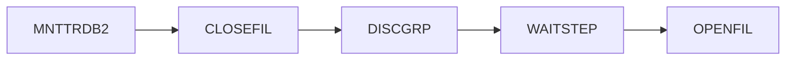
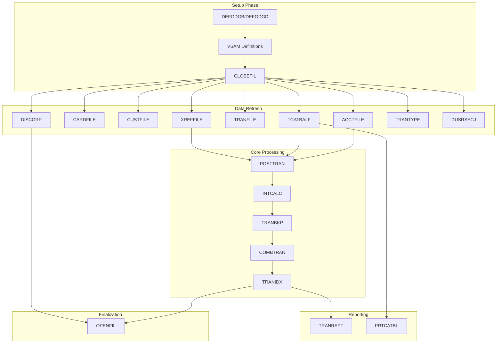
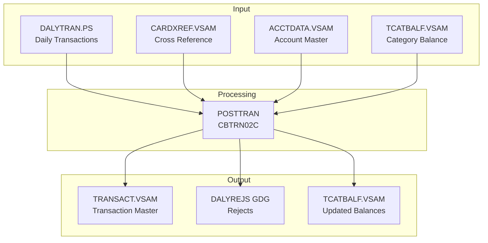
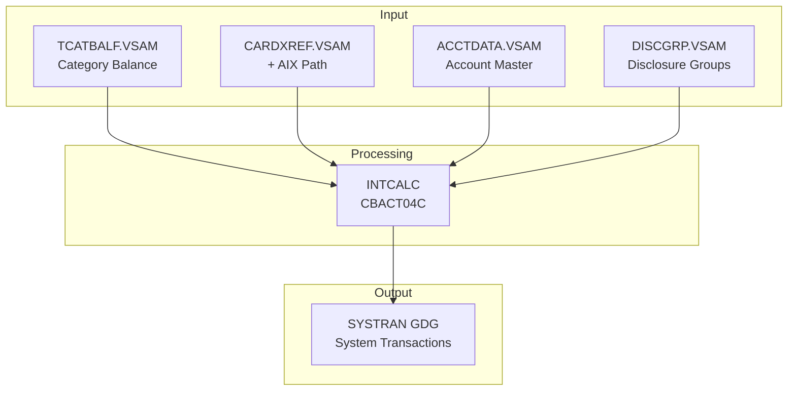
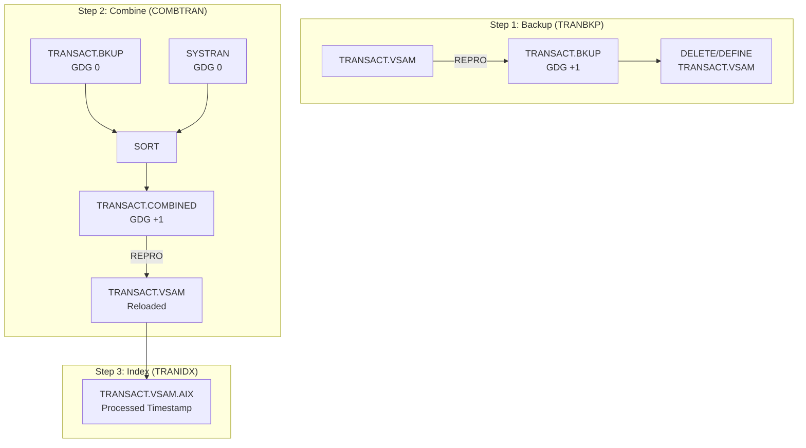
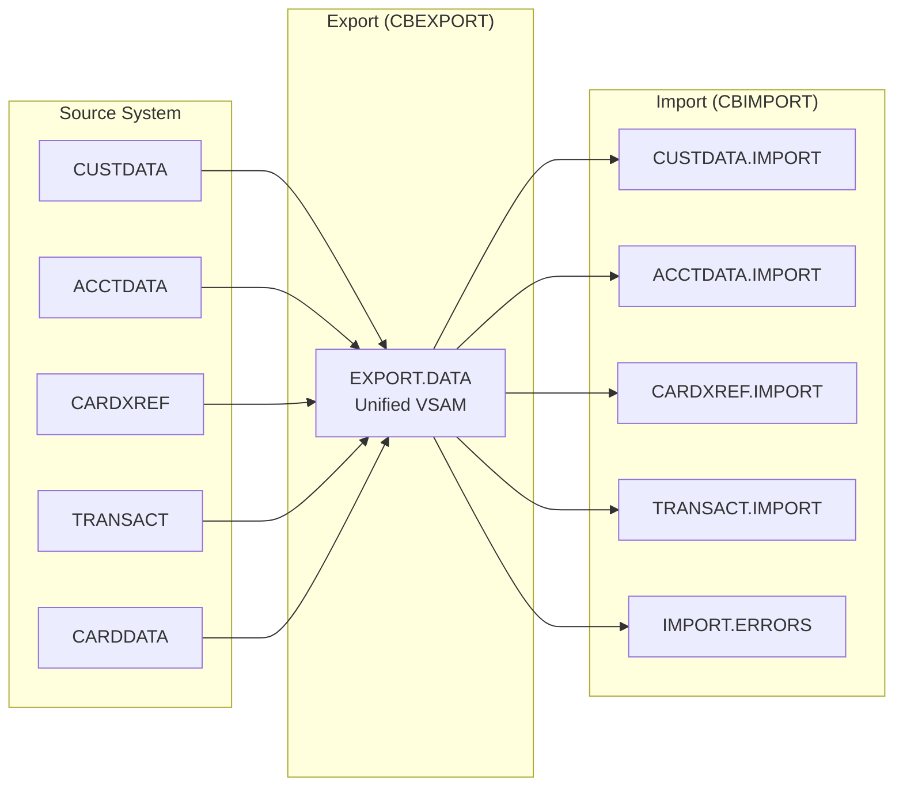
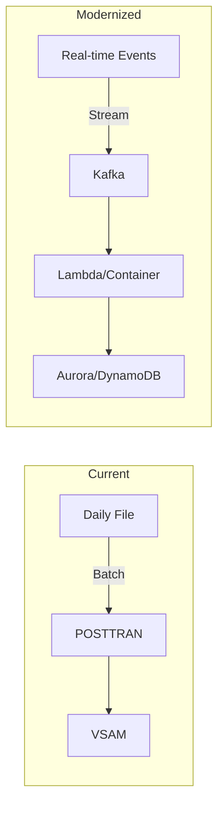
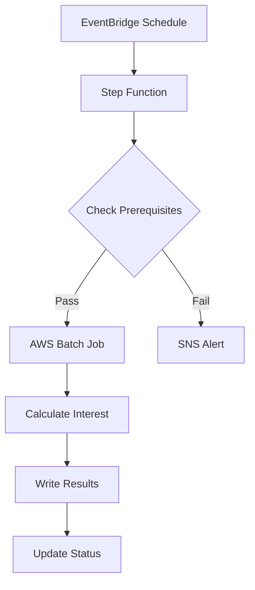

# RE-006: CardDemo Batch Workflow Analysis

**Document Version:** 1.0
**Generated:** 2026-02-05
**Prompt ID:** RE-006
**Status:** Complete

---

## 1. Executive Summary

This document provides a comprehensive analysis of the JCL batch workflows in the CardDemo mainframe credit card processing application. The analysis covers job-step specifications, inter-job dependencies, data flow diagrams, restart/recovery procedures, and modernization recommendations.

> **Count Correction (2026-02-06):** Original document stated 33 JCL jobs and 10 batch programs. Actual counts are 38 JCL files in `app/jcl/` (33 .jcl + 5 .JCL) and 12 batch COBOL programs in `app/cbl/` (10 .cbl + 2 .CBL). An additional 8 JCL files exist in extension directories. See [CONFIDENCE-ASSESSMENT.md](../CONFIDENCE-ASSESSMENT.md) for details.

### Key Findings

| Metric | Value |
|--------|-------|
| Total JCL Jobs (core) | 38 (33 lowercase + 5 uppercase extension) |
| Total JCL Jobs (with extensions) | 46 |
| Batch COBOL Programs (core) | 12 (10 .cbl + 2 .CBL) |
| VSAM Clusters Defined | 15 |
| GDG Bases Defined | 11 |
| Scheduler Workflows | 5 (Control-M) |
| Critical Processing Jobs | 5 |

### Job Categories

| Category | Count | Purpose |
|----------|-------|---------|
| VSAM File Definition | 11 | Create/populate VSAM clusters |
| GDG Base Definition | 4 | Define generation data groups |
| Transaction Processing | 5 | Core business processing |
| Statement Generation | 1 | Create account statements |
| Reporting | 3 | Generate reports |
| CICS File Management | 2 | Open/close files for batch |
| Data Read/Extract | 4 | Extract data from VSAM |
| Data Import/Export | 2 | Data migration utilities |
| FTP/File Transfer | 3 | FTP and internal reader jobs |
| Text-to-PDF Conversion | 1 | Convert text statements to PDF |
| Other/Utility | 2 | CICS resources, timing |

> **Note on file extensions (MIN-003):** The `app/jcl/` directory contains files with both lowercase `.jcl` (33 files) and uppercase `.JCL` (5 files) extensions. Similarly, `app/cbl/` contains both `.cbl` and `.CBL` files. On case-sensitive file systems (Linux, z/OS USS), these are distinct entries. All uppercase `.JCL` files (CREASTMT, FTPJCL, INTRDRJ1, INTRDRJ2, TXT2PDF1) represent specialized workflows documented in section 2.9 below.

---

## 2. JCL Job Inventory

### 2.1 VSAM File Definition Jobs (10)

These jobs define, delete, and populate VSAM clusters that form the application's persistent data layer.

#### ACCTFILE - Account Master VSAM

| Attribute | Value |
|-----------|-------|
| **Purpose** | Define and load account master VSAM |
| **Program** | IDCAMS |
| **Steps** | STEP05 (Delete), STEP10 (Define), STEP15 (REPRO) |
| **VSAM Cluster** | `AWS.M2.CARDDEMO.ACCTDATA.VSAM.KSDS` |
| **Key Specification** | 11 bytes at offset 0 (Account ID) |
| **Record Size** | 300 bytes |
| **Input** | `AWS.M2.CARDDEMO.ACCTDATA.PS` |

```
Step Flow: Delete existing → Define cluster → Load from PS file
```

#### CARDFILE - Card Master VSAM with AIX

| Attribute | Value |
|-----------|-------|
| **Purpose** | Define card master VSAM with alternate index |
| **Program** | IDCAMS, SDSF |
| **Steps** | CLCIFIL, STEP05-60, OPCIFIL |
| **VSAM Cluster** | `AWS.M2.CARDDEMO.CARDDATA.VSAM.KSDS` |
| **Key Specification** | 16 bytes at offset 0 (Card Number) |
| **AIX Specification** | 11 bytes at offset 16 (Account ID) |
| **Record Size** | 150 bytes |
| **CICS Files** | CARDDAT, CARDAIX |

Special features:
- Closes CICS files before processing
- Creates alternate index on Account ID
- Reopens CICS files after processing

#### CUSTFILE - Customer Master VSAM

| Attribute | Value |
|-----------|-------|
| **Purpose** | Define customer master VSAM |
| **Key Specification** | 9 bytes at offset 0 (Customer ID) |
| **Record Size** | 500 bytes |
| **CICS Files** | CUSTDAT |

#### XREFFILE - Card Cross-Reference VSAM with AIX

| Attribute | Value |
|-----------|-------|
| **Purpose** | Define card-to-account cross-reference |
| **Key Specification** | 16 bytes at offset 0 (Card Number) |
| **AIX Specification** | 11 bytes at offset 25 (Account ID) |
| **Record Size** | 50 bytes |

#### TRANFILE - Transaction Master VSAM with AIX

| Attribute | Value |
|-----------|-------|
| **Purpose** | Define transaction master VSAM |
| **Key Specification** | 16 bytes at offset 0 (Transaction ID) |
| **AIX Specification** | 26 bytes at offset 304 (Processed Timestamp) |
| **Record Size** | 350 bytes |
| **CICS Files** | TRANSACT, CXACAIX |

#### TRANTYPE - Transaction Type Reference

| Attribute | Value |
|-----------|-------|
| **Key Specification** | 2 bytes at offset 0 (Type Code) |
| **Record Size** | 60 bytes |

#### TRANCATG - Transaction Category Reference

| Attribute | Value |
|-----------|-------|
| **Key Specification** | 6 bytes at offset 0 (Type + Category) |
| **Record Size** | 60 bytes |

#### TCATBALF - Transaction Category Balance

| Attribute | Value |
|-----------|-------|
| **Key Specification** | 17 bytes at offset 0 (Acct+Type+Cat) |
| **Record Size** | 50 bytes |

#### DISCGRP - Disclosure Group Reference

| Attribute | Value |
|-----------|-------|
| **Key Specification** | 16 bytes at offset 0 |
| **Record Size** | 50 bytes |

#### DUSRSECJ - User Security VSAM

| Attribute | Value |
|-----------|-------|
| **Purpose** | Define user security with inline data |
| **Programs** | IEBGENER, IDCAMS |
| **Key Specification** | 8 bytes at offset 0 (User ID) |
| **Record Size** | 80 bytes |
| **Inline Users** | 10 (5 admin, 5 regular) |

### 2.2 GDG Base Definition Jobs (4)

#### DEFGDGB - Transaction Processing GDGs

Defines 6 GDG bases with limit 5:

| GDG Base | Purpose |
|----------|---------|
| `AWS.M2.CARDDEMO.TRANSACT.BKUP` | Transaction backup |
| `AWS.M2.CARDDEMO.TRANSACT.DALY` | Daily transaction extract |
| `AWS.M2.CARDDEMO.TRANREPT` | Transaction reports |
| `AWS.M2.CARDDEMO.TCATBALF.BKUP` | Category balance backup |
| `AWS.M2.CARDDEMO.SYSTRAN` | System-generated transactions |
| `AWS.M2.CARDDEMO.TRANSACT.COMBINED` | Combined transactions |

#### DEFGDGD - Reference Data GDGs

Defines 3 GDG bases and creates initial generations:

| GDG Base | Purpose |
|----------|---------|
| `AWS.M2.CARDDEMO.TRANTYPE.BKUP` | Transaction type backup |
| `AWS.M2.CARDDEMO.TRANCATG.PS.BKUP` | Transaction category backup |
| `AWS.M2.CARDDEMO.DISCGRP.BKUP` | Disclosure group backup |

#### REPTFILE - Transaction Report GDG

| Attribute | Value |
|-----------|-------|
| **GDG Base** | `AWS.M2.CARDDEMO.TRANREPT` |
| **Limit** | 10 generations |

> **GDG Limit Conflict (MIN-004):** DEFGDGB.jcl also defines the `AWS.M2.CARDDEMO.TRANREPT` GDG base with LIMIT(5), while REPTFILE.jcl defines it with LIMIT(10). These are conflicting definitions for the same GDG base. Whichever job runs last sets the effective limit. This should be reconciled during modernization.

#### DALYREJS - Daily Rejects GDG

| Attribute | Value |
|-----------|-------|
| **GDG Base** | `AWS.M2.CARDDEMO.DALYREJS` |
| **Limit** | 5 generations |

### 2.3 Transaction Processing Jobs (5) - CRITICAL

These are the core business processing jobs that execute the application's primary functions.

#### POSTTRAN - Post Daily Transactions

| Attribute | Value |
|-----------|-------|
| **Program** | CBTRN02C |
| **Criticality** | HIGH |
| **Function** | Post records from daily transaction file |

**Input Files:**
- `AWS.M2.CARDDEMO.DALYTRAN.PS` - Daily transactions
- `AWS.M2.CARDDEMO.TRANSACT.VSAM.KSDS` - Transaction master
- `AWS.M2.CARDDEMO.CARDXREF.VSAM.KSDS` - Card cross-reference
- `AWS.M2.CARDDEMO.ACCTDATA.VSAM.KSDS` - Account master
- `AWS.M2.CARDDEMO.TCATBALF.VSAM.KSDS` - Category balance

**Output Files:**
- `AWS.M2.CARDDEMO.DALYREJS(+1)` - Rejected transactions

**Processing Logic:**
1. Read daily transaction input file
2. Validate card number via XREF
3. Update transaction master VSAM
4. Update category balance VSAM
5. Write rejected transactions to GDG

#### INTCALC - Interest Calculation

| Attribute | Value |
|-----------|-------|
| **Program** | CBACT04C |
| **Criticality** | HIGH |
| **Function** | Calculate interest and fees |
| **PARM** | YYYYMMDD00 (Date parameter) |

**Input Files:**
- `AWS.M2.CARDDEMO.TCATBALF.VSAM.KSDS` - Category balance
- `AWS.M2.CARDDEMO.CARDXREF.VSAM.KSDS` - Card cross-reference
- `AWS.M2.CARDDEMO.CARDXREF.VSAM.AIX.PATH` - Cross-ref by account
- `AWS.M2.CARDDEMO.ACCTDATA.VSAM.KSDS` - Account master
- `AWS.M2.CARDDEMO.DISCGRP.VSAM.KSDS` - Disclosure groups

**Output Files:**
- `AWS.M2.CARDDEMO.SYSTRAN(+1)` - System-generated transactions

**Processing Logic:**
1. Read category balance records sequentially
2. Lookup disclosure group for interest rates
3. Calculate interest and fees
4. Generate interest/fee transactions
5. Write to SYSTRAN GDG

#### COMBTRAN - Combine Transactions

| Attribute | Value |
|-----------|-------|
| **Program** | SORT, IDCAMS |
| **Criticality** | HIGH |
| **Function** | Merge backup + system transactions |

**Step Details:**

| Step | Program | Function |
|------|---------|----------|
| STEP05R | SORT | Sort and combine BKUP(0) + SYSTRAN(0) |
| STEP10 | IDCAMS | REPRO combined file to VSAM |

**SORT Control:**
```
SORT FIELDS=(TRAN-ID,A)
```

#### TRANBKP - Transaction Backup

| Attribute | Value |
|-----------|-------|
| **Program** | REPROC (proc), IDCAMS |
| **Criticality** | HIGH |
| **Function** | Backup and redefine transaction VSAM |

**Step Details:**

| Step | Program | Function |
|------|---------|----------|
| STEP05R | REPROC | REPRO VSAM to sequential backup |
| STEP05 | IDCAMS | DELETE cluster and AIX |
| STEP10 | IDCAMS | DEFINE cluster (COND 4,LT) |

**Key Attribute:** Uses REPROC procedure which invokes IDCAMS with REPROCT control file.

#### TRANIDX - Transaction AIX Rebuild

| Attribute | Value |
|-----------|-------|
| **Program** | IDCAMS |
| **Function** | Create/rebuild AIX on processed timestamp |

**Step Details:**

| Step | Function |
|------|----------|
| STEP20 | DEFINE ALTERNATEINDEX |
| STEP25 | DEFINE PATH |
| STEP30 | BLDINDEX |

### 2.4 Reporting Jobs (3)

#### TRANREPT - Transaction Detail Report

| Attribute | Value |
|-----------|-------|
| **Programs** | REPROC, SORT, CBTRN03C |
| **Function** | Generate date-filtered transaction report |

**Step Details:**

| Step | Program | Function |
|------|---------|----------|
| STEP05R | REPROC | Unload transaction VSAM to GDG |
| STEP05R | SORT | Filter by date, sort by card number |
| STEP10R | CBTRN03C | Generate formatted report |

**SORT Parameters (configurable):**
```
PARM-START-DATE,C'2022-01-01'
PARM-END-DATE,C'2022-07-06'
```

#### PRTCATBL - Category Balance Report

| Attribute | Value |
|-----------|-------|
| **Programs** | REPROC, SORT |
| **Function** | Print transaction category balance report |

**Output Format:** LRECL=40, sorted by Account+Type+Category

#### REPTFILE - (See GDG Definition)

### 2.5 CICS File Management Jobs (2)

#### CLOSEFIL - Close CICS Files

| Attribute | Value |
|-----------|-------|
| **Program** | SDSF |
| **CICS Region** | CICSAWSA |

**CICS Commands Executed:**
```
/F CICSAWSA,'CEMT SET FIL(TRANSACT) CLO'
/F CICSAWSA,'CEMT SET FIL(CCXREF) CLO'
/F CICSAWSA,'CEMT SET FIL(ACCTDAT) CLO'
/F CICSAWSA,'CEMT SET FIL(CXACAIX) CLO'
/F CICSAWSA,'CEMT SET FIL(USRSEC) CLO'
```

#### OPENFIL - Open CICS Files

| Attribute | Value |
|-----------|-------|
| **Program** | SDSF |
| **CICS Region** | CICSAWSA |

**CICS Commands Executed:**
```
/F CICSAWSA,'CEMT SET FIL(TRANSACT) OPE'
/F CICSAWSA,'CEMT SET FIL(CCXREF) OPE'
/F CICSAWSA,'CEMT SET FIL(ACCTDAT) OPE'
/F CICSAWSA,'CEMT SET FIL(CXACAIX) OPE'
/F CICSAWSA,'CEMT SET FIL(USRSEC) OPE'
```

### 2.6 Data Read/Extract Jobs (4)

#### READACCT - Account Data Extract

| Attribute | Value |
|-----------|-------|
| **Program** | CBACT01C |
| **Input** | Account master VSAM |
| **Outputs** | 3 formats: PSCOMP (107), ARRYPS (110), VBPS (84 VB) |

#### READCARD, READCUST, READXREF

Simple read programs for card, customer, and cross-reference VSAM files respectively. Output to SYSOUT only.

### 2.7 Data Import/Export Jobs (2)

#### CBEXPORT - Multi-File Export

| Attribute | Value |
|-----------|-------|
| **Programs** | IDCAMS, CBEXPORT |
| **Function** | Export 5 VSAM files to unified export file |

**Export File Specification:**
- Cluster: `AWS.M2.CARDDEMO.EXPORT.DATA`
- Key: 4 bytes at offset 28
- Record Size: 500 bytes

**Source Files:**
1. Customer master
2. Account master
3. Card cross-reference
4. Transaction master
5. Card master

#### CBIMPORT - Import and Split

| Attribute | Value |
|-----------|-------|
| **Program** | CBIMPORT |
| **Function** | Import from unified file, split to normalized files |

**Target Files:**
- `AWS.M2.CARDDEMO.CUSTDATA.IMPORT` (LRECL=500)
- `AWS.M2.CARDDEMO.ACCTDATA.IMPORT` (LRECL=300)
- `AWS.M2.CARDDEMO.CARDXREF.IMPORT` (LRECL=50)
- `AWS.M2.CARDDEMO.TRANSACT.IMPORT` (LRECL=350)
- `AWS.M2.CARDDEMO.IMPORT.ERRORS` (LRECL=132)

### 2.8 Other/Utility Jobs (3)

#### CBADMCDJ - CICS Resource Definition

| Attribute | Value |
|-----------|-------|
| **Program** | DFHCSDUP |
| **Function** | Define CICS resources for CardDemo |

**Defines:**
- Library: COM2DOLL
- 17 Mapsets
- 16 Programs
- 5 Transactions
- Group: CARDDEMO

#### WAITSTEP - Timing Delay

| Attribute | Value |
|-----------|-------|
| **Program** | COBSWAIT |
| **Input** | SYSIN DD (inline data: centiseconds value, e.g. `00003600` = 36 seconds) |

> **Note:** The wait duration is delivered via `SYSIN DD *` inline data, not via EXEC PARM=. The JCL comment states "WAIT FOR CENTISECONDS IN THE PARM" but the actual mechanism is SYSIN.

#### ESDSRRDS - Alternate VSAM Types

Defines ESDS and RRDS versions of user security file for demonstration purposes.

### 2.9 Additional JCL Jobs (6) - Uppercase .JCL Extension Files

These six jobs use uppercase `.JCL` file extensions (plus one lowercase `.jcl`). They were previously undocumented and represent specialized workflows for statement generation, FTP file transfer, internal reader chaining, text-to-PDF conversion, and an alternate customer VSAM definition.

#### CREASTMT.JCL - Statement Generation Workflow

| Attribute | Value |
|-----------|-------|
| **Purpose** | Create account statements for each card in the XREF file |
| **Programs** | IDCAMS, SORT, IEFBR14, CBSTM03A |
| **Criticality** | MEDIUM |

**Step Details:**

| Step | Program | Function |
|------|---------|----------|
| DELDEF01 | IDCAMS | Delete/define temporary VSAM `AWS.M2.CARDDEMO.TRXFL.VSAM.KSDS` (KEYS 32,0, RECORDSIZE 350) |
| STEP010 | SORT | Sort TRANSACT VSAM by card number + tran ID, reformat key to first 16 bytes |
| STEP020 | IDCAMS | REPRO sorted sequential file into temporary VSAM |
| STEP030 | IEFBR14 | Delete prior statement output files (STATEMNT.HTML, STATEMNT.PS) |
| STEP040 | CBSTM03A | Generate statements in text and HTML format |

**Input Files (STEP040):**
- `AWS.M2.CARDDEMO.TRXFL.VSAM.KSDS` - Sorted transaction VSAM (temporary)
- `AWS.M2.CARDDEMO.CARDXREF.VSAM.KSDS` - Card cross-reference
- `AWS.M2.CARDDEMO.ACCTDATA.VSAM.KSDS` - Account master
- `AWS.M2.CARDDEMO.CUSTDATA.VSAM.KSDS` - Customer master

**Output Files:**
- `AWS.M2.CARDDEMO.STATEMNT.PS` - Plain text statements (LRECL=80)
- `AWS.M2.CARDDEMO.STATEMNT.HTML` - HTML-formatted statements (LRECL=100)

**Program Notes:**
- **CBSTM03A.CBL** is the statement generation main program. It reads transaction data per card via XREF, looks up customer and account details, and writes formatted statements in both text and HTML formats. It demonstrates mainframe control block addressing (PSA/TCB/TIOT), ALTER/GO TO statements, COMP/COMP-3 variables, 2-dimensional arrays, and subroutine calls.
- **CBSTM03B.CBL** is a called subroutine that handles all VSAM file I/O operations (open, read, read-by-key, close) for the four input files (TRNXFILE, XREFFILE, CUSTFILE, ACCTFILE). It is invoked via `CALL 'CBSTM03B' USING WS-M03B-AREA`.

**Relationship to TXT2PDF1.JCL:** The `STATEMNT.PS` output from CREASTMT can be converted to PDF by running TXT2PDF1.JCL as a downstream job.

#### FTPJCL.JCL - FTP File Transfer

| Attribute | Value |
|-----------|-------|
| **Purpose** | Transfer files to/from mainframe via FTP |
| **Program** | FTP |
| **Function** | Send mainframe dataset to remote FTP server as text file |

**Step Details:**

| Step | Program | Function |
|------|---------|----------|
| STEP1 | FTP | Connect to FTP server, PUT mainframe file |

**FTP Operations:**
- Connects to IP `172.31.21.124` with user `carddemousr`
- Transfers `AWS.M2.CARDEMO.FTP.TEST` as ASCII text
- Sends file to `/ftpfolder/welcome.txt` via PUT command
- Comments note the PUT can be changed to GET for receiving files

#### INTRDRJ1.JCL - Internal Reader Job Trigger

| Attribute | Value |
|-----------|-------|
| **Purpose** | Copy FTP-received file and trigger chained job via internal reader |
| **Programs** | IDCAMS, IEBGENER |

**Step Details:**

| Step | Program | Function |
|------|---------|----------|
| IDCAMS | IDCAMS | REPRO `AWS.M2.CARDEMO.FTP.TEST` to `AWS.M2.CARDEMO.FTP.TEST.BKUP` |
| STEP01 | IEBGENER | Submit INTRDRJ2 via internal reader (SYSOUT=(A,INTRDR)) |

**Key Pattern:** This job demonstrates the JES internal reader pattern where IEBGENER copies a JCL member from a PDS (`AWS.M2.CARDDEMO.JCL(INTRDRJ2)`) to the internal reader, causing automatic submission of the chained job.

#### INTRDRJ2.JCL - Internal Reader Chained Job

| Attribute | Value |
|-----------|-------|
| **Purpose** | Secondary copy triggered by INTRDRJ1 via internal reader |
| **Program** | IDCAMS |

**Step Details:**

| Step | Program | Function |
|------|---------|----------|
| IDCAMS | IDCAMS | REPRO `AWS.M2.CARDEMO.FTP.TEST.BKUP` to `AWS.M2.CARDEMO.FTP.TEST.BKUP.INTRDR` |

**Chain:** FTPJCL -> INTRDRJ1 -> INTRDRJ2 (triggered via internal reader)

#### TXT2PDF1.JCL - Text to PDF Conversion

| Attribute | Value |
|-----------|-------|
| **Purpose** | Convert text statement file to PDF format |
| **Program** | IKJEFT1B (TSO/E batch) |
| **Function** | Invoke TXT2PDF REXX exec to convert plain text to PDF |

**Step Details:**

| Step | Program | Function |
|------|---------|----------|
| TXT2PDF | IKJEFT1B | Execute TXT2PDF REXX to convert text to PDF |

**Key Attributes:**
- **STEPLIB:** `AWS.M2.LBD.TXT2PDF.LOAD`
- **SYSEXEC:** `AWS.M2.LBD.TXT2PDF.EXEC` (REXX library)
- **Input:** `AWS.M2.CARDDEMO.STATEMNT.PS` (via INDD DD)
- **Output:** `AWS.M2.CARDDEMO.STATEMNT.PS.PDF`
- **COND:** `(0,NE)` - only runs if prior steps had RC=0

**Relationship to CREASTMT.JCL:** This job converts the plain text statement output from CREASTMT.JCL STEP040 into PDF format.

#### DEFCUST.jcl - Alternate Customer VSAM Definition

| Attribute | Value |
|-----------|-------|
| **Purpose** | Define customer VSAM cluster using alternate DSN schema |
| **Program** | IDCAMS |

**Step Details:**

| Step | Program | Function |
|------|---------|----------|
| STEP05 (first) | IDCAMS | DELETE `AWS.CCDA.CUSTDATA.CLUSTER` |
| STEP05 (second) | IDCAMS | DEFINE CLUSTER `AWS.CUSTDATA.CLUSTER` |

**Alternate DSN Schema (MAJ-004):**

| Attribute | DEFCUST.jcl (Alternate) | CUSTFILE.jcl (Standard) |
|-----------|------------------------|------------------------|
| **Delete target** | `AWS.CCDA.CUSTDATA.CLUSTER` | `AWS.M2.CARDDEMO.CUSTDATA.VSAM.KSDS` |
| **Define name** | `AWS.CUSTDATA.CLUSTER` | `AWS.M2.CARDDEMO.CUSTDATA.VSAM.KSDS` |
| **Key spec** | KEYS(10 0) | KEYS(9 0) |
| **Record size** | RECORDSIZE(500 500) | RECORDSIZE(500 500) |
| **SHAREOPTIONS** | (1 4) | (2 3) |
| **Data component** | `AWS.CUSTDATA.CLUSTER.DATA` | `AWS.M2.CARDDEMO.CUSTDATA.VSAM.KSDS.DATA` |
| **Index component** | `AWS.CUSTDATA.CLUSTER.INDEX` | `AWS.M2.CARDDEMO.CUSTDATA.VSAM.KSDS.INDEX` |

> **Key Discrepancy:** DEFCUST uses KEYS(10 0) while CUSTFILE uses KEYS(9 0). This suggests either a different customer ID format (10-byte vs 9-byte) or an alternate environment configuration. The DSN pattern `AWS.CCDA.*` and `AWS.CUSTDATA.*` differs from the standard `AWS.M2.CARDDEMO.*` pattern used throughout the rest of the application. This may represent a legacy or alternate deployment environment.

> **Note:** DEFCUST.jcl has a duplicate step name (both steps are named STEP05). The first STEP05 performs the DELETE and the second STEP05 performs the DEFINE. While JCL allows this, it prevents RESTART= from targeting either step unambiguously.

---

## 3. Job Dependency Analysis

### 3.1 Control-M Workflow Definitions

The application uses Control-M for job scheduling with the following defined workflows:

#### DAILY-TransactionBackup (All Days)


#### WEEKLY-DisclosureGroupsRefresh (Saturday)



#### MONTHLY-InterestCalculation


> **Correction (MAJ-002):** The original workflow omitted TRANBKP (between INTCALC and COMBTRAN) and TRANIDX (between COMBTRAN and OPENFIL). TRANBKP backs up the transaction VSAM and redefines the cluster; COMBTRAN reads `TRANSACT.BKUP(0)` which TRANBKP produces. TRANIDX rebuilds the AIX after COMBTRAN reloads the VSAM. Both are functionally required. The WAITSTEP node was removed as `scripts/run_interest_calc.sh` does not include it in this workflow. See section 3.3.2 for the actual script sequence.

### 3.2 Complete Job Dependency DAG



> **Note (MIN-002):** TRANCATG.jcl is a VSAM definition job listed in section 2.1 but is not shown in the "Data Refresh" subgraph above. Unlike TRANTYPE, DISCGRP, and TCATBALF which appear in `run_full_batch.sh`, TRANCATG is not referenced by any shell script and is presumed to be a one-time setup job or run independently. Its omission from the daily workflow DAG is intentional.

### 3.3 Shell Script Workflows

All three scripts use FTP via `tnftp` on port 2121 (tunneled to mainframe) to submit JCL jobs. They check for an active FTP tunnel before executing.

#### 3.3.1 run_full_batch.sh - Complete Batch Cycle

| Phase | Jobs | Wait Time |
|-------|------|-----------|
| 1. Close CICS | CLOSEFIL | 5s |
| 2. Data Refresh | ACCTFILE, CARDFILE, XREFFILE, CUSTFILE, TRANBKP, DISCGRP, TCATBALF, TRANTYPE, DUSRSECJ | 5s |
| 3. Core Processing | POSTTRAN | 10s |
| 4. Interest | INTCALC | 5s |
| 5. Backup/Combine | TRANBKP, COMBTRAN | 5s |
| 6. Index | TRANIDX | 5s |
| 7. Open CICS | OPENFIL | - |

#### 3.3.2 run_interest_calc.sh - Interest Calculation Only

Executes the interest calculation cycle independently, without data refresh or transaction posting.

| Step | Job | Wait Time | Purpose |
|------|-----|-----------|---------|
| 1 | CLOSEFIL | 5s | Close CICS files |
| 2 | INTCALC | 5s | Run interest calculations |
| 3 | TRANBKP | - | Backup transaction master |
| 4 | COMBTRAN | 5s | Combine system transactions with daily |
| 5 | TRANIDX | 5s | Rebuild alternate index |
| 6 | OPENFIL | - | Reopen CICS files |

**Sequence:** CLOSEFIL -> INTCALC -> TRANBKP -> COMBTRAN -> TRANIDX -> OPENFIL

#### 3.3.3 run_posting.sh - Transaction Posting Only

Executes transaction posting independently, without interest calculation or full data refresh.

| Step | Job | Wait Time | Purpose |
|------|-----|-----------|---------|
| 1 | CLOSEFIL | 5s | Close CICS files |
| 2 | ACCTFILE | - | Refresh account master |
| 3 | TCATBALF | - | Refresh category balance |
| 4 | TRANBKP | - | Backup/refresh transaction master |
| 5 | POSTTRAN | 10s | Post daily transactions |
| 6 | TRANIDX | 5s | Rebuild alternate index |
| 7 | OPENFIL | - | Reopen CICS files |

**Sequence:** CLOSEFIL -> ACCTFILE -> TCATBALF -> TRANBKP -> POSTTRAN -> TRANIDX -> OPENFIL

---

## 4. Data Flow Diagrams

### 4.1 Daily Transaction Processing Flow



### 4.2 Interest Calculation Flow



### 4.3 Transaction Consolidation Flow



### 4.4 Export/Import Flow



---

## 5. Restart and Recovery Procedures

### 5.1 Critical Job Recovery Matrix

| Job | Error Point | Recovery Action | Idempotent? |
|-----|-------------|-----------------|-------------|
| POSTTRAN | Any step | Re-run after verifying input | Yes (reprocesses all) |
| INTCALC | Any step | Re-run with same date PARM | Yes |
| TRANBKP | STEP05R | Check backup, re-run | No - verify backup first |
| TRANBKP | STEP05/10 | Re-run from STEP05 | Yes (delete/define) |
| COMBTRAN | STEP05R | Re-run | Yes (recreates output) |
| COMBTRAN | STEP10 | Re-run STEP10 only | Yes (REPRO to empty VSAM) |

### 5.2 POSTTRAN Recovery

**Scenario: Job fails mid-processing**

1. Check DALYREJS GDG for partial rejects
2. Verify TRANSACT.VSAM state
3. If partial update:
   - Restore TRANSACT.VSAM from TRANSACT.BKUP(0)
   - Restore TCATBALF.VSAM from TCATBALF.BKUP(0)
4. Fix input data issue
5. Re-submit POSTTRAN

**Restart JCL:**
```jcl
//POSTTRAN JOB ... RESTART=STEP15
```

### 5.3 INTCALC Recovery

**Scenario: Job abends during calculation**

1. Output SYSTRAN GDG generation may be partial
2. Delete partial generation: `DELETE AWS.M2.CARDDEMO.SYSTRAN(+1)`
3. Re-submit INTCALC with same PARM

### 5.4 TRANBKP Recovery

**Scenario: VSAM delete succeeds but define fails**

1. Transaction VSAM is unavailable
2. Check TRANSACT.BKUP(+1) contains valid data
3. Restart from STEP10 to redefine cluster
4. If backup failed, restore from TRANSACT.BKUP(0)

### 5.5 COMBTRAN Recovery

**Scenario: SORT step fails**

1. Output file may be partial
2. Delete `AWS.M2.CARDDEMO.TRANSACT.COMBINED(+1)`
3. Re-submit job

**Scenario: REPRO fails**

1. VSAM may be empty or partial
2. Re-run STEP10 only
3. If VSAM corrupted, restore from TRANBKP and re-run COMBTRAN

### 5.6 GDG Management

**Rolling back a bad generation:**
```jcl
//ROLLBACK EXEC PGM=IDCAMS
//SYSIN DD *
  DELETE AWS.M2.CARDDEMO.TRANSACT.BKUP(0) PURGE
/*
```

**Skipping a generation (create placeholder):**
```jcl
//SKIP EXEC PGM=IEBGENER
//SYSUT1 DD DUMMY
//SYSUT2 DD DSN=AWS.M2.CARDDEMO.SYSTRAN(+1),DISP=(NEW,CATLG)
```

---

## 6. Modernization Recommendations

### 6.1 Event-Driven Candidates

| Current Job | Issue | Recommended Architecture |
|-------------|-------|-------------------------|
| POSTTRAN | Batch window constraint | Event streaming (Kafka/Kinesis) |
| CLOSEFIL/OPENFIL | CICS contention | Eliminate with concurrent access |

**POSTTRAN Modernization:**



**Benefits:**
- Real-time transaction posting
- No batch window required
- Horizontal scalability
- Built-in retry/DLQ

### 6.2 Batch-Appropriate Jobs

| Job | Reason to Keep Batch | Modern Platform |
|-----|---------------------|-----------------|
| INTCALC | End-of-period calculation | AWS Batch + Step Functions |
| TRANREPT | Date-range aggregation | Lambda + S3 + Athena |
| COMBTRAN | Large volume merge | AWS Glue ETL |
| TRANBKP | Point-in-time backup | Native database snapshots |

**INTCALC Modernization with Step Functions:**



### 6.3 GDG Migration Strategy

| GDG Pattern | S3 Equivalent |
|-------------|---------------|
| GDG(0) - Current | `s3://bucket/prefix/current/` |
| GDG(+1) - New | `s3://bucket/prefix/YYYY-MM-DD-HH-MM/` |
| GDG(-n) - Historical | S3 versioning or timestamp prefixes |
| SCRATCH | S3 lifecycle policy (delete after N days) |

**Example S3 Structure:**
```
s3://carddemo-data/
├── transactions/
│   ├── current/              # Symlink/latest pointer
│   ├── 2026-02-05-00-00/    # Generation 1
│   ├── 2026-02-04-00-00/    # Generation 2
│   └── 2026-02-03-00-00/    # Generation 3
└── backups/
    └── (same pattern)
```

### 6.4 CICS File Contention Elimination

**Current Pattern:**
```
CLOSEFIL → [Batch Jobs] → OPENFIL
```

**Modernized Pattern (Database):**
- Use Aurora PostgreSQL or DynamoDB
- MVCC provides concurrent read/write
- No file locking required
- Point-in-time recovery built-in

### 6.5 Monitoring and Observability

| Current | Modernized |
|---------|-----------|
| JES spool output | CloudWatch Logs |
| COND codes | Step Function execution state |
| Operator intervention | SNS/PagerDuty alerts |
| CA-7/Control-M | EventBridge + Step Functions |

---

## 7. Appendices

### Appendix A: Program-to-Job Mapping

| Program | Job(s) | Function |
|---------|--------|----------|
| CBACT01C | READACCT | Account data extract |
| CBACT02C | READCARD | Card data read |
| CBACT03C | READXREF | Cross-reference read |
| CBACT04C | INTCALC | Interest calculation |
| CBCUS01C | READCUST | Customer data read |
| CBSTM03A | CREASTMT | Statement generation main program (.CBL uppercase) |
| CBSTM03B | (subroutine) | File I/O subroutine called by CBSTM03A (.CBL uppercase) |
| CBTRN01C | (no JCL reference) | Batch transaction program - not referenced by any JCL job |
| CBTRN02C | POSTTRAN | Transaction posting |
| CBTRN03C | TRANREPT | Transaction reporting |
| CBEXPORT | CBEXPORT | Multi-file export |
| CBIMPORT | CBIMPORT | Import and split |
| COBSWAIT | WAITSTEP | Timing delay |
| IDCAMS | 25+ jobs | VSAM utilities |
| IEBGENER | Multiple | Data copy |
| IEFBR14 | CREASTMT | Dummy program for file deletion |
| IKJEFT1B | TXT2PDF1 | TSO/E batch for REXX execution |
| FTP | FTPJCL | FTP file transfer utility |
| DFHCSDUP | CBADMCDJ | CICS resource definition |
| SORT | COMBTRAN, TRANREPT, PRTCATBL, CREASTMT | Data sorting |
| SDSF | CLOSEFIL, OPENFIL | CICS file commands |

### Appendix B: Dataset Inventory

| Dataset Pattern | Type | Key | Record |
|-----------------|------|-----|--------|
| `*.ACCTDATA.VSAM.KSDS` | KSDS | 11,0 | 300 |
| `*.CARDDATA.VSAM.KSDS` | KSDS+AIX | 16,0 / 11,16 | 150 |
| `*.CUSTDATA.VSAM.KSDS` | KSDS | 9,0 | 500 |
| `*.CARDXREF.VSAM.KSDS` | KSDS+AIX | 16,0 / 11,25 | 50 |
| `*.TRANSACT.VSAM.KSDS` | KSDS+AIX | 16,0 / 26,304 | 350 |
| `*.TRANTYPE.VSAM.KSDS` | KSDS | 2,0 | 60 |
| `*.TRANCATG.VSAM.KSDS` | KSDS | 6,0 | 60 |
| `*.TCATBALF.VSAM.KSDS` | KSDS | 17,0 | 50 |
| `*.DISCGRP.VSAM.KSDS` | KSDS | 16,0 | 50 |
| `*.USRSEC.VSAM.KSDS` | KSDS | 8,0 | 80 |
| `*.EXPORT.DATA` | KSDS | 4,28 | 500 |
| `*.TRXFL.VSAM.KSDS` | KSDS | 32,0 | 350 | (temp, CREASTMT) |
| `AWS.CUSTDATA.CLUSTER` | KSDS | 10,0 | 500 | (alt schema, DEFCUST) |

### Appendix C: CICS File Mapping

| CICS Name | Physical Dataset |
|-----------|------------------|
| TRANSACT | `AWS.M2.CARDDEMO.TRANSACT.VSAM.KSDS` |
| CCXREF | `AWS.M2.CARDDEMO.CARDXREF.VSAM.KSDS` |
| ACCTDAT | `AWS.M2.CARDDEMO.ACCTDATA.VSAM.KSDS` |
| CXACAIX | `AWS.M2.CARDDEMO.CARDXREF.VSAM.AIX.PATH` |
| USRSEC | `AWS.M2.CARDDEMO.USRSEC.VSAM.KSDS` |
| CARDDAT | `AWS.M2.CARDDEMO.CARDDATA.VSAM.KSDS` |
| CARDAIX | `AWS.M2.CARDDEMO.CARDDATA.VSAM.AIX.PATH` |
| CUSTDAT | `AWS.M2.CARDDEMO.CUSTDATA.VSAM.KSDS` |

### Appendix D: Condition Code Reference

| IDCAMS RC | Meaning | Action |
|-----------|---------|--------|
| 0 | Success | Continue |
| 4 | Warning (e.g., file not found for delete) | Usually OK |
| 8 | Error (non-fatal) | Investigate |
| 12 | Severe error | Job fails |
| 16 | Critical error | Job fails |

**Common COND Usage:**
```jcl
//STEP10 EXEC PGM=IDCAMS,COND=(4,LT)
```
Meaning: Skip STEP10 if any prior step has RC > 4

---

## 8. Document Metadata

| Attribute | Value |
|-----------|-------|
| Author | Claude (AI-assisted analysis) |
| Prompt | RE-006 |
| Source Files | 38 JCL (33 .jcl + 5 .JCL), 12 batch COBOL (10 .cbl + 2 .CBL), 2 scheduler configs, 3 shell scripts |
| Output Location | `docs/reverse-engineering/05-specialized/BATCH-WORKFLOWS.md` |
| Work Files | `.work/reverse-engineering/specialized/batch-workflows/` |

---

*This document was generated as part of the CardDemo reverse engineering prompt suite. For the master index, see RE-000.*
