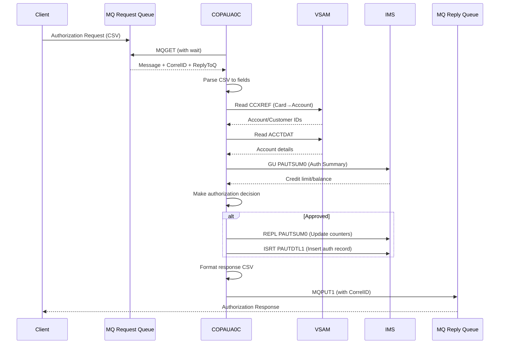

# CardDemo Integration Patterns Analysis (RE-008)

## Executive Summary

CardDemo includes three optional extension directories that demonstrate enterprise integration patterns common in mainframe modernization scenarios. This analysis documents DB2 SQL patterns, IMS DL/I hierarchical database access, and IBM MQ messaging patterns along with AWS modernization recommendations.

### Extension Directory Inventory

> **Inventory Correction (2026-02-06):** Original document listed 8 programs. Actual count is 13 COBOL programs across extensions, plus IMS DBD/PSB, DB2 DDL, CTL, CSD, and JCL artifacts. See [PROGRAM-INVENTORY.md](../appendices/PROGRAM-INVENTORY.md) for the complete listing.

| Extension Directory | Purpose | Technologies | Programs (Updated) |
|---------------------|---------|--------------|----------|
| `app-authorization-ims-db2-mq` | Real-time authorization processing with fraud detection | IMS DB + DB2 + MQ | **8 programs:** COPAUA0C, COPAUS0C, COPAUS1C, COPAUS2C, CBPAUP0C, PAUDBUNL.CBL, DBUNLDGS.CBL, PAUDBLOD.CBL |
| `app-transaction-type-db2` | Transaction type reference data management | DB2 | 3 programs: COTRTLIC, COTRTUPC, COBTUPDT |
| `app-vsam-mq` | Account data extraction via messaging | VSAM + MQ | 2 programs: COACCT01, CODATE01 |

### Previously Undocumented Programs (Added 2026-02-06)

| Program | Ext | LOC | Type | Purpose | Key Operations |
|---------|-----|-----|------|---------|----------------|
| COPAUS0C | .cbl | 1,032 | CICS+IMS | Pending authorization summary list browse | IMS GU/GNP on PAUTSUM0/PAUTDTL1; BMS COPAU00 |
| COPAUS1C | .cbl | 604 | CICS+IMS | Authorization detail view with fraud toggle | IMS GU/GNP/REPL; LINK to COPAUS2C; SYNCPOINT/ROLLBACK |
| PAUDBUNL | .CBL | 317 | Batch+IMS | IMS database unload to sequential files | CBLTDLI GN/GNP on PAUTSUM0/PAUTDTL1; writes OPFILE1/OPFILE2 |
| DBUNLDGS | .CBL | 366 | Batch+IMS+GSAM | IMS database unload to GSAM files | CBLTDLI GN/GNP; ISRT to GSAM via PASFLPCB/PADFLPCB |
| PAUDBLOD | .CBL | 369 | Batch+IMS | IMS database load from sequential files | Reads INFILE1/INFILE2; CBLTDLI ISRT/GU on PAUTSUM0/PAUTDTL1 |

**Migration significance:** The unload/load utilities (PAUDBUNL, DBUNLDGS, PAUDBLOD) are critical for **data migration planning** — they define the exact process for extracting data from and loading data into the IMS hierarchical database. Any migration from IMS to a relational database must replicate the parent-child segment relationships these programs handle.

---

## Integration Architecture Diagram

```mermaid
flowchart TB
    subgraph External["External Systems"]
        MQ_IN["MQ Request Queue"]
        MQ_OUT["MQ Reply Queue"]
    end

    subgraph CICS["CICS Transaction Processing"]
        COPAUA0C["COPAUA0C<br/>Authorization Decision"]
        COPAUS2C["COPAUS2C<br/>Fraud Reporting"]
        COTRTLIC["COTRTLIC<br/>Transaction Type List"]
        COTRTUPC["COTRTUPC<br/>Transaction Type Update"]
        COACCT01["COACCT01<br/>Account Inquiry via MQ"]
        CODATE01["CODATE01<br/>Date Service via MQ"]
    end

    subgraph Batch["Batch Processing"]
        CBPAUP0C["CBPAUP0C<br/>Purge Expired Auth"]
        COBTUPDT["COBTUPDT<br/>Batch Transaction Type Update"]
    end

    subgraph IMS["IMS Database"]
        PAUTSUM0["PAUTSUM0<br/>Auth Summary (Root)"]
        PAUTDTL1["PAUTDTL1<br/>Auth Details (Child)"]
    end

    subgraph DB2["DB2 Database"]
        AUTHFRDS["AUTHFRDS<br/>Fraud Tracking"]
        TRTYPE["TRANSACTION_TYPE<br/>Type Codes"]
        TRTYPECAT["TRANSACTION_TYPE_CATEGORY<br/>Type Categories"]
    end

    subgraph VSAM["VSAM Files"]
        ACCTDAT["ACCTDAT<br/>Account Master"]
        CCXREF["CCXREF<br/>Card Cross-Reference"]
    end

    MQ_IN --> COPAUA0C
    COPAUA0C --> MQ_OUT
    COPAUA0C --> PAUTSUM0
    COPAUA0C --> PAUTDTL1
    COPAUA0C --> CCXREF
    COPAUA0C --> ACCTDAT

    COPAUS2C --> AUTHFRDS

    COTRTLIC --> TRTYPE
    COTRTLIC --> TRTYPECAT
    COTRTUPC --> TRTYPE
    COBTUPDT --> TRTYPE

    CBPAUP0C --> PAUTSUM0
    CBPAUP0C --> PAUTDTL1

    MQ_IN --> COACCT01
    COACCT01 --> ACCTDAT
    COACCT01 --> MQ_OUT

    MQ_IN --> CODATE01
    CODATE01 --> MQ_OUT
```



---

## DB2 Integration Patterns

### Tables and DCLGEN Mappings

#### 1. CARDDEMO.TRANSACTION_TYPE

**Purpose**: Reference table for transaction type codes

**DDL Definition** (from `DCLTRTYP.dcl`):
```sql
CREATE TABLE CARDDEMO.TRANSACTION_TYPE
( TR_TYPE          CHAR(2) NOT NULL,
  TR_DESCRIPTION   VARCHAR(50) NOT NULL
);
```

**COBOL Host Variable Declaration**:
```cobol
01  DCLTRANSACTION-TYPE.
    10 DCL-TR-TYPE          PIC X(2).
    10 DCL-TR-DESCRIPTION.
       49 DCL-TR-DESCRIPTION-LEN  PIC S9(4) USAGE COMP.
       49 DCL-TR-DESCRIPTION-TEXT PIC X(50).
```

| DB2 Column | DB2 Type | COBOL Type | Modern Equivalent |
|------------|----------|------------|-------------------|
| TR_TYPE | CHAR(2) | PIC X(2) | VARCHAR(2) |
| TR_DESCRIPTION | VARCHAR(50) | VARCHAR structure | VARCHAR(50) |

---

#### 2. CARDDEMO.TRANSACTION_TYPE_CATEGORY

**Purpose**: Transaction type categorization for reporting

**DDL Definition** (from `DCLTRCAT.dcl`):
```sql
CREATE TABLE CARDDEMO.TRANSACTION_TYPE_CATEGORY
( TRC_TYPE_CODE      CHAR(2) NOT NULL,
  TRC_TYPE_CATEGORY  CHAR(4) NOT NULL,
  TRC_CAT_DATA       VARCHAR(50) NOT NULL
);
```

**COBOL Host Variable Declaration**:
```cobol
01  DCLTRANSACTION-TYPE-CATEGORY.
    10 DCL-TRC-TYPE-CODE       PIC X(2).
    10 DCL-TRC-TYPE-CATEGORY   PIC X(4).
    10 DCL-TRC-CAT-DATA.
       49 DCL-TRC-CAT-DATA-LEN  PIC S9(4) USAGE COMP.
       49 DCL-TRC-CAT-DATA-TEXT PIC X(50).
```

---

#### 3. CARDDEMO.AUTHFRDS (Fraud Tracking)

**Purpose**: Track authorization fraud reports with full transaction context

**DDL Definition** (from `AUTHFRDS.dcl`):
```sql
CREATE TABLE CARDDEMO.AUTHFRDS
( CARD_NUM                CHAR(16) NOT NULL,
  AUTH_TS                 TIMESTAMP NOT NULL,
  AUTH_TYPE               CHAR(4),
  CARD_EXPIRY_DATE        CHAR(4),
  MESSAGE_TYPE            CHAR(6),
  MESSAGE_SOURCE          CHAR(6),
  AUTH_ID_CODE            CHAR(6),
  AUTH_RESP_CODE          CHAR(2),
  AUTH_RESP_REASON        CHAR(4),
  PROCESSING_CODE         CHAR(6),
  TRANSACTION_AMT         DECIMAL(12, 2),
  APPROVED_AMT            DECIMAL(12, 2),
  MERCHANT_CATAGORY_CODE  CHAR(4),
  ACQR_COUNTRY_CODE       CHAR(3),
  POS_ENTRY_MODE          SMALLINT,
  MERCHANT_ID             CHAR(15),
  MERCHANT_NAME           VARCHAR(22),
  MERCHANT_CITY           CHAR(13),
  MERCHANT_STATE          CHAR(2),
  MERCHANT_ZIP            CHAR(9),
  TRANSACTION_ID          CHAR(15),
  MATCH_STATUS            CHAR(1),
  AUTH_FRAUD              CHAR(1),
  FRAUD_RPT_DATE          DATE,
  ACCT_ID                 DECIMAL(11, 0),
  CUST_ID                 DECIMAL(9, 0)
);
```

**Key Columns**: 26 columns capturing complete authorization context for fraud analysis

---

### SQL Operation Patterns

#### Pattern 1: Single Row SELECT (COTRTUPC.cbl:1475-1482)

```cobol
EXEC SQL
     SELECT TR_TYPE
           ,TR_DESCRIPTION
       INTO :DCL-TR-TYPE
           ,:DCL-TR-DESCRIPTION
       FROM CARDDEMO.TRANSACTION_TYPE
      WHERE TR_TYPE = :DCL-TR-TYPE
END-EXEC
```

**Usage**: Fetch single record by primary key for display/update operations

---

#### Pattern 2: Cursor Processing - Forward (COTRTLIC.cbl:338-352)

```cobol
EXEC SQL
     DECLARE C-TR-TYPE-FORWARD CURSOR FOR
         SELECT TR_TYPE
               ,TR_DESCRIPTION
           FROM CARDDEMO.TRANSACTION_TYPE
          WHERE TR_TYPE >= :WS-START-KEY
            AND ((:WS-EDIT-TYPE-FLAG = '1'
            AND   TR_TYPE = :WS-TYPE-CD-FILTER)
            OR   (:WS-EDIT-TYPE-FLAG <> '1'))
            AND ((:WS-EDIT-DESC-FLAG = '1'
            AND   TR_DESCRIPTION LIKE TRIM(:WS-TYPE-DESC-FILTER))
            OR   (:WS-EDIT-DESC-FLAG <> '1'))
         ORDER BY TR_TYPE
END-EXEC
```

**Usage**: Forward pagination with optional filtering

---

#### Pattern 3: Cursor Processing - Backward (COTRTLIC.cbl:354-368)

```cobol
EXEC SQL
     DECLARE C-TR-TYPE-BACKWARD CURSOR FOR
         SELECT TR_TYPE
               ,TR_DESCRIPTION
           FROM CARDDEMO.TRANSACTION_TYPE
          WHERE TR_TYPE < :WS-START-KEY
            AND ((:WS-EDIT-TYPE-FLAG = '1'
            AND   TR_TYPE = :WS-TYPE-CD-FILTER)
            OR   (:WS-EDIT-TYPE-FLAG <> '1'))
            AND ((:WS-EDIT-DESC-FLAG = '1'
            AND   TR_DESCRIPTION LIKE TRIM(:WS-TYPE-DESC-FILTER))
            OR   (:WS-EDIT-DESC-FLAG <> '1'))
         ORDER BY TR_TYPE DESC
END-EXEC
```

**Usage**: Backward pagination (Page Up) with same filtering logic

---

#### Pattern 4: INSERT with TIMESTAMP_FORMAT (COPAUS2C.cbl:141-198)

```cobol
EXEC SQL
     INSERT INTO CARDDEMO.AUTHFRDS
           (CARD_NUM, AUTH_TS, AUTH_TYPE, CARD_EXPIRY_DATE,
            MESSAGE_TYPE, MESSAGE_SOURCE, AUTH_ID_CODE,
            AUTH_RESP_CODE, AUTH_RESP_REASON, PROCESSING_CODE,
            TRANSACTION_AMT, APPROVED_AMT, MERCHANT_CATAGORY_CODE,
            ACQR_COUNTRY_CODE, POS_ENTRY_MODE, MERCHANT_ID,
            MERCHANT_NAME, MERCHANT_CITY, MERCHANT_STATE,
            MERCHANT_ZIP, TRANSACTION_ID, MATCH_STATUS,
            AUTH_FRAUD, FRAUD_RPT_DATE, ACCT_ID, CUST_ID)
       VALUES
         ( :CARD-NUM
          ,TIMESTAMP_FORMAT (:AUTH-TS, 'YY-MM-DD HH24.MI.SSNNNNNN')
          ,:AUTH-TYPE
          ,:CARD-EXPIRY-DATE
          ... (remaining values)
          ,CURRENT DATE
          ,:ACCT-ID
          ,:CUST-ID
         )
END-EXEC
```

**Key Features**:
- `TIMESTAMP_FORMAT` for converting string to timestamp
- `CURRENT DATE` for audit timestamp
- INSERT-or-UPDATE pattern (checks SQLCODE -803 for duplicate)

---

#### Pattern 5: UPDATE with CURRENT DATE (COPAUS2C.cbl:222-229)

```cobol
EXEC SQL
     UPDATE CARDDEMO.AUTHFRDS
        SET AUTH_FRAUD     = :AUTH-FRAUD,
            FRAUD_RPT_DATE = CURRENT DATE
      WHERE CARD_NUM = :CARD-NUM
        AND AUTH_TS  = TIMESTAMP_FORMAT (:AUTH-TS,
                              'YY-MM-DD HH24.MI.SSNNNNNN')
END-EXEC
```

**Usage**: Update fraud status with audit timestamp

---

#### Pattern 6: Simple INSERT (COBTUPDT.cbl:137-148)

```cobol
EXEC SQL
     INSERT INTO CARDDEMO.TRANSACTION_TYPE
     (TR_TYPE, TR_DESCRIPTION)
     VALUES
     (:INPUT-REC-NUMBER, :INPUT-REC-DESC)
END-EXEC
```

---

#### Pattern 7: Simple UPDATE (COBTUPDT.cbl:171-175)

```cobol
EXEC SQL
     UPDATE CARDDEMO.TRANSACTION_TYPE
        SET TR_DESCRIPTION = :INPUT-REC-DESC
      WHERE TR_TYPE = :INPUT-REC-NUMBER
END-EXEC
```

---

#### Pattern 8: Simple DELETE (COBTUPDT.cbl:201-204)

```cobol
EXEC SQL
     DELETE FROM CARDDEMO.TRANSACTION_TYPE
      WHERE TR_TYPE = :INPUT-REC-NUMBER
END-EXEC
```

---

### SQLCODE Handling Patterns

| SQLCODE | Meaning | Typical Response |
|---------|---------|------------------|
| 0 | Success | Continue processing |
| +100 | Not found / End of cursor | Set not-found flag, handle gracefully |
| -803 | Duplicate key violation | Trigger UPDATE instead of INSERT |
| -532 | Foreign key violation | Return error, prevent delete |
| -911 | Deadlock / Timeout | Retry or rollback |

**Example Error Handling** (COBTUPDT.cbl:207-226):
```cobol
EVALUATE TRUE
    WHEN SQLCODE = ZERO
       DISPLAY 'RECORD DELETED SUCCESSFULLY'
    WHEN SQLCODE = +100
       STRING 'No records found.' DELIMITED BY SIZE
       INTO WS-RETURN-MSG
       END-STRING
       PERFORM 9999-ABEND
    WHEN SQLCODE < 0
       STRING 'Error accessing:'
              ' TRANSACTION_TYPE table. SQLCODE:'
              WS-VAR-SQLCODE
       DELIMITED BY SIZE
       INTO WS-RETURN-MSG
       END-STRING
       PERFORM 9999-ABEND
END-EVALUATE
```

---

## IMS DB Integration Patterns

### Database Structure

```
DBPAUTP0 (HIDAM - Hierarchical Indexed Direct Access Method)
├── PAUTSUM0 (Root Segment: Authorization Summary)
│   ├── Key: ACCNTID (Account ID)
│   └── Contains: Credit limits, balances, auth counts
│
└── PAUTDTL1 (Child Segment: Authorization Details)
    ├── Key: AUTH_DATE_9C + AUTH_TIME_9C (Composite)
    └── Contains: Full authorization transaction details
```

---

### Segment Definitions

#### PAUTSUM0 - Authorization Summary (CIPAUSMY.cpy)

```cobol
05  PA-ACCT-ID                   PIC S9(11) COMP-3.
05  PA-CUST-ID                   PIC  9(09).
05  PA-AUTH-STATUS               PIC  X(01).
05  PA-ACCOUNT-STATUS            PIC  X(02) OCCURS 5 TIMES.
05  PA-CREDIT-LIMIT              PIC S9(09)V99 COMP-3.
05  PA-CASH-LIMIT                PIC S9(09)V99 COMP-3.
05  PA-CREDIT-BALANCE            PIC S9(09)V99 COMP-3.
05  PA-CASH-BALANCE              PIC S9(09)V99 COMP-3.
05  PA-APPROVED-AUTH-CNT         PIC S9(04) COMP.
05  PA-DECLINED-AUTH-CNT         PIC S9(04) COMP.
05  PA-APPROVED-AUTH-AMT         PIC S9(09)V99 COMP-3.
05  PA-DECLINED-AUTH-AMT         PIC S9(09)V99 COMP-3.
05  FILLER                       PIC X(34).
```

**Total Segment Size**: ~100 bytes

---

#### PAUTDTL1 - Authorization Details (CIPAUDTY.cpy)

```cobol
05  PA-AUTHORIZATION-KEY.
    10 PA-AUTH-DATE-9C           PIC S9(05) COMP-3.
    10 PA-AUTH-TIME-9C           PIC S9(09) COMP-3.
05  PA-AUTH-ORIG-DATE            PIC  X(06).
05  PA-AUTH-ORIG-TIME            PIC  X(06).
05  PA-CARD-NUM                  PIC  X(16).
05  PA-AUTH-TYPE                 PIC  X(04).
05  PA-CARD-EXPIRY-DATE          PIC  X(04).
05  PA-MESSAGE-TYPE              PIC  X(06).
05  PA-MESSAGE-SOURCE            PIC  X(06).
05  PA-AUTH-ID-CODE              PIC  X(06).
05  PA-AUTH-RESP-CODE            PIC  X(02).
    88 PA-AUTH-APPROVED          VALUE '00'.
05  PA-AUTH-RESP-REASON          PIC  X(04).
05  PA-PROCESSING-CODE           PIC  9(06).
05  PA-TRANSACTION-AMT           PIC S9(10)V99 COMP-3.
05  PA-APPROVED-AMT              PIC S9(10)V99 COMP-3.
05  PA-MERCHANT-CATAGORY-CODE    PIC  X(04).
05  PA-ACQR-COUNTRY-CODE         PIC  X(03).
05  PA-POS-ENTRY-MODE            PIC  9(02).
05  PA-MERCHANT-ID               PIC  X(15).
05  PA-MERCHANT-NAME             PIC  X(22).
05  PA-MERCHANT-CITY             PIC  X(13).
05  PA-MERCHANT-STATE            PIC  X(02).
05  PA-MERCHANT-ZIP              PIC  X(09).
05  PA-TRANSACTION-ID            PIC  X(15).
05  PA-MATCH-STATUS              PIC  X(01).
    88 PA-MATCH-PENDING          VALUE 'P'.
    88 PA-MATCH-AUTH-DECLINED    VALUE 'D'.
    88 PA-MATCH-PENDING-EXPIRED  VALUE 'E'.
    88 PA-MATCHED-WITH-TRAN      VALUE 'M'.
05  PA-AUTH-FRAUD                PIC  X(01).
    88 PA-FRAUD-CONFIRMED        VALUE 'F'.
    88 PA-FRAUD-REMOVED          VALUE 'R'.
05  PA-FRAUD-RPT-DATE            PIC  X(08).
05  FILLER                       PIC  X(17).
```

---

### DL/I Function Codes (IMSFUNCS.cpy)

```cobol
01 FUNC-CODES.
   05 FUNC-GU                   PIC X(04)  VALUE 'GU  '.
   05 FUNC-GHU                  PIC X(04)  VALUE 'GHU '.
   05 FUNC-GN                   PIC X(04)  VALUE 'GN  '.
   05 FUNC-GHN                  PIC X(04)  VALUE 'GHN '.
   05 FUNC-GNP                  PIC X(04)  VALUE 'GNP '.
   05 FUNC-GHNP                 PIC X(04)  VALUE 'GHNP'.
   05 FUNC-REPL                 PIC X(04)  VALUE 'REPL'.
   05 FUNC-ISRT                 PIC X(04)  VALUE 'ISRT'.
   05 FUNC-DLET                 PIC X(04)  VALUE 'DLET'.
   05 PARMCOUNT                 PIC S9(05) VALUE +4 COMP-5.
```

| Function | Code | Purpose | Returns |
|----------|------|---------|---------|
| GU | Get Unique | Position to specific segment by key | Segment data |
| GHU | Get Hold Unique | Same as GU, with update intent | Segment data + lock |
| GN | Get Next | Sequential forward navigation | Next segment |
| GHN | Get Hold Next | GN with update intent | Next segment + lock |
| GNP | Get Next in Parent | Iterate child segments under parent | Child segment |
| GHNP | Get Hold Next in Parent | GNP with update intent | Child segment + lock |
| REPL | Replace | Update current segment | Status code |
| ISRT | Insert | Add new segment | Status code |
| DLET | Delete | Remove current segment | Status code |

---

### DL/I Call Examples

#### Pattern 1: GU - Get Unique (COPAUA0C.cbl:620-624)

```cobol
EXEC DLI GU USING PCB(PAUT-PCB-NUM)
    SEGMENT (PAUTSUM0)
    INTO (PENDING-AUTH-SUMMARY)
    WHERE (ACCNTID = PA-ACCT-ID)
END-EXEC

MOVE DIBSTAT TO IMS-RETURN-CODE
EVALUATE TRUE
    WHEN STATUS-OK
       SET FOUND-PAUT-SMRY-SEG TO TRUE
    WHEN SEGMENT-NOT-FOUND
       SET NFOUND-PAUT-SMRY-SEG TO TRUE
    WHEN OTHER
       MOVE 'I002' TO ERR-LOCATION
       SET  ERR-CRITICAL TO TRUE
       PERFORM 9500-LOG-ERROR
END-EVALUATE
```

---

#### Pattern 2: GN - Get Next (CBPAUP0C.cbl:223-226)

```cobol
EXEC DLI GN USING PCB(PAUT-PCB-NUM)
     SEGMENT (PAUTSUM0)
     INTO (PENDING-AUTH-SUMMARY)
END-EXEC

EVALUATE DIBSTAT
   WHEN '  '
        SET NOT-END-OF-AUTHDB TO TRUE
        ADD 1 TO WS-NO-SUMRY-READ
   WHEN 'GB'
        SET END-OF-AUTHDB TO TRUE
   WHEN OTHER
        DISPLAY 'AUTH SUMMARY READ FAILED :' DIBSTAT
        PERFORM 9999-ABEND
END-EVALUATE
```

---

#### Pattern 3: GNP - Get Next in Parent (CBPAUP0C.cbl:255-258)

```cobol
EXEC DLI GNP USING PCB(PAUT-PCB-NUM)
     SEGMENT (PAUTDTL1)
     INTO (PENDING-AUTH-DETAILS)
END-EXEC

EVALUATE DIBSTAT
   WHEN '  '
        SET MORE-AUTHS TO TRUE
        ADD 1 TO WS-NO-DTL-READ
   WHEN 'GE'
   WHEN 'GB'
        SET NO-MORE-AUTHS TO TRUE
   WHEN OTHER
        DISPLAY 'AUTH DETAIL READ FAILED :' DIBSTAT
        PERFORM 9999-ABEND
END-EVALUATE
```

---

#### Pattern 4: REPL - Replace (COPAUA0C.cbl:825-828)

```cobol
EXEC DLI REPL USING PCB(PAUT-PCB-NUM)
     SEGMENT (PAUTSUM0)
     FROM (PENDING-AUTH-SUMMARY)
END-EXEC
```

---

#### Pattern 5: ISRT - Insert Root Segment (COPAUA0C.cbl:830-833)

```cobol
EXEC DLI ISRT USING PCB(PAUT-PCB-NUM)
     SEGMENT (PAUTSUM0)
     FROM (PENDING-AUTH-SUMMARY)
END-EXEC
```

---

#### Pattern 6: ISRT - Insert Child with Parent Path (COPAUA0C.cbl:913-919)

```cobol
EXEC DLI ISRT USING PCB(PAUT-PCB-NUM)
     SEGMENT (PAUTSUM0)
     WHERE (ACCNTID = PA-ACCT-ID)
     SEGMENT (PAUTDTL1)
     FROM (PENDING-AUTH-DETAILS)
     SEGLENGTH (LENGTH OF PENDING-AUTH-DETAILS)
END-EXEC
```

---

#### Pattern 7: DLET - Delete Child Segment (CBPAUP0C.cbl:310-313)

```cobol
EXEC DLI DLET USING PCB(PAUT-PCB-NUM)
     SEGMENT (PAUTDTL1)
     FROM (PENDING-AUTH-DETAILS)
END-EXEC

IF DIBSTAT = SPACES
   ADD 1 TO WS-NO-DTL-DELETED
ELSE
   DISPLAY 'AUTH DETAIL DELETE FAILED :' DIBSTAT
   PERFORM 9999-ABEND
END-IF
```

---

#### Pattern 8: DLET - Delete Root Segment (CBPAUP0C.cbl:335-338)

```cobol
EXEC DLI DLET USING PCB(PAUT-PCB-NUM)
     SEGMENT (PAUTSUM0)
     FROM (PENDING-AUTH-SUMMARY)
END-EXEC
```

---

#### Pattern 9: CHKP - Checkpoint (CBPAUP0C.cbl:355-356)

```cobol
EXEC DLI CHKP ID(WK-CHKPT-ID)
END-EXEC
```

---

#### Pattern 10: SCHD/TERM - PSB Scheduling (COPAUA0C.cbl:293-321)

```cobol
EXEC DLI SCHD
     PSB((PSB-NAME))
     NODHABEND
END-EXEC

MOVE DIBSTAT TO IMS-RETURN-CODE

IF PSB-SCHEDULED-MORE-THAN-ONCE
   EXEC DLI TERM END-EXEC
   EXEC DLI SCHD
        PSB((PSB-NAME))
        NODHABEND
   END-EXEC
END-IF
```

---

### IMS Status Codes

| Status | Meaning | Response |
|--------|---------|----------|
| `'  '` (spaces) | Success | Continue |
| `'FW'` | Success (alternate) | Continue |
| `'GE'` | Segment not found | Set not-found flag |
| `'GB'` | End of database | Exit loop |
| `'II'` | Duplicate segment | Handle duplicate |
| `'GP'` | Wrong parentage | Error handling |
| `'BA'` | Database unavailable | Retry or abort |
| `'TC'` | PSB scheduled more than once | TERM and re-SCHD |
| `'TE'` | Could not schedule PSB | Abort |

**Status Code Variables** (COPAUA0C.cbl:85-94):
```cobol
05 IMS-RETURN-CODE                 PIC X(02).
   88 STATUS-OK                    VALUE '  ', 'FW'.
   88 SEGMENT-NOT-FOUND            VALUE 'GE'.
   88 DUPLICATE-SEGMENT-FOUND      VALUE 'II'.
   88 WRONG-PARENTAGE              VALUE 'GP'.
   88 END-OF-DB                    VALUE 'GB'.
   88 DATABASE-UNAVAILABLE         VALUE 'BA'.
   88 PSB-SCHEDULED-MORE-THAN-ONCE VALUE 'TC'.
   88 COULD-NOT-SCHEDULE-PSB       VALUE 'TE'.
   88 RETRY-CONDITION              VALUE 'BA', 'FH', 'TE'.
```

---

## MQ Messaging Patterns

### Queue Configuration

#### Authorization Module Queues (COPAUA0C)

| Queue Name | Direction | Purpose |
|------------|-----------|---------|
| `AWS.M2.CARDDEMO.PAUTH.REQUEST` | Input | Authorization request messages |
| `AWS.M2.CARDDEMO.PAUTH.REPLY` | Output | Authorization response messages |

#### Account Service Queues (COACCT01)

| Queue Name | Direction | Purpose |
|------------|-----------|---------|
| Dynamic (from MQTM-QNAME) | Input | Account inquiry requests |
| `CARD.DEMO.REPLY.ACCT` | Output | Account data responses |
| `CARD.DEMO.ERROR` | Output | Error messages |

#### Date Service Queues (CODATE01)

| Queue Name | Direction | Purpose |
|------------|-----------|---------|
| Dynamic (from MQTM-QNAME) | Input | Date requests |
| `CARD.DEMO.REPLY.DATE` | Output | Current date/time responses |
| `CARD.DEMO.ERROR` | Output | Error messages |

---

### Message Format Specifications

#### Authorization Request (CCPAURQY.cpy)

**Format**: CSV-delimited string

```cobol
05  PA-RQ-AUTH-DATE              PIC  X(06).    * YYMMDD
05  PA-RQ-AUTH-TIME              PIC  X(06).    * HHMMSS
05  PA-RQ-CARD-NUM               PIC  X(16).    * Card number
05  PA-RQ-AUTH-TYPE              PIC  X(04).    * Authorization type
05  PA-RQ-CARD-EXPIRY-DATE       PIC  X(04).    * MMYY
05  PA-RQ-MESSAGE-TYPE           PIC  X(06).    * Message type code
05  PA-RQ-MESSAGE-SOURCE         PIC  X(06).    * Source identifier
05  PA-RQ-PROCESSING-CODE        PIC  9(06).    * Processing code
05  PA-RQ-TRANSACTION-AMT        PIC +9(10).99. * Transaction amount
05  PA-RQ-MERCHANT-CATAGORY-CODE PIC  X(04).    * MCC code
05  PA-RQ-ACQR-COUNTRY-CODE      PIC  X(03).    * Acquirer country
05  PA-RQ-POS-ENTRY-MODE         PIC  9(02).    * POS entry mode
05  PA-RQ-MERCHANT-ID            PIC  X(15).    * Merchant ID
05  PA-RQ-MERCHANT-NAME          PIC  X(22).    * Merchant name
05  PA-RQ-MERCHANT-CITY          PIC  X(13).    * Merchant city
05  PA-RQ-MERCHANT-STATE         PIC  X(02).    * Merchant state
05  PA-RQ-MERCHANT-ZIP           PIC  X(09).    * Merchant ZIP
05  PA-RQ-TRANSACTION-ID         PIC  X(15).    * Transaction ID
```

**JSON Equivalent**:
```json
{
  "authDate": "YYMMDD",
  "authTime": "HHMMSS",
  "cardNumber": "1234567890123456",
  "authType": "SALE",
  "cardExpiry": "1225",
  "messageType": "0100",
  "messageSource": "POS001",
  "processingCode": "000000",
  "transactionAmount": 125.50,
  "merchantCategoryCode": "5411",
  "acquirerCountryCode": "840",
  "posEntryMode": 5,
  "merchantId": "MER123456789012",
  "merchantName": "ACME STORE",
  "merchantCity": "NEW YORK",
  "merchantState": "NY",
  "merchantZip": "10001",
  "transactionId": "TXN123456789012"
}
```

---

#### Authorization Response (CCPAURLY.cpy)

**Format**: CSV-delimited string

```cobol
05  PA-RL-CARD-NUM               PIC  X(16).    * Card number
05  PA-RL-TRANSACTION-ID         PIC  X(15).    * Transaction ID
05  PA-RL-AUTH-ID-CODE           PIC  X(06).    * Authorization code
05  PA-RL-AUTH-RESP-CODE         PIC  X(02).    * Response code
05  PA-RL-AUTH-RESP-REASON       PIC  X(04).    * Reason code
05  PA-RL-APPROVED-AMT           PIC +9(10).99. * Approved amount
```

**Response Codes**:
| Code | Meaning |
|------|---------|
| 00 | Approved |
| 05 | Declined |

**Reason Codes**:
| Code | Meaning |
|------|---------|
| 0000 | No error |
| 3100 | Card/Account not found |
| 4100 | Insufficient funds |
| 4200 | Card not active |
| 4300 | Account closed |
| 5100 | Card fraud |
| 5200 | Merchant fraud |
| 9000 | Other error |

---

### MQ API Patterns

#### Pattern 1: MQOPEN - Open Input Queue (COPAUA0C.cbl:255-283)

```cobol
MOVE MQOT-Q             TO MQOD-OBJECTTYPE OF MQM-OD-REQUEST
MOVE WS-REQUEST-QNAME   TO MQOD-OBJECTNAME OF MQM-OD-REQUEST

COMPUTE WS-OPTIONS = MQOO-INPUT-SHARED

CALL 'MQOPEN' USING W01-HCONN-REQUEST
                    MQM-OD-REQUEST
                    WS-OPTIONS
                    W01-HOBJ-REQUEST
                    WS-COMPCODE
                    WS-REASON
END-CALL

IF WS-COMPCODE = MQCC-OK
   SET WS-REQUEST-MQ-OPEN TO TRUE
ELSE
   MOVE 'M001'          TO ERR-LOCATION
   SET  ERR-CRITICAL    TO TRUE
   SET  ERR-MQ          TO TRUE
   PERFORM 9500-LOG-ERROR
END-IF
```

---

#### Pattern 2: MQGET - Retrieve Message with Wait (COPAUA0C.cbl:386-431)

```cobol
COMPUTE MQGMO-OPTIONS  =  MQGMO-NO-SYNCPOINT + MQGMO-WAIT
                       +  MQGMO-CONVERT
                       +  MQGMO-FAIL-IF-QUIESCING

MOVE WS-WAIT-INTERVAL      TO MQGMO-WAITINTERVAL
MOVE MQMI-NONE             TO MQMD-MSGID    OF MQM-MD-REQUEST
MOVE MQCI-NONE             TO MQMD-CORRELID OF MQM-MD-REQUEST
MOVE MQFMT-STRING          TO MQMD-FORMAT   OF MQM-MD-REQUEST
MOVE LENGTH OF W01-GET-BUFFER TO W01-BUFFLEN

CALL 'MQGET' USING W01-HCONN-REQUEST
                   W01-HOBJ-REQUEST
                   MQM-MD-REQUEST
                   MQM-GET-MESSAGE-OPTIONS
                   W01-BUFFLEN
                   W01-GET-BUFFER
                   W01-DATALEN
                   WS-COMPCODE
                   WS-REASON
END-CALL

IF WS-COMPCODE = MQCC-OK
   MOVE MQMD-CORRELID OF MQM-MD-REQUEST TO WS-SAVE-CORRELID
   MOVE MQMD-REPLYTOQ OF MQM-MD-REQUEST TO WS-REPLY-QNAME
ELSE
   IF WS-REASON = MQRC-NO-MSG-AVAILABLE
      SET NO-MORE-MSG-AVAILABLE TO TRUE
   ELSE
      PERFORM 9500-LOG-ERROR
   END-IF
END-IF
```

---

#### Pattern 3: MQPUT1 - Send Reply with Correlation (COPAUA0C.cbl:738-779)

```cobol
MOVE MQOT-Q               TO MQOD-OBJECTTYPE OF MQM-OD-REPLY
MOVE WS-REPLY-QNAME       TO MQOD-OBJECTNAME OF MQM-OD-REPLY

MOVE MQMT-REPLY           TO MQMD-MSGTYPE     OF MQM-MD-REPLY
MOVE WS-SAVE-CORRELID     TO MQMD-CORRELID    OF MQM-MD-REPLY
MOVE MQMI-NONE            TO MQMD-MSGID       OF MQM-MD-REPLY
MOVE SPACES               TO MQMD-REPLYTOQ    OF MQM-MD-REPLY
MOVE SPACES               TO MQMD-REPLYTOQMGR OF MQM-MD-REPLY
MOVE MQPER-NOT-PERSISTENT TO MQMD-PERSISTENCE OF MQM-MD-REPLY
MOVE 50                   TO MQMD-EXPIRY      OF MQM-MD-REPLY
MOVE MQFMT-STRING         TO MQMD-FORMAT      OF MQM-MD-REPLY

COMPUTE MQPMO-OPTIONS     =  MQPMO-NO-SYNCPOINT +
                             MQPMO-DEFAULT-CONTEXT

MOVE WS-RESP-LENGTH       TO W02-BUFFLEN

CALL 'MQPUT1' USING W02-HCONN-REPLY
                    MQM-OD-REPLY
                    MQM-MD-REPLY
                    MQM-PUT-MESSAGE-OPTIONS
                    W02-BUFFLEN
                    W02-PUT-BUFFER
                    WS-COMPCODE
                    WS-REASON
END-CALL

IF WS-COMPCODE NOT = MQCC-OK
   PERFORM 9500-LOG-ERROR
END-IF
```

---

#### Pattern 4: MQCLOSE - Release Queue Handle (COPAUA0C.cbl:956-961)

```cobol
CALL 'MQCLOSE' USING W01-HCONN-REQUEST
                   W01-HOBJ-REQUEST
                   MQCO-NONE
                   WS-COMPCODE
                   WS-REASON
END-CALL

IF WS-COMPCODE = MQCC-OK
   SET WS-REQUEST-MQ-CLSE TO TRUE
ELSE
   PERFORM 9500-LOG-ERROR
END-IF
```

---

### Request/Response Sequence Diagram



---

## COBOL-to-Modern Type Mappings

### DB2 Types

| DB2 Type | COBOL Declaration | Modern Type (PostgreSQL) | Modern Type (DynamoDB) |
|----------|-------------------|--------------------------|------------------------|
| CHAR(n) | PIC X(n) | VARCHAR(n) | String |
| VARCHAR(n) | Level 49 structure | VARCHAR(n) | String |
| SMALLINT | PIC S9(4) COMP | SMALLINT | Number |
| DECIMAL(p,s) | PIC S9(p-s)V9(s) COMP-3 | DECIMAL(p,s) | Number |
| TIMESTAMP | PIC X(26) | TIMESTAMP | String (ISO 8601) |
| DATE | PIC X(10) | DATE | String (ISO 8601) |

### IMS Segment to Document Mapping

**PAUTSUM0 (Root) → DynamoDB Document**:
```json
{
  "pk": "ACCT#00000000001",
  "sk": "SUMMARY",
  "accountId": 1,
  "customerId": 123456789,
  "authStatus": "A",
  "creditLimit": 10000.00,
  "cashLimit": 2000.00,
  "creditBalance": 1500.00,
  "cashBalance": 0.00,
  "approvedAuthCount": 45,
  "declinedAuthCount": 3,
  "approvedAuthAmount": 12500.00,
  "declinedAuthAmount": 350.00
}
```

**PAUTDTL1 (Child) → DynamoDB Document**:
```json
{
  "pk": "ACCT#00000000001",
  "sk": "AUTH#25001#990000000",
  "authDateKey": 25001,
  "authTimeKey": 990000000,
  "originalDate": "240115",
  "originalTime": "143022",
  "cardNumber": "1234567890123456",
  "authType": "SALE",
  "expiryDate": "1225",
  "messageType": "0100",
  "messageSource": "POS001",
  "authIdCode": "143022",
  "responseCode": "00",
  "responseReason": "0000",
  "processingCode": 0,
  "transactionAmount": 125.50,
  "approvedAmount": 125.50,
  "merchantCategoryCode": "5411",
  "acquirerCountryCode": "840",
  "posEntryMode": 5,
  "merchantId": "MER123456789012",
  "merchantName": "ACME STORE",
  "merchantCity": "NEW YORK",
  "merchantState": "NY",
  "merchantZip": "10001",
  "transactionId": "TXN123456789012",
  "matchStatus": "P",
  "fraudFlag": null,
  "fraudReportDate": null
}
```

---

## Modernization Recommendations

### DB2 → Amazon RDS/Aurora PostgreSQL

| Pattern | Current (DB2/COBOL) | Modern (PostgreSQL/API) |
|---------|---------------------|-------------------------|
| Single Row SELECT | Embedded SQL with host variables | Repository pattern with JPA/JDBC |
| Cursor Processing | DECLARE CURSOR + FETCH loop | Streaming/Pagination with LIMIT/OFFSET |
| INSERT with TIMESTAMP | TIMESTAMP_FORMAT function | TO_TIMESTAMP() or application layer |
| SQLCODE handling | EVALUATE SQLCODE | Exception handling with specific catch blocks |

**Migration Notes**:
- VARCHAR structures (level 49) map directly to PostgreSQL VARCHAR
- DECIMAL types maintain precision
- Consider adding indexes on filter columns (TR_TYPE, TR_DESCRIPTION)

---

### IMS DB → Amazon DynamoDB

| IMS Pattern | DynamoDB Equivalent |
|-------------|---------------------|
| HIDAM (Hierarchical Indexed) | Single-table design with composite keys |
| Root segment (PAUTSUM0) | Item with PK=ACCT#id, SK=SUMMARY |
| Child segment (PAUTDTL1) | Item with PK=ACCT#id, SK=AUTH#date#time |
| GU (Get Unique) | GetItem with exact key |
| GN (Get Next) | Query with ScanIndexForward=true |
| GNP (Get Next in Parent) | Query with PK + begins_with(SK, "AUTH#") |
| REPL (Replace) | UpdateItem |
| ISRT (Insert) | PutItem |
| DLET (Delete) | DeleteItem |

**Single-Table Design**:
```
PK                  | SK                    | Type
--------------------|-----------------------|--------
ACCT#00000000001    | SUMMARY               | AuthSummary
ACCT#00000000001    | AUTH#25001#990000000  | AuthDetail
ACCT#00000000001    | AUTH#25002#980000000  | AuthDetail
```

---

### IBM MQ → AWS Messaging Services

| MQ Pattern | AWS Service | Implementation |
|------------|-------------|----------------|
| Request Queue | Amazon SQS | Standard or FIFO queue for requests |
| Reply Queue | Amazon SQS | Separate queue for responses |
| Correlation ID | Message attributes | Use MessageDeduplicationId or custom attribute |
| Request/Reply | API Gateway + Lambda | Synchronous REST API |
| Async Processing | EventBridge + SQS | Event-driven architecture |

**Modernized Authorization Flow**:
```
API Gateway → Lambda (Validation) → SQS (Request)
    → Lambda (Processing) → DynamoDB (Persistence)
    → SQS (Response) → Lambda (Reply) → API Gateway
```

**Alternative: Synchronous API**:
```
API Gateway → Lambda (Full Processing) → DynamoDB
    → Return Response
```

---

## Cross-References

| Reference | Document | Relationship |
|-----------|----------|--------------|
| RE-001 Domain Model | `docs/reverse-engineering/01-domain-model/` | Entity definitions used in integrations |
| RE-002 Data Model | `docs/reverse-engineering/02-data-model/` | VSAM file structures that feed integrations |
| RE-010 Modernization | `docs/reverse-engineering/06-modernization/` | Complexity assessment includes integration factors |
| RE-011 API Candidates | `docs/reverse-engineering/06-modernization/` | Integration points as API surfaces |

---

## Appendix: File Inventory

### Programs Analyzed

| Program | Location | Integration Types |
|---------|----------|-------------------|
| COPAUA0C | `app/app-authorization-ims-db2-mq/cbl/` | IMS + MQ + VSAM |
| COPAUS2C | `app/app-authorization-ims-db2-mq/cbl/` | DB2 (fraud) |
| CBPAUP0C | `app/app-authorization-ims-db2-mq/cbl/` | IMS (batch) |
| COTRTLIC | `app/app-transaction-type-db2/cbl/` | DB2 (cursors) |
| COTRTUPC | `app/app-transaction-type-db2/cbl/` | DB2 (CRUD) |
| COBTUPDT | `app/app-transaction-type-db2/cbl/` | DB2 (batch) |
| COACCT01 | `app/app-vsam-mq/cbl/` | MQ + VSAM |
| CODATE01 | `app/app-vsam-mq/cbl/` | MQ |

### Copybooks Analyzed

| Copybook | Location | Purpose |
|----------|----------|---------|
| CIPAUSMY | `app/app-authorization-ims-db2-mq/cpy/` | IMS summary segment |
| CIPAUDTY | `app/app-authorization-ims-db2-mq/cpy/` | IMS detail segment |
| IMSFUNCS | `app/app-authorization-ims-db2-mq/cpy/` | DL/I function codes |
| CCPAURQY | `app/app-authorization-ims-db2-mq/cpy/` | MQ request message |
| CCPAURLY | `app/app-authorization-ims-db2-mq/cpy/` | MQ response message |
| DCLTRTYP | `app/app-transaction-type-db2/dcl/` | DB2 transaction type |
| DCLTRCAT | `app/app-transaction-type-db2/dcl/` | DB2 type category |
| AUTHFRDS | `app/app-authorization-ims-db2-mq/dcl/` | DB2 fraud tracking |

---

*Generated by RE-008 Integration Patterns Analysis*
*CardDemo AWS Mainframe Modernization Project*
