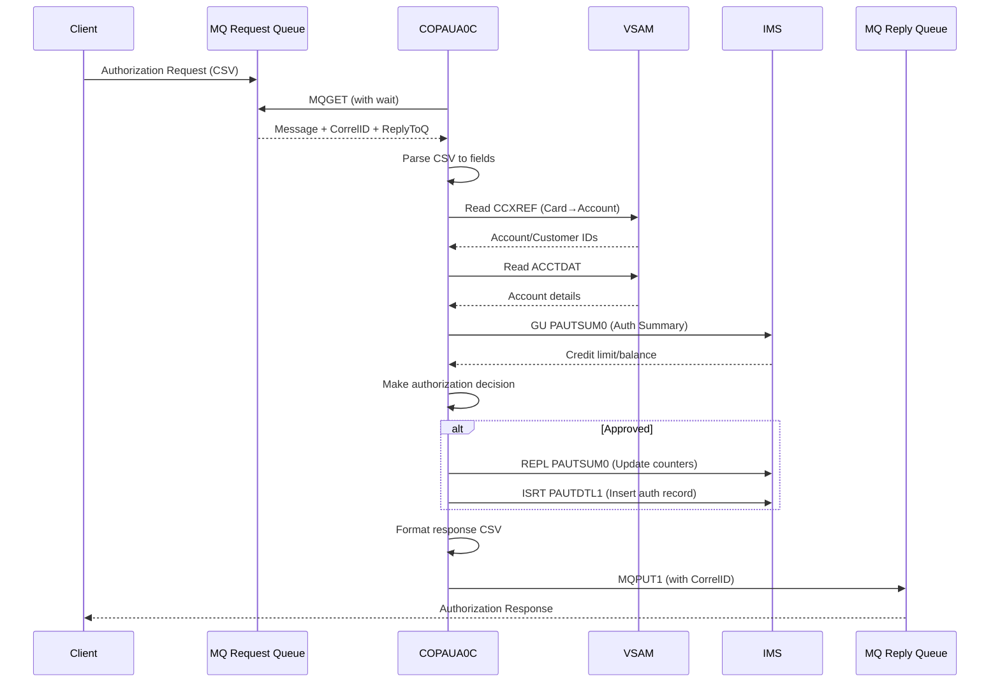

# CardDemo Integration Patterns Analysis (RE-008)

## Executive Summary

CardDemo includes three optional extension directories that demonstrate enterprise integration patterns common in mainframe modernization scenarios. This analysis documents DB2 SQL patterns, IMS DL/I hierarchical database access, and IBM MQ messaging patterns along with AWS modernization recommendations.

### Extension Directory Inventory

> **Inventory Correction (2026-02-06):** Original document listed 8 programs. Actual count is 13 COBOL programs across extensions, plus IMS DBD/PSB, DB2 DDL, CTL, CSD, and JCL artifacts. See [PROGRAM-INVENTORY.md](../appendices/PROGRAM-INVENTORY.md) for the complete listing.

| Extension Directory | Purpose | Technologies | Programs (Updated) |
|---------------------|---------|--------------|----------|
| `app-authorization-ims-db2-mq` | Real-time authorization processing with fraud detection | IMS DB + DB2 + MQ | **8 programs:** COPAUA0C, COPAUS0C, COPAUS1C, COPAUS2C, CBPAUP0C, PAUDBUNL.CBL, DBUNLDGS.CBL, PAUDBLOD.CBL |
| `app-transaction-type-db2` | Transaction type reference data management | DB2 | 3 programs: COTRTLIC, COTRTUPC, COBTUPDT |
| `app-vsam-mq` | Account data extraction via messaging | VSAM + MQ | 2 programs: COACCT01, CODATE01 |

### Previously Undocumented Programs (Added 2026-02-06)

| Program | Ext | LOC | Type | Purpose | Key Operations |
|---------|-----|-----|------|---------|----------------|
| COPAUS0C | .cbl | 1,032 | CICS+IMS | Pending authorization summary list browse | IMS GU/GNP on PAUTSUM0/PAUTDTL1; BMS COPAU00 |
| COPAUS1C | .cbl | 604 | CICS+IMS | Authorization detail view with fraud toggle | IMS GU/GNP/REPL; LINK to COPAUS2C; SYNCPOINT/ROLLBACK |
| PAUDBUNL | .CBL | 317 | Batch+IMS | IMS database unload to sequential files | CBLTDLI GN/GNP on PAUTSUM0/PAUTDTL1; writes OPFILE1/OPFILE2 |
| DBUNLDGS | .CBL | 366 | Batch+IMS+GSAM | IMS database unload to GSAM files | CBLTDLI GN/GNP; ISRT to GSAM via PASFLPCB/PADFLPCB |
| PAUDBLOD | .CBL | 369 | Batch+IMS | IMS database load from sequential files | Reads INFILE1/INFILE2; CBLTDLI ISRT/GU on PAUTSUM0/PAUTDTL1 |

**Migration significance:** The unload/load utilities (PAUDBUNL, DBUNLDGS, PAUDBLOD) are critical for **data migration planning** — they define the exact process for extracting data from and loading data into the IMS hierarchical database. Any migration from IMS to a relational database must replicate the parent-child segment relationships these programs handle.

---

## Integration Architecture Diagram

```mermaid
flowchart TB
    subgraph External["External Systems"]
        MQ_IN["MQ Request Queue"]
        MQ_OUT["MQ Reply Queue"]
    end

    subgraph CICS["CICS Transaction Processing"]
        COPAUA0C["COPAUA0C<br/>Authorization Decision"]
        COPAUS0C["COPAUS0C<br/>Auth Summary Browse"]
        COPAUS1C["COPAUS1C<br/>Auth Detail View"]
        COPAUS2C["COPAUS2C<br/>Fraud Reporting"]
        COTRTLIC["COTRTLIC<br/>Transaction Type List"]
        COTRTUPC["COTRTUPC<br/>Transaction Type Update"]
        COACCT01["COACCT01<br/>Account Inquiry via MQ"]
        CODATE01["CODATE01<br/>Date Service via MQ"]
    end

    subgraph Batch["Batch Processing"]
        CBPAUP0C["CBPAUP0C<br/>Purge Expired Auth"]
        COBTUPDT["COBTUPDT<br/>Batch Transaction Type Update"]
        PAUDBUNL["PAUDBUNL<br/>IMS DB Unload"]
        DBUNLDGS["DBUNLDGS<br/>IMS GSAM Unload"]
        PAUDBLOD["PAUDBLOD<br/>IMS DB Load"]
    end

    subgraph SeqFiles["Sequential Files"]
        ROOTFILE["ROOT File<br/>(PAUTSUM0 segments)"]
        CHILDFILE["CHILD File<br/>(PAUTDTL1 segments)"]
        GSAMROOT["GSAM ROOT<br/>(PASFLDBD)"]
        GSAMCHILD["GSAM CHILD<br/>(PADFLDBD)"]
    end

    subgraph IMS["IMS Database"]
        PAUTSUM0["PAUTSUM0<br/>Auth Summary (Root)"]
        PAUTDTL1["PAUTDTL1<br/>Auth Details (Child)"]
    end

    subgraph DB2["DB2 Database"]
        AUTHFRDS["AUTHFRDS<br/>Fraud Tracking"]
        TRTYPE["TRANSACTION_TYPE<br/>Type Codes"]
        TRTYPECAT["TRANSACTION_TYPE_CATEGORY<br/>Type Categories"]
    end

    subgraph VSAM["VSAM Files"]
        ACCTDAT["ACCTDAT<br/>Account Master"]
        CCXREF["CCXREF<br/>Card Cross-Reference"]
    end

    MQ_IN --> COPAUA0C
    COPAUA0C --> MQ_OUT
    COPAUA0C --> PAUTSUM0
    COPAUA0C --> PAUTDTL1
    COPAUA0C --> CCXREF
    COPAUA0C --> ACCTDAT

    COPAUS2C --> AUTHFRDS

    COTRTLIC --> TRTYPE
    COTRTLIC --> TRTYPECAT
    COTRTUPC --> TRTYPE
    COBTUPDT --> TRTYPE

    COPAUS0C --> PAUTSUM0
    COPAUS0C --> PAUTDTL1
    COPAUS0C --> ACCTDAT
    COPAUS0C --> CCXREF
    COPAUS1C --> PAUTSUM0
    COPAUS1C --> PAUTDTL1
    COPAUS1C -.->|LINK| COPAUS2C

    CBPAUP0C --> PAUTSUM0
    CBPAUP0C --> PAUTDTL1

    PAUDBUNL --> PAUTSUM0
    PAUDBUNL --> PAUTDTL1
    PAUDBUNL --> ROOTFILE
    PAUDBUNL --> CHILDFILE

    DBUNLDGS --> PAUTSUM0
    DBUNLDGS --> PAUTDTL1
    DBUNLDGS --> GSAMROOT
    DBUNLDGS --> GSAMCHILD

    PAUDBLOD --> PAUTSUM0
    PAUDBLOD --> PAUTDTL1
    ROOTFILE --> PAUDBLOD
    CHILDFILE --> PAUDBLOD

    MQ_IN --> COACCT01
    COACCT01 --> ACCTDAT
    COACCT01 --> MQ_OUT

    MQ_IN --> CODATE01
    CODATE01 --> MQ_OUT
```



---

## DB2 Integration Patterns

### Tables and DCLGEN Mappings

#### 1. CARDDEMO.TRANSACTION_TYPE

**Purpose**: Reference table for transaction type codes

**DDL Definition** (from `app/app-transaction-type-db2/ddl/TRNTYPE.ddl` via `DB2CREAT.ctl`):
```sql
CREATE TABLE CARDDEMO.TRANSACTION_TYPE
( TR_TYPE          CHAR(2) NOT NULL,
  TR_DESCRIPTION   VARCHAR(50) NOT NULL,
  PRIMARY KEY(TR_TYPE))
```

**DCLGEN Copybook** (from `app/app-transaction-type-db2/dcl/DCLTRTYP.dcl`): Generated COBOL host variable declarations used in embedded SQL programs. DCLGEN output contains both an `EXEC SQL DECLARE TABLE` statement and the corresponding COBOL `01` level structure.

**COBOL Host Variable Declaration**:
```cobol
01  DCLTRANSACTION-TYPE.
    10 DCL-TR-TYPE          PIC X(2).
    10 DCL-TR-DESCRIPTION.
       49 DCL-TR-DESCRIPTION-LEN  PIC S9(4) USAGE COMP.
       49 DCL-TR-DESCRIPTION-TEXT PIC X(50).
```

| DB2 Column | DB2 Type | COBOL Type | Modern Equivalent |
|------------|----------|------------|-------------------|
| TR_TYPE | CHAR(2) | PIC X(2) | VARCHAR(2) |
| TR_DESCRIPTION | VARCHAR(50) | VARCHAR structure | VARCHAR(50) |

---

#### 2. CARDDEMO.TRANSACTION_TYPE_CATEGORY

**Purpose**: Transaction type categorization for reporting

**DDL Definition** (from `app/app-transaction-type-db2/ddl/TRNTYCAT.ddl` via `DB2CREAT.ctl`):
```sql
CREATE TABLE CARDDEMO.TRANSACTION_TYPE_CATEGORY
( TRC_TYPE_CODE      CHAR(2) NOT NULL,
  TRC_TYPE_CATEGORY  CHAR(4) NOT NULL,
  TRC_CAT_DATA       VARCHAR(50) NOT NULL,
  PRIMARY KEY(TRC_TYPE_CODE, TRC_TYPE_CATEGORY))
```

**DCLGEN Copybook** (from `app/app-transaction-type-db2/dcl/DCLTRCAT.dcl`): Generated COBOL host variable declarations for embedded SQL.

**COBOL Host Variable Declaration**:
```cobol
01  DCLTRANSACTION-TYPE-CATEGORY.
    10 DCL-TRC-TYPE-CODE       PIC X(2).
    10 DCL-TRC-TYPE-CATEGORY   PIC X(4).
    10 DCL-TRC-CAT-DATA.
       49 DCL-TRC-CAT-DATA-LEN  PIC S9(4) USAGE COMP.
       49 DCL-TRC-CAT-DATA-TEXT PIC X(50).
```

---

#### 3. CARDDEMO.AUTHFRDS (Fraud Tracking)

**Purpose**: Track authorization fraud reports with full transaction context

**DDL Definition** (from `app/app-authorization-ims-db2-mq/ddl/AUTHFRDS.ddl`; DCLGEN copybook in `app/app-authorization-ims-db2-mq/dcl/AUTHFRDS.dcl`):
```sql
CREATE TABLE CARDDEMO.AUTHFRDS
( CARD_NUM                CHAR(16) NOT NULL,
  AUTH_TS                 TIMESTAMP NOT NULL,
  AUTH_TYPE               CHAR(4),
  CARD_EXPIRY_DATE        CHAR(4),
  MESSAGE_TYPE            CHAR(6),
  MESSAGE_SOURCE          CHAR(6),
  AUTH_ID_CODE            CHAR(6),
  AUTH_RESP_CODE          CHAR(2),
  AUTH_RESP_REASON        CHAR(4),
  PROCESSING_CODE         CHAR(6),
  TRANSACTION_AMT         DECIMAL(12, 2),
  APPROVED_AMT            DECIMAL(12, 2),
  MERCHANT_CATAGORY_CODE  CHAR(4),
  ACQR_COUNTRY_CODE       CHAR(3),
  POS_ENTRY_MODE          SMALLINT,
  MERCHANT_ID             CHAR(15),
  MERCHANT_NAME           VARCHAR(22),
  MERCHANT_CITY           CHAR(13),
  MERCHANT_STATE          CHAR(2),
  MERCHANT_ZIP            CHAR(9),
  TRANSACTION_ID          CHAR(15),
  MATCH_STATUS            CHAR(1),
  AUTH_FRAUD              CHAR(1),
  FRAUD_RPT_DATE          DATE,
  ACCT_ID                 DECIMAL(11, 0),
  CUST_ID                 DECIMAL(9, 0)
);
```

**Key Columns**: 26 columns capturing complete authorization context for fraud analysis

---

### SQL Operation Patterns

#### Pattern 1: Single Row SELECT (COTRTUPC.cbl:1475-1482)

```cobol
EXEC SQL
     SELECT TR_TYPE
           ,TR_DESCRIPTION
       INTO :DCL-TR-TYPE
           ,:DCL-TR-DESCRIPTION
       FROM CARDDEMO.TRANSACTION_TYPE
      WHERE TR_TYPE = :DCL-TR-TYPE
END-EXEC
```

**Usage**: Fetch single record by primary key for display/update operations

---

#### Pattern 2: Cursor Processing - Forward (COTRTLIC.cbl:338-352)

```cobol
EXEC SQL
     DECLARE C-TR-TYPE-FORWARD CURSOR FOR
         SELECT TR_TYPE
               ,TR_DESCRIPTION
           FROM CARDDEMO.TRANSACTION_TYPE
          WHERE TR_TYPE >= :WS-START-KEY
            AND ((:WS-EDIT-TYPE-FLAG = '1'
            AND   TR_TYPE = :WS-TYPE-CD-FILTER)
            OR   (:WS-EDIT-TYPE-FLAG <> '1'))
            AND ((:WS-EDIT-DESC-FLAG = '1'
            AND   TR_DESCRIPTION LIKE TRIM(:WS-TYPE-DESC-FILTER))
            OR   (:WS-EDIT-DESC-FLAG <> '1'))
         ORDER BY TR_TYPE
END-EXEC
```

**Usage**: Forward pagination with optional filtering

---

#### Pattern 3: Cursor Processing - Backward (COTRTLIC.cbl:354-368)

```cobol
EXEC SQL
     DECLARE C-TR-TYPE-BACKWARD CURSOR FOR
         SELECT TR_TYPE
               ,TR_DESCRIPTION
           FROM CARDDEMO.TRANSACTION_TYPE
          WHERE TR_TYPE < :WS-START-KEY
            AND ((:WS-EDIT-TYPE-FLAG = '1'
            AND   TR_TYPE = :WS-TYPE-CD-FILTER)
            OR   (:WS-EDIT-TYPE-FLAG <> '1'))
            AND ((:WS-EDIT-DESC-FLAG = '1'
            AND   TR_DESCRIPTION LIKE TRIM(:WS-TYPE-DESC-FILTER))
            OR   (:WS-EDIT-DESC-FLAG <> '1'))
         ORDER BY TR_TYPE DESC
END-EXEC
```

**Usage**: Backward pagination (Page Up) with same filtering logic

---

#### Pattern 4: INSERT with TIMESTAMP_FORMAT (COPAUS2C.cbl:141-198)

```cobol
EXEC SQL
     INSERT INTO CARDDEMO.AUTHFRDS
           (CARD_NUM, AUTH_TS, AUTH_TYPE, CARD_EXPIRY_DATE,
            MESSAGE_TYPE, MESSAGE_SOURCE, AUTH_ID_CODE,
            AUTH_RESP_CODE, AUTH_RESP_REASON, PROCESSING_CODE,
            TRANSACTION_AMT, APPROVED_AMT, MERCHANT_CATAGORY_CODE,
            ACQR_COUNTRY_CODE, POS_ENTRY_MODE, MERCHANT_ID,
            MERCHANT_NAME, MERCHANT_CITY, MERCHANT_STATE,
            MERCHANT_ZIP, TRANSACTION_ID, MATCH_STATUS,
            AUTH_FRAUD, FRAUD_RPT_DATE, ACCT_ID, CUST_ID)
       VALUES
         ( :CARD-NUM
          ,TIMESTAMP_FORMAT (:AUTH-TS, 'YY-MM-DD HH24.MI.SSNNNNNN')
          ,:AUTH-TYPE
          ,:CARD-EXPIRY-DATE
          ... (remaining values)
          ,CURRENT DATE
          ,:ACCT-ID
          ,:CUST-ID
         )
END-EXEC
```

**Key Features**:
- `TIMESTAMP_FORMAT` for converting string to timestamp
- `CURRENT DATE` for audit timestamp
- INSERT-or-UPDATE pattern (checks SQLCODE -803 for duplicate)

---

#### Pattern 5: UPDATE with CURRENT DATE (COPAUS2C.cbl:222-229)

```cobol
EXEC SQL
     UPDATE CARDDEMO.AUTHFRDS
        SET AUTH_FRAUD     = :AUTH-FRAUD,
            FRAUD_RPT_DATE = CURRENT DATE
      WHERE CARD_NUM = :CARD-NUM
        AND AUTH_TS  = TIMESTAMP_FORMAT (:AUTH-TS,
                              'YY-MM-DD HH24.MI.SSNNNNNN')
END-EXEC
```

**Usage**: Update fraud status with audit timestamp

---

#### Pattern 6: Simple INSERT (COBTUPDT.cbl:137-148)

```cobol
EXEC SQL
     INSERT INTO CARDDEMO.TRANSACTION_TYPE
     (TR_TYPE, TR_DESCRIPTION)
     VALUES
     (:INPUT-REC-NUMBER, :INPUT-REC-DESC)
END-EXEC
```

---

#### Pattern 7: Simple UPDATE (COBTUPDT.cbl:171-175)

```cobol
EXEC SQL
     UPDATE CARDDEMO.TRANSACTION_TYPE
        SET TR_DESCRIPTION = :INPUT-REC-DESC
      WHERE TR_TYPE = :INPUT-REC-NUMBER
END-EXEC
```

---

#### Pattern 8: Simple DELETE (COBTUPDT.cbl:201-204)

```cobol
EXEC SQL
     DELETE FROM CARDDEMO.TRANSACTION_TYPE
      WHERE TR_TYPE = :INPUT-REC-NUMBER
END-EXEC
```

---

### SQLCODE Handling Patterns

| SQLCODE | Meaning | Typical Response |
|---------|---------|------------------|
| 0 | Success | Continue processing |
| +100 | Not found / End of cursor | Set not-found flag, handle gracefully |
| -803 | Duplicate key violation | Trigger UPDATE instead of INSERT |
| -532 | Foreign key violation | Return error, prevent delete |
| -911 | Deadlock / Timeout | Retry or rollback |

**Example Error Handling** (COBTUPDT.cbl:207-226):
```cobol
EVALUATE TRUE
    WHEN SQLCODE = ZERO
       DISPLAY 'RECORD DELETED SUCCESSFULLY'
    WHEN SQLCODE = +100
       STRING 'No records found.' DELIMITED BY SIZE
       INTO WS-RETURN-MSG
       END-STRING
       PERFORM 9999-ABEND
    WHEN SQLCODE < 0
       STRING 'Error accessing:'
              ' TRANSACTION_TYPE table. SQLCODE:'
              WS-VAR-SQLCODE
       DELIMITED BY SIZE
       INTO WS-RETURN-MSG
       END-STRING
       PERFORM 9999-ABEND
END-EVALUATE
```

---

## IMS DB Integration Patterns

### Database Structure

```
DBPAUTP0 (HIDAM - Hierarchical Indexed Direct Access Method)
├── PAUTSUM0 (Root Segment: Authorization Summary)
│   ├── Key: ACCNTID (Account ID)
│   └── Contains: Credit limits, balances, auth counts
│
└── PAUTDTL1 (Child Segment: Authorization Details)
    ├── Key: AUTH_DATE_9C + AUTH_TIME_9C (Composite)
    └── Contains: Full authorization transaction details
```

### IMS DBD/PSB Definitions

The IMS database structure is formally defined by **DBD** (Database Definition) and **PSB** (Program Specification Block) definitions in `app/app-authorization-ims-db2-mq/ims/`. These confirm the database structure described above and define access permissions.

#### Database Definitions (DBD)

| DBD File | DBD Name | Access Method | Storage | Purpose |
|----------|----------|---------------|---------|---------|
| `DBPAUTP0.dbd` | DBPAUTP0 | HIDAM,VSAM | DD: DDPAUTP0 (4096 byte blocks) | Primary authorization database |
| `DBPAUTX0.dbd` | DBPAUTX0 | INDEX,VSAM | DD: DDPAUTX0 (4096 byte blocks) | Secondary index for DBPAUTP0 |
| `PASFLDBD.DBD` | PASFLDBD | GSAM,BSAM | DD: PASFILIP/PASFILOP | GSAM file for root segment unload (RECFM=F, LRECL=100) |
| `PADFLDBD.DBD` | PADFLDBD | GSAM,BSAM | DD: PADFILIP/PADFILOP | GSAM file for child segment unload (RECFM=F, LRECL=200) |

**DBPAUTP0 Structure** (from `DBPAUTP0.dbd`):
- Root segment `PAUTSUM0`: 100 bytes, key field `ACCNTID` at position 1, length 6, type Packed (P). Uses TWINBWD pointer for bidirectional twin chain traversal.
- Child segment `PAUTDTL1`: 200 bytes, parent=PAUTSUM0, key field `PAUT9CTS` at position 1, length 8, type Character (C).
- Has `LCHILD` link to index segment `PAUTINDX` in `DBPAUTX0`.

**DBPAUTX0 Structure** (from `DBPAUTX0.dbd`):
- Index segment `PAUTINDX`: 6 bytes, key field `INDXSEQ` at position 1, length 6, type Packed (P). Frequency estimate: 100,000 entries.
- `LCHILD` points back to `PAUTSUM0` in `DBPAUTP0`, indexing on `ACCNTID`. This provides direct keyed access to authorization summaries by account ID.

#### Program Specification Blocks (PSB)

| PSB File | PSB Name | Language | PCBs | Processing Options | Used By |
|----------|----------|----------|------|-------------------|---------|
| `PSBPAUTB.psb` | PSBPAUTB | COBOL | 1 DB PCB (DBPAUTP0) | `AP` (All Processing: GISRD) | COPAUA0C, COPAUS0C, COPAUS1C, CBPAUP0C, PAUDBLOD |
| `PSBPAUTL.psb` | PSBPAUTL | ASSEM | 1 DB PCB (DBPAUTP0) | `L` (Load only: ISRT) | Initial database load utility |
| `PAUTBUNL.PSB` | PAUTBUNL | COBOL | 1 DB PCB (DBPAUTP0) | `GOTP` (Get/read only) | PAUDBUNL (sequential unload) |
| `DLIGSAMP.PSB` | DLIGSAMP | COBOL | 1 DB PCB + 2 GSAM PCBs | `GOTP` (DB) + `LS` (GSAM) | DBUNLDGS (GSAM unload) |

**Processing Option Codes**:

| Code | Meaning |
|------|---------|
| `A` | All processing (Get, Insert, Replace, Delete) |
| `AP` | All processing including path calls |
| `G` | Get (read) only |
| `GOTP` | Get, path call, with position |
| `I` | Insert |
| `R` | Replace |
| `D` | Delete |
| `L` | Load (initial database load) |
| `LS` | Load Sequential (GSAM output) |

**Segment Sensitivity**: All PSBs define sensitivity to both `PAUTSUM0` (root) and `PAUTDTL1` (child of PAUTSUM0), meaning every program can navigate both levels of the hierarchy. The DLIGSAMP PSB additionally includes two GSAM PCBs for PASFLDBD and PADFLDBD, enabling the DBUNLDGS program to simultaneously read from the IMS database and write to GSAM sequential files.

---

### Segment Definitions

#### PAUTSUM0 - Authorization Summary (CIPAUSMY.cpy)

```cobol
05  PA-ACCT-ID                   PIC S9(11) COMP-3.
05  PA-CUST-ID                   PIC  9(09).
05  PA-AUTH-STATUS               PIC  X(01).
05  PA-ACCOUNT-STATUS            PIC  X(02) OCCURS 5 TIMES.
05  PA-CREDIT-LIMIT              PIC S9(09)V99 COMP-3.
05  PA-CASH-LIMIT                PIC S9(09)V99 COMP-3.
05  PA-CREDIT-BALANCE            PIC S9(09)V99 COMP-3.
05  PA-CASH-BALANCE              PIC S9(09)V99 COMP-3.
05  PA-APPROVED-AUTH-CNT         PIC S9(04) COMP.
05  PA-DECLINED-AUTH-CNT         PIC S9(04) COMP.
05  PA-APPROVED-AUTH-AMT         PIC S9(09)V99 COMP-3.
05  PA-DECLINED-AUTH-AMT         PIC S9(09)V99 COMP-3.
05  FILLER                       PIC X(34).
```

**Total Segment Size**: ~100 bytes

---

#### PAUTDTL1 - Authorization Details (CIPAUDTY.cpy)

```cobol
05  PA-AUTHORIZATION-KEY.
    10 PA-AUTH-DATE-9C           PIC S9(05) COMP-3.
    10 PA-AUTH-TIME-9C           PIC S9(09) COMP-3.
05  PA-AUTH-ORIG-DATE            PIC  X(06).
05  PA-AUTH-ORIG-TIME            PIC  X(06).
05  PA-CARD-NUM                  PIC  X(16).
05  PA-AUTH-TYPE                 PIC  X(04).
05  PA-CARD-EXPIRY-DATE          PIC  X(04).
05  PA-MESSAGE-TYPE              PIC  X(06).
05  PA-MESSAGE-SOURCE            PIC  X(06).
05  PA-AUTH-ID-CODE              PIC  X(06).
05  PA-AUTH-RESP-CODE            PIC  X(02).
    88 PA-AUTH-APPROVED          VALUE '00'.
05  PA-AUTH-RESP-REASON          PIC  X(04).
05  PA-PROCESSING-CODE           PIC  9(06).
05  PA-TRANSACTION-AMT           PIC S9(10)V99 COMP-3.
05  PA-APPROVED-AMT              PIC S9(10)V99 COMP-3.
05  PA-MERCHANT-CATAGORY-CODE    PIC  X(04).
05  PA-ACQR-COUNTRY-CODE         PIC  X(03).
05  PA-POS-ENTRY-MODE            PIC  9(02).
05  PA-MERCHANT-ID               PIC  X(15).
05  PA-MERCHANT-NAME             PIC  X(22).
05  PA-MERCHANT-CITY             PIC  X(13).
05  PA-MERCHANT-STATE            PIC  X(02).
05  PA-MERCHANT-ZIP              PIC  X(09).
05  PA-TRANSACTION-ID            PIC  X(15).
05  PA-MATCH-STATUS              PIC  X(01).
    88 PA-MATCH-PENDING          VALUE 'P'.
    88 PA-MATCH-AUTH-DECLINED    VALUE 'D'.
    88 PA-MATCH-PENDING-EXPIRED  VALUE 'E'.
    88 PA-MATCHED-WITH-TRAN      VALUE 'M'.
05  PA-AUTH-FRAUD                PIC  X(01).
    88 PA-FRAUD-CONFIRMED        VALUE 'F'.
    88 PA-FRAUD-REMOVED          VALUE 'R'.
05  PA-FRAUD-RPT-DATE            PIC  X(08).
05  FILLER                       PIC  X(17).
```

---

### DL/I Function Codes (IMSFUNCS.cpy)

```cobol
01 FUNC-CODES.
   05 FUNC-GU                   PIC X(04)  VALUE 'GU  '.
   05 FUNC-GHU                  PIC X(04)  VALUE 'GHU '.
   05 FUNC-GN                   PIC X(04)  VALUE 'GN  '.
   05 FUNC-GHN                  PIC X(04)  VALUE 'GHN '.
   05 FUNC-GNP                  PIC X(04)  VALUE 'GNP '.
   05 FUNC-GHNP                 PIC X(04)  VALUE 'GHNP'.
   05 FUNC-REPL                 PIC X(04)  VALUE 'REPL'.
   05 FUNC-ISRT                 PIC X(04)  VALUE 'ISRT'.
   05 FUNC-DLET                 PIC X(04)  VALUE 'DLET'.
   05 PARMCOUNT                 PIC S9(05) VALUE +4 COMP-5.
```

| Function | Code | Purpose | Returns |
|----------|------|---------|---------|
| GU | Get Unique | Position to specific segment by key | Segment data |
| GHU | Get Hold Unique | Same as GU, with update intent | Segment data + lock |
| GN | Get Next | Sequential forward navigation | Next segment |
| GHN | Get Hold Next | GN with update intent | Next segment + lock |
| GNP | Get Next in Parent | Iterate child segments under parent | Child segment |
| GHNP | Get Hold Next in Parent | GNP with update intent | Child segment + lock |
| REPL | Replace | Update current segment | Status code |
| ISRT | Insert | Add new segment | Status code |
| DLET | Delete | Remove current segment | Status code |

---

### DL/I Call Examples

#### Pattern 1: GU - Get Unique (COPAUA0C.cbl:620-624)

```cobol
EXEC DLI GU USING PCB(PAUT-PCB-NUM)
    SEGMENT (PAUTSUM0)
    INTO (PENDING-AUTH-SUMMARY)
    WHERE (ACCNTID = PA-ACCT-ID)
END-EXEC

MOVE DIBSTAT TO IMS-RETURN-CODE
EVALUATE TRUE
    WHEN STATUS-OK
       SET FOUND-PAUT-SMRY-SEG TO TRUE
    WHEN SEGMENT-NOT-FOUND
       SET NFOUND-PAUT-SMRY-SEG TO TRUE
    WHEN OTHER
       MOVE 'I002' TO ERR-LOCATION
       SET  ERR-CRITICAL TO TRUE
       PERFORM 9500-LOG-ERROR
END-EVALUATE
```

---

#### Pattern 2: GN - Get Next (CBPAUP0C.cbl:223-226)

```cobol
EXEC DLI GN USING PCB(PAUT-PCB-NUM)
     SEGMENT (PAUTSUM0)
     INTO (PENDING-AUTH-SUMMARY)
END-EXEC

EVALUATE DIBSTAT
   WHEN '  '
        SET NOT-END-OF-AUTHDB TO TRUE
        ADD 1 TO WS-NO-SUMRY-READ
   WHEN 'GB'
        SET END-OF-AUTHDB TO TRUE
   WHEN OTHER
        DISPLAY 'AUTH SUMMARY READ FAILED :' DIBSTAT
        PERFORM 9999-ABEND
END-EVALUATE
```

---

#### Pattern 3: GNP - Get Next in Parent (CBPAUP0C.cbl:255-258)

```cobol
EXEC DLI GNP USING PCB(PAUT-PCB-NUM)
     SEGMENT (PAUTDTL1)
     INTO (PENDING-AUTH-DETAILS)
END-EXEC

EVALUATE DIBSTAT
   WHEN '  '
        SET MORE-AUTHS TO TRUE
        ADD 1 TO WS-NO-DTL-READ
   WHEN 'GE'
   WHEN 'GB'
        SET NO-MORE-AUTHS TO TRUE
   WHEN OTHER
        DISPLAY 'AUTH DETAIL READ FAILED :' DIBSTAT
        PERFORM 9999-ABEND
END-EVALUATE
```

---

#### Pattern 4: REPL - Replace (COPAUA0C.cbl:825-828)

```cobol
EXEC DLI REPL USING PCB(PAUT-PCB-NUM)
     SEGMENT (PAUTSUM0)
     FROM (PENDING-AUTH-SUMMARY)
END-EXEC
```

---

#### Pattern 5: ISRT - Insert Root Segment (COPAUA0C.cbl:830-833)

```cobol
EXEC DLI ISRT USING PCB(PAUT-PCB-NUM)
     SEGMENT (PAUTSUM0)
     FROM (PENDING-AUTH-SUMMARY)
END-EXEC
```

---

#### Pattern 6: ISRT - Insert Child with Parent Path (COPAUA0C.cbl:913-919)

```cobol
EXEC DLI ISRT USING PCB(PAUT-PCB-NUM)
     SEGMENT (PAUTSUM0)
     WHERE (ACCNTID = PA-ACCT-ID)
     SEGMENT (PAUTDTL1)
     FROM (PENDING-AUTH-DETAILS)
     SEGLENGTH (LENGTH OF PENDING-AUTH-DETAILS)
END-EXEC
```

---

#### Pattern 7: DLET - Delete Child Segment (CBPAUP0C.cbl:310-313)

```cobol
EXEC DLI DLET USING PCB(PAUT-PCB-NUM)
     SEGMENT (PAUTDTL1)
     FROM (PENDING-AUTH-DETAILS)
END-EXEC

IF DIBSTAT = SPACES
   ADD 1 TO WS-NO-DTL-DELETED
ELSE
   DISPLAY 'AUTH DETAIL DELETE FAILED :' DIBSTAT
   PERFORM 9999-ABEND
END-IF
```

---

#### Pattern 8: DLET - Delete Root Segment (CBPAUP0C.cbl:335-338)

```cobol
EXEC DLI DLET USING PCB(PAUT-PCB-NUM)
     SEGMENT (PAUTSUM0)
     FROM (PENDING-AUTH-SUMMARY)
END-EXEC
```

---

#### Pattern 9: CHKP - Checkpoint (CBPAUP0C.cbl:355-356)

```cobol
EXEC DLI CHKP ID(WK-CHKPT-ID)
END-EXEC
```

---

#### Pattern 10: SCHD/TERM - PSB Scheduling (COPAUA0C.cbl:293-321)

```cobol
EXEC DLI SCHD
     PSB((PSB-NAME))
     NODHABEND
END-EXEC

MOVE DIBSTAT TO IMS-RETURN-CODE

IF PSB-SCHEDULED-MORE-THAN-ONCE
   EXEC DLI TERM END-EXEC
   EXEC DLI SCHD
        PSB((PSB-NAME))
        NODHABEND
   END-EXEC
END-IF
```

---

### Batch DL/I API: CBLTDLI Call Interface

The patterns above (Patterns 1-10) use the **EXEC DLI** syntax, which is the CICS/DL/I interface for online programs. The batch IMS programs (PAUDBUNL, DBUNLDGS, PAUDBLOD) use a distinct API: the **CBLTDLI** call-level interface. This is a materially different pattern for modernization because it uses explicit PCB masks in the LINKAGE SECTION and passes SSA (Segment Search Argument) structures as separate data items.

**Key Differences**:

| Aspect | EXEC DLI (Online) | CBLTDLI (Batch) |
|--------|-------------------|-----------------|
| Syntax | `EXEC DLI GU USING PCB(n) SEGMENT(name) INTO(area) WHERE(key=value) END-EXEC` | `CALL 'CBLTDLI' USING func-code pcb-mask io-area ssa` |
| PCB Reference | By ordinal number `PCB(n)` | By explicit PCB mask variable in LINKAGE SECTION |
| SSA Handling | `WHERE` clause embedded in EXEC DLI | Separate SSA data structure passed as parameter |
| Status Code | `DIBSTAT` | PCB status field (e.g., `PAUT-PCB-STATUS`) |
| Program Entry | Standard CICS program entry | `PROCEDURE DIVISION USING pcb-list` with `ENTRY 'DLITCBL' USING pcb-list` |
| PSB Scheduling | `EXEC DLI SCHD PSB(name)` | Provided by IMS region controller (DFSRRC00) |

#### Batch Pattern: Unqualified GN with CBLTDLI (PAUDBUNL.CBL:213-216)

```cobol
CALL 'CBLTDLI'            USING  FUNC-GN
                              PAUTBPCB
                              PENDING-AUTH-SUMMARY
                              ROOT-UNQUAL-SSA.
```

Where `ROOT-UNQUAL-SSA` is defined as:
```cobol
01 ROOT-UNQUAL-SSA.
   05 FILLER                 PIC X(08) VALUE 'PAUTSUM0'.
   05 FILLER                 PIC X(01) VALUE ' '.
```

#### Batch Pattern: GNP with CBLTDLI (PAUDBUNL.CBL:257-260)

```cobol
CALL 'CBLTDLI'            USING  FUNC-GNP
                              PAUTBPCB
                              PENDING-AUTH-DETAILS
                              CHILD-UNQUAL-SSA.
```

#### Batch Pattern: ISRT to GSAM (DBUNLDGS.CBL:302-304)

```cobol
CALL 'CBLTDLI'       USING  FUNC-ISRT
                              PASFLPCB
                              PENDING-AUTH-SUMMARY.
```

GSAM (Generalized Sequential Access Method) PCBs are used to write IMS data to sequential files. DBUNLDGS uses two GSAM PCBs: `PASFLPCB` for root segments and `PADFLPCB` for child segments.

#### Batch Pattern: Qualified SSA with CBLTDLI (PAUDBLOD.CBL:296-299)

```cobol
CALL 'CBLTDLI'       USING  FUNC-GU
                              PAUTBPCB
                              PENDING-AUTH-SUMMARY
                              ROOT-QUAL-SSA.
```

Where `ROOT-QUAL-SSA` includes a key qualification:
```cobol
01 ROOT-QUAL-SSA.
   05 QUAL-SSA-SEG-NAME      PIC X(08) VALUE 'PAUTSUM0'.
   05 FILLER                 PIC X(01) VALUE '('.
   05 QUAL-SSA-KEY-FIELD     PIC X(08) VALUE 'ACCNTID '.
   05 QUAL-SSA-REL-OPER      PIC X(02) VALUE 'EQ'.
   05 QUAL-SSA-KEY-VALUE     PIC S9(11) COMP-3.
   05 FILLER                 PIC X(01) VALUE ')'.
```

This is a qualified SSA that specifies a key value for direct segment retrieval, equivalent to the `WHERE (ACCNTID = value)` clause in EXEC DLI syntax.

#### Batch Pattern: ISRT with CBLTDLI (PAUDBLOD.CBL:321-324)

```cobol
CALL 'CBLTDLI' USING  FUNC-ISRT
                       PAUTBPCB
                       PENDING-AUTH-DETAILS
                       CHILD-UNQUAL-SSA.
```

---

### IMS Status Codes

| Status | Meaning | Response |
|--------|---------|----------|
| `'  '` (spaces) | Success | Continue |
| `'FW'` | Success (alternate) | Continue |
| `'GE'` | Segment not found | Set not-found flag |
| `'GB'` | End of database | Exit loop |
| `'II'` | Duplicate segment | Handle duplicate |
| `'GP'` | Wrong parentage | Error handling |
| `'BA'` | Database unavailable | Retry or abort |
| `'TC'` | PSB scheduled more than once | TERM and re-SCHD |
| `'TE'` | Could not schedule PSB | Abort |

**Status Code Variables** (COPAUA0C.cbl:85-94):
```cobol
05 IMS-RETURN-CODE                 PIC X(02).
   88 STATUS-OK                    VALUE '  ', 'FW'.
   88 SEGMENT-NOT-FOUND            VALUE 'GE'.
   88 DUPLICATE-SEGMENT-FOUND      VALUE 'II'.
   88 WRONG-PARENTAGE              VALUE 'GP'.
   88 END-OF-DB                    VALUE 'GB'.
   88 DATABASE-UNAVAILABLE         VALUE 'BA'.
   88 PSB-SCHEDULED-MORE-THAN-ONCE VALUE 'TC'.
   88 COULD-NOT-SCHEDULE-PSB       VALUE 'TE'.
   88 RETRY-CONDITION              VALUE 'BA', 'FH', 'TE'.
```

---

## MQ Messaging Patterns

### Queue Configuration

#### Authorization Module Queues (COPAUA0C)

| Queue Name | Direction | Purpose |
|------------|-----------|---------|
| `AWS.M2.CARDDEMO.PAUTH.REQUEST` | Input | Authorization request messages |
| `AWS.M2.CARDDEMO.PAUTH.REPLY` | Output | Authorization response messages |

#### Account Service Queues (COACCT01)

| Queue Name | Direction | Purpose |
|------------|-----------|---------|
| Dynamic (from MQTM-QNAME) | Input | Account inquiry requests |
| `CARD.DEMO.REPLY.ACCT` | Output | Account data responses |
| `CARD.DEMO.ERROR` | Output | Error messages |

#### Date Service Queues (CODATE01)

| Queue Name | Direction | Purpose |
|------------|-----------|---------|
| Dynamic (from MQTM-QNAME) | Input | Date requests |
| `CARD.DEMO.REPLY.DATE` | Output | Current date/time responses |
| `CARD.DEMO.ERROR` | Output | Error messages |

---

### Message Format Specifications

#### Authorization Request (CCPAURQY.cpy)

**Format**: CSV-delimited string

```cobol
05  PA-RQ-AUTH-DATE              PIC  X(06).    * YYMMDD
05  PA-RQ-AUTH-TIME              PIC  X(06).    * HHMMSS
05  PA-RQ-CARD-NUM               PIC  X(16).    * Card number
05  PA-RQ-AUTH-TYPE              PIC  X(04).    * Authorization type
05  PA-RQ-CARD-EXPIRY-DATE       PIC  X(04).    * MMYY
05  PA-RQ-MESSAGE-TYPE           PIC  X(06).    * Message type code
05  PA-RQ-MESSAGE-SOURCE         PIC  X(06).    * Source identifier
05  PA-RQ-PROCESSING-CODE        PIC  9(06).    * Processing code
05  PA-RQ-TRANSACTION-AMT        PIC +9(10).99. * Transaction amount
05  PA-RQ-MERCHANT-CATAGORY-CODE PIC  X(04).    * MCC code
05  PA-RQ-ACQR-COUNTRY-CODE      PIC  X(03).    * Acquirer country
05  PA-RQ-POS-ENTRY-MODE         PIC  9(02).    * POS entry mode
05  PA-RQ-MERCHANT-ID            PIC  X(15).    * Merchant ID
05  PA-RQ-MERCHANT-NAME          PIC  X(22).    * Merchant name
05  PA-RQ-MERCHANT-CITY          PIC  X(13).    * Merchant city
05  PA-RQ-MERCHANT-STATE         PIC  X(02).    * Merchant state
05  PA-RQ-MERCHANT-ZIP           PIC  X(09).    * Merchant ZIP
05  PA-RQ-TRANSACTION-ID         PIC  X(15).    * Transaction ID
```

**JSON Equivalent**:
```json
{
  "authDate": "YYMMDD",
  "authTime": "HHMMSS",
  "cardNumber": "1234567890123456",
  "authType": "SALE",
  "cardExpiry": "1225",
  "messageType": "0100",
  "messageSource": "POS001",
  "processingCode": "000000",
  "transactionAmount": 125.50,
  "merchantCategoryCode": "5411",
  "acquirerCountryCode": "840",
  "posEntryMode": 5,
  "merchantId": "MER123456789012",
  "merchantName": "ACME STORE",
  "merchantCity": "NEW YORK",
  "merchantState": "NY",
  "merchantZip": "10001",
  "transactionId": "TXN123456789012"
}
```

---

#### Authorization Response (CCPAURLY.cpy)

**Format**: CSV-delimited string

```cobol
05  PA-RL-CARD-NUM               PIC  X(16).    * Card number
05  PA-RL-TRANSACTION-ID         PIC  X(15).    * Transaction ID
05  PA-RL-AUTH-ID-CODE           PIC  X(06).    * Authorization code
05  PA-RL-AUTH-RESP-CODE         PIC  X(02).    * Response code
05  PA-RL-AUTH-RESP-REASON       PIC  X(04).    * Reason code
05  PA-RL-APPROVED-AMT           PIC +9(10).99. * Approved amount
```

**Response Codes**:
| Code | Meaning |
|------|---------|
| 00 | Approved |
| 05 | Declined |

**Reason Codes**:
| Code | Meaning |
|------|---------|
| 0000 | No error |
| 3100 | Card/Account not found |
| 4100 | Insufficient funds |
| 4200 | Card not active |
| 4300 | Account closed |
| 5100 | Card fraud |
| 5200 | Merchant fraud |
| 9000 | Other error |

---

### MQ API Patterns

#### Pattern 1: MQOPEN - Open Input Queue (COPAUA0C.cbl:255-283)

```cobol
MOVE MQOT-Q             TO MQOD-OBJECTTYPE OF MQM-OD-REQUEST
MOVE WS-REQUEST-QNAME   TO MQOD-OBJECTNAME OF MQM-OD-REQUEST

COMPUTE WS-OPTIONS = MQOO-INPUT-SHARED

CALL 'MQOPEN' USING W01-HCONN-REQUEST
                    MQM-OD-REQUEST
                    WS-OPTIONS
                    W01-HOBJ-REQUEST
                    WS-COMPCODE
                    WS-REASON
END-CALL

IF WS-COMPCODE = MQCC-OK
   SET WS-REQUEST-MQ-OPEN TO TRUE
ELSE
   MOVE 'M001'          TO ERR-LOCATION
   SET  ERR-CRITICAL    TO TRUE
   SET  ERR-MQ          TO TRUE
   PERFORM 9500-LOG-ERROR
END-IF
```

---

#### Pattern 2: MQGET - Retrieve Message with Wait (COPAUA0C.cbl:386-431)

```cobol
COMPUTE MQGMO-OPTIONS  =  MQGMO-NO-SYNCPOINT + MQGMO-WAIT
                       +  MQGMO-CONVERT
                       +  MQGMO-FAIL-IF-QUIESCING

MOVE WS-WAIT-INTERVAL      TO MQGMO-WAITINTERVAL
MOVE MQMI-NONE             TO MQMD-MSGID    OF MQM-MD-REQUEST
MOVE MQCI-NONE             TO MQMD-CORRELID OF MQM-MD-REQUEST
MOVE MQFMT-STRING          TO MQMD-FORMAT   OF MQM-MD-REQUEST
MOVE LENGTH OF W01-GET-BUFFER TO W01-BUFFLEN

CALL 'MQGET' USING W01-HCONN-REQUEST
                   W01-HOBJ-REQUEST
                   MQM-MD-REQUEST
                   MQM-GET-MESSAGE-OPTIONS
                   W01-BUFFLEN
                   W01-GET-BUFFER
                   W01-DATALEN
                   WS-COMPCODE
                   WS-REASON
END-CALL

IF WS-COMPCODE = MQCC-OK
   MOVE MQMD-CORRELID OF MQM-MD-REQUEST TO WS-SAVE-CORRELID
   MOVE MQMD-REPLYTOQ OF MQM-MD-REQUEST TO WS-REPLY-QNAME
ELSE
   IF WS-REASON = MQRC-NO-MSG-AVAILABLE
      SET NO-MORE-MSG-AVAILABLE TO TRUE
   ELSE
      PERFORM 9500-LOG-ERROR
   END-IF
END-IF
```

---

#### Pattern 3: MQPUT1 - Send Reply with Correlation (COPAUA0C.cbl:738-779)

```cobol
MOVE MQOT-Q               TO MQOD-OBJECTTYPE OF MQM-OD-REPLY
MOVE WS-REPLY-QNAME       TO MQOD-OBJECTNAME OF MQM-OD-REPLY

MOVE MQMT-REPLY           TO MQMD-MSGTYPE     OF MQM-MD-REPLY
MOVE WS-SAVE-CORRELID     TO MQMD-CORRELID    OF MQM-MD-REPLY
MOVE MQMI-NONE            TO MQMD-MSGID       OF MQM-MD-REPLY
MOVE SPACES               TO MQMD-REPLYTOQ    OF MQM-MD-REPLY
MOVE SPACES               TO MQMD-REPLYTOQMGR OF MQM-MD-REPLY
MOVE MQPER-NOT-PERSISTENT TO MQMD-PERSISTENCE OF MQM-MD-REPLY
MOVE 50                   TO MQMD-EXPIRY      OF MQM-MD-REPLY
MOVE MQFMT-STRING         TO MQMD-FORMAT      OF MQM-MD-REPLY

COMPUTE MQPMO-OPTIONS     =  MQPMO-NO-SYNCPOINT +
                             MQPMO-DEFAULT-CONTEXT

MOVE WS-RESP-LENGTH       TO W02-BUFFLEN

CALL 'MQPUT1' USING W02-HCONN-REPLY
                    MQM-OD-REPLY
                    MQM-MD-REPLY
                    MQM-PUT-MESSAGE-OPTIONS
                    W02-BUFFLEN
                    W02-PUT-BUFFER
                    WS-COMPCODE
                    WS-REASON
END-CALL

IF WS-COMPCODE NOT = MQCC-OK
   PERFORM 9500-LOG-ERROR
END-IF
```

---

#### Pattern 4: MQCLOSE - Release Queue Handle (COPAUA0C.cbl:956-961)

```cobol
CALL 'MQCLOSE' USING W01-HCONN-REQUEST
                   W01-HOBJ-REQUEST
                   MQCO-NONE
                   WS-COMPCODE
                   WS-REASON
END-CALL

IF WS-COMPCODE = MQCC-OK
   SET WS-REQUEST-MQ-CLSE TO TRUE
ELSE
   PERFORM 9500-LOG-ERROR
END-IF
```

---

### Request/Response Sequence Diagram



---

## Program-Level Integration Pattern Details

### COPAUS0C - Pending Authorization Summary List (CICS + IMS)

**Source**: `app/app-authorization-ims-db2-mq/cbl/COPAUS0C.cbl` (1,032 lines)
**Transaction**: CPVS
**BMS Map**: COPAU00 (COPAU0A)
**PSB**: PSBPAUTB (PROCOPT=AP)

**Integration Pattern**: CICS online program that provides a paginated browse of pending authorization detail records for a given account. Uses IMS DL/I via `EXEC DLI` syntax.

**DL/I Calls**:
| Call | Segment | Purpose | Location |
|------|---------|---------|----------|
| `SCHD` PSB(PSBPAUTB) | - | Schedule PSB with NODHABEND; handles TC status by TERM + re-SCHD | Lines 1001-1031 |
| `GU` PAUTSUM0 WHERE(ACCNTID=PA-ACCT-ID) | Root | Position to account's authorization summary | Lines 973-977 |
| `GNP` PAUTDTL1 | Child | Browse next authorization detail under parent | Lines 461-464 |
| `GNP` PAUTDTL1 WHERE(PAUT9CTS=key) | Child | Reposition to specific auth detail by composite key | Lines 493-497 |

**VSAM Reads**: CXACAIX (card cross-reference by account), ACCTDAT (account master), CUSTDAT (customer master).

**Screen Flow**: Displays 5 authorization details per page with PF7/PF8 pagination. Selecting a record with 'S' invokes XCTL to COPAUS1C for detail view.

**Key Pattern - IMS Pagination with COMMAREA Key Tracking**:
The program tracks page positions using an array of authorization keys (`CDEMO-CPVS-PAUKEY-PREV-PG`, 20 entries) stored in the CICS COMMAREA. This enables PF7 (page back) by saving the first key of each page and re-issuing a qualified GNP to reposition.

---

### COPAUS1C - Authorization Detail View with Fraud Toggle (CICS + IMS)

**Source**: `app/app-authorization-ims-db2-mq/cbl/COPAUS1C.cbl` (604 lines)
**Transaction**: CPVD
**BMS Map**: COPAU01 (COPAU1A)
**PSB**: PSBPAUTB (PROCOPT=AP)

**Integration Pattern**: CICS online program that displays a single authorization detail record and allows fraud status toggling. Uses IMS DL/I (`EXEC DLI`) for read/update, CICS LINK for DB2 fraud reporting, and CICS SYNCPOINT/ROLLBACK for transaction integrity.

**DL/I Calls**:
| Call | Segment | Purpose | Location |
|------|---------|---------|----------|
| `SCHD` PSB(PSBPAUTB) | - | Schedule PSB | Lines 574-603 |
| `GU` PAUTSUM0 WHERE(ACCNTID=PA-ACCT-ID) | Root | Position to account summary | Lines 439-443 |
| `GNP` PAUTDTL1 WHERE(PAUT9CTS=key) | Child | Fetch specific auth detail by composite key | Lines 465-469 |
| `GNP` PAUTDTL1 (unqualified) | Child | Read next auth detail (PF8 navigation) | Lines 495-498 |
| `REPL` PAUTDTL1 | Child | Update auth detail after fraud toggle | Lines 525-528 |

**Cross-Program Integration**:
- **PF5 (Fraud Toggle)**: Toggles `PA-AUTH-FRAUD` between 'F' (fraud confirmed) and 'R' (fraud removed). Then uses `EXEC CICS LINK PROGRAM(COPAUS2C)` to invoke the fraud reporting program, passing fraud data via a COMMAREA structure.
- COPAUS2C inserts/updates the `AUTHFRDS` DB2 table (see DB2 Pattern 4/5 above).
- On success, COPAUS1C issues `EXEC DLI REPL` to update the IMS detail segment, then `EXEC CICS SYNCPOINT`.
- On failure, issues `EXEC CICS SYNCPOINT ROLLBACK` to roll back both DB2 and IMS changes.

**Decline Reason Lookup Table** (lines 57-73): Contains 10 entries mapping reason codes to descriptions (e.g., 3100=INVALID CARD, 4100=INSUFFICNT FUND, 5100=CARD FRAUD, 5300=LOST CARD). This extends the response code table documented in the MQ section.

---

### PAUDBUNL - IMS Database Unload to Sequential Files (Batch + IMS)

**Source**: `app/app-authorization-ims-db2-mq/cbl/PAUDBUNL.CBL` (317 lines)
**PSB**: PAUTBUNL (PROCOPT=GOTP -- read only)
**API**: CBLTDLI (batch call-level DL/I interface)

**Integration Pattern**: Batch program that reads the entire IMS DBPAUTP0 database sequentially and writes root and child segments to two separate sequential output files. This is an **IMS database unload utility** for data extraction/backup.

**DL/I Calls (via CBLTDLI)**:
| Call | PCB | SSA | Purpose | Location |
|------|-----|-----|---------|----------|
| `GN` | PAUTBPCB | ROOT-UNQUAL-SSA (PAUTSUM0) | Read next root segment | Lines 213-216 |
| `GNP` | PAUTBPCB | CHILD-UNQUAL-SSA (PAUTDTL1) | Read next child under current root | Lines 257-260 |

**Output Files**:
| DD Name | File | Record Format | Content |
|---------|------|---------------|---------|
| OUTFIL1 | OPFILE1 | FB, LRECL=100 | Root segments (PAUTSUM0 -- authorization summary) |
| OUTFIL2 | OPFILE2 | FB, LRECL=206 | Child segments prefixed with root key (6-byte COMP-3 PA-ACCT-ID + 200-byte PAUTDTL1) |

**Processing Logic**: Iterates root segments with GN until GB (end of database). For each root, iterates child segments with GNP until GE (end of parent). Writes each root to OPFILE1 and each child (prefixed with the parent's account key) to OPFILE2.

**PCB Entry**: Uses `PROCEDURE DIVISION USING PAUTBPCB` with `ENTRY 'DLITCBL' USING PAUTBPCB`. The PCB mask is defined in the LINKAGE SECTION via `COPY PAUTBPCB`.

---

### DBUNLDGS - IMS Database Unload to GSAM Files (Batch + IMS + GSAM)

**Source**: `app/app-authorization-ims-db2-mq/cbl/DBUNLDGS.CBL` (366 lines)
**PSB**: DLIGSAMP (1 DB PCB with PROCOPT=GOTP + 2 GSAM PCBs with PROCOPT=LS)
**API**: CBLTDLI (batch call-level DL/I interface)

**Integration Pattern**: Batch program that reads the IMS database and writes to **GSAM** (Generalized Sequential Access Method) files instead of standard sequential files. GSAM is an IMS-managed sequential access method that uses IMS PCBs for I/O, allowing the output to be managed within the IMS framework.

**DL/I Calls (via CBLTDLI)**:
| Call | PCB | SSA | Purpose | Location |
|------|-----|-----|---------|----------|
| `GN` | PAUTBPCB | ROOT-UNQUAL-SSA | Read next root segment from DB | Lines 222-225 |
| `GNP` | PAUTBPCB | CHILD-UNQUAL-SSA | Read next child segment from DB | Lines 267-270 |
| `ISRT` | PASFLPCB | (none) | Write root segment to GSAM summary file | Lines 302-304 |
| `ISRT` | PADFLPCB | (none) | Write child segment to GSAM detail file | Lines 321-323 |

**GSAM PCBs**:
| PCB | DBD | DD Names | Record Size | Purpose |
|-----|-----|----------|-------------|---------|
| PASFLPCB | PASFLDBD | PASFILIP (input) / PASFILOP (output) | 100 bytes | Root segment GSAM file |
| PADFLPCB | PADFLDBD | PADFILIP (input) / PADFILOP (output) | 200 bytes | Child segment GSAM file |

**Key Difference from PAUDBUNL**: Instead of using COBOL `WRITE` statements to sequential files, DBUNLDGS uses `CALL 'CBLTDLI' USING FUNC-ISRT` with GSAM PCBs. This keeps all I/O within the IMS framework, which is significant for environments where IMS logging and recovery are required for output files.

---

### PAUDBLOD - IMS Database Load from Sequential Files (Batch + IMS)

**Source**: `app/app-authorization-ims-db2-mq/cbl/PAUDBLOD.CBL` (369 lines)
**PSB**: PSBPAUTB (PROCOPT=AP -- all processing)
**API**: CBLTDLI (batch call-level DL/I interface)

**Integration Pattern**: Batch program that reads sequential files (produced by PAUDBUNL) and loads them into the IMS database. This is the **IMS database reload utility**, the counterpart to PAUDBUNL.

**DL/I Calls (via CBLTDLI)**:
| Call | PCB | SSA | Purpose | Location |
|------|-----|-----|---------|----------|
| `ISRT` | PAUTBPCB | ROOT-UNQUAL-SSA | Insert root segment into IMS database | Lines 244-247 |
| `GU` | PAUTBPCB | ROOT-QUAL-SSA (with key) | Position to parent before inserting child | Lines 296-299 |
| `ISRT` | PAUTBPCB | CHILD-UNQUAL-SSA | Insert child segment under positioned parent | Lines 321-324 |

**Input Files**:
| DD Name | File | Content |
|---------|------|---------|
| INFILE1 | Root segment file | 100-byte root records (PAUTSUM0) |
| INFILE2 | Child segment file | 206-byte records (6-byte root key + 200-byte child PAUTDTL1) |

**Processing Logic**:
1. Phase 1: Reads INFILE1 sequentially. For each root record, issues CBLTDLI ISRT with unqualified SSA to insert root segments. Handles 'II' (duplicate) by logging and continuing.
2. Phase 2: Reads INFILE2 sequentially. For each child record, extracts the root key, issues CBLTDLI GU with a **qualified SSA** (ROOT-QUAL-SSA with ACCNTID EQ key-value) to position to the parent, then issues CBLTDLI ISRT to insert the child segment.

**Qualified SSA Pattern**: This is the only program that uses a qualified SSA with CBLTDLI. The SSA structure includes the segment name, opening parenthesis, key field name, relational operator, key value, and closing parenthesis -- all in a single 01-level structure.

**PCB Entry**: Uses `PROCEDURE DIVISION USING IO-PCB-MASK PAUTBPCB` -- note that PAUDBLOD receives an I/O PCB mask (for IMS system services) in addition to the database PCB.

---

## COBOL-to-Modern Type Mappings

### DB2 Types

| DB2 Type | COBOL Declaration | Modern Type (PostgreSQL) | Modern Type (DynamoDB) |
|----------|-------------------|--------------------------|------------------------|
| CHAR(n) | PIC X(n) | VARCHAR(n) | String |
| VARCHAR(n) | Level 49 structure | VARCHAR(n) | String |
| SMALLINT | PIC S9(4) COMP | SMALLINT | Number |
| DECIMAL(p,s) | PIC S9(p-s)V9(s) COMP-3 | DECIMAL(p,s) | Number |
| TIMESTAMP | PIC X(26) | TIMESTAMP | String (ISO 8601) |
| DATE | PIC X(10) | DATE | String (ISO 8601) |

### IMS Segment to Document Mapping

**PAUTSUM0 (Root) → DynamoDB Document**:
```json
{
  "pk": "ACCT#00000000001",
  "sk": "SUMMARY",
  "accountId": 1,
  "customerId": 123456789,
  "authStatus": "A",
  "creditLimit": 10000.00,
  "cashLimit": 2000.00,
  "creditBalance": 1500.00,
  "cashBalance": 0.00,
  "approvedAuthCount": 45,
  "declinedAuthCount": 3,
  "approvedAuthAmount": 12500.00,
  "declinedAuthAmount": 350.00
}
```

**PAUTDTL1 (Child) → DynamoDB Document**:
```json
{
  "pk": "ACCT#00000000001",
  "sk": "AUTH#25001#990000000",
  "authDateKey": 25001,
  "authTimeKey": 990000000,
  "originalDate": "240115",
  "originalTime": "143022",
  "cardNumber": "1234567890123456",
  "authType": "SALE",
  "expiryDate": "1225",
  "messageType": "0100",
  "messageSource": "POS001",
  "authIdCode": "143022",
  "responseCode": "00",
  "responseReason": "0000",
  "processingCode": 0,
  "transactionAmount": 125.50,
  "approvedAmount": 125.50,
  "merchantCategoryCode": "5411",
  "acquirerCountryCode": "840",
  "posEntryMode": 5,
  "merchantId": "MER123456789012",
  "merchantName": "ACME STORE",
  "merchantCity": "NEW YORK",
  "merchantState": "NY",
  "merchantZip": "10001",
  "transactionId": "TXN123456789012",
  "matchStatus": "P",
  "fraudFlag": null,
  "fraudReportDate": null
}
```

---

## Modernization Recommendations

### DB2 → Amazon RDS/Aurora PostgreSQL

| Pattern | Current (DB2/COBOL) | Modern (PostgreSQL/API) |
|---------|---------------------|-------------------------|
| Single Row SELECT | Embedded SQL with host variables | Repository pattern with JPA/JDBC |
| Cursor Processing | DECLARE CURSOR + FETCH loop | Streaming/Pagination with LIMIT/OFFSET |
| INSERT with TIMESTAMP | TIMESTAMP_FORMAT function | TO_TIMESTAMP() or application layer |
| SQLCODE handling | EVALUATE SQLCODE | Exception handling with specific catch blocks |

**Migration Notes**:
- VARCHAR structures (level 49) map directly to PostgreSQL VARCHAR
- DECIMAL types maintain precision
- Consider adding indexes on filter columns (TR_TYPE, TR_DESCRIPTION)

---

### IMS DB → Amazon DynamoDB

| IMS Pattern | DynamoDB Equivalent |
|-------------|---------------------|
| HIDAM (Hierarchical Indexed) | Single-table design with composite keys |
| Root segment (PAUTSUM0) | Item with PK=ACCT#id, SK=SUMMARY |
| Child segment (PAUTDTL1) | Item with PK=ACCT#id, SK=AUTH#date#time |
| GU (Get Unique) | GetItem with exact key |
| GN (Get Next) | Query with ScanIndexForward=true |
| GNP (Get Next in Parent) | Query with PK + begins_with(SK, "AUTH#") |
| REPL (Replace) | UpdateItem |
| ISRT (Insert) | PutItem |
| DLET (Delete) | DeleteItem |

**Single-Table Design**:
```
PK                  | SK                    | Type
--------------------|-----------------------|--------
ACCT#00000000001    | SUMMARY               | AuthSummary
ACCT#00000000001    | AUTH#25001#990000000  | AuthDetail
ACCT#00000000001    | AUTH#25002#980000000  | AuthDetail
```

---

### IBM MQ → AWS Messaging Services

| MQ Pattern | AWS Service | Implementation |
|------------|-------------|----------------|
| Request Queue | Amazon SQS | Standard or FIFO queue for requests |
| Reply Queue | Amazon SQS | Separate queue for responses |
| Correlation ID | Message attributes | Use MessageDeduplicationId or custom attribute |
| Request/Reply | API Gateway + Lambda | Synchronous REST API |
| Async Processing | EventBridge + SQS | Event-driven architecture |

**Modernized Authorization Flow**:
```
API Gateway → Lambda (Validation) → SQS (Request)
    → Lambda (Processing) → DynamoDB (Persistence)
    → SQS (Response) → Lambda (Reply) → API Gateway
```

**Alternative: Synchronous API**:
```
API Gateway → Lambda (Full Processing) → DynamoDB
    → Return Response
```

---

## DB2 Utility Control Files (CTL)

The `app/app-transaction-type-db2/ctl/` directory contains 7 DB2 utility control card files. These are input to DB2 batch utilities and define database creation, data loading, and plan management operations.

| CTL File | Purpose | Utility | Key Operations |
|----------|---------|---------|----------------|
| `DB2CREAT.ctl` | Create CARDDEMO database, tablespaces, tables, and indexes | DSNTIAD | Creates DATABASE CARDDEMO; TABLESPACE CARDSPC1 + CARDSTTC; TABLE TRANSACTION_TYPE + TRANSACTION_TYPE_CATEGORY with PKs and unique indexes; FOREIGN KEY on TRANSACTION_TYPE_CATEGORY referencing TRANSACTION_TYPE; GRANTs to PUBLIC |
| `DB2LTTYP.ctl` | Load TRANSACTION_TYPE reference data | DSNTEP4 | INSERT of 7 transaction types (01=PURCHASE through 07=ADJUSTMENT) using SELECT...UNION ALL from SYSIBM.SYSDUMMY1 |
| `DB2LTCAT.ctl` | Load TRANSACTION_TYPE_CATEGORY reference data | DSNTEP4 | INSERT of 18 category records (e.g., 01/0001=REGULAR SALES DRAFT, 02/0001=CASH PAYMENT) using SELECT...UNION ALL |
| `DB2FREE.ctl` | Free DB2 plans and packages | DSN FREE | Frees PLAN(CARDDEMO), PLAN(COTRTLIC), PACKAGE(COTRTLIC.*) on subsystem DAZ1 |
| `DB2TEP41.ctl` | Run DSNTEP4 dynamic SQL processor | DSN RUN | Executes DSNTEP4 with PARMS('/ALIGN(LHS) MIXED') for processing SQL input |
| `DB2TIAD1.ctl` | Run DSNTIAD batch SQL processor | DSN RUN | Executes DSNTIAD with PARMS('RC0') for DDL execution |
| `REPROCT.ctl` | IDCAMS REPRO utility control | IDCAMS | `REPRO INFILE(FILEIN) OUTFILE(FILEOUT)` -- copies dataset contents |

**Execution Context**: These CTL files are referenced by the CREADB21.jcl job, which orchestrates DB2 database creation in a multi-step sequence: free existing plans (DB2FREE) -> create database objects (DB2CREAT via DB2TIAD1) -> load transaction types (DB2LTTYP via DB2TEP41) -> load categories (DB2LTCAT via DB2TEP41).

---

## Extension JCL Files

Eight JCL files across the extension directories define batch job execution for IMS and DB2 operations.

### Authorization Extension JCL (`app/app-authorization-ims-db2-mq/jcl/`)

| JCL File | Job Name | Purpose | Program/Utility | Key Details |
|----------|----------|---------|-----------------|-------------|
| `CBPAUP0J.jcl` | CBPAUP0J | Execute IMS batch purge of expired authorizations | DFSRRC00 -> CBPAUP0C (BMP mode, PSB=PSBPAUTB) | Runs as IMS BMP (Batch Message Processing); accepts parameters via SYSIN (expiry days, checkpoint frequency, debug flag) |
| `DBPAUTP0.jcl` | DBPAUTP0 | IMS database unload using DFSURGU0 utility | DFSRRC00 -> DFSURGU0 (ULU mode, DBD=DBPAUTP0) | Uses IMS HD Reorganization Unload utility; outputs variable-length records (LRECL=27990, RECFM=VB); references DDPAUTP0 and DDPAUTX0 DDs for database and index |
| `UNLDPADB.JCL` | UNLDPADB | IMS database unload to sequential files via custom program | DFSRRC00 -> PAUDBUNL (DLI mode, PSB=PAUTBUNL) | Step 0: deletes previous output; Step 1: runs PAUDBUNL with OUTFIL1 (LRECL=100, FB) for root segments and OUTFIL2 (LRECL=206, FB) for child segments |
| `UNLDGSAM.JCL` | UNLDGSAM | IMS database unload to GSAM files via custom program | DFSRRC00 -> DBUNLDGS (DLI mode, PSB=DLIGSAMP) | Runs DBUNLDGS with GSAM output DDs: PASFILOP (root GSAM) and PADFILOP (child GSAM); also references DDPAUTP0/DDPAUTX0 for IMS database access |
| `LOADPADB.JCL` | LOADPADB | IMS database load from sequential files via custom program | DFSRRC00 -> PAUDBLOD (BMP mode, PSB=PSBPAUTB) | Reads INFILE1 (root segments) and INFILE2 (child segments) produced by UNLDPADB; uses PSBPAUTB with AP processing option for insert capability |

### Transaction Type Extension JCL (`app/app-transaction-type-db2/jcl/`)

| JCL File | Job Name | Purpose | Program/Utility | Key Details |
|----------|----------|---------|-----------------|-------------|
| `CREADB21.jcl` | CREADB2 | Create and populate DB2 CARDDEMO database | IKJEFT01 (TSO) -> multiple DB2 utilities | Multi-step: FREEPLN (free plans via DB2FREE.ctl) -> CRCRDDB (create DB via DB2CREAT.ctl/DB2TIAD1.ctl) -> RUNTEP2 (load types via DB2LTTYP.ctl/DB2TEP41.ctl) -> LDTCCAT (load categories via DB2LTCAT.ctl/DB2TEP41.ctl) |
| `MNTTRDB2.jcl` | MNTTRDB2 | Batch maintenance of DB2 TRANSACTION_TYPE table | IKJEFT01 -> COBTUPDT (PLAN=CARDDEMO) | Input file format: Col 1 = A(dd)/D(elete)/U(pdate)/*(comment); Cols 2-3 = type code; Cols 4-53 = description |
| `TRANEXTR.jcl` | TRANEXTR | Extract DB2 reference data to sequential files | IKJEFT01 -> DSNTIAUL | Multi-step: backup previous files to GDG -> delete old files -> extract TRANSACTION_TYPE to TRANTYPE.PS -> extract TRANSACTION_TYPE_CATEGORY to TRANCATG.PS; runs daily to feed transaction report generation |

---

## Cross-References

| Reference | Document | Relationship |
|-----------|----------|--------------|
| RE-001 Domain Model | `docs/reverse-engineering/01-domain-model/` | Entity definitions used in integrations |
| RE-002 Data Model | `docs/reverse-engineering/02-data-model/` | VSAM file structures that feed integrations |
| RE-010 Modernization | `docs/reverse-engineering/06-modernization/` | Complexity assessment includes integration factors |
| RE-011 API Candidates | `docs/reverse-engineering/06-modernization/` | Integration points as API surfaces |

---

## Appendix: File Inventory

### Programs Analyzed

| Program | Location | Integration Types | DL/I API |
|---------|----------|-------------------|----------|
| COPAUA0C | `app/app-authorization-ims-db2-mq/cbl/` | IMS + MQ + VSAM | EXEC DLI |
| COPAUS0C | `app/app-authorization-ims-db2-mq/cbl/` | IMS + VSAM (CICS) | EXEC DLI |
| COPAUS1C | `app/app-authorization-ims-db2-mq/cbl/` | IMS + DB2 via LINK (CICS) | EXEC DLI |
| COPAUS2C | `app/app-authorization-ims-db2-mq/cbl/` | DB2 (fraud) | N/A |
| CBPAUP0C | `app/app-authorization-ims-db2-mq/cbl/` | IMS (batch purge) | EXEC DLI |
| PAUDBUNL | `app/app-authorization-ims-db2-mq/cbl/` | IMS (batch unload to seq files) | CBLTDLI |
| DBUNLDGS | `app/app-authorization-ims-db2-mq/cbl/` | IMS + GSAM (batch unload to GSAM) | CBLTDLI |
| PAUDBLOD | `app/app-authorization-ims-db2-mq/cbl/` | IMS (batch load from seq files) | CBLTDLI |
| COTRTLIC | `app/app-transaction-type-db2/cbl/` | DB2 (cursors) | N/A |
| COTRTUPC | `app/app-transaction-type-db2/cbl/` | DB2 (CRUD) | N/A |
| COBTUPDT | `app/app-transaction-type-db2/cbl/` | DB2 (batch) | N/A |
| COACCT01 | `app/app-vsam-mq/cbl/` | MQ + VSAM | N/A |
| CODATE01 | `app/app-vsam-mq/cbl/` | MQ | N/A |

### Copybooks Analyzed

| Copybook | Location | Purpose |
|----------|----------|---------|
| CIPAUSMY | `app/app-authorization-ims-db2-mq/cpy/` | IMS summary segment |
| CIPAUDTY | `app/app-authorization-ims-db2-mq/cpy/` | IMS detail segment |
| IMSFUNCS | `app/app-authorization-ims-db2-mq/cpy/` | DL/I function codes |
| CCPAURQY | `app/app-authorization-ims-db2-mq/cpy/` | MQ request message |
| CCPAURLY | `app/app-authorization-ims-db2-mq/cpy/` | MQ response message |
| DCLTRTYP | `app/app-transaction-type-db2/dcl/` | DB2 transaction type |
| DCLTRCAT | `app/app-transaction-type-db2/dcl/` | DB2 type category |
| AUTHFRDS | `app/app-authorization-ims-db2-mq/dcl/` | DB2 fraud tracking |

### IMS Definitions Analyzed

| File | Location | Type | Purpose |
|------|----------|------|---------|
| DBPAUTP0.dbd | `app/app-authorization-ims-db2-mq/ims/` | DBD | Primary HIDAM database |
| DBPAUTX0.dbd | `app/app-authorization-ims-db2-mq/ims/` | DBD | Secondary index |
| PASFLDBD.DBD | `app/app-authorization-ims-db2-mq/ims/` | DBD | GSAM root segment file |
| PADFLDBD.DBD | `app/app-authorization-ims-db2-mq/ims/` | DBD | GSAM child segment file |
| PSBPAUTB.psb | `app/app-authorization-ims-db2-mq/ims/` | PSB | Online + batch (PROCOPT=AP) |
| PSBPAUTL.psb | `app/app-authorization-ims-db2-mq/ims/` | PSB | Initial load (PROCOPT=L) |
| PAUTBUNL.PSB | `app/app-authorization-ims-db2-mq/ims/` | PSB | Batch unload (PROCOPT=GOTP) |
| DLIGSAMP.PSB | `app/app-authorization-ims-db2-mq/ims/` | PSB | GSAM unload (DB+2 GSAM PCBs) |

### DDL and DCLGEN Files Analyzed

**Note on DDL vs DCLGEN**: DDL files (in `ddl/` directories) contain SQL Data Definition Language statements (CREATE TABLE, CREATE INDEX, ALTER TABLE). DCLGEN files (in `dcl/` directories) are output from the DB2 DCLGEN utility -- they contain both an `EXEC SQL DECLARE TABLE` statement and a corresponding COBOL `01`-level host variable structure. Programs INCLUDE the DCLGEN copybook to get both the table declaration and host variables for embedded SQL.

| File | Location | Type | Content |
|------|----------|------|---------|
| AUTHFRDS.ddl | `app/app-authorization-ims-db2-mq/ddl/` | DDL | CREATE TABLE CARDDEMO.AUTHFRDS with PRIMARY KEY(CARD_NUM, AUTH_TS) |
| XAUTHFRD.ddl | `app/app-authorization-ims-db2-mq/ddl/` | DDL | Index definition for AUTHFRDS |
| TRNTYPE.ddl | `app/app-transaction-type-db2/ddl/` | DDL | CREATE TABLE CARDDEMO.TRANSACTION_TYPE |
| XTRNTYPE.ddl | `app/app-transaction-type-db2/ddl/` | DDL | Index for TRANSACTION_TYPE |
| TRNTYCAT.ddl | `app/app-transaction-type-db2/ddl/` | DDL | CREATE TABLE CARDDEMO.TRANSACTION_TYPE_CATEGORY |
| XTRNTYCAT.ddl | `app/app-transaction-type-db2/ddl/` | DDL | Index for TRANSACTION_TYPE_CATEGORY |
| AUTHFRDS.dcl | `app/app-authorization-ims-db2-mq/dcl/` | DCLGEN | DECLARE TABLE + COBOL host vars for AUTHFRDS (26 columns) |
| DCLTRTYP.dcl | `app/app-transaction-type-db2/dcl/` | DCLGEN | DECLARE TABLE + COBOL host vars for TRANSACTION_TYPE |
| DCLTRCAT.dcl | `app/app-transaction-type-db2/dcl/` | DCLGEN | DECLARE TABLE + COBOL host vars for TRANSACTION_TYPE_CATEGORY |

---

*Generated by RE-008 Integration Patterns Analysis*
*CardDemo AWS Mainframe Modernization Project*
