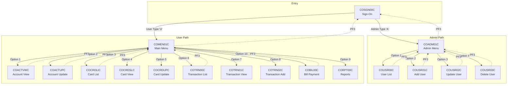
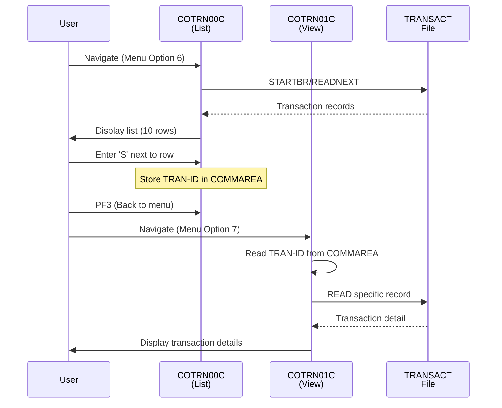
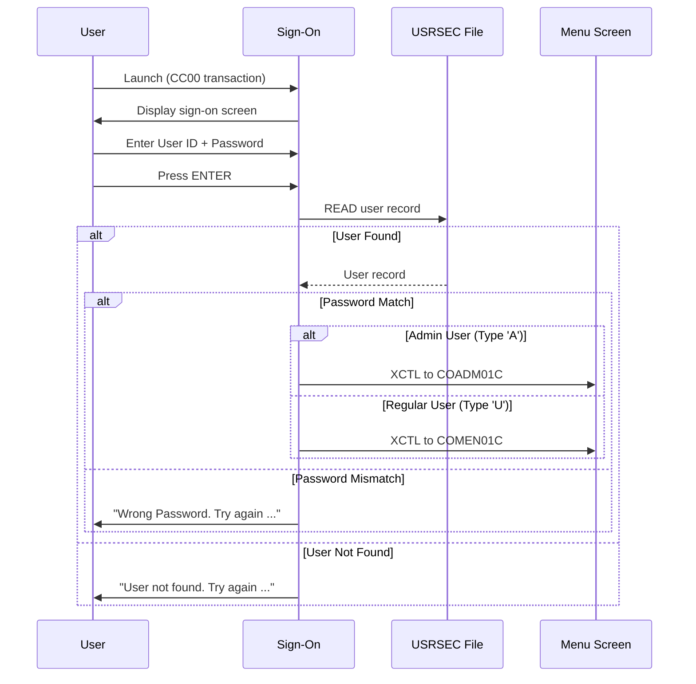
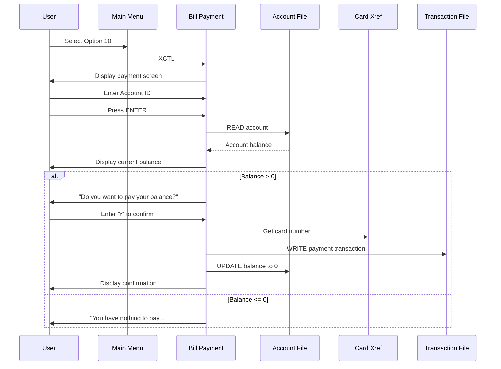
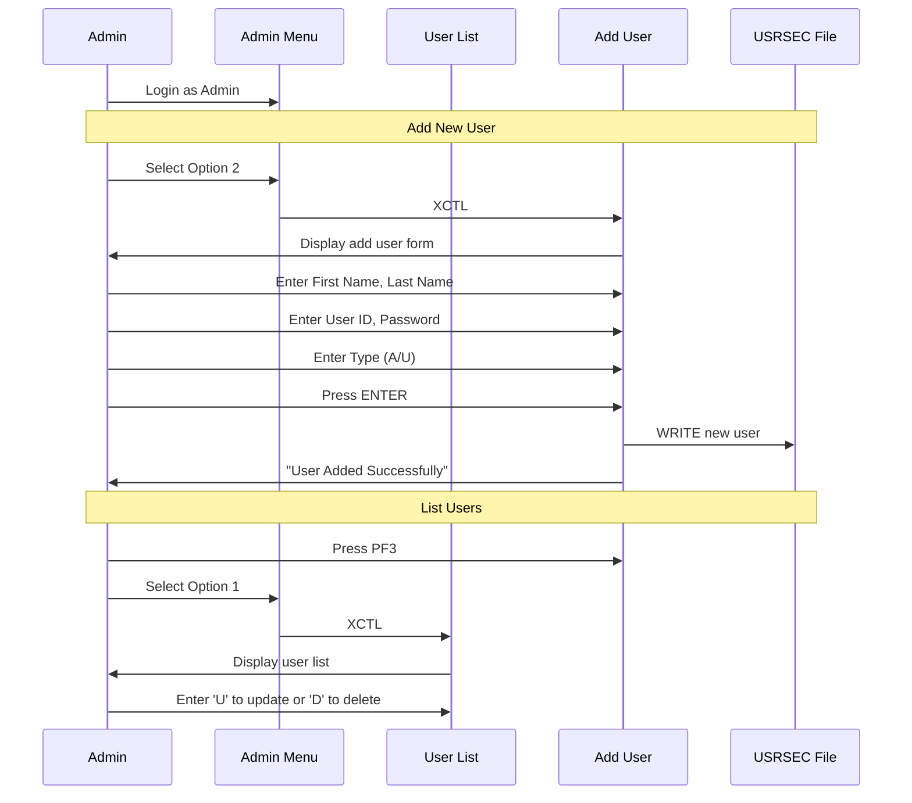

# CardDemo Screen Flow Analysis (RE-005)

## Executive Summary

This document provides a comprehensive analysis of the CardDemo mainframe application's user interface layer, including all 17 BMS (Basic Mapping Support) mapsets, field specifications, navigation flows, PF key mappings, user journeys, and error message catalogs. This analysis supports modernization planning by documenting the complete screen interaction model.

### Key Metrics

| Metric | Value |
|--------|-------|
| Total BMS Mapsets | 17 |
| Total COBOL Programs (Online) | 17 |
| Screen Categories | 9 |
| List Screens (Paginated) | 3 |
| Form Screens (Data Entry) | 6 |
| Detail/View Screens | 5 |
| Menu Screens | 3 |
| User Journeys Documented | 6 |

---

## 1. Screen Inventory

### 1.1 Complete Screen Mapping Table

| BMS File | Mapset | Map Name | Program | Category | Title | Field Count |
|----------|--------|----------|---------|----------|-------|-------------|
| COSGN00.bms | COSGN00 | COSGN0A | COSGN00C | Authentication | Sign-On Screen | ~35 |
| COADM01.bms | COADM01 | COADM1A | COADM01C | Navigation-Admin | Admin Menu | ~32 |
| COMEN01.bms | COMEN01 | COMEN1A | COMEN01C | Navigation-User | Main Menu | ~32 |
| COACTVW.bms | COACTVW | CACTVWA | COACTVWC | Account | View Account | ~95 |
| COACTUP.bms | COACTUP | CACTUPA | COACTUPC | Account | Update Account | ~145 |
| COCRDLI.bms | COCRDLI | CCRDLIA | COCRDLIC | Card | List Credit Cards | ~72 |
| COCRDSL.bms | COCRDSL | CCRDSLA | COCRDSLC | Card | View Credit Card | ~39 |
| COCRDUP.bms | COCRDUP | CCRDUPA | COCRDUPC | Card | Update Credit Card | ~28 |
| COTRN00.bms | COTRN00 | COTRN0A | COTRN00C | Transaction | List Transactions | ~151 |
| COTRN01.bms | COTRN01 | COTRN1A | COTRN01C | Transaction | View Transaction | ~84 |
| COTRN02.bms | COTRN02 | COTRN2A | COTRN02C | Transaction | Add Transaction | ~88 |
| COBIL00.bms | COBIL00 | COBIL0A | COBIL00C | Payment | Bill Payment | ~26 |
| COUSR00.bms | COUSR00 | COUSR0A | COUSR00C | User-Admin | List Users | ~174 |
| COUSR01.bms | COUSR01 | COUSR1A | COUSR01C | User-Admin | Add User | ~26 |
| COUSR02.bms | COUSR02 | COUSR2A | COUSR02C | User-Admin | Update User | ~28 |
| COUSR03.bms | COUSR03 | COUSR3A | COUSR03C | User-Admin | Delete User | ~23 |
| CORPT00.bms | CORPT00 | CORPT0A | CORPT00C | Reports | Transaction Reports | ~56 |

### 1.2 Screen Categories

```
Authentication (1)
├── COSGN00 - Sign-On Screen

Navigation (2)
├── COADM01 - Admin Menu (Admin users only)
└── COMEN01 - Main Menu (All users)

Account Module (2)
├── COACTVW - View Account
└── COACTUP - Update Account

Card Module (3)
├── COCRDLI - List Credit Cards
├── COCRDSL - View Credit Card Detail
└── COCRDUP - Update Credit Card

Transaction Module (3)
├── COTRN00 - List Transactions
├── COTRN01 - View Transaction
└── COTRN02 - Add Transaction

Payment Module (1)
└── COBIL00 - Bill Payment

User Admin Module (4) - Admin Only
├── COUSR00 - List Users
├── COUSR01 - Add User
├── COUSR02 - Update User
└── COUSR03 - Delete User

Reports Module (1)
└── CORPT00 - Transaction Reports
```

---

## 2. Screen Specifications

### 2.1 Standard Screen Header (All Screens)

All screens share a consistent header layout:

| Field | Position | Length | Description |
|-------|----------|--------|-------------|
| TRNNAME | (1,7) | 4 | Transaction ID |
| TITLE01 | (1,21) | 40 | Application title line 1 |
| CURDATE | (1,71) | 8 | Current date (mm/dd/yy) |
| PGMNAME | (2,7) | 8 | Program name |
| TITLE02 | (2,21) | 40 | Application title line 2 |
| CURTIME | (2,71) | 8 | Current time (hh:mm:ss) |

### 2.2 Standard Screen Footer (All Screens)

| Field | Position | Length | Description |
|-------|----------|--------|-------------|
| ERRMSG | (23,1) | 78 | Error/info message (RED color) |
| Function Keys | (24,1) | varies | PF key legend |

### 2.3 Authentication Screen (COSGN00)

**Purpose:** Application entry point for user authentication

**Screen Title:** Sign-On Screen (CardDemo Application)

**Input Fields:**

| Field | Position | Length | Attributes | Description |
|-------|----------|--------|------------|-------------|
| USERID | (19,43) | 8 | UNPROT, IC | User ID input |
| PASSWD | (20,43) | 8 | UNPROT, DRK | Password input (hidden) |

**Special Elements:**
- ASCII art "dollar bill" graphic (rows 7-15)
- Instructions: "Type your User ID and Password, then press ENTER"

**PF Keys:** ENTER=Sign-on, F3=Exit

### 2.4 Menu Screens (COADM01, COMEN01)

**Layout:** 12 menu option slots (OPTN001-012) at positions (6-17,20)

**Input Field:**

| Field | Position | Length | Attributes | Description |
|-------|----------|--------|------------|-------------|
| OPTION | (20,41) | 2 | UNPROT, NUM, IC | Menu selection |

**Admin Menu (COADM01) Options:**
1. User List (Security) → COUSR00C
2. User Add (Security) → COUSR01C
3. User Update (Security) → COUSR02C
4. User Delete (Security) → COUSR03C
5. Transaction Type List (DB2) → COTRTLIC
6. Transaction Type Maintenance (DB2) → COTRTUPC

**Main Menu (COMEN01) Options:**
1. Account View → COACTVWC
2. Account Update → COACTUPC
3. Credit Card List → COCRDLIC
4. Credit Card View → COCRDSLC
5. Credit Card Update → COCRDUPC
6. Transaction List → COTRN00C
7. Transaction View → COTRN01C
8. Transaction Add → COTRN02C
9. Transaction Reports → CORPT00C
10. Bill Payment → COBIL00C
11. Pending Authorization View → COPAUS0C

**PF Keys:** ENTER=Continue, F3=Exit

### 2.5 Account View Screen (COACTVW)

**Purpose:** Display account and customer details (read-only)

**Input Fields:**

| Field | Position | Length | Description |
|-------|----------|--------|-------------|
| ACCTSID | (5,38) | 11 | Account Number (IC, MUSTFILL) |

**Output Fields (Selected):**

| Field | Position | Description |
|-------|----------|-------------|
| ACSTTUS | (5,70) | Active Status (Y/N) |
| ADTOPEN | (6,17) | Account Opened Date |
| ACRDLIM | (6,61) | Credit Limit |
| ACSHLIM | (7,61) | Cash Credit Limit |
| ACURBAL | (8,61) | Current Balance |
| ACSTNUM | (12,23) | Customer ID |
| ACSTSSN | (12,54) | SSN |
| ACSFNAM | (15,1) | First Name |
| ACSLNAM | (15,55) | Last Name |
| ACSADL1 | (16,10) | Address Line 1 |
| ACSCITY | (18,10) | City |
| ACSSTTE | (16,73) | State |
| ACSZIPC | (17,73) | Zip Code |

**PF Keys:** F3=Exit

### 2.6 Account Update Screen (COACTUP)

**Purpose:** Update account and customer information

**Input Fields:** Same as COACTVW but with UNPROT attribute for editing

**Additional Date Fields (Split):**
- Opened: OPNYEAR(4) - OPNMON(2) - OPNDAY(2)
- Expiry: EXPYEAR(4) - EXPMON(2) - EXPDAY(2)
- Reissue: RISYEAR(4) - RISMON(2) - RISDAY(2)
- DOB: DOBYEAR(4) - DOBMON(2) - DOBDAY(2)

**SSN Fields (Split):** ACTSSN1(3) - ACTSSN2(2) - ACTSSN3(4)

**Phone Fields (Split):** ACSPH1A(3) - ACSPH1B(3) - ACSPH1C(4)

**PF Keys:** ENTER=Process, F3=Exit, F5=Save, F12=Cancel

### 2.7 Card List Screen (COCRDLI)

**Purpose:** Paginated list of credit cards

**Search Fields:**

| Field | Position | Length | Description |
|-------|----------|--------|-------------|
| ACCTSID | (6,44) | 11 | Account Number filter |
| CARDSID | (7,44) | 16 | Card Number filter |

**List Rows (7 rows):**

| Row | Select | Account | Card Number | Status |
|-----|--------|---------|-------------|--------|
| 11 | CRDSEL1 | ACCTNO1 | CRDNUM1 | CRDSTS1 |
| 12 | CRDSEL2 | ACCTNO2 | CRDNUM2 | CRDSTS2 |
| ... | ... | ... | ... | ... |
| 17 | CRDSEL7 | ACCTNO7 | CRDNUM7 | CRDSTS7 |

**PF Keys:** F3=Exit, F7=Backward, F8=Forward

### 2.8 Transaction List Screen (COTRN00)

**Purpose:** Paginated transaction list with search

**Search Field:**

| Field | Position | Length | Description |
|-------|----------|--------|-------------|
| TRNIDIN | (6,21) | 16 | Transaction ID search |

**List Rows (10 rows):**

| Row | Select | Tran ID | Date | Description | Amount |
|-----|--------|---------|------|-------------|--------|
| 10 | SEL0001 | TRNID01 | TDATE01 | TDESC01 | TAMT001 |
| 11 | SEL0002 | TRNID02 | TDATE02 | TDESC02 | TAMT002 |
| ... | ... | ... | ... | ... | ... |
| 19 | SEL0010 | TRNID10 | TDATE10 | TDESC10 | TAMT010 |

**Instructions:** "Type 'S' to View Transaction details from the list"

**PF Keys:** ENTER=Continue, F3=Back, F7=Backward, F8=Forward

### 2.9 Transaction View Screen (COTRN01)

**Purpose:** Display transaction details

**Input Field:**

| Field | Position | Length | Description |
|-------|----------|--------|-------------|
| TRNIDIN | (6,21) | 16 | Transaction ID (IC) |

**Output Fields:**

| Field | Position | Description |
|-------|----------|-------------|
| TRNID | (10,22) | Transaction ID |
| CARDNUM | (10,58) | Card Number |
| TTYPCD | (12,15) | Type Code |
| TCATCD | (12,36) | Category Code |
| TRNSRC | (12,54) | Source |
| TDESC | (14,19) | Description |
| TRNAMT | (16,14) | Amount |
| TORIGDT | (16,42) | Original Date |
| TPROCDT | (16,68) | Processed Date |
| MID | (18,19) | Merchant ID |
| MNAME | (18,48) | Merchant Name |
| MCITY | (20,21) | Merchant City |
| MZIP | (20,67) | Merchant Zip |

**PF Keys:** ENTER=Fetch, F3=Back, F4=Clear, F5=Browse Tran.

### 2.10 Transaction Add Screen (COTRN02)

**Purpose:** Create new transaction

**Input Fields:**

| Field | Position | Length | Description |
|-------|----------|--------|-------------|
| ACTIDIN | (6,21) | 11 | Account ID |
| CARDNIN | (6,55) | 16 | Card Number (alternative) |
| TTYPCD | (10,15) | 2 | Type Code |
| TCATCD | (10,36) | 4 | Category Code |
| TRNSRC | (10,54) | 10 | Source |
| TDESC | (12,19) | 60 | Description |
| TRNAMT | (14,14) | 12 | Amount (-99999999.99) |
| TORIGDT | (14,42) | 10 | Original Date (YYYY-MM-DD) |
| TPROCDT | (14,68) | 10 | Processed Date (YYYY-MM-DD) |
| MID | (16,19) | 9 | Merchant ID |
| MNAME | (16,48) | 30 | Merchant Name |
| MCITY | (18,21) | 25 | Merchant City |
| MZIP | (18,67) | 10 | Merchant Zip |
| CONFIRM | (21,63) | 1 | Confirmation (Y/N) |

**PF Keys:** ENTER=Continue, F3=Back, F4=Clear, F5=Copy Last Tran.

### 2.11 Bill Payment Screen (COBIL00)

**Purpose:** Process bill payment

**Input Fields:**

| Field | Position | Length | Description |
|-------|----------|--------|-------------|
| ACTIDIN | (6,21) | 11 | Account ID (IC) |
| CONFIRM | (15,60) | 1 | Payment Confirmation (Y/N) |

**Output Fields:**

| Field | Position | Description |
|-------|----------|-------------|
| CURBAL | (11,32) | Current Balance |

**PF Keys:** ENTER=Continue, F3=Back, F4=Clear

### 2.12 User List Screen (COUSR00)

**Purpose:** Paginated list of system users (Admin only)

**Search Field:**

| Field | Position | Length | Description |
|-------|----------|--------|-------------|
| USRIDIN | (6,21) | 8 | User ID search |

**List Rows (10 rows):**

| Row | Select | User ID | First Name | Last Name | Type |
|-----|--------|---------|------------|-----------|------|
| 10 | SEL0001 | USRID01 | FNAME01 | LNAME01 | UTYPE01 |
| ... | ... | ... | ... | ... | ... |
| 19 | SEL0010 | USRID10 | FNAME10 | LNAME10 | UTYPE10 |

**Instructions:** "Type 'U' to Update or 'D' to Delete a User from the list"

**PF Keys:** ENTER=Continue, F3=Back, F7=Backward, F8=Forward

### 2.13 User Add Screen (COUSR01)

**Purpose:** Create new user account

**Input Fields:**

| Field | Position | Length | Description |
|-------|----------|--------|-------------|
| FNAME | (8,18) | 20 | First Name (IC) |
| LNAME | (8,56) | 20 | Last Name |
| USERID | (11,15) | 8 | User ID |
| PASSWD | (11,55) | 8 | Password (DRK) |
| USRTYPE | (14,17) | 1 | User Type (A=Admin, U=User) |

**PF Keys:** ENTER=Add User, F3=Back, F4=Clear, F12=Exit

### 2.14 User Update Screen (COUSR02)

**Purpose:** Update existing user

**Input Fields:**

| Field | Position | Length | Description |
|-------|----------|--------|-------------|
| USRIDIN | (6,21) | 8 | User ID (IC) |
| FNAME | (11,18) | 20 | First Name |
| LNAME | (11,56) | 20 | Last Name |
| PASSWD | (13,16) | 8 | Password (DRK) |
| USRTYPE | (15,17) | 1 | User Type |

**PF Keys:** ENTER=Fetch, F3=Save&Exit, F4=Clear, F5=Save, F12=Cancel

### 2.15 User Delete Screen (COUSR03)

**Purpose:** Delete user account

**Input Fields:**

| Field | Position | Length | Description |
|-------|----------|--------|-------------|
| USRIDIN | (6,21) | 8 | User ID (IC) |

**Display Fields (Read-only):**
- FNAME, LNAME, USRTYPE

**PF Keys:** ENTER=Fetch, F3=Back, F4=Clear, F5=Delete

### 2.16 Reports Screen (CORPT00)

**Purpose:** Generate transaction reports

**Report Type Selection:**

| Field | Position | Description |
|-------|----------|-------------|
| MONTHLY | (7,10) | Monthly (Current Month) |
| YEARLY | (9,10) | Yearly (Current Year) |
| CUSTOM | (11,10) | Custom (Date Range) |

**Date Range Fields (for Custom):**

| Field | Position | Length | Format |
|-------|----------|--------|--------|
| SDTMM | (13,29) | 2 | Start Month |
| SDTDD | (13,34) | 2 | Start Day |
| SDTYYYY | (13,39) | 4 | Start Year |
| EDTMM | (14,29) | 2 | End Month |
| EDTDD | (14,34) | 2 | End Day |
| EDTYYYY | (14,39) | 4 | End Year |
| CONFIRM | (19,66) | 1 | Confirmation (Y/N) |

**PF Keys:** ENTER=Continue, F3=Back

---

## 3. Navigation Flow Diagrams

### 3.1 Application-Level Navigation



### 3.2 Transaction List to Detail Flow



---

## 4. PF Key Reference Table

### 4.1 Global Standards

| Key | Standard Action | CICS Implementation |
|-----|-----------------|---------------------|
| ENTER | Submit/Process | Primary action key |
| PF3 | Return/Exit | XCTL to previous screen |
| PF4 | Clear | Clear input fields |
| PF5 | Save/Action | Save/Delete/Browse |
| PF7 | Page Up | List screens (READPREV) |
| PF8 | Page Down | List screens (READNEXT) |
| PF12 | Cancel/Exit | Cancel operation |

### 4.2 Screen-Specific PF Key Matrix

| Screen | ENTER | PF3 | PF4 | PF5 | PF7 | PF8 | PF12 |
|--------|-------|-----|-----|-----|-----|-----|------|
| COSGN00 | Sign-on | Exit App | - | - | - | - | - |
| COADM01 | Select | COSGN00C | - | - | - | - | - |
| COMEN01 | Select | COSGN00C | - | - | - | - | - |
| COACTVW | - | COMEN01C | - | - | - | - | - |
| COACTUP | Process | Exit | - | Save | - | - | Cancel |
| COCRDLI | - | COMEN01C | - | - | Page Up | Page Down | - |
| COCRDSL | Search | Exit | - | - | - | - | - |
| COCRDUP | Process | Exit | - | Save | - | - | Cancel |
| COTRN00 | Continue | Back | - | - | Page Up | Page Down | - |
| COTRN01 | Fetch | Back | Clear | Browse | - | - | - |
| COTRN02 | Continue | Back | Clear | Copy | - | - | - |
| COBIL00 | Continue | Back | Clear | - | - | - | - |
| COUSR00 | Continue | Back | - | - | Page Up | Page Down | - |
| COUSR01 | Add | Back | Clear | - | - | - | Exit |
| COUSR02 | Fetch | Save&Exit | Clear | Save | - | - | Cancel |
| COUSR03 | Fetch | Back | Clear | Delete | - | - | - |
| CORPT00 | Continue | Back | - | - | - | - | - |

---

## 5. User Journeys

### 5.1 Journey 1: User Authentication

**User Type:** All users
**Priority:** High



**Error Scenarios:**
- Empty User ID: "Please enter User ID ..."
- Empty Password: "Please enter Password ..."
- Invalid User ID: "User not found. Try again ..."
- Wrong Password: "Wrong Password. Try again ..."
- System Error: "Unable to verify the User ..."

### 5.2 Journey 2: Account Inquiry

**User Type:** Regular User
**Priority:** High

**Flow:** COSGN00 → COMEN01 → COACTVW

**Steps:**
1. User logs in (Journey 1)
2. Select Option 1 "Account View" from Main Menu
3. Enter Account Number (11 digits)
4. Press ENTER to fetch account details
5. View account info including:
   - Account status, dates, limits
   - Customer name, address, contact info
   - Current balance
6. Press PF3 to return to menu

### 5.3 Journey 3: Bill Payment

**User Type:** Regular User
**Priority:** High



**Error Scenarios:**
- Empty Account ID: "Acct ID can NOT be empty..."
- Invalid Account: "Account ID NOT found..."
- Zero Balance: "You have nothing to pay..."
- Invalid Confirmation: "Invalid value. Valid values are (Y/N)..."

### 5.4 Journey 4: Transaction List and View

**User Type:** Regular User
**Priority:** High

**Flow:** COMEN01 → COTRN00 → COTRN01

**Steps:**
1. Select Option 6 "Transaction List" from Main Menu
2. (Optional) Enter Transaction ID to search
3. View paginated list (10 transactions per page)
4. Use PF7/PF8 to navigate pages
5. Enter 'S' next to a transaction to select it
6. Press PF3 to return to menu
7. Select Option 7 "Transaction View"
8. Transaction ID auto-populated from selection
9. Press ENTER to view full details
10. View merchant info, amounts, dates

**Selection Instructions:** "Type 'S' to View Transaction details from the list"

### 5.5 Journey 5: User Administration (Admin)

**User Type:** Admin only
**Priority:** High

**Flow:** COSGN00 → COADM01 → COUSR00/01/02/03



**User Validation:**
- First Name required
- Last Name required
- User ID required (8 chars max)
- Password required (8 chars max)
- User Type must be 'A' or 'U'

### 5.6 Journey 6: Card Management

**User Type:** Regular User
**Priority:** Medium

**Flow:** COMEN01 → COCRDLI → COCRDUP

**Steps:**
1. Select Option 3 "Credit Card List" from Main Menu
2. (Optional) Enter Account Number or Card Number to filter
3. View card list (7 cards per page)
4. Select card for update (card is stored in context)
5. Select Option 5 "Credit Card Update"
6. Modify: Name on card, Active status, Expiry date
7. Press PF5 to save or F12 to cancel

---

## 6. Error Message Catalog

### 6.1 Common Messages (CSMSG01Y.cpy)

| Code | Message | Usage |
|------|---------|-------|
| CCDA-MSG-THANK-YOU | "Thank you for using CardDemo application..." | Application exit |
| CCDA-MSG-INVALID-KEY | "Invalid key pressed. Please see below..." | Invalid PF key |

### 6.2 Authentication Messages (COSGN00C)

| Message | Condition |
|---------|-----------|
| "Please enter User ID ..." | USERID is empty |
| "Please enter Password ..." | PASSWD is empty |
| "User not found. Try again ..." | User ID not in USRSEC file |
| "Wrong Password. Try again ..." | Password mismatch |
| "Unable to verify the User ..." | System error during verification |

### 6.3 Bill Payment Messages (COBIL00C)

| Message | Condition |
|---------|-----------|
| "Acct ID can NOT be empty..." | Account ID is spaces/low-values |
| "Account ID NOT found..." | Account not in ACCTDAT |
| "You have nothing to pay..." | Current balance <= 0 |
| "Invalid value. Valid values are (Y/N)..." | Invalid confirmation value |
| "Confirm to make a bill payment..." | Awaiting confirmation |

### 6.4 Transaction Messages (COTRN00C, COTRN01C, COTRN02C)

| Message | Condition |
|---------|-----------|
| "Tran ID must be Numeric ..." | Non-numeric transaction ID |
| "Invalid selection. Valid value is S" | Invalid list selection |
| "You are already at the top of the page..." | PF7 at first page |
| "You are already at the bottom of the page..." | PF8 at last page |
| "Please select at least one type of report" | No report type selected |
| "Start date is required for custom report" | Missing start date |
| "End date is required for custom report" | Missing end date |

### 6.5 User Admin Messages (COUSR01C, COUSR02C, COUSR03C)

| Message | Condition |
|---------|-----------|
| "First Name is required..." | Empty first name |
| "Last Name is required..." | Empty last name |
| "User ID is required..." | Empty user ID |
| "Password is required..." | Empty password |
| "User Type is required..." | Empty user type |
| "User Added Successfully" | Successful user creation |
| "User Updated Successfully" | Successful user update |
| "User Deleted Successfully" | Successful user deletion |
| "User Already exists ..." | Duplicate user ID on add |
| "User Not found ..." | User ID not found on update/delete |

### 6.6 File I/O Error Messages

| Message Pattern | File | Condition |
|-----------------|------|-----------|
| "Unable to Read file ..." | Various | READ error |
| "Unable to write to file ..." | Various | WRITE error |
| "Unable to update file ..." | Various | REWRITE error |
| "Unable to start browse ..." | Various | STARTBR error |

---

## 7. Role-Based Access Matrix

| Screen | Admin | User | Enforcement Location |
|--------|-------|------|---------------------|
| COSGN00 | Yes | Yes | Entry point |
| COADM01 | Yes | No | COSGN00C:89 (checks SEC-USR-TYPE) |
| COMEN01 | Yes | Yes | COSGN00C:89 |
| COUSR00-03 | Yes | No | Via COADM01C only |
| COACTVW | Yes | Yes | COMEN01C |
| COACTUPC | Yes | Yes | COMEN01C |
| COCRDLI | Yes | Yes | COMEN01C |
| COCRDSL | Yes | Yes | COMEN01C |
| COCRDUP | Yes | Yes | COMEN01C |
| COTRN00 | Yes | Yes | COMEN01C |
| COTRN01 | Yes | Yes | COMEN01C |
| COTRN02 | Yes | Yes | COMEN01C |
| COBIL00 | Yes | Yes | COMEN01C |
| CORPT00 | Yes | Yes | COMEN01C |

**Access Control Implementation:**
- User type stored in USRSEC file (SEC-USR-TYPE field)
- Type 'A' = Admin, Type 'U' = Regular User
- COSGN00C routes to appropriate menu based on type
- No screen-level security beyond menu routing

---

## 8. ASCII Screen Layouts

### 8.1 COSGN00 - Sign-On Screen

```
+--------------------------------------------------------------------------------+
| Tran: CC00      CardDemo Application                      Date: mm/dd/yy       |
| Prog: COSGN00C                                            Time: hh:mm:ss       |
| AppID: XXXXXXXX                                           SysID: XXXXXXXX      |
|                                                                                |
|       This is a Credit Card Demo Application for Mainframe Modernization       |
|                                                                                |
|                    +========================================+                   |
|                    |%%%%%%%  NATIONAL RESERVE NOTE  %%%%%%%%|                   |
|                    |%(1)  THE UNITED STATES OF KICSLAND (1)%|                   |
|                    |%$$              ___       ********  $$%|                   |
|                    |%$    {x}       (o o)                 $%|                   |
|                    |%$     ******  (  V  )      O N E     $%|                   |
|                    |%(1)          ---m-m---             (1)%|                   |
|                    |%%~~~~~~~~~~~ ONE DOLLAR ~~~~~~~~~~~~~%%|                   |
|                    +========================================+                   |
|                                                                                |
|              Type your User ID and Password, then press ENTER:                 |
|                                                                                |
|                User ID     : [________] (8 Char)                               |
|                Password    : [________] (8 Char)                               |
|                                                                                |
|                                                                                |
| [Error Message Area - 78 characters                                          ] |
| ENTER=Sign-on  F3=Exit                                                         |
+--------------------------------------------------------------------------------+
```

### 8.2 COMEN01 - Main Menu

```
+--------------------------------------------------------------------------------+
| Tran: CM00      CardDemo Application                      Date: mm/dd/yy       |
| Prog: COMEN01C                                            Time: hh:mm:ss       |
|                                                                                |
|                                 Main Menu                                       |
|                                                                                |
|                    1. Account View                                             |
|                    2. Account Update                                           |
|                    3. Credit Card List                                         |
|                    4. Credit Card View                                         |
|                    5. Credit Card Update                                       |
|                    6. Transaction List                                         |
|                    7. Transaction View                                         |
|                    8. Transaction Add                                          |
|                    9. Transaction Reports                                      |
|                   10. Bill Payment                                             |
|                   11. Pending Authorization View                               |
|                                                                                |
|                                                                                |
|                                                                                |
|               Please select an option : [__]                                   |
|                                                                                |
|                                                                                |
| [Error Message Area                                                          ] |
| ENTER=Continue  F3=Exit                                                        |
+--------------------------------------------------------------------------------+
```

### 8.3 COTRN00 - Transaction List

```
+--------------------------------------------------------------------------------+
| Tran: CM00      CardDemo Application                      Date: mm/dd/yy       |
| Prog: COTRN00C                                            Time: hh:mm:ss       |
|                                                                                |
|                              List Transactions                    Page: 1      |
|                                                                                |
|     Search Tran ID: [________________]                                         |
|                                                                                |
| Sel  Transaction ID    Date          Description                Amount        |
| ---  ----------------  --------  --------------------------  ------------      |
| [_]  1234567890123456  01/15/26  GROCERY STORE PURCHASE        +    125.50     |
| [_]  1234567890123457  01/16/26  GAS STATION                   +     45.00     |
| [_]  1234567890123458  01/17/26  ONLINE SHOPPING               +    299.99     |
| [_]  1234567890123459  01/18/26  RESTAURANT                    +     67.25     |
| [_]  1234567890123460  01/19/26  UTILITY PAYMENT               +    150.00     |
| [_]  1234567890123461  01/20/26  PHARMACY                      +     32.50     |
| [_]  1234567890123462  01/21/26  COFFEE SHOP                   +      8.75     |
| [_]  1234567890123463  01/22/26  ELECTRONICS STORE             +    549.00     |
| [_]  1234567890123464  01/23/26  SUBSCRIPTION SERVICE          +     14.99     |
| [_]  1234567890123465  01/24/26  BILL PAYMENT                  +    500.00     |
|                                                                                |
|            Type 'S' to View Transaction details from the list                  |
|                                                                                |
| [Error Message Area                                                          ] |
| ENTER=Continue  F3=Back  F7=Backward  F8=Forward                               |
+--------------------------------------------------------------------------------+
```

### 8.4 COBIL00 - Bill Payment

```
+--------------------------------------------------------------------------------+
| Tran: CM00      CardDemo Application                      Date: mm/dd/yy       |
| Prog: COBIL00C                                            Time: hh:mm:ss       |
|                                                                                |
|                                Bill Payment                                     |
|                                                                                |
|     Enter Acct ID: [___________]                                               |
|                                                                                |
|     ----------------------------------------------------------------------     |
|                                                                                |
|                                                                                |
|         Your current balance is:     $1,523.45                                 |
|                                                                                |
|                                                                                |
|                                                                                |
|         Do you want to pay your balance now. Please confirm: [_] (Y/N)         |
|                                                                                |
|                                                                                |
|                                                                                |
|                                                                                |
|                                                                                |
|                                                                                |
|                                                                                |
| [Error Message Area                                                          ] |
| ENTER=Continue  F3=Back  F4=Clear                                              |
+--------------------------------------------------------------------------------+
```

---

## 9. Modernization Implications

### 9.1 Frontend Routing Strategy

| Legacy Pattern | Modern Equivalent |
|----------------|-------------------|
| BMS Mapsets | React/Vue Components |
| XCTL Navigation | React Router / Vue Router |
| RETURN TRANSID | Client-side state |
| Menu Options | Navigation Sidebar/Tabs |
| PF3 Return | Browser Back / Breadcrumbs |
| PF7/PF8 Paging | Infinite Scroll / Pagination |
| COMMAREA State | Redux/Vuex/URL Parameters |

### 9.2 Proposed Route Structure

```
/                           → Redirect to /login
/login                      → COSGN00C (Sign-On)
/admin                      → COADM01C (Admin Menu)
/admin/users                → COUSR00C (User List)
/admin/users/new            → COUSR01C (Add User)
/admin/users/:id/edit       → COUSR02C (Update User)
/admin/users/:id/delete     → COUSR03C (Delete User)
/dashboard                  → COMEN01C (Main Menu)
/accounts                   → COACTVWC (Account View)
/accounts/:id               → Account detail
/accounts/:id/edit          → COACTUPC (Account Update)
/cards                      → COCRDLIC (Card List)
/cards/:cardNum             → COCRDSLC (Card View)
/cards/:cardNum/edit        → COCRDUPC (Card Update)
/transactions               → COTRN00C (Transaction List)
/transactions/:id           → COTRN01C (Transaction View)
/transactions/new           → COTRN02C (Add Transaction)
/payments                   → COBIL00C (Bill Payment)
/reports                    → CORPT00C (Reports)
```

### 9.3 State Management Mapping

| Legacy (COMMAREA) | Modern (State) |
|-------------------|----------------|
| CDEMO-FROM-TRANID | Navigation history |
| CDEMO-FROM-PROGRAM | Previous route |
| CDEMO-PGM-CONTEXT | Component state |
| CDEMO-ACCT-ID | URL parameter / Store |
| CDEMO-CARD-NUM | URL parameter / Store |

### 9.4 Screen Component Architecture

```
src/
├── components/
│   ├── common/
│   │   ├── ScreenHeader.tsx      # Header fields
│   │   ├── ScreenFooter.tsx      # Error msg + PF keys
│   │   ├── DataTable.tsx         # List screens
│   │   └── FormField.tsx         # Input fields
│   ├── auth/
│   │   └── SignOn.tsx            # COSGN00
│   ├── menu/
│   │   ├── AdminMenu.tsx         # COADM01
│   │   └── MainMenu.tsx          # COMEN01
│   ├── account/
│   │   ├── AccountView.tsx       # COACTVW
│   │   └── AccountUpdate.tsx     # COACTUP
│   ├── card/
│   │   ├── CardList.tsx          # COCRDLI
│   │   ├── CardView.tsx          # COCRDSL
│   │   └── CardUpdate.tsx        # COCRDUP
│   ├── transaction/
│   │   ├── TransactionList.tsx   # COTRN00
│   │   ├── TransactionView.tsx   # COTRN01
│   │   └── TransactionAdd.tsx    # COTRN02
│   ├── payment/
│   │   └── BillPayment.tsx       # COBIL00
│   ├── user/
│   │   ├── UserList.tsx          # COUSR00
│   │   ├── UserAdd.tsx           # COUSR01
│   │   ├── UserUpdate.tsx        # COUSR02
│   │   └── UserDelete.tsx        # COUSR03
│   └── reports/
│       └── Reports.tsx           # CORPT00
```

---

## 10. Cross-References

| Document | Location | Relationship |
|----------|----------|--------------|
| Domain Model | `docs/reverse-engineering/01-domain-model/` | Entity definitions |
| Data Model | `docs/reverse-engineering/02-data-model/` | File structures |
| Navigation Flows | `docs/reverse-engineering/03-context-model/NAVIGATION-FLOWS.md` | High-level flows |
| Context Map | `docs/reverse-engineering/03-context-model/CONTEXT-MAP.md` | Bounded contexts |
| BMS Mapsets | `app/bms/` | Screen definitions |
| COBOL Programs | `app/cbl/CO*.cbl` | Screen logic |
| Copybooks | `app/cpy/` | Shared structures |

---

## Appendix A: Field Attribute Reference

### BMS Field Attributes

| Attribute | Description |
|-----------|-------------|
| ASKIP | Auto-skip (protected, cursor skips over) |
| UNPROT | Unprotected (user can enter data) |
| PROT | Protected (display only) |
| NUM | Numeric only input |
| IC | Initial cursor position |
| FSET | Modified data tag always set |
| BRT | Bright (highlighted) |
| NORM | Normal intensity |
| DRK | Dark (not displayed, for passwords) |

### BMS Color Attributes

| Color | Usage |
|-------|-------|
| BLUE | Labels, headers |
| YELLOW | Titles, PF key legends |
| GREEN | Input fields |
| RED | Error messages |
| TURQUOISE | Instructions, prompts |
| NEUTRAL | Screen titles |

---

## Appendix B: Source File References

| Component | Primary Source |
|-----------|---------------|
| Sign-on Program | `app/cbl/COSGN00C.cbl` |
| Admin Menu | `app/cbl/COADM01C.cbl`, `app/cpy/COADM02Y.cpy` |
| User Menu | `app/cbl/COMEN01C.cbl`, `app/cpy/COMEN02Y.cpy` |
| Account Programs | `app/cbl/COACTVWC.cbl`, `COACTUPC.cbl` |
| Card Programs | `app/cbl/COCRDLIC.cbl`, `COCRDSLC.cbl`, `COCRDUPC.cbl` |
| Transaction Programs | `app/cbl/COTRN00C.cbl`, `COTRN01C.cbl`, `COTRN02C.cbl` |
| Bill Payment | `app/cbl/COBIL00C.cbl` |
| User Admin | `app/cbl/COUSR00C.cbl`, `COUSR01C.cbl`, `COUSR02C.cbl`, `COUSR03C.cbl` |
| Reports | `app/cbl/CORPT00C.cbl` |
| Common Messages | `app/cpy/CSMSG01Y.cpy` |
| COMMAREA | `app/cpy/COCOM01Y.cpy` |

---

*Generated as part of RE-005: Screen Flow Analysis*
*CardDemo Mainframe Modernization Project*
