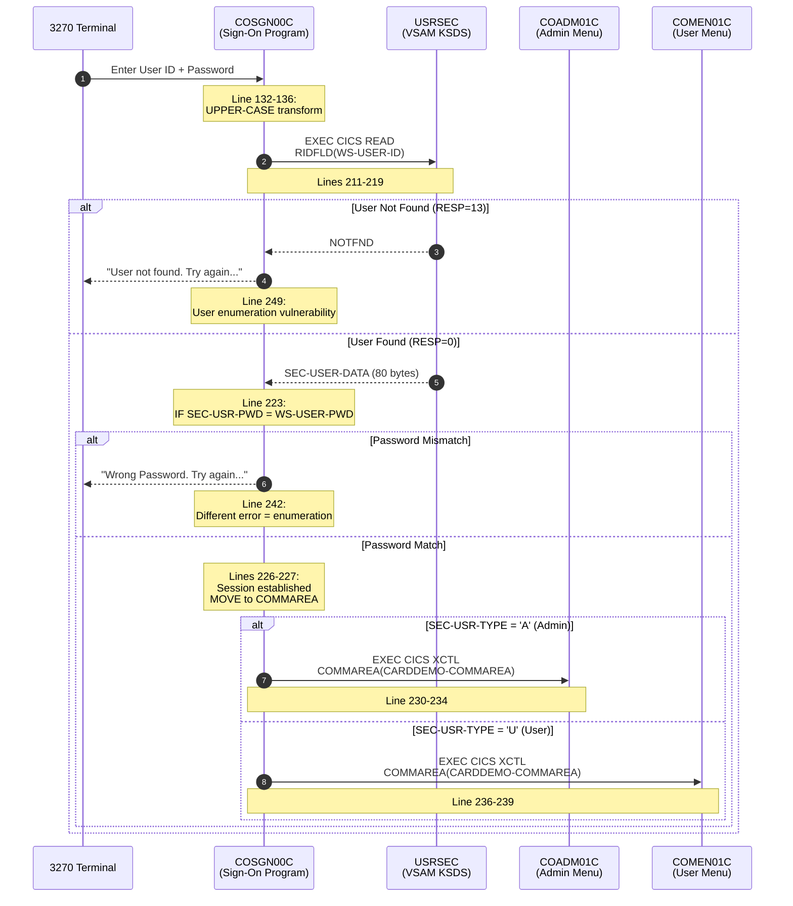

# CardDemo Security Model Analysis

**Document Version:** 1.0
**Generated:** 2026-02-05
**Scope:** Comprehensive security analysis of the CardDemo mainframe application
**Classification:** Internal - Security Assessment

---

## Table of Contents

1. [Executive Summary](#1-executive-summary)
2. [Authentication Architecture](#2-authentication-architecture)
3. [Role-Based Access Control Matrix](#3-role-based-access-control-matrix)
4. [Session Management](#4-session-management)
5. [Security Findings Catalog](#5-security-findings-catalog)
6. [PCI-DSS Compliance Gap Analysis](#6-pci-dss-compliance-gap-analysis)
7. [Modernization Recommendations](#7-modernization-recommendations)
8. [Cross-References](#8-cross-references)

---

## 1. Executive Summary

### Overview

This document provides a comprehensive security analysis of the CardDemo mainframe credit card processing application. The assessment covers authentication mechanisms, authorization controls, session management, and data protection patterns.

### Critical Findings Summary

| Severity | Count | Key Issues |
|----------|-------|------------|
| **CRITICAL** | 6 | Plain-text passwords, no session timeout, missing authorization checks, unencrypted PAN/CVV |
| **HIGH** | 2 | User enumeration, unsigned session context |
| **MEDIUM** | 2 | SSN displayed without masking, weak input validation |
| **Total** | 10 | Findings requiring immediate remediation |

### Compliance Status

| Standard | Status | Score |
|----------|--------|-------|
| **PCI-DSS v4.0** | Critical Non-Compliance | **15%** |
| NIST 800-53 | Non-Compliant | ~20% |
| SOX | Partial | ~30% |

### Risk Rating: **CRITICAL**

The application contains fundamental security design flaws that would be unacceptable in any production credit card processing system. All findings require remediation before any modernization deployment.

---

## 2. Authentication Architecture

### 2.1 Authentication Flow

The following sequence diagram illustrates the current authentication process:



### 2.2 Source File References

| File | Purpose | Critical Lines |
|------|---------|----------------|
| `app/cbl/COSGN00C.cbl` | Authentication entry point | 209-257 (READ-USER-SEC-FILE) |
| `app/cpy/CSUSR01Y.cpy` | User security record layout | 17-23 |
| `app/jcl/DUSRSECJ.jcl` | Default user credentials | 35-44 |

### 2.3 User Security Record Layout

**Source:** `app/cpy/CSUSR01Y.cpy:17-23`

```cobol
01 SEC-USER-DATA.
   05 SEC-USR-ID                 PIC X(08).    *> Primary key
   05 SEC-USR-FNAME              PIC X(20).    *> First name
   05 SEC-USR-LNAME              PIC X(20).    *> Last name
   05 SEC-USR-PWD                PIC X(08).    *> Password (PLAIN TEXT!)
   05 SEC-USR-TYPE               PIC X(01).    *> 'A'=Admin, 'U'=User
   05 SEC-USR-FILLER             PIC X(23).    *> Reserved
```

**Record Length:** 80 bytes
**Key:** SEC-USR-ID (8 bytes, position 0)

### 2.4 Default Credentials (from DUSRSECJ.jcl:35-44)

| User ID | First Name | Last Name | Password | Type |
|---------|------------|-----------|----------|------|
| ADMIN001 | MARGARET | GOLD | PASSWORD | Admin (A) |
| ADMIN002 | RUSSELL | RUSSELL | PASSWORD | Admin (A) |
| ADMIN003 | RAYMOND | WHITMORE | PASSWORD | Admin (A) |
| ADMIN004 | EMMANUEL | CASGRAIN | PASSWORD | Admin (A) |
| ADMIN005 | GRANVILLE | LACHAPELLE | PASSWORD | Admin (A) |
| USER0001 | LAWRENCE | THOMAS | PASSWORD | User (U) |
| USER0002 | AJITH | KUMAR | PASSWORD | User (U) |
| USER0003 | LAURITZ | ALME | PASSWORD | User (U) |
| USER0004 | AVERARDO | MAZZI | PASSWORD | User (U) |
| USER0005 | LEE | TING | PASSWORD | User (U) |

**Security Issue:** All default passwords are "PASSWORD" - a trivially guessable credential.

### 2.5 Authentication Logic Analysis

**Password Comparison (COSGN00C.cbl:223):**
```cobol
IF SEC-USR-PWD = WS-USER-PWD
```

This is a plain-text string comparison with no cryptographic processing:
- No password hashing (MD5, SHA-256, bcrypt, etc.)
- No salting
- No key derivation function
- Direct memory comparison exposes timing attack vector

**Error Message Differentiation (COSGN00C.cbl:242, 249):**
```cobol
WHEN 0
    IF SEC-USR-PWD = WS-USER-PWD
        ...
    ELSE
        MOVE 'Wrong Password. Try again ...' TO WS-MESSAGE   *> Line 242
WHEN 13
    MOVE 'User not found. Try again ...' TO WS-MESSAGE       *> Line 249
```

Different error messages enable **user enumeration attacks** - attackers can determine valid usernames.

---

## 3. Role-Based Access Control Matrix

### 3.1 User Types

**Source:** `app/cpy/COCOM01Y.cpy:26-28`

```cobol
10 CDEMO-USER-TYPE               PIC X(01).
   88 CDEMO-USRTYP-ADMIN         VALUE 'A'.
   88 CDEMO-USRTYP-USER          VALUE 'U'.
```

### 3.2 Access Control Matrix

| Function | Program | Admin (A) | User (U) | Auth Check Location | Notes |
|----------|---------|:---------:|:--------:|---------------------|-------|
| **Sign On** | COSGN00C | Yes | Yes | Entry point | Authentication required |
| **Admin Menu** | COADM01C | Yes | No | COSGN00C:230-234 | Role routing at login |
| **User Menu** | COMEN01C | Yes | Yes | COMEN01C:136-143 | Menu-level check only |
| **Account View** | COACTVWC | Yes | Yes | **NONE** | No per-program auth |
| **Account Update** | COACTUPC | Yes | Yes | **NONE** | No per-program auth |
| **Card List** | COCRDLIC | Yes | Yes | **NONE** | No per-program auth |
| **Card View** | COCRDSLC | Yes | Yes | **NONE** | No per-program auth |
| **Card Update** | COCRDUPC | Yes | Yes | **NONE** | No per-program auth |
| **Transaction List** | COTRN00C | Yes | Yes | **NONE** | No per-program auth |
| **Transaction View** | COTRN01C | Yes | Yes | **NONE** | No per-program auth |
| **Transaction Add** | COTRN02C | Yes | Yes | **NONE** | No per-program auth |
| **Reports** | CORPT00C | Yes | Yes | **NONE** | No per-program auth |
| **Bill Payment** | COBIL00C | Yes | Yes | **NONE** | No per-program auth |
| **User List** | COUSR00C | Yes | No | Menu only (COADM01C) | Admin menu restriction |
| **User Add** | COUSR01C | Yes | No | Menu only (COADM01C) | Admin menu restriction |
| **User Update** | COUSR02C | Yes | No | Menu only (COADM01C) | Admin menu restriction |
| **User Delete** | COUSR03C | Yes | No | Menu only (COADM01C) | Admin menu restriction |

### 3.3 Menu Authorization Check

**Source:** `app/cbl/COMEN01C.cbl:136-143`

```cobol
IF CDEMO-USRTYP-USER AND
   CDEMO-MENU-OPT-USRTYPE(WS-OPTION) = 'A'
    SET ERR-FLG-ON          TO TRUE
    MOVE SPACES             TO WS-MESSAGE
    MOVE 'No access - Admin Only option... ' TO
                            WS-MESSAGE
    PERFORM SEND-MENU-SCREEN
END-IF
```

**Critical Flaw:** This check occurs only at the menu selection level in COMEN01C. Once a user bypasses the menu (e.g., direct CICS transaction invocation), no further authorization validation occurs.

### 3.4 Menu Option Configurations

**User Menu (COMEN02Y.cpy):**

| # | Function | Program | User Type |
|---|----------|---------|-----------|
| 1 | Account View | COACTVWC | U |
| 2 | Account Update | COACTUPC | U |
| 3 | Credit Card List | COCRDLIC | U |
| 4 | Credit Card View | COCRDSLC | U |
| 5 | Credit Card Update | COCRDUPC | U |
| 6 | Transaction List | COTRN00C | U |
| 7 | Transaction View | COTRN01C | U |
| 8 | Transaction Add | COTRN02C | U |
| 9 | Transaction Reports | CORPT00C | U |
| 10 | Bill Payment | COBIL00C | U |
| 11 | Pending Authorization View | COPAUS0C | U |

**Admin Menu (COADM02Y.cpy):**

| # | Function | Program |
|---|----------|---------|
| 1 | User List (Security) | COUSR00C |
| 2 | User Add (Security) | COUSR01C |
| 3 | User Update (Security) | COUSR02C |
| 4 | User Delete (Security) | COUSR03C |
| 5 | Transaction Type List/Update (Db2) | COTRTLIC |
| 6 | Transaction Type Maintenance (Db2) | COTRTUPC |

---

## 4. Session Management

### 4.1 COMMAREA Session Structure

**Source:** `app/cpy/COCOM01Y.cpy:19-44`

```cobol
01 CARDDEMO-COMMAREA.
   05 CDEMO-GENERAL-INFO.
      10 CDEMO-FROM-TRANID             PIC X(04).   *> Navigation source
      10 CDEMO-FROM-PROGRAM            PIC X(08).   *> Navigation source
      10 CDEMO-TO-TRANID               PIC X(04).   *> Navigation target
      10 CDEMO-TO-PROGRAM              PIC X(08).   *> Navigation target
      10 CDEMO-USER-ID                 PIC X(08).   *> Authenticated user
      10 CDEMO-USER-TYPE               PIC X(01).   *> Role ('A' or 'U')
      10 CDEMO-PGM-CONTEXT             PIC 9(01).   *> State (0=enter, 1=reenter)
   05 CDEMO-CUSTOMER-INFO.
      10 CDEMO-CUST-ID                 PIC 9(09).   *> Current customer
      10 CDEMO-CUST-FNAME              PIC X(25).
      10 CDEMO-CUST-MNAME              PIC X(25).
      10 CDEMO-CUST-LNAME              PIC X(25).
   05 CDEMO-ACCOUNT-INFO.
      10 CDEMO-ACCT-ID                 PIC 9(11).   *> Current account
      10 CDEMO-ACCT-STATUS             PIC X(01).
   05 CDEMO-CARD-INFO.
      10 CDEMO-CARD-NUM                PIC 9(16).   *> FULL CARD NUMBER!
   05 CDEMO-MORE-INFO.
      10 CDEMO-LAST-MAP                PIC X(7).
      10 CDEMO-LAST-MAPSET             PIC X(7).
```

**Total Size:** ~130 bytes

### 4.2 Session Lifecycle


### 4.3 Session Security Issues

| Issue | Description | Impact |
|-------|-------------|--------|
| **No Timeout** | Sessions persist indefinitely until PF3 logout | Unattended terminals remain authenticated |
| **No Idle Detection** | No monitoring of user activity | Session hijacking risk |
| **Unsigned Context** | COMMAREA has no integrity check | Session tampering possible |
| **No Encryption** | Session data transmitted in clear text | Eavesdropping risk |
| **Full PAN Storage** | Complete 16-digit card number in COMMAREA | PCI-DSS violation |
| **No Concurrency Control** | Same user can have multiple sessions | Audit trail confusion |

### 4.4 Session Establishment Code

**Source:** `app/cbl/COSGN00C.cbl:224-228`

```cobol
MOVE WS-TRANID    TO CDEMO-FROM-TRANID
MOVE WS-PGMNAME   TO CDEMO-FROM-PROGRAM
MOVE WS-USER-ID   TO CDEMO-USER-ID
MOVE SEC-USR-TYPE TO CDEMO-USER-TYPE
MOVE ZEROS        TO CDEMO-PGM-CONTEXT
```

No session token generation, no timestamp, no cryptographic binding.

---

## 5. Security Findings Catalog

### SEC-001: Plain-Text Password Storage and Comparison

| Attribute | Value |
|-----------|-------|
| **ID** | SEC-001 |
| **Severity** | CRITICAL |
| **CVSS 3.1** | 9.8 (Critical) |
| **Category** | CWE-256: Plaintext Storage of Password |
| **Location** | `app/cpy/CSUSR01Y.cpy:21`, `app/cbl/COSGN00C.cbl:223` |

**Description:**
Passwords are stored in the USRSEC VSAM file without any cryptographic protection. The SEC-USR-PWD field (8 bytes) contains the literal password value. Authentication compares the user-entered password directly against this stored value.

**Evidence:**
```cobol
*> CSUSR01Y.cpy:21
05 SEC-USR-PWD                PIC X(08).    *> Plain text password

*> COSGN00C.cbl:223
IF SEC-USR-PWD = WS-USER-PWD
```

**Impact:**
- Database breach exposes all user credentials immediately
- No protection against insider threats
- Facilitates credential stuffing attacks
- Violates fundamental security principles

**Remediation:**
- **Immediate:** Implement bcrypt or Argon2id password hashing
- **Modernization:** Migrate to AWS Cognito with built-in secure credential storage

---

### SEC-002: No Account Lockout Mechanism

| Attribute | Value |
|-----------|-------|
| **ID** | SEC-002 |
| **Severity** | CRITICAL |
| **CVSS 3.1** | 8.1 (High) |
| **Category** | CWE-307: Improper Restriction of Excessive Authentication Attempts |
| **Location** | `app/cbl/COSGN00C.cbl:241-257` |

**Description:**
The authentication logic in COSGN00C contains no mechanism to track failed login attempts or lock accounts after repeated failures. Attackers can attempt unlimited password guesses.

**Evidence:**
```cobol
*> COSGN00C.cbl:241-257 - No failure counter, no lockout logic
WHEN 0
    IF SEC-USR-PWD = WS-USER-PWD
        *> Success path
    ELSE
        MOVE 'Wrong Password. Try again ...' TO WS-MESSAGE
        *> Returns to login screen - no attempt tracking
    END-IF
WHEN 13
    MOVE 'User not found. Try again ...' TO WS-MESSAGE
    *> No logging, no rate limiting
```

**Impact:**
- Brute force attacks are trivially feasible
- 8-character passwords can be cracked in hours
- No alerting on suspicious activity

**Remediation:**
- **Immediate:** Add failed login counter field to SEC-USER-DATA, lock after 5 failures
- **Modernization:** AWS Cognito provides built-in advanced security features including adaptive authentication

---

### SEC-003: User Enumeration via Error Messages

| Attribute | Value |
|-----------|-------|
| **ID** | SEC-003 |
| **Severity** | HIGH |
| **CVSS 3.1** | 5.3 (Medium) |
| **Category** | CWE-203: Observable Discrepancy |
| **Location** | `app/cbl/COSGN00C.cbl:242, 249` |

**Description:**
The sign-on program returns different error messages for "user not found" versus "wrong password", allowing attackers to enumerate valid usernames.

**Evidence:**
```cobol
*> Line 242 - Password wrong for existing user
MOVE 'Wrong Password. Try again ...' TO WS-MESSAGE

*> Line 249 - User does not exist
MOVE 'User not found. Try again ...' TO WS-MESSAGE
```

**Impact:**
- Attackers can build list of valid usernames
- Enables targeted password attacks
- Reduces attack complexity

**Remediation:**
- **Immediate:** Use generic message: "Invalid credentials. Try again..."
- **Modernization:** AWS Cognito uses consistent error responses

---

### SEC-004: No Session Timeout

| Attribute | Value |
|-----------|-------|
| **ID** | SEC-004 |
| **Severity** | CRITICAL |
| **CVSS 3.1** | 7.5 (High) |
| **Category** | CWE-613: Insufficient Session Expiration |
| **Location** | Application-wide |

**Description:**
No session timeout mechanism exists in the CardDemo application. Once authenticated, a session remains valid indefinitely until the user explicitly logs out (PF3).

**Evidence:**
- No timestamp stored in COMMAREA
- No idle time tracking
- No automatic session termination logic in any program
- CICS RETURN with COMMAREA preserves session indefinitely

**Impact:**
- Unattended terminals remain authenticated
- Session hijacking window is unlimited
- Violates PCI-DSS requirement 8.2.8

**Remediation:**
- **Immediate:** Add session timestamp to COMMAREA, validate on each transaction
- **Modernization:** JWT tokens with short expiration (15-30 minutes), refresh token rotation

---

### SEC-005: Missing Per-Program Authorization Checks

| Attribute | Value |
|-----------|-------|
| **ID** | SEC-005 |
| **Severity** | CRITICAL |
| **CVSS 3.1** | 8.8 (High) |
| **Category** | CWE-862: Missing Authorization |
| **Location** | All CO*.cbl transaction programs |

**Description:**
Transaction programs (COACTVWC, COTRN00C, etc.) do not validate user authorization. Authorization is only checked at menu selection in COMEN01C. Direct transaction invocation bypasses all access controls.

**Evidence:**
```cobol
*> COACTVWC.cbl - No authorization check at program entry
PROCEDURE DIVISION.
0000-MAIN.
    EXEC CICS HANDLE ABEND LABEL(ABEND-ROUTINE) END-EXEC
    INITIALIZE CC-WORK-AREA WS-MISC-STORAGE WS-COMMAREA
    *> No CDEMO-USER-TYPE validation
    *> Proceeds directly to account data access
```

**Impact:**
- Users can access any function by invoking transactions directly
- Regular users may access admin-only functions
- Complete authorization model bypass

**Remediation:**
- **Immediate:** Add authorization check paragraph to each program
- **Modernization:** API Gateway with Lambda authorizer enforcing OAuth 2.0 scopes

---

### SEC-006: Unencrypted Credit Card Data

| Attribute | Value |
|-----------|-------|
| **ID** | SEC-006 |
| **Severity** | CRITICAL |
| **CVSS 3.1** | 9.1 (Critical) |
| **Category** | CWE-311: Missing Encryption of Sensitive Data |
| **Location** | `app/cpy/CVACT02Y.cpy:5-7`, `app/cpy/CVTRA05Y.cpy:15`, `app/cpy/COCOM01Y.cpy:41` |

**Description:**
Primary Account Numbers (PAN), CVV codes, and other sensitive card data are stored and transmitted without encryption.

**Evidence:**
```cobol
*> CVACT02Y.cpy - Card record layout
05  CARD-NUM                          PIC X(16).   *> Full PAN unencrypted
05  CARD-ACCT-ID                      PIC 9(11).
05  CARD-CVV-CD                       PIC 9(03).   *> CVV stored!

*> CVTRA05Y.cpy - Transaction record
05  TRAN-CARD-NUM                     PIC X(16).   *> Full PAN in transactions

*> COCOM01Y.cpy:41 - Session COMMAREA
10 CDEMO-CARD-NUM                PIC 9(16).        *> Full PAN in memory
```

**Impact:**
- PCI-DSS critical violation (Requirements 3.2, 3.4)
- Data breach exposes all card numbers
- CVV storage is explicitly prohibited by card networks
- Potential for massive fraud liability

**Remediation:**
- **Immediate:** Remove CVV storage entirely, truncate/hash PANs
- **Modernization:** AWS Payment Cryptography for tokenization, never store CVV

---

### SEC-007: No Audit Logging

| Attribute | Value |
|-----------|-------|
| **ID** | SEC-007 |
| **Severity** | CRITICAL |
| **CVSS 3.1** | 6.5 (Medium) |
| **Category** | CWE-778: Insufficient Logging |
| **Location** | Application-wide |

**Description:**
The CardDemo application contains no audit logging for security events. Authentication attempts, data access, and modifications are not recorded.

**Evidence:**
- No WRITE operations to audit log files
- No SMF record generation
- No security event capture
- Only operational DISPLAY statements in batch programs

**Impact:**
- Cannot detect intrusions
- Cannot investigate incidents
- Cannot prove compliance
- Violates PCI-DSS requirement 10.x

**Remediation:**
- **Immediate:** Add audit logging to COSGN00C and all data modification programs
- **Modernization:** AWS CloudTrail, CloudWatch Logs, centralized SIEM integration

---

### SEC-008: Unsigned COMMAREA Session Context

| Attribute | Value |
|-----------|-------|
| **ID** | SEC-008 |
| **Severity** | HIGH |
| **CVSS 3.1** | 6.8 (Medium) |
| **Category** | CWE-345: Insufficient Verification of Data Authenticity |
| **Location** | `app/cpy/COCOM01Y.cpy` |

**Description:**
The COMMAREA that carries session state between programs has no integrity protection. A malicious user with terminal access could potentially modify the COMMAREA contents between transactions.

**Evidence:**
```cobol
*> COCOM01Y.cpy - No MAC, no signature, no checksum
01 CARDDEMO-COMMAREA.
   05 CDEMO-GENERAL-INFO.
      10 CDEMO-USER-ID                 PIC X(08).   *> Modifiable
      10 CDEMO-USER-TYPE               PIC X(01).   *> 'U' -> 'A' = privilege escalation
```

**Impact:**
- Session tampering could elevate privileges
- User identity could be spoofed
- Audit trail can be manipulated

**Remediation:**
- **Immediate:** Add HMAC field calculated over session fields
- **Modernization:** Signed JWT tokens with server-side validation

---

### SEC-009: SSN Displayed Without Masking

| Attribute | Value |
|-----------|-------|
| **ID** | SEC-009 |
| **Severity** | MEDIUM |
| **CVSS 3.1** | 4.3 (Medium) |
| **Category** | CWE-359: Exposure of Private Personal Information |
| **Location** | `app/cbl/COACTVWC.cbl:496-504` |

**Description:**
Social Security Numbers are displayed on screen with only formatting (XXX-XX-XXXX), not masking. The full SSN is visible to any user viewing an account.

**Evidence:**
```cobol
*> COACTVWC.cbl:496-504
STRING
    CUST-SSN(1:3)
    '-'
    CUST-SSN(4:2)
    '-'
    CUST-SSN(6:4)
    DELIMITED BY SIZE
    INTO ACSTSSNO OF CACTVWAO
END-STRING
```

**Impact:**
- Full SSN exposed to all users
- Identity theft risk
- Privacy violation

**Remediation:**
- **Immediate:** Display as "XXX-XX-" + last 4 digits only
- **Modernization:** Role-based field-level visibility controls

---

### SEC-010: Batch Programs Without Security Context

| Attribute | Value |
|-----------|-------|
| **ID** | SEC-010 |
| **Severity** | CRITICAL |
| **CVSS 3.1** | 7.8 (High) |
| **Category** | CWE-284: Improper Access Control |
| **Location** | All CB*.cbl programs (e.g., `app/cbl/CBTRN01C.cbl`) |

**Description:**
Batch programs operate with full data access and no user context or authorization. JCL job submission determines access, not application-level controls.

**Evidence:**
```cobol
*> CBTRN01C.cbl - No user validation, no authorization
PROCEDURE DIVISION.
MAIN-PARA.
    DISPLAY 'START OF EXECUTION OF PROGRAM CBTRN01C'.
    PERFORM 0000-DALYTRAN-OPEN.
    *> Direct file access - no security checks
    *> No user context
    *> No audit of who ran the job
```

**Impact:**
- Any user who can submit JCL has full data access
- No segregation of duties
- No audit trail of batch operations

**Remediation:**
- **Immediate:** Add RACF/ACF2 security to JCL and datasets
- **Modernization:** AWS IAM roles for batch jobs, CloudTrail logging

---

## 6. PCI-DSS Compliance Gap Analysis

### 6.1 Requirements Matrix

| Req ID | Requirement Description | Status | Gap Description | Remediation Priority |
|--------|------------------------|--------|-----------------|---------------------|
| **3.2** | Do not store CVV/CVC | **FAIL** | CVV stored in CARD-CVV-CD (CVACT02Y.cpy:7) | Critical |
| **3.4** | Render PAN unreadable | **FAIL** | Full 16-digit PAN stored in plain text | Critical |
| **3.5** | Protect encryption keys | **N/A** | No encryption implemented | N/A |
| **7.1** | Limit CHD access by need | **PARTIAL** | Menu-level only; no program-level RBAC | High |
| **7.2** | Access control systems | **FAIL** | No comprehensive access control | High |
| **8.1** | Unique user IDs | **PASS** | Each user has unique SEC-USR-ID | - |
| **8.2.1** | Strong authentication | **FAIL** | Plain-text 8-char passwords | Critical |
| **8.2.3** | Password complexity | **FAIL** | No complexity requirements | High |
| **8.2.4** | Change passwords periodically | **FAIL** | No password expiration | High |
| **8.2.5** | Disable inactive accounts | **FAIL** | No account status management | High |
| **8.2.8** | Session timeout | **FAIL** | No session timeout | Critical |
| **8.3.6** | Account lockout | **FAIL** | No lockout after failed attempts | Critical |
| **10.1** | Audit trails | **FAIL** | No security event logging | Critical |
| **10.2.1** | Log user access to CHD | **FAIL** | No access logging | Critical |
| **10.2.4** | Log invalid access attempts | **FAIL** | Failed logins not logged | Critical |
| **10.2.5** | Log privilege changes | **FAIL** | No privilege logging | Critical |
| **10.3** | Audit trail elements | **FAIL** | No audit infrastructure | Critical |
| **10.5** | Secure audit trails | **FAIL** | No audit trails exist | Critical |

### 6.2 Compliance Score

| Category | Requirements | Passed | Score |
|----------|-------------|--------|-------|
| Protect Stored Data (Req 3) | 4 | 0 | 0% |
| Access Control (Req 7) | 2 | 0.5 | 25% |
| Authentication (Req 8) | 8 | 1 | 12.5% |
| Monitoring (Req 10) | 6 | 0 | 0% |
| **Overall** | **20** | **1.5** | **~15%** |

**Status: CRITICAL NON-COMPLIANCE**

The CardDemo application in its current state cannot achieve PCI-DSS compliance. Fundamental architectural changes are required before any card data processing would be permissible.

---

## 7. Modernization Recommendations

### 7.1 Authentication Modernization Architecture


### 7.2 AWS Cognito Integration

**User Pool Configuration:**
- Password policy: Minimum 12 characters, require uppercase, lowercase, number, symbol
- MFA: Required (TOTP or SMS)
- Account recovery: Email + phone verification
- Advanced security: Enabled (compromised credential detection, adaptive authentication)

**JWT Token Design:**
```json
{
  "sub": "admin001",
  "cognito:username": "admin001",
  "email": "admin001@carddemo.example.com",
  "cognito:groups": ["admin", "carddemo-users"],
  "custom:legacy_user_id": "ADMIN001",
  "scope": "carddemo/admin carddemo/users carddemo/accounts carddemo/cards carddemo/transactions",
  "iat": 1709683200,
  "exp": 1709686800,
  "iss": "https://cognito-idp.us-east-1.amazonaws.com/us-east-1_XXXXXXXXX"
}
```

**Token Lifetime:**
- Access token: 15 minutes
- Refresh token: 7 days
- ID token: 15 minutes

### 7.3 OAuth 2.0 Scope Mapping

| Legacy Role | Legacy Access | OAuth 2.0 Scopes |
|-------------|---------------|------------------|
| Admin ('A') | All functions | `carddemo/admin`, `carddemo/users:manage`, `carddemo/accounts:full`, `carddemo/cards:full`, `carddemo/transactions:full`, `carddemo/reports:all` |
| User ('U') | Customer functions | `carddemo/accounts:read`, `carddemo/accounts:own`, `carddemo/cards:own`, `carddemo/transactions:own`, `carddemo/bills:pay` |

**Fine-Grained Scopes:**
```
carddemo/accounts:read      - View any account (admin)
carddemo/accounts:own       - View own accounts only
carddemo/accounts:update    - Modify account data
carddemo/cards:read         - View any card
carddemo/cards:own          - View own cards only
carddemo/cards:update       - Modify card data
carddemo/transactions:read  - View any transaction
carddemo/transactions:own   - View own transactions
carddemo/transactions:add   - Create transactions
carddemo/users:manage       - CRUD user accounts
carddemo/reports:all        - Generate all reports
carddemo/bills:pay          - Make bill payments
```

### 7.4 Data Protection Strategy

**Layer 1: Encryption at Rest**

| Data Store | Encryption Method | Key Management |
|------------|-------------------|----------------|
| RDS PostgreSQL | AES-256 | AWS KMS CMK |
| S3 (exports/archives) | SSE-KMS | AWS KMS CMK |
| DynamoDB (session) | AES-256 | AWS-owned key |
| Secrets Manager | AES-256 | AWS KMS CMK |

**Layer 2: Encryption in Transit**

| Communication Path | Protocol | Configuration |
|-------------------|----------|---------------|
| Client to API Gateway | TLS 1.3 | Certificate pinning recommended |
| API Gateway to Lambda | TLS 1.2+ | Internal AWS network |
| Lambda to RDS | TLS 1.2 | IAM authentication |
| Lambda to Payment Cryptography | mTLS | Private certificate |

**Layer 3: Field-Level Encryption**

| Field | Protection Method | Notes |
|-------|-------------------|-------|
| PAN | Tokenization via AWS Payment Cryptography | Never store actual PAN |
| CVV | Never store | Process in memory only |
| SSN | Format-preserving encryption | Display last 4 only |
| Password | bcrypt/Argon2id in Cognito | Managed by Cognito |

### 7.5 Security Monitoring

**AWS Services Integration:**

```
┌─────────────────────────────────────────────────────────────────┐
│                     Security Monitoring                          │
├─────────────────────────────────────────────────────────────────┤
│  CloudTrail          → All API calls logged                      │
│  CloudWatch Logs     → Application logs                         │
│  CloudWatch Metrics  → Authentication metrics                    │
│  GuardDuty           → Threat detection                         │
│  Security Hub        → Consolidated findings                     │
│  Macie               → Sensitive data discovery                  │
│  WAF                 → Web application firewall                  │
│  Config              → Compliance monitoring                     │
└─────────────────────────────────────────────────────────────────┘
```

**Key Metrics to Monitor:**
- Failed authentication attempts per user
- Successful authentications from new locations
- Unusual data access patterns
- Privilege escalation attempts
- Session anomalies

---

## 8. Cross-References

### Related Documentation

| Document | Relevance |
|----------|-----------|
| [RE-001 Domain Model](../01-domain-model/DOMAIN-MODEL.md) | User entity definition, SecurityRole bounded context |
| [RE-002 Data Model](../02-data-model/DATA-MODEL.md) | USRSEC file structure, PAN/CVV storage |
| [RE-003 Context Model](../03-context-model/COMMAREA-SPECIFICATION.md) | COMMAREA session structure details |
| [RE-004 Architecture](../04-architecture/C4-L3-COMPONENT.md) | COSGN00C in component diagrams |
| RE-010 Modernization | Security remediation effort estimates |
| RE-011 API Candidates | API security requirements by endpoint |

### Source Code Index

| Category | Files |
|----------|-------|
| Authentication | `COSGN00C.cbl`, `CSUSR01Y.cpy`, `DUSRSECJ.jcl` |
| Authorization | `COMEN01C.cbl`, `COADM01C.cbl`, `COCOM01Y.cpy` |
| Menu Definitions | `COMEN02Y.cpy`, `COADM02Y.cpy` |
| Sensitive Data | `CVACT02Y.cpy`, `CVTRA05Y.cpy`, `CVCUS01Y.cpy` |
| Batch Security | `CBTRN01C.cbl`, `CBACT01C.cbl` |

---

## Appendix A: Security Checklist for Modernization

- [ ] Remove all plain-text password storage
- [ ] Implement password hashing (bcrypt/Argon2id)
- [ ] Add account lockout mechanism
- [ ] Implement session timeout (15-30 minutes)
- [ ] Add per-program authorization checks
- [ ] Remove CVV storage entirely
- [ ] Tokenize all PAN data
- [ ] Implement comprehensive audit logging
- [ ] Add COMMAREA integrity verification
- [ ] Mask SSN display (show last 4 only)
- [ ] Implement uniform error messages
- [ ] Add rate limiting
- [ ] Deploy WAF rules
- [ ] Enable MFA
- [ ] Implement least-privilege access model
- [ ] Create security incident response procedures

---

## Document Control

| Version | Date | Author | Changes |
|---------|------|--------|---------|
| 1.0 | 2026-02-05 | Claude Code | Initial security model analysis |

---

*This document was generated as part of the RE-007 Security Model Analysis of the CardDemo mainframe modernization project.*
