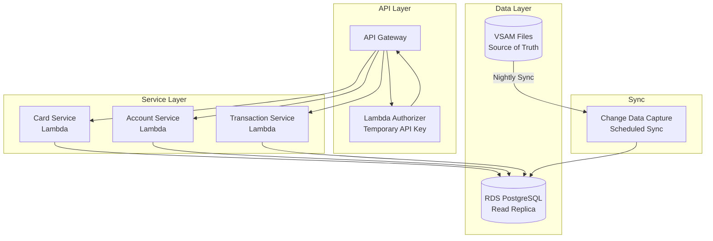

# CardDemo Migration Roadmap

**Document Version:** 1.0
**Generated:** 2026-02-05
**Prompt ID:** RE-010
**Classification:** Internal - Strategy

---

## Table of Contents

1. [Executive Summary](#1-executive-summary)
2. [Migration Strategy](#2-migration-strategy)
3. [Wave 1: Read-Only APIs](#3-wave-1-read-only-apis)
4. [Wave 2: Write Operations](#4-wave-2-write-operations)
5. [Wave 3: Authentication Modernization](#5-wave-3-authentication-modernization)
6. [Wave 4: Batch Modernization](#6-wave-4-batch-modernization)
7. [Data Migration Strategy](#7-data-migration-strategy)
8. [Dependencies and Sequencing](#8-dependencies-and-sequencing)
9. [Risk Mitigation](#9-risk-mitigation)
10. [Success Criteria](#10-success-criteria)
11. [Cross-References](#11-cross-references)

---

## 1. Executive Summary

This document presents a phased migration roadmap for the CardDemo mainframe application. The strategy follows a **Strangler Fig pattern**, progressively replacing mainframe functions with modern cloud-native services while maintaining system availability throughout the transition.

### Migration Overview

| Wave | Focus | Programs | Risk | Value |
|------|-------|----------|------|-------|
| **Wave 1** | Read-Only APIs | 6 programs | Low | High - Quick wins, prove architecture |
| **Wave 2** | Write Operations | 4 programs | Medium | High - Core business value |
| **Wave 3** | Auth Modernization | 5 programs | High | Critical - Security remediation |
| **Wave 4** | Batch Processing | 10 programs | High | Medium - Operational improvement |

### Key Decisions

- **Migration Pattern:** Strangler Fig (incremental replacement)
- **Target Platform:** AWS (API Gateway, Lambda/ECS, RDS PostgreSQL, Cognito)
- **Data Strategy:** Dual-write with eventual VSAM decommission
- **Language Target:** Modern language (Java/TypeScript/Python) per team preference
- **API Style:** REST with OpenAPI 3.0 contracts

---

## 2. Migration Strategy

### 2.1 Strangler Fig Pattern


### 2.2 Guiding Principles

1. **No Big Bang** - Never migrate more than one bounded context at a time
2. **Read Before Write** - Expose read APIs first, then writes
3. **Security First** - Critical security gaps must be closed before API exposure
4. **Data Integrity** - Parallel-run with reconciliation before cutover
5. **Rollback Ready** - Every wave must have a rollback plan
6. **Business Continuity** - Mainframe remains operational until replacement proven

### 2.3 Technology Mapping

| Mainframe Component | Modern Replacement | Notes |
|--------------------|--------------------|-------|
| CICS Transactions | API Gateway + Lambda/ECS | Per-context services |
| VSAM KSDS | RDS PostgreSQL | Schema from DATA-MODEL.md |
| VSAM AIX | PostgreSQL indexes | Native secondary indexes |
| BMS Screens | React/Angular SPA | Separate front-end project |
| COMMAREA | JWT Claims + Request Context | Stateless design |
| COBOL Business Logic | Java/TypeScript/Python | Business rules from BUSINESS-RULES.md |
| JCL Batch | Step Functions + AWS Batch | Event-driven where possible |
| Control-M | EventBridge Scheduler | Native AWS scheduling |
| GDG | S3 versioning | Lifecycle policies for retention |

---

## 3. Wave 1: Read-Only APIs

### 3.1 Scope

Expose read-only data access through RESTful APIs. No data modifications. Lowest risk, highest confidence.

### 3.2 Programs in Scope

| Order | Program | API Endpoint | API Score | Bounded Context |
|-------|---------|--------------|-----------|-----------------|
| 1 | COCRDSLC | `GET /cards/{cardNumber}` | 4.75 | Card Management |
| 2 | COACTVWC | `GET /accounts/{accountId}` | 4.55 | Account Management |
| 3 | COTRN01C | `GET /transactions/{transactionId}` | 4.50 | Transaction Processing |
| 4 | COCRDLIC | `GET /accounts/{accountId}/cards` | 4.00 | Card Management |
| 5 | COTRN00C | `GET /transactions` | 3.75 | Transaction Processing |
| 6 | CORPT00C | `GET /reports/transactions` | 2.25 | Reporting |

### 3.3 Architecture



### 3.4 Data Sync Strategy

During Wave 1, VSAM remains the source of truth. A nightly data sync populates the read-only RDS replica:

1. Run CBEXPORT to extract VSAM data
2. Transform EBCDIC to UTF-8
3. Load into RDS PostgreSQL staging tables
4. Swap staging with production tables (atomic)

### 3.5 Key Deliverables

- [ ] RDS PostgreSQL schema for read tables (Account, Card, Transaction, Customer, CrossRef)
- [ ] Lambda functions for 5 read endpoints
- [ ] API Gateway configuration with rate limiting
- [ ] Temporary API key authentication (replaced in Wave 3)
- [ ] Data sync pipeline (VSAM → S3 → RDS)
- [ ] OpenAPI 3.0 contract documentation
- [ ] Integration test suite
- [ ] Monitoring dashboards (CloudWatch)

### 3.6 Security Considerations

- **PAN Masking:** Card numbers returned as `****-****-****-1234`
- **CVV Exclusion:** Never include CVV in API responses
- **SSN Masking:** Return as `***-**-1234` (last 4 only)
- **Rate Limiting:** 100 requests/minute per API key
- **TLS 1.3:** Required for all API traffic

### 3.7 Rollback Plan

- Disable API Gateway routes
- No mainframe changes required (read-only)
- RDS can be decommissioned independently

---

## 4. Wave 2: Write Operations

### 4.1 Scope

Introduce data modification APIs. Requires dual-write pattern to maintain VSAM consistency during transition.

### 4.2 Programs in Scope

| Order | Program | API Endpoint | API Score | Bounded Context |
|-------|---------|--------------|-----------|-----------------|
| 7 | COBIL00C | `POST /accounts/{accountId}/payments` | 3.75 | Bill Payment |
| 8 | COCRDUPC | `PUT /cards/{cardNumber}` | 3.25 | Card Management |
| 9 | COUSR01C | `POST /admin/users` | 3.20 | User Administration |
| 10 | COUSR02C | `PUT /admin/users/{userId}` | 3.20 | User Administration |

### 4.3 Architecture


### 4.4 Dual-Write Pattern

Write operations update both RDS and VSAM to maintain consistency:

1. **Primary write** to RDS PostgreSQL (within transaction)
2. **Secondary write** to VSAM via mainframe API
3. **Reconciliation** job runs hourly to detect and resolve conflicts
4. **Conflict resolution:** RDS is authoritative (newer write wins)

### 4.5 Bill Payment Implementation

The bill payment (`COBIL00C`) is the highest-value write operation:

**Business Rules to Preserve:**
- BR-V008: Account ID required
- BR-V007: Account must exist
- BR-L002: Balance must be > 0
- BR-C006: Payment = full balance
- BR-C008: Sequential transaction ID generation
- BR-V018: Confirmation required (Y/N)

**Idempotency:**
- Require `Idempotency-Key` header
- Store in DynamoDB with 24-hour TTL
- Return cached response for duplicate requests

### 4.6 Key Deliverables

- [ ] Write endpoints for Bill Payment, Card Update, User CRUD
- [ ] Dual-write proxy with conflict resolution
- [ ] Hourly reconciliation Step Function
- [ ] Idempotency support via DynamoDB
- [ ] Business rule validation (59+ rules from BUSINESS-RULES.md)
- [ ] Integration tests with dual-write verification
- [ ] Rollback procedures documented

### 4.7 Rollback Plan

- Disable write API routes
- Fall back to mainframe-only writes
- Run reconciliation to sync any pending changes to VSAM
- Reconciliation job detects and resolves any conflicts

---

## 5. Wave 3: Authentication Modernization

### 5.1 Scope

Replace the legacy authentication system (COSGN00C + USRSEC) with AWS Cognito. This wave addresses 6 of 10 security findings.

### 5.2 Programs in Scope

| Program | Current Function | Replacement |
|---------|-----------------|-------------|
| COSGN00C | Sign-on (plain-text auth) | Cognito User Pool |
| COUSR00C | User list | Cognito ListUsers API |
| COUSR01C | User add | Cognito AdminCreateUser |
| COUSR02C | User update | Cognito AdminUpdateUserAttributes |
| COUSR03C | User delete | Cognito AdminDeleteUser |

### 5.3 Security Findings Addressed

| Finding | Current | Modernized |
|---------|---------|-----------|
| SEC-001: Plain-text passwords | PIC X(08) in USRSEC | Cognito (bcrypt/SRP) |
| SEC-002: No account lockout | Unlimited attempts | Cognito advanced security |
| SEC-003: User enumeration | Different error messages | Cognito generic responses |
| SEC-004: No session timeout | Indefinite COMMAREA | JWT with 15-min expiry |
| SEC-005: Missing per-program auth | Menu-only check | OAuth 2.0 scopes per API |
| SEC-008: Unsigned COMMAREA | No integrity check | Signed JWT tokens |

### 5.4 OAuth 2.0 Scope Design

| Legacy Role | Legacy Check | OAuth 2.0 Scopes |
|-------------|-------------|-------------------|
| Admin ('A') | CDEMO-USRTYP-ADMIN | `carddemo:admin`, `accounts:read`, `accounts:write`, `cards:read`, `cards:write`, `transactions:read`, `transactions:write`, `users:manage` |
| User ('U') | CDEMO-USRTYP-USER | `accounts:read`, `cards:read`, `transactions:read`, `transactions:write` |

### 5.5 User Migration Strategy

1. Export USRSEC records (10 users: 5 admin, 5 regular)
2. Create Cognito User Pool with password policy (min 12 chars, MFA required)
3. Bulk import users with `FORCE_CHANGE_PASSWORD` status
4. Map SEC-USR-TYPE to Cognito groups (`admin`, `user`)
5. Users set new password on first login

### 5.6 Key Deliverables

- [ ] Cognito User Pool with custom attributes
- [ ] User migration script (USRSEC → Cognito)
- [ ] Lambda Authorizer for API Gateway (replace API key auth from Wave 1)
- [ ] OAuth 2.0 token endpoint (`POST /auth/token`)
- [ ] Scope-based authorization on all existing endpoints
- [ ] MFA enrollment flow
- [ ] Password policy enforcement
- [ ] Session management (refresh token rotation)

### 5.7 Rollback Plan

- Revert API Gateway authorizer to API key authentication
- Mainframe authentication remains operational (COSGN00C unchanged)
- Cognito User Pool can be deleted independently

---

## 6. Wave 4: Batch Modernization

### 6.1 Scope

Replace JCL batch workflows with event-driven and scheduled cloud-native processing.

### 6.2 Programs in Scope

| Program | Current Job | Modernized Architecture |
|---------|------------|------------------------|
| CBTRN02C | POSTTRAN | Kinesis → Lambda (real-time) |
| CBACT04C | INTCALC | EventBridge → Step Functions → AWS Batch |
| CBTRN03C | TRANREPT | S3 Event → Lambda → Athena |
| CBEXPORT | CBEXPORT | Step Functions → Lambda |
| CBIMPORT | CBIMPORT | S3 Event → Lambda → RDS |
| CBACT01C | READACCT | Eliminated (direct RDS query) |
| CBACT02C | READCARD | Eliminated (direct RDS query) |
| CBACT03C | READXREF | Eliminated (direct RDS query) |
| CBCUS01C | READCUST | Eliminated (direct RDS query) |
| CBTRN01C | - | Eliminated (merged into POSTTRAN) |

### 6.3 POSTTRAN Event-Driven Architecture

Replace batch transaction posting with real-time event processing:


**Benefits:**
- Real-time transaction posting (vs. daily batch)
- Automatic scaling
- Built-in retry with dead-letter queue
- No batch window required
- No CICS file contention (CLOSEFIL/OPENFIL eliminated)

### 6.4 INTCALC Scheduled Architecture

Interest calculation remains batch but uses modern orchestration:


### 6.5 GDG → S3 Migration

| GDG Pattern | S3 Equivalent |
|-------------|---------------|
| `TRANSACT.BKUP(0)` | `s3://carddemo/backups/transactions/current/` |
| `TRANSACT.BKUP(+1)` | `s3://carddemo/backups/transactions/YYYY-MM-DD/` |
| `SYSTRAN(0)` | `s3://carddemo/system-transactions/current/` |
| `DALYREJS(+1)` | `s3://carddemo/rejects/YYYY-MM-DD/` |
| Retention (LIMIT 5) | S3 Lifecycle Policy (expire after 5 generations) |

### 6.6 Jobs Eliminated After Full Migration

| Job | Reason for Elimination |
|-----|----------------------|
| CLOSEFIL | No file contention with database |
| OPENFIL | No file contention with database |
| WAITSTEP | No inter-step timing needed |
| TRANBKP | Native database backup/snapshots |
| TRANIDX | Native database indexes |
| COMBTRAN | Real-time posting eliminates merge |
| All VSAM definition jobs (10) | RDS schema managed by migrations |

### 6.7 Key Deliverables

- [ ] Kinesis stream for real-time transaction ingestion
- [ ] Lambda consumer with validation logic (5 rejection codes)
- [ ] Step Functions workflow for interest calculation
- [ ] AWS Batch job for interest computation
- [ ] S3 lifecycle policies for GDG replacement
- [ ] DLQ handling for rejected transactions
- [ ] Monitoring and alerting for all batch replacements
- [ ] Parallel-run validation (batch vs. real-time results)

### 6.8 Rollback Plan

- Revert to JCL batch processing
- Kinesis stream can be paused
- Step Functions executions can be stopped
- Data reconciliation between RDS and VSAM

---

## 7. Data Migration Strategy

### 7.1 Schema Design

Map VSAM files to PostgreSQL tables:

| VSAM File | Table | Records | Key | Notes |
|-----------|-------|---------|-----|-------|
| ACCTDAT | `accounts` | ~100 | `acct_id` | 300→~20 columns |
| CARDDAT | `cards` | ~100 | `card_num` | 150→~7 columns; remove CVV |
| CUSTDAT | `customers` | ~100 | `cust_id` | 500→~20 columns |
| TRANSACT | `transactions` | ~1000 | `tran_id` | 350→~15 columns |
| CCXREF | `card_cross_references` | ~100 | `card_num` | 50→4 columns |
| USRSEC | Cognito | ~10 | `user_id` | Migrated in Wave 3 |
| TCATBALF | `transaction_category_balances` | ~500 | composite | 50→5 columns |
| TRANTYPE | `transaction_types` | ~20 | `type_code` | 60→3 columns |
| TRANCATG | `transaction_categories` | ~50 | composite | 60→3 columns |
| DISCGRP | `disclosure_groups` | ~10 | `group_id` | 50→5 columns |

### 7.2 Data Type Conversions

| COBOL Type | PostgreSQL Type | Transformation |
|------------|----------------|----------------|
| `PIC 9(11)` | `VARCHAR(11)` | Preserve leading zeros |
| `PIC X(16)` (PAN) | `VARCHAR(16)` | Tokenize via AWS Payment Cryptography |
| `PIC S9(10)V99` | `NUMERIC(12,2)` | Convert packed decimal |
| `PIC X(10)` (date) | `DATE` | Parse YYYY-MM-DD |
| `PIC X(26)` (timestamp) | `TIMESTAMP WITH TIME ZONE` | Convert DB2 format |
| `PIC X(01)` (Y/N) | `BOOLEAN` | Map Y→true, N→false |
| `PIC 9(03)` (FICO) | `SMALLINT` | Direct numeric |
| `PIC X(n)` | `VARCHAR(n)` | Trim trailing spaces |

### 7.3 Migration Phases


---

## 8. Dependencies and Sequencing

### 8.1 Wave Dependencies


### 8.2 Critical Path

```
Pre-Requisites → Wave 1 → Wave 3 → Wave 2 → Wave 4 → Decommission
```

Wave 3 (Authentication) must complete before Wave 2 (Write Operations) goes to production, because write APIs require proper authentication and authorization.

### 8.3 Parallel Work Streams

While the critical path is sequential, teams can work in parallel:

| Stream | Wave 1 Period | Wave 2 Period | Wave 3 Period | Wave 4 Period |
|--------|--------------|--------------|--------------|--------------|
| API Team | Build read APIs | Build write APIs | Scope mapping | - |
| Auth Team | - | Design Cognito | Implement Cognito | - |
| Data Team | Sync pipeline | Dual-write proxy | User migration | Event streaming |
| Batch Team | - | - | - | Step Functions |
| QA Team | Read API tests | Write API tests | Auth tests | Batch tests |

---

## 9. Risk Mitigation

### 9.1 Per-Wave Risk Mitigation

| Wave | Key Risk | Mitigation | Contingency |
|------|----------|------------|-------------|
| **Wave 1** | Stale data in read replica | Increase sync frequency; display "last updated" timestamp | Fall back to direct mainframe query |
| **Wave 1** | PAN exposure via API | Mask all card numbers; never return CVV | WAF rules to block suspicious patterns |
| **Wave 2** | Dual-write inconsistency | Hourly reconciliation; RDS authoritative | Revert to mainframe-only writes |
| **Wave 2** | Business rule gaps | Test all 59+ rules from BUSINESS-RULES.md | Maintain COBOL programs as fallback |
| **Wave 3** | User lockout during migration | Gradual rollout; maintain COSGN00C as fallback | Revert to legacy auth |
| **Wave 3** | MFA adoption resistance | Phased MFA rollout; admin-first | Make MFA optional initially |
| **Wave 4** | Event ordering issues | Kinesis partition key on account ID | Fall back to batch processing |
| **Wave 4** | Interest calculation differences | Parallel-run for 3 cycles; compare results | Keep INTCALC as backup |

### 9.2 Data Integrity Safeguards

1. **Reconciliation reports** after every sync/migration step
2. **Checksums** on extracted VSAM data vs. loaded RDS data
3. **Row counts** verification across all tables
4. **Business rule regression** - Run 59+ rules against both datastores
5. **Financial reconciliation** - Balance totals must match to the cent

---

## 10. Success Criteria

### 10.1 Wave Completion Criteria

| Wave | Criterion | Metric |
|------|-----------|--------|
| **Wave 1** | Read APIs operational | 5 endpoints returning correct data; <200ms p95 latency |
| **Wave 1** | Data freshness | Read replica <24 hours stale |
| **Wave 2** | Write APIs operational | Bill payment, card update working end-to-end |
| **Wave 2** | Data consistency | Reconciliation shows 0 conflicts for 30 days |
| **Wave 3** | Auth modernized | All users migrated to Cognito; MFA enabled |
| **Wave 3** | Security findings closed | SEC-001 through SEC-008 resolved |
| **Wave 4** | Batch replaced | Real-time posting operational; interest calc matching |
| **Final** | VSAM decommissioned | All data in RDS; no mainframe dependencies |

### 10.2 Overall Success Metrics

| Metric | Target |
|--------|--------|
| API response time (p95) | < 200ms |
| API availability | 99.9% |
| PCI-DSS compliance | > 90% |
| Data consistency | 100% (zero discrepancies) |
| Business rule coverage | 100% of 59+ rules |
| Security findings open | 0 critical, 0 high |

---

## 11. Cross-References

| Document | Relevance |
|----------|-----------|
| [MODERNIZATION-READINESS.md](./MODERNIZATION-READINESS.md) | Readiness scores driving wave prioritization |
| [API-CANDIDATES.md](./API-CANDIDATES.md) | API scoring used for wave assignments |
| [API-CONTRACTS.md](./API-CONTRACTS.md) | OpenAPI contracts for implementation |
| [SECURITY-MODEL.md](../05-specialized/SECURITY-MODEL.md) | Security findings addressed in Wave 3 |
| [BATCH-WORKFLOWS.md](../05-specialized/BATCH-WORKFLOWS.md) | Batch job dependencies for Wave 4 |
| [DATA-MODEL.md](../02-data-model/DATA-MODEL.md) | VSAM schema for RDS migration |
| [BUSINESS-RULES.md](../01-domain-model/BUSINESS-RULES.md) | Rules requiring test coverage |
| [CONTEXT-MAP.md](../03-context-model/CONTEXT-MAP.md) | Bounded contexts for service decomposition |

---

## Document Control

| Version | Date | Author | Changes |
|---------|------|--------|---------|
| 1.0 | 2026-02-05 | Claude Code | Initial migration roadmap |

---

*This document was generated as part of the RE-010 Modernization Readiness Assessment of the CardDemo mainframe modernization project.*
