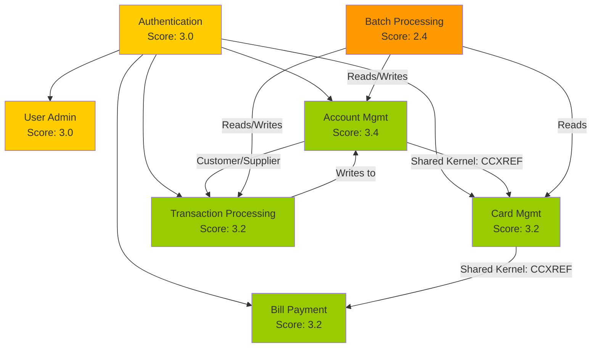

# CardDemo Modernization Readiness Assessment

**Document Version:** 1.0
**Generated:** 2026-02-05
**Prompt ID:** RE-010
**Classification:** Internal - Assessment

---

## Table of Contents

1. [Executive Summary](#1-executive-summary)
2. [Program Complexity Assessment](#2-program-complexity-assessment)
3. [Technical Debt Inventory](#3-technical-debt-inventory)
4. [Bounded Context Readiness](#4-bounded-context-readiness)
5. [Risk Assessment Matrix](#5-risk-assessment-matrix)
6. [Infrastructure Readiness](#6-infrastructure-readiness)
7. [Modernization Scoring Summary](#7-modernization-scoring-summary)
8. [Recommendations](#8-recommendations)
9. [Cross-References](#9-cross-references)

---

## 1. Executive Summary

### Overview

This assessment evaluates the CardDemo mainframe application's readiness for modernization based on code complexity analysis, technical debt inventory, security posture, and architectural patterns. The assessment covers all 29 COBOL programs (19,496 LOC), 29 copybooks (2,748 LOC), 17 BMS screens, and 33 JCL batch jobs.

### Key Findings

| Dimension | Rating | Score | Key Issue |
|-----------|--------|-------|-----------|
| **Code Complexity** | Moderate | 3/5 | Large programs (COACTUPC: 4,236 LOC) but consistent patterns |
| **Technical Debt** | High | 2/5 | 10 security findings (6 critical), PCI-DSS at 15% |
| **Architectural Clarity** | Good | 4/5 | 7 well-defined bounded contexts, clear separation |
| **Data Model** | Good | 4/5 | 6 VSAM clusters with clean key structures |
| **API Readiness** | Good | 4/5 | 15 of 18 programs suitable for API exposure |
| **Batch Modernization** | Moderate | 3/5 | 5 critical workflows with complex dependencies |
| **Overall Readiness** | **Moderate-Good** | **3.3/5** | Ready with phased approach |

### Overall Verdict

CardDemo is a **good candidate for modernization** due to its clear bounded contexts, consistent coding patterns, and well-structured data model. The primary risks are the critical security deficiencies (which must be remediated regardless of modernization) and the complexity of the account update program (COACTUPC at 4,236 LOC). A phased, context-by-context migration approach is recommended.

---

## 2. Program Complexity Assessment

### 2.1 Lines of Code Analysis

**Total Application Size:** 22,244 lines (19,496 COBOL + 2,748 copybooks)

#### Online Programs (19 programs, 15,260 LOC)

| Program | Function | LOC | Complexity | Bounded Context |
|---------|----------|-----|------------|-----------------|
| COACTUPC | Account Update | 4,236 | **Very High** | Account Management |
| COCRDUPC | Card Update | 1,560 | High | Card Management |
| COCRDLIC | Card List | 1,459 | High | Card Management |
| COACTVWC | Account View | 941 | Moderate | Account Management |
| COCRDSLC | Card View | 887 | Moderate | Card Management |
| COTRN02C | Transaction Add | 783 | Moderate | Transaction Processing |
| COTRN00C | Transaction List | 699 | Moderate | Transaction Processing |
| COUSR00C | User List | 695 | Moderate | User Administration |
| CORPT00C | Reports | 649 | Moderate | Batch Processing |
| COBIL00C | Bill Payment | 572 | Moderate | Bill Payment |
| COUSR02C | User Update | 414 | Low | User Administration |
| COUSR03C | User Delete | 359 | Low | User Administration |
| COTRN01C | Transaction View | 330 | Low | Transaction Processing |
| COMEN01C | User Menu | 308 | Low | Navigation |
| COUSR01C | User Add | 299 | Low | User Administration |
| COADM01C | Admin Menu | 288 | Low | Navigation |
| COSGN00C | Sign-On | 260 | Low | Authentication |
| CSUTLDTC | Date Utility | 157 | Low | Shared Utility |
| COBSWAIT | Batch Wait | 41 | Trivial | Batch Processing |

#### Batch Programs (10 programs, 4,236 LOC)

| Program | Function | LOC | Complexity | Job(s) |
|---------|----------|-----|------------|--------|
| CBTRN02C | Transaction Posting | 731 | Moderate | POSTTRAN |
| CBACT04C | Interest Calculation | 652 | Moderate | INTCALC |
| CBTRN03C | Transaction Reporting | 649 | Moderate | TRANREPT |
| CBEXPORT | Multi-File Export | 582 | Moderate | CBEXPORT |
| CBTRN01C | Transaction Processing | 494 | Moderate | - |
| CBIMPORT | Import and Split | 487 | Moderate | CBIMPORT |
| CBACT01C | Account Extract | 430 | Low | READACCT |
| CBACT02C | Card Read | 178 | Low | READCARD |
| CBACT03C | Cross-Ref Read | 178 | Low | READXREF |
| CBCUS01C | Customer Read | 178 | Low | READCUST |

### 2.2 Complexity Distribution

```
LOC Range        Programs   % of Total
───────────────  ─────────  ──────────
> 2000 LOC       1          3.4%    (COACTUPC)
1000-2000 LOC    2          6.9%    (COCRDUPC, COCRDLIC)
500-999 LOC      8          27.6%
200-499 LOC      11         37.9%
< 200 LOC        7          24.1%
```

### 2.3 Complexity Hotspots

| Rank | Program | LOC | Risk Factors |
|------|---------|-----|--------------|
| 1 | **COACTUPC** | 4,236 | Largest program; customer+account+card update; extensive validation; multi-file writes |
| 2 | **COCRDUPC** | 1,560 | Complex card validation (name, status, expiry); multi-field update |
| 3 | **COCRDLIC** | 1,459 | Paginated browse with alternate index; complex cursor management |
| 4 | **COACTVWC** | 941 | 3-file join (Account+Customer+Card); SSN formatting |
| 5 | **CBTRN02C** | 731 | Multi-file batch processing; 5 rejection codes; credit limit validation |

---

## 3. Technical Debt Inventory

### 3.1 Security Debt (Critical)

**Source:** [SECURITY-MODEL.md](../05-specialized/SECURITY-MODEL.md)

| ID | Finding | Severity | CVSS | Remediation Effort |
|----|---------|----------|------|--------------------|
| SEC-001 | Plain-text password storage | CRITICAL | 9.8 | High - Requires auth redesign |
| SEC-002 | No account lockout | CRITICAL | 8.1 | Medium - Add counter field |
| SEC-003 | User enumeration | HIGH | 5.3 | Low - Unify error messages |
| SEC-004 | No session timeout | CRITICAL | 7.5 | Medium - Add timestamp to COMMAREA |
| SEC-005 | Missing per-program auth | CRITICAL | 8.8 | High - Add auth check to each program |
| SEC-006 | Unencrypted PAN/CVV | CRITICAL | 9.1 | High - Tokenization required |
| SEC-007 | No audit logging | CRITICAL | 6.5 | High - Add logging infrastructure |
| SEC-008 | Unsigned COMMAREA | HIGH | 6.8 | Medium - Add integrity check |
| SEC-009 | SSN displayed unmasked | MEDIUM | 4.3 | Low - Mask display output |
| SEC-010 | Batch without security | MEDIUM | 7.8 | Medium - Add RACF security |

**PCI-DSS Compliance:** 15% (1.5 of 20 requirements met)

**Security Debt Score: 1/5 (Critical)**

### 3.2 Architectural Debt

| Issue | Impact | Location | Remediation |
|-------|--------|----------|-------------|
| Menu-only authorization | Users can bypass RBAC via direct transaction invocation | COMEN01C | Add per-program auth checks |
| Monolithic COMMAREA | Single shared session structure couples all programs | COCOM01Y | Decompose per-context |
| No separation of concerns | COBOL programs mix UI, business logic, and data access | All CO* programs | Layer extraction during modernization |
| Hard-coded file names | VSAM file names embedded in programs | All programs | Externalize configuration |
| No error abstraction | Each program implements its own error handling | All programs | Centralized error handling |

**Architectural Debt Score: 3/5 (Moderate)**

### 3.3 Code Quality Debt

| Issue | Programs Affected | Impact |
|-------|-------------------|--------|
| Inconsistent naming | 3 programs | Minor readability impact |
| GO TO usage | COACTUPC, COCRDUPC | Spaghetti flow in complex programs |
| Deep nesting (>5 levels) | COACTUPC | Difficult to trace logic |
| Copy-paste duplication | Validation patterns | Maintenance burden |
| Missing comments | All batch programs | Knowledge transfer risk |
| UNUSED1Y copybook | Unused artifact | Dead code |

**Code Quality Score: 3/5 (Moderate)**

### 3.4 Data Debt

| Issue | Impact | Files Affected |
|-------|--------|----------------|
| CVV stored in plain text | PCI-DSS violation | CARDDAT |
| Full PAN in COMMAREA | Data exposure risk | COCOM01Y |
| SSN without encryption | Privacy violation | CUSTDAT |
| No referential integrity | Orphan records possible | All VSAM files |
| Large FILLER fields | Wasted storage | ACCTDAT (178 bytes), CUSTDAT |

**Data Debt Score: 2/5 (High)**

---

## 4. Bounded Context Readiness

### 4.1 Context-by-Context Assessment

Each bounded context is scored on 5 dimensions (1-5 scale):

| Context | Isolation | Complexity | API Ready | Data Clean | Security | **Overall** |
|---------|-----------|------------|-----------|------------|----------|-------------|
| Authentication | 5 | 2 (Low) | 4 | 3 | 1 | **3.0** |
| User Administration | 4 | 2 (Low) | 3 | 4 | 2 | **3.0** |
| Account Management | 3 | 5 (Very High) | 4 | 3 | 2 | **3.4** |
| Card Management | 4 | 4 (High) | 4 | 2 | 2 | **3.2** |
| Transaction Processing | 4 | 3 (Moderate) | 4 | 3 | 2 | **3.2** |
| Bill Payment | 4 | 3 (Moderate) | 4 | 3 | 2 | **3.2** |
| Batch Processing | 2 | 4 (High) | 2 | 3 | 1 | **2.4** |

### 4.2 Context Dependency Analysis



### 4.3 Recommended Modernization Order

1. **Authentication** (Wave 1) - Foundation; must be modernized first for security
2. **Card Management - Read** (Wave 1) - High API score, simple reads
3. **Account Management - Read** (Wave 1) - High API score, core business
4. **Transaction Processing - Read** (Wave 2) - List/view operations
5. **Bill Payment** (Wave 3) - Highest-value write operation
6. **Card/Account - Write** (Wave 3) - Write operations with validation
7. **User Administration** (Wave 3) - Admin-only, lower priority
8. **Batch Processing** (Wave 4) - Most complex, event-driven migration

---

## 5. Risk Assessment Matrix

### 5.1 Risk Register

| ID | Risk | Probability | Impact | Severity | Mitigation |
|----|------|------------|--------|----------|------------|
| R-001 | COACTUPC complexity causes migration delays | High | High | **Critical** | Decompose into smaller services; dedicate expert resources |
| R-002 | Security gaps exploited during migration | Medium | Critical | **Critical** | Remediate SEC-001, SEC-006 before exposing APIs |
| R-003 | Data integrity loss during VSAM migration | Medium | High | **High** | Parallel-run with reconciliation; phased cutover |
| R-004 | Batch window disruption | Medium | High | **High** | Maintain batch processing until event-driven architecture proven |
| R-005 | Business rule loss in translation | Medium | Medium | **Medium** | 59+ documented business rules provide baseline; comprehensive testing |
| R-006 | COMMAREA session model incompatible with REST | Low | Medium | **Medium** | JWT token design already specified; stateless API design |
| R-007 | Cross-reference integrity during migration | Medium | Medium | **Medium** | Migrate CCXREF as atomic unit with Card and Account data |
| R-008 | Stakeholder resistance | Low | High | **Medium** | Phased approach with quick wins (read-only APIs first) |

### 5.2 Risk Heat Map

```
               Low Impact    Medium Impact   High Impact    Critical Impact
              ┌─────────────┬──────────────┬──────────────┬───────────────┐
High Prob     │             │              │    R-001     │               │
              ├─────────────┼──────────────┼──────────────┼───────────────┤
Medium Prob   │             │ R-005, R-007 │ R-003, R-004 │    R-002      │
              ├─────────────┼──────────────┼──────────────┼───────────────┤
Low Prob      │             │    R-006     │    R-008     │               │
              └─────────────┴──────────────┴──────────────┴───────────────┘
```

---

## 6. Infrastructure Readiness

### 6.1 Current State Assessment

| Dimension | Current State | Gap | Priority |
|-----------|---------------|-----|----------|
| **Compute** | CICS regions, JES batch | Need Lambda/ECS/Batch | High |
| **Data** | VSAM KSDS files | Need RDS/DynamoDB migration | High |
| **Security** | Plain-text, no encryption | Need Cognito, KMS, WAF | Critical |
| **Integration** | COMMAREA, XCTL | Need API Gateway, event bus | High |
| **Monitoring** | JES spool, COND codes | Need CloudWatch, X-Ray | Medium |
| **CI/CD** | Manual FTP deployment | Need CodePipeline/CodeBuild | Medium |

### 6.2 Target Architecture Components

| AWS Service | Replaces | Purpose |
|-------------|----------|---------|
| API Gateway | CICS terminal interface | RESTful API exposure |
| Lambda / ECS | COBOL programs | Business logic execution |
| Cognito | USRSEC VSAM + COSGN00C | Authentication + authorization |
| RDS PostgreSQL | VSAM KSDS files | Relational data storage |
| DynamoDB | COMMAREA | Session state (if needed) |
| Step Functions | JCL workflows | Batch orchestration |
| AWS Batch | Batch COBOL programs | Large-scale batch processing |
| EventBridge | Control-M scheduler | Event-driven scheduling |
| KMS | (none) | Encryption key management |
| CloudWatch | JES spool | Logging and monitoring |

### 6.3 Migration Pattern Assessment

| Pattern | Applicability | Risk | Recommendation |
|---------|---------------|------|----------------|
| **Rehost (Lift & Shift)** | Immediate | Low | Use AWS M2 for initial migration |
| **Replatform** | Short-term | Medium | Convert VSAM to RDS, keep COBOL logic |
| **Refactor** | Medium-term | High | Rewrite in modern language per bounded context |
| **Strangler Fig** | Recommended | Medium | Incrementally replace with APIs |

**Recommended:** Strangler Fig pattern, starting with read-only API exposure via API Gateway fronting the existing mainframe, then progressively replacing backend logic.

---

## 7. Modernization Scoring Summary

### 7.1 Composite Readiness Score

| Category | Weight | Score (1-5) | Weighted |
|----------|--------|-------------|----------|
| Architectural Clarity | 20% | 4.0 | 0.80 |
| Code Complexity | 15% | 3.0 | 0.45 |
| Data Model Quality | 15% | 4.0 | 0.60 |
| API Suitability | 15% | 4.0 | 0.60 |
| Security Posture | 15% | 1.5 | 0.23 |
| Documentation | 10% | 4.5 | 0.45 |
| Business Rule Coverage | 10% | 4.0 | 0.40 |
| **Overall** | **100%** | | **3.53/5** |

### 7.2 Readiness Classification

```
Score Range    Classification        CardDemo Status
──────────────────────────────────────────────────────
4.5 - 5.0      Excellent
4.0 - 4.4      Good
3.5 - 3.9      Moderate-Good         ◄── CardDemo (3.53)
3.0 - 3.4      Moderate
2.0 - 2.9      Challenging
1.0 - 1.9      Not Ready
```

### 7.3 Key Strengths

1. **Clear bounded contexts** (7 well-defined) - natural microservices decomposition
2. **Consistent coding patterns** - 7 documented patterns used across all programs
3. **Well-structured data model** - 6 core VSAM clusters with clean key structures
4. **High API suitability** - 15 of 18 programs suitable for API exposure
5. **Comprehensive documentation** - 33+ documents covering all aspects

### 7.4 Key Weaknesses

1. **Critical security gaps** - 6 critical findings; PCI-DSS at 15%
2. **COACTUPC complexity** - 4,236 LOC monolith handling account+customer+card updates
3. **No test infrastructure** - No unit tests, no automated testing
4. **Tight coupling** - COMMAREA session model couples all online programs
5. **Batch dependencies** - 5 critical workflows with sequential dependencies

---

## 8. Recommendations

### 8.1 Pre-Modernization Actions (Must-Do)

1. **Remediate critical security findings** (SEC-001, SEC-002, SEC-004, SEC-005, SEC-006, SEC-007)
2. **Decompose COACTUPC** into smaller, focused programs (Account Update, Customer Update, Card-Account Linking)
3. **Create test harness** with known inputs/outputs for each program
4. **Document all 59+ business rules** with test cases for regression validation

### 8.2 Phase 1: API Gateway + Strangler Fig

- Deploy API Gateway in front of existing mainframe
- Implement authentication via Cognito (`POST /auth/token`)
- Expose read-only APIs (Account View, Card View, Transaction View)
- 7 high-priority API candidates (score >= 3.75)

### 8.3 Phase 2: Write Operations + Data Migration

- Implement write APIs (Bill Payment, Card Update)
- Begin VSAM-to-RDS migration (start with USRSEC, CARDDAT)
- Establish dual-write pattern for data consistency

### 8.4 Phase 3: Batch Modernization

- Replace POSTTRAN with event-driven processing (Kinesis/Lambda)
- Migrate INTCALC to AWS Batch + Step Functions
- Replace GDG pattern with S3 versioning

### 8.5 Phase 4: Full Decommission

- Remove all CICS transaction programs
- Decommission VSAM files after full data migration
- Archive JCL and batch programs

---

## 9. Cross-References

| Document | Relevance |
|----------|-----------|
| [SECURITY-MODEL.md](../05-specialized/SECURITY-MODEL.md) | Security findings and compliance gaps |
| [API-CANDIDATES.md](./API-CANDIDATES.md) | API scoring and implementation roadmap |
| [API-CONTRACTS.md](./API-CONTRACTS.md) | OpenAPI contract specifications |
| [CONTEXT-MAP.md](../03-context-model/CONTEXT-MAP.md) | Bounded context definitions and relationships |
| [C4-L4-CODE-PATTERNS.md](../04-architecture/C4-L4-CODE-PATTERNS.md) | Recurring code patterns |
| [BATCH-WORKFLOWS.md](../05-specialized/BATCH-WORKFLOWS.md) | Batch job dependencies and flows |
| [DOMAIN-MODEL.md](../01-domain-model/DOMAIN-MODEL.md) | Entity definitions and relationships |
| [BUSINESS-RULES.md](../01-domain-model/BUSINESS-RULES.md) | Complete business rules catalog |
| [MIGRATION-ROADMAP.md](./MIGRATION-ROADMAP.md) | Phased migration plan |

---

## Document Control

| Version | Date | Author | Changes |
|---------|------|--------|---------|
| 1.0 | 2026-02-05 | Claude Code | Initial modernization readiness assessment |

---

*This document was generated as part of the RE-010 Modernization Readiness Assessment of the CardDemo mainframe modernization project.*
