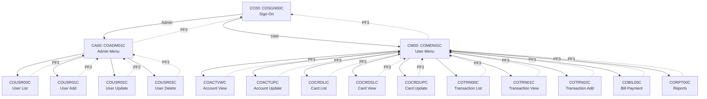

# CardDemo Transaction Inventory

**Document Version:** 1.0
**Generated:** 2026-02-05
**Total CICS Transactions:** 5
**Total Online Programs:** 17
**Total BMS Mapsets:** 17

---

## Summary

| Transaction ID | Programs | Access | Description |
|---------------|----------|--------|-------------|
| CC00 | 1 | All Users | Sign-on authentication |
| CA00 | 5 | Admin Only | Admin menu and user management |
| CM00 | 11 | All Users | Main menu and business functions |
| (Batch) | 10 | JCL Submit | Batch processing programs |
| (Utility) | 2 | System | Shared utilities |

---

## CICS Transaction Definitions

### CC00 - Sign-On Transaction

| Property | Value |
|----------|-------|
| **Transaction ID** | CC00 |
| **Initial Program** | COSGN00C |
| **Access** | All users (entry point) |
| **Function** | Authentication and session establishment |
| **BMS Mapset** | COSGN00 |

**Flow:**
```
Terminal → CC00 → COSGN00C → USRSEC (validate)
    ├── Admin user → XCTL to COADM01C (CA00 context)
    └── Regular user → XCTL to COMEN01C (CM00 context)
```

---

### CA00 - Admin Menu Transaction

| Property | Value |
|----------|-------|
| **Transaction ID** | CA00 |
| **Initial Program** | COADM01C |
| **Access** | Admin users only (SEC-USR-TYPE = 'A') |
| **Function** | Admin menu navigation |
| **BMS Mapset** | COADM01 |

**Menu Options:**

| Option | Function | Target Program | BMS Screen |
|--------|----------|---------------|------------|
| 1 | User List (Security) | COUSR00C | COUSR00 |
| 2 | User Add (Security) | COUSR01C | COUSR01 |
| 3 | User Update (Security) | COUSR02C | COUSR02 |
| 4 | User Delete (Security) | COUSR03C | COUSR03 |
| 5 | Transaction Type List (DB2) | COTRTLIC | - (extension) |
| 6 | Transaction Type Maintenance (DB2) | COTRTUPC | - (extension) |

**Navigation:**
- PF3 → Return to COSGN00C (sign-off)

---

### CM00 - Main Menu Transaction

| Property | Value |
|----------|-------|
| **Transaction ID** | CM00 |
| **Initial Program** | COMEN01C |
| **Access** | All authenticated users |
| **Function** | Main menu navigation to business functions |
| **BMS Mapset** | COMEN01 |

**Menu Options:**

| Option | Function | Target Program | BMS Screen | User Type |
|--------|----------|---------------|------------|-----------|
| 1 | Account View | COACTVWC | COACTVW | U (all) |
| 2 | Account Update | COACTUPC | COACTUP | U (all) |
| 3 | Credit Card List | COCRDLIC | COCRDLI | U (all) |
| 4 | Credit Card View | COCRDSLC | COCRDSL | U (all) |
| 5 | Credit Card Update | COCRDUPC | COCRDUP | U (all) |
| 6 | Transaction List | COTRN00C | COTRN00 | U (all) |
| 7 | Transaction View | COTRN01C | COTRN01 | U (all) |
| 8 | Transaction Add | COTRN02C | COTRN02 | U (all) |
| 9 | Transaction Reports | CORPT00C | CORPT00 | U (all) |
| 10 | Bill Payment | COBIL00C | COBIL00 | U (all) |
| 11 | Pending Auth View | COPAUS0C | - | U (extension) |

**Navigation:**
- PF3 → Return to COSGN00C (sign-off)
- Option selection → XCTL to target program

---

## Transaction-to-Program Mapping

### Complete Program Routing Table

| Transaction | Entry Program | Routed Programs | Total Programs |
|------------|--------------|-----------------|----------------|
| CC00 | COSGN00C | COADM01C, COMEN01C | 3 |
| CA00 | COADM01C | COUSR00C, COUSR01C, COUSR02C, COUSR03C | 5 |
| CM00 | COMEN01C | COACTVWC, COACTUPC, COCRDLIC, COCRDSLC, COCRDUPC, COTRN00C, COTRN01C, COTRN02C, COBIL00C, CORPT00C | 11 |

### Program Navigation Flow



---

## BMS Mapset Inventory

| # | Mapset | Map Name | Program | Category | Approx. Fields |
|---|--------|----------|---------|----------|---------------|
| 1 | COSGN00 | COSGN0A | COSGN00C | Authentication | 35 |
| 2 | COADM01 | COADM1A | COADM01C | Admin Menu | 32 |
| 3 | COMEN01 | COMEN1A | COMEN01C | User Menu | 32 |
| 4 | COACTVW | CACTVWA | COACTVWC | Account View | 95 |
| 5 | COACTUP | CACTUPA | COACTUPC | Account Update | 145 |
| 6 | COCRDLI | CCRDLIA | COCRDLIC | Card List | 72 |
| 7 | COCRDSL | CCRDSLA | COCRDSLC | Card Detail | 39 |
| 8 | COCRDUP | CCRDUPA | COCRDUPC | Card Update | 28 |
| 9 | COTRN00 | COTRN0A | COTRN00C | Transaction List | 151 |
| 10 | COTRN01 | COTRN1A | COTRN01C | Transaction View | 84 |
| 11 | COTRN02 | COTRN2A | COTRN02C | Transaction Add | 88 |
| 12 | COBIL00 | COBIL0A | COBIL00C | Bill Payment | 26 |
| 13 | COUSR00 | COUSR0A | COUSR00C | User List | 174 |
| 14 | COUSR01 | COUSR1A | COUSR01C | User Add | 26 |
| 15 | COUSR02 | COUSR2A | COUSR02C | User Update | 28 |
| 16 | COUSR03 | COUSR3A | COUSR03C | User Delete | 23 |
| 17 | CORPT00 | CORPT0A | CORPT00C | Reports | 56 |

---

## PF Key Assignments

Standard PF key assignments across all online programs:

| PF Key | Function | Scope |
|--------|----------|-------|
| **Enter** | Submit/Confirm | All screens |
| **PF3** | Return/Exit | All screens → previous menu |
| **PF7** | Page Up (Previous) | List screens (COCRDLIC, COTRN00C, COUSR00C) |
| **PF8** | Page Down (Next) | List screens (COCRDLIC, COTRN00C, COUSR00C) |

---

## User Journey Paths

### Journey 1: View Account Balance
```
CC00 (Sign-On) → CM00 (Menu) → Option 1 → COACTVWC (Account View) → PF3 → CM00
```

### Journey 2: Make Bill Payment
```
CC00 → CM00 → Option 10 → COBIL00C (Enter Account) → Confirm (Y) → Payment Success → PF3 → CM00
```

### Journey 3: View Card Details
```
CC00 → CM00 → Option 3 → COCRDLIC (Card List) → Select Card → COCRDSLC (Card View) → PF3 → CM00
```

### Journey 4: Admin - Manage Users
```
CC00 (Admin) → CA00 → Option 1 → COUSR00C (User List) → Select → COUSR02C (Update) → PF3 → CA00
```

### Journey 5: Add Transaction
```
CC00 → CM00 → Option 8 → COTRN02C (Enter Details) → Confirm → Success → PF3 → CM00
```

### Journey 6: View Transaction History
```
CC00 → CM00 → Option 6 → COTRN00C (List) → PF8 (Next Page) → Select → COTRN01C (Detail) → PF3 → CM00
```

---

## CICS Resource Definitions

From CBADMCDJ.jcl (DFHCSDUP definitions):

| Resource Type | Name | Count |
|---------------|------|-------|
| Library | COM2DOLL | 1 |
| Mapsets | COSGN00, COADM01, COMEN01, COACTVW, COACTUP, COCRDLI, COCRDSL, COCRDUP, COTRN00, COTRN01, COTRN02, COBIL00, COUSR00, COUSR01, COUSR02, COUSR03, CORPT00 | 17 |
| Programs | COSGN00C, COADM01C, COMEN01C, COACTVWC, COACTUPC, COCRDLIC, COCRDSLC, COCRDUPC, COTRN00C, COTRN01C, COTRN02C, COBIL00C, COUSR00C, COUSR01C, COUSR02C, COUSR03C | 16 |
| Transactions | CC00, CA00, CM00 | 3 (core) |
| Group | CARDDEMO | 1 |

---

## Cross-References

| Document | Relevance |
|----------|-----------|
| [SCREEN-FLOWS.md](../05-specialized/SCREEN-FLOWS.md) | Detailed screen specifications |
| [NAVIGATION-FLOWS.md](../03-context-model/NAVIGATION-FLOWS.md) | Navigation state machine |
| [CONTEXT-MAP.md](../03-context-model/CONTEXT-MAP.md) | Transaction-to-context mapping |
| [PROGRAM-INVENTORY.md](./PROGRAM-INVENTORY.md) | Complete program catalog |
| [COMMAREA-SPECIFICATION.md](../03-context-model/COMMAREA-SPECIFICATION.md) | Session state structure |

---

*Generated as part of the RE-000 Master Index for the CardDemo reverse engineering project.*
