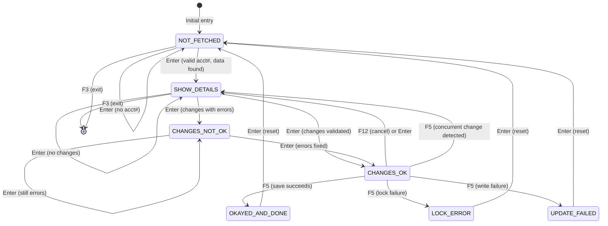
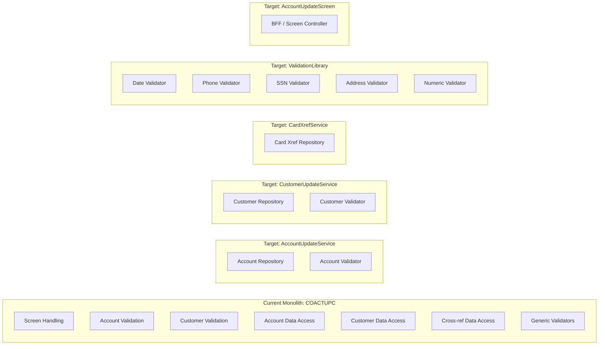

# COACTUPC.cbl Deep-Dive Analysis

**Program**: COACTUPC.cbl (4,236 lines)
**Layer**: Business Logic -- CICS Online
**Function**: Accept and process Account Update
**Transaction ID**: CAUP
**Mapset/Map**: COACTUP / CACTUPA
**Date**: 2026-02-06

---

## Executive Summary

COACTUPC is a monolithic CICS COBOL program that handles both **account** and **customer** record updates through a single BMS screen. At 4,236 lines it is one of the largest programs in the CardDemo application. The program implements a multi-step conversational transaction pattern:

1. Accept an account number from the user
2. Read the account, cross-reference, and customer records from three VSAM files
3. Display all data on a single screen for editing
4. Validate over 30 individual fields with extensive business rules
5. Detect changes by comparing old vs. new values
6. Require explicit confirmation (F5) before writing
7. Perform optimistic locking by re-reading and comparing before REWRITE
8. Write back to both ACCTDAT and CUSTDAT in a single unit of work

The program is a classic "God object" -- it owns the entire lifecycle of account and customer updates, mixes presentation logic with business rules and data access, and maintains complex state through a custom COMMAREA extension (`WS-THIS-PROGCOMMAREA`). This makes it the single highest-priority candidate for decomposition in any modernization effort.

**Key Findings**:
- **3 VSAM files** are accessed: CXACAIX (cross-reference alternate index), ACCTDAT (account master), CUSTDAT (customer master)
- **47 GO TO statements** create non-trivial control flow, though most follow a structured "early exit" pattern within validation paragraphs
- **Over 30 validation rules** are implemented inline with no reusable validation service
- The `SET CDEMO-USRTYP-USER TO TRUE` pattern appears exactly once at line 947, hardcoding the user type during PF3 exit processing
- A potential data integrity bug exists in the optimistic lock comparison for customer DOB at lines 4174-4179, where date offsets appear inconsistent
- The program does NOT perform a SYNCPOINT ROLLBACK if the account REWRITE succeeds but the customer REWRITE fails at the correct layer -- the rollback at line 4100 only covers the customer failure, leaving a window for partial updates if the REWRITE semantics differ from expectations

---

## C1. Control Flow Mapping

### C1.1 Main EVALUATE Dispatch (lines 921-1004)

The program's top-level control is a single EVALUATE TRUE at line 921 with the following branches:

```
EVALUATE TRUE
  WHEN CCARD-AID-PFK03                    -> Exit processing (XCTL)
  WHEN ACUP-DETAILS-NOT-FETCHED           -> Fresh entry (send blank map)
       AND CDEMO-PGM-ENTER
  WHEN CDEMO-FROM-PROGRAM = LIT-MENUPGM   -> Coming from menu (send blank map)
       AND NOT CDEMO-PGM-REENTER
  WHEN ACUP-CHANGES-OKAYED-AND-DONE       -> Post-success reset
  WHEN ACUP-CHANGES-FAILED                -> Post-failure reset
  WHEN OTHER                              -> Main processing path
END-EVALUATE
```

### C1.2 Complete Call Graph (Paragraph-to-Paragraph)

```mermaid
graph TD
    A["0000-MAIN<br/>line 859"] --> B["YYYY-STORE-PFKEY<br/>(COPY CSSTRPFY, line 4199)"]
    A --> C{"EVALUATE TRUE<br/>line 921"}

    C -->|PFK03| D["SYNCPOINT + XCTL<br/>lines 952-959"]
    C -->|Fresh Entry| E["3000-SEND-MAP<br/>line 969"]
    C -->|Post-Success/Fail| F["3000-SEND-MAP<br/>line 985"]
    C -->|WHEN OTHER| G["1000-PROCESS-INPUTS<br/>line 997"]

    G --> H["1100-RECEIVE-MAP<br/>line 1039"]
    G --> I["1200-EDIT-MAP-INPUTS<br/>line 1429"]

    I --> J["1210-EDIT-ACCOUNT<br/>line 1783"]
    I --> K["1205-COMPARE-OLD-NEW<br/>line 1681"]
    I --> L["1220-EDIT-YESNO<br/>line 1856"]
    I --> M["EDIT-DATE-CCYYMMDD<br/>(COPY CSUTLDPY)"]
    I --> N["1250-EDIT-SIGNED-9V2<br/>line 2180"]
    I --> O["1265-EDIT-US-SSN<br/>line 2431"]
    I --> P["EDIT-DATE-OF-BIRTH<br/>(COPY CSUTLDPY)"]
    I --> Q["1245-EDIT-NUM-REQD<br/>line 2109"]
    I --> R["1275-EDIT-FICO-SCORE<br/>line 2514"]
    I --> S["1225-EDIT-ALPHA-REQD<br/>line 1898"]
    I --> T["1235-EDIT-ALPHA-OPT<br/>line 2012"]
    I --> U["1215-EDIT-MANDATORY<br/>line 1824"]
    I --> V["1270-EDIT-US-STATE-CD<br/>line 2493"]
    I --> W["1260-EDIT-US-PHONE-NUM<br/>line 2225"]
    I --> X["1280-EDIT-US-STATE-ZIP-CD<br/>line 2536"]

    O --> Q
    W --> WA["EDIT-AREA-CODE<br/>line 2246"]
    W --> WB["EDIT-US-PHONE-PREFIX<br/>line 2316"]
    W --> WC["EDIT-US-PHONE-LINENUM<br/>line 2370"]

    C -->|WHEN OTHER cont.| Y["2000-DECIDE-ACTION<br/>line 2562"]
    Y --> Z["9000-READ-ACCT<br/>line 3608"]
    Y --> AA["9600-WRITE-PROCESSING<br/>line 3888"]
    Y --> AB["ABEND-ROUTINE<br/>line 4203"]

    Z --> AC["9200-GETCARDXREF-BYACCT<br/>line 3650"]
    Z --> AD["9300-GETACCTDATA-BYACCT<br/>line 3701"]
    Z --> AE["9400-GETCUSTDATA-BYCUST<br/>line 3752"]
    Z --> AF["9500-STORE-FETCHED-DATA<br/>line 3801"]

    AA --> AG["9700-CHECK-CHANGE-IN-REC<br/>line 4109"]

    C -->|WHEN OTHER cont.| AH["3000-SEND-MAP<br/>line 2649"]
    AH --> AI["3100-SCREEN-INIT<br/>line 2668"]
    AH --> AJ["3200-SETUP-SCREEN-VARS<br/>line 2698"]
    AH --> AK["3250-SETUP-INFOMSG<br/>line 2955"]
    AH --> AL["3300-SETUP-SCREEN-ATTRS<br/>line 2986"]
    AH --> AM["3390-SETUP-INFOMSG-ATTRS<br/>line 3566"]
    AH --> AN["3400-SEND-SCREEN<br/>line 3589"]

    AJ --> AO["3201-SHOW-INITIAL-VALUES<br/>line 2731"]
    AJ --> AP["3202-SHOW-ORIGINAL-VALUES<br/>line 2787"]
    AJ --> AQ["3203-SHOW-UPDATED-VALUES<br/>line 2870"]

    AL --> AR["3310-PROTECT-ALL-ATTRS<br/>line 3441"]
    AL --> AS["3320-UNPROTECT-FEW-ATTRS<br/>line 3500"]

    A --> AT["COMMON-RETURN<br/>line 1007"]
```



### C1.3 Complete Paragraph Inventory

| Line | Paragraph Name | Purpose |
|------|---------------|---------|
| 859 | `0000-MAIN` | Entry point; initializes, dispatches |
| 1007 | `COMMON-RETURN` | CICS RETURN with COMMAREA |
| 1021 | `0000-MAIN-EXIT` | Exit label for main |
| 1025 | `1000-PROCESS-INPUTS` | Orchestrates receive + edit |
| 1036 | `1000-PROCESS-INPUTS-EXIT` | Exit |
| 1039 | `1100-RECEIVE-MAP` | CICS RECEIVE MAP; maps BMS fields to working storage |
| 1426 | `1100-RECEIVE-MAP-EXIT` | Exit |
| 1429 | `1200-EDIT-MAP-INPUTS` | Master edit orchestrator (30+ validations) |
| 1678 | `1200-EDIT-MAP-INPUTS-EXIT` | Exit |
| 1681 | `1205-COMPARE-OLD-NEW` | Compares old vs new values for change detection |
| 1777 | `1205-COMPARE-OLD-NEW-EXIT` | Exit |
| 1783 | `1210-EDIT-ACCOUNT` | Account number validation |
| 1820 | `1210-EDIT-ACCOUNT-EXIT` | Exit |
| 1824 | `1215-EDIT-MANDATORY` | Generic mandatory field check |
| 1852 | `1215-EDIT-MANDATORY-EXIT` | Exit |
| 1856 | `1220-EDIT-YESNO` | Generic Y/N field validation |
| 1894 | `1220-EDIT-YESNO-EXIT` | Exit |
| 1898 | `1225-EDIT-ALPHA-REQD` | Required alphabetic field validation |
| 1951 | `1225-EDIT-ALPHA-REQD-EXIT` | Exit |
| 1955 | `1230-EDIT-ALPHANUM-REQD` | Required alphanumeric validation (unused in current flow) |
| 2009 | `1230-EDIT-ALPHANUM-REQD-EXIT` | Exit |
| 2012 | `1235-EDIT-ALPHA-OPT` | Optional alphabetic field validation |
| 2057 | `1235-EDIT-ALPHA-OPT-EXIT` | Exit |
| 2061 | `1240-EDIT-ALPHANUM-OPT` | Optional alphanumeric validation (unused in current flow) |
| 2105 | `1240-EDIT-ALPHANUM-OPT-EXIT` | Exit |
| 2109 | `1245-EDIT-NUM-REQD` | Required numeric field validation |
| 2176 | `1245-EDIT-NUM-REQD-EXIT` | Exit |
| 2180 | `1250-EDIT-SIGNED-9V2` | Signed decimal (currency) validation |
| 2221 | `1250-EDIT-SIGNED-9V2-EXIT` | Exit |
| 2225 | `1260-EDIT-US-PHONE-NUM` | US phone number validation (area+prefix+line) |
| 2246 | `EDIT-AREA-CODE` | Phone area code sub-validation |
| 2316 | `EDIT-US-PHONE-PREFIX` | Phone prefix sub-validation |
| 2370 | `EDIT-US-PHONE-LINENUM` | Phone line number sub-validation |
| 2424 | `EDIT-US-PHONE-EXIT` | Exit for phone validation |
| 2427 | `1260-EDIT-US-PHONE-NUM-EXIT` | Outer exit for phone validation |
| 2431 | `1265-EDIT-US-SSN` | Social Security Number validation (3 parts) |
| 2489 | `1265-EDIT-US-SSN-EXIT` | Exit |
| 2493 | `1270-EDIT-US-STATE-CD` | US state code validation (lookup) |
| 2511 | `1270-EDIT-US-STATE-CD-EXIT` | Exit |
| 2514 | `1275-EDIT-FICO-SCORE` | FICO score range validation (300-850) |
| 2531 | `1275-EDIT-FICO-SCORE-EXIT` | Exit |
| 2536 | `1280-EDIT-US-STATE-ZIP-CD` | State-Zip cross-validation |
| 2558 | `1280-EDIT-US-STATE-ZIP-CD-EXIT` | Exit |
| 2562 | `2000-DECIDE-ACTION` | Post-edit decision EVALUATE |
| 2643 | `2000-DECIDE-ACTION-EXIT` | Exit |
| 2649 | `3000-SEND-MAP` | Master send-map orchestrator |
| 2664 | `3000-SEND-MAP-EXIT` | Exit |
| 2668 | `3100-SCREEN-INIT` | Initialize screen output area |
| 2694 | `3100-SCREEN-INIT-EXIT` | Exit |
| 2698 | `3200-SETUP-SCREEN-VARS` | Setup screen data values |
| 2727 | `3200-SETUP-SCREEN-VARS-EXIT` | Exit |
| 2731 | `3201-SHOW-INITIAL-VALUES` | Blank/initial screen values |
| 2783 | `3201-SHOW-INITIAL-VALUES-EXIT` | Exit |
| 2787 | `3202-SHOW-ORIGINAL-VALUES` | Show fetched (old) values |
| 2867 | `3202-SHOW-ORIGINAL-VALUES-EXIT` | Exit |
| 2870 | `3203-SHOW-UPDATED-VALUES` | Show user-modified values |
| 2951 | `3203-SHOW-UPDATED-VALUES-EXIT` | Exit |
| 2955 | `3250-SETUP-INFOMSG` | Set informational message based on state |
| 2983 | `3250-SETUP-INFOMSG-EXIT` | Exit |
| 2986 | `3300-SETUP-SCREEN-ATTRS` | Set field attributes (protect/unprotect/color/cursor) |
| 3437 | `3300-SETUP-SCREEN-ATTRS-EXIT` | Exit |
| 3441 | `3310-PROTECT-ALL-ATTRS` | Protect all screen fields |
| 3496 | `3310-PROTECT-ALL-ATTRS-EXIT` | Exit |
| 3500 | `3320-UNPROTECT-FEW-ATTRS` | Unprotect editable fields |
| 3562 | `3320-UNPROTECT-FEW-ATTRS-EXIT` | Exit |
| 3566 | `3390-SETUP-INFOMSG-ATTRS` | Set info message display attributes |
| 3584 | `3390-SETUP-INFOMSG-ATTRS-EXIT` | Exit |
| 3589 | `3400-SEND-SCREEN` | EXEC CICS SEND MAP |
| 3603 | `3400-SEND-SCREEN-EXIT` | Exit |
| 3608 | `9000-READ-ACCT` | Master read orchestrator |
| 3647 | `9000-READ-ACCT-EXIT` | Exit |
| 3650 | `9200-GETCARDXREF-BYACCT` | Read CXACAIX by account ID |
| 3698 | `9200-GETCARDXREF-BYACCT-EXIT` | Exit |
| 3701 | `9300-GETACCTDATA-BYACCT` | Read ACCTDAT by account ID |
| 3748 | `9300-GETACCTDATA-BYACCT-EXIT` | Exit |
| 3752 | `9400-GETCUSTDATA-BYCUST` | Read CUSTDAT by customer ID |
| 3797 | `9400-GETCUSTDATA-BYCUST-EXIT` | Exit |
| 3801 | `9500-STORE-FETCHED-DATA` | Copy VSAM records to COMMAREA/old-details |
| 3885 | `9500-STORE-FETCHED-DATA-EXIT` | Exit |
| 3888 | `9600-WRITE-PROCESSING` | Master write orchestrator (lock, check, rewrite) |
| 4105 | `9600-WRITE-PROCESSING-EXIT` | Exit |
| 4109 | `9700-CHECK-CHANGE-IN-REC` | Optimistic concurrency check |
| 4193 | `9700-CHECK-CHANGE-IN-REC-EXIT` | Exit |
| 4199 | `YYYY-STORE-PFKEY` | PF key mapping (COPY CSSTRPFY) |
| 4203 | `ABEND-ROUTINE` | ABEND handler |
| 4226 | `ABEND-ROUTINE-EXIT` | Exit |
| 4232 | (COPY CSUTLDPY) | Date validation routines (EDIT-DATE-CCYYMMDD, EDIT-DATE-OF-BIRTH) |

**Total paragraphs**: 56 (including COPY members)

### C1.4 State Machine

The program operates as a state machine driven by `ACUP-CHANGE-ACTION` (line 654):



State values:
| Value | 88-level Name | Meaning |
|-------|--------------|---------|
| LOW-VALUES/SPACES | `ACUP-DETAILS-NOT-FETCHED` | No account loaded |
| 'S' | `ACUP-SHOW-DETAILS` | Data displayed for editing |
| 'E' | `ACUP-CHANGES-NOT-OK` | Validation errors found |
| 'N' | `ACUP-CHANGES-OK-NOT-CONFIRMED` | Changes valid, awaiting F5 |
| 'C' | `ACUP-CHANGES-OKAYED-AND-DONE` | Save completed |
| 'L' | `ACUP-CHANGES-OKAYED-LOCK-ERROR` | Could not lock record |
| 'F' | `ACUP-CHANGES-OKAYED-BUT-FAILED` | REWRITE failed |

### C1.5 GO TO Analysis

There are **47 GO TO statements** in the program. They fall into three categories:

**Category 1 -- Structured Early Exit (42 occurrences)**
These GO TOs jump to the EXIT paragraph of their enclosing PERFORM range. This is a standard COBOL pattern equivalent to an early `return` in modern languages. Found in paragraphs: 1100, 1200, 1205, 1210, 1215, 1220, 1225, 1230, 1235, 1240, 1245, 1250, 1260, 1270, 1275, 1280, 9000, 9600, 9700.

**Category 2 -- COMMON-RETURN Jumps (3 occurrences, lines 973, 989, 1003)**
These skip directly to `COMMON-RETURN` from the main EVALUATE, bypassing the normal sequential fall-through. They are used for states that do not require the full 1000->2000->3000 processing chain.

**Category 3 -- Intra-paragraph Fall-Through in Phone Validation (2 occurrences, lines 2259/2277/2291/2311 to EDIT-US-PHONE-PREFIX; lines 2330/2348/2362 to EDIT-US-PHONE-LINENUM)**
These create a fall-through chain within the phone number validation where area-code validation failures still allow prefix validation to run. This is the closest to "spaghetti" pattern in the program, as the phone validation paragraphs are not clean PERFORM ranges -- they use GO TO to chain forward through sub-paragraphs.

---

## C2. Business Rule Extraction

### C2.1 Validation Rule Catalog

| # | Line(s) | Field | Rule | Error Message |
|---|---------|-------|------|---------------|
| V01 | 1787-1797 | Account Number | Must not be blank/LOW-VALUES | "Account number not provided" |
| V02 | 1802-1813 | Account Number | Must be numeric, 11 digits, non-zero | "Account Number if supplied must be a 11 digit Non-Zero Number" |
| V03 | 1472-1476 | Account Status | Must be 'Y' or 'N' | "Account Status must be supplied." / "Account Status must be Y or N." |
| V04 | 1478-1482 | Open Date | Must be valid CCYYMMDD date | (from CSUTLDPY copy) |
| V05 | 1484-1488 | Credit Limit | Must be supplied, valid signed decimal | "Credit Limit must be supplied." / "Credit Limit is not valid" |
| V06 | 1490-1494 | Expiry Date | Must be valid CCYYMMDD date | (from CSUTLDPY copy) |
| V07 | 1496-1501 | Cash Credit Limit | Must be supplied, valid signed decimal | "Cash Credit Limit must be supplied." / "Cash Credit Limit is not valid" |
| V08 | 1503-1507 | Reissue Date | Must be valid CCYYMMDD date | (from CSUTLDPY copy) |
| V09 | 1509-1513 | Current Balance | Must be supplied, valid signed decimal | "Current Balance must be supplied." / "Current Balance is not valid" |
| V10 | 1515-1520 | Current Cycle Credit | Must be supplied, valid signed decimal | "Current Cycle Credit Limit must be supplied." |
| V11 | 1522-1527 | Current Cycle Debit | Must be supplied, valid signed decimal | "Current Cycle Debit Limit must be supplied." |
| V12 | 2439-2445 | SSN Part 1 | Must be numeric, 3 digits, non-zero | "SSN: First 3 chars must be supplied." / "must be all numeric." / "must not be zero." |
| V13 | 2447-2463 | SSN Part 1 | Must not be 000, 666, or 900-999 | "SSN: First 3 chars: should not be 000, 666, or between 900 and 999" |
| V14 | 2469-2475 | SSN Part 2 | Must be numeric, 2 digits, non-zero | "SSN 4th & 5th chars must be supplied." |
| V15 | 2481-2487 | SSN Part 3 | Must be numeric, 4 digits, non-zero | "SSN Last 4 chars must be supplied." |
| V16 | 1533-1543 | Date of Birth | Must be valid CCYYMMDD + age check | (from CSUTLDPY copy) |
| V17 | 1545-1556 | FICO Score | Must be numeric, non-zero, range 300-850 | "FICO Score must be all numeric." / "FICO Score: should be between 300 and 850" |
| V18 | 1560-1566 | First Name | Required, alphabetic only | "First Name must be supplied." / "First Name can have alphabets only." |
| V19 | 1568-1574 | Middle Name | Optional, alphabetic only if supplied | "Middle Name can have alphabets only." |
| V20 | 1576-1582 | Last Name | Required, alphabetic only | "Last Name must be supplied." / "Last Name can have alphabets only." |
| V21 | 1584-1590 | Address Line 1 | Mandatory (non-blank) | "Address Line 1 must be supplied." |
| V22 | 1592-1602 | State | Required, alphabetic, valid US state code | "State must be supplied." / "State: is not a valid state code" |
| V23 | 1605-1611 | Zip Code | Required, numeric, non-zero | "Zip must be supplied." / "Zip must be all numeric." |
| V24 | 1615-1621 | City | Required, alphabetic | "City must be supplied." / "City can have alphabets only." |
| V25 | 1623-1630 | Country | Required, alphabetic | "Country must be supplied." / "Country can have alphabets only." |
| V26 | 1632-1638 | Phone 1 | Optional; if supplied: area code must be valid NA code, prefix numeric non-zero, line numeric non-zero | Multiple messages per part |
| V27 | 1640-1646 | Phone 2 | Same rules as Phone 1 | Multiple messages per part |
| V28 | 1648-1655 | EFT Account Id | Required, numeric, non-zero | "EFT Account Id must be supplied." |
| V29 | 1657-1662 | Primary Card Holder | Must be 'Y' or 'N' | "Primary Card Holder must be supplied." / "must be Y or N." |
| V30 | 1664-1669 | State + Zip | Cross-validation: zip prefix must match state | "Invalid zip code for state" |

### C2.2 Error Message Catalog

| Line(s) | 88-level Name | Message Text |
|---------|--------------|--------------|
| 467 | `FOUND-ACCOUNT-DATA` | "Details of selected account shown above" |
| 469 | `PROMPT-FOR-SEARCH-KEYS` | "Enter or update id of account to update" |
| 471 | `PROMPT-FOR-CHANGES` | "Update account details presented above." |
| 473 | `PROMPT-FOR-CONFIRMATION` | "Changes validated.Press F5 to save" |
| 475 | `CONFIRM-UPDATE-SUCCESS` | "Changes committed to database" |
| 477 | `INFORM-FAILURE` | "Changes unsuccessful. Please try again" |
| 482 | `WS-EXIT-MESSAGE` | "PF03 pressed.Exiting" |
| 484 | `WS-PROMPT-FOR-ACCT` | "Account number not provided" |
| 486 | `WS-PROMPT-FOR-LASTNAME` | "Last name not provided" |
| 488 | `WS-NAME-MUST-BE-ALPHA` | "Name can only contain alphabets and spaces" |
| 490 | `NO-SEARCH-CRITERIA-RECEIVED` | "No input received" |
| 492 | `NO-CHANGES-DETECTED` | "No change detected with respect to values fetched." |
| 494 | `SEARCHED-ACCT-ZEROES` | "Account number must be a non zero 11 digit number" |
| 498 | `DID-NOT-FIND-ACCT-IN-CARDXREF` | "Did not find this account in account card xref file" |
| 500 | `DID-NOT-FIND-ACCT-IN-ACCTDAT` | "Did not find this account in account master file" |
| 502 | `DID-NOT-FIND-CUST-IN-CUSTDAT` | "Did not find associated customer in master file" |
| 504 | `ACCT-STATUS-MUST-BE-YES-NO` | "Account Active Status must be Y or N" |
| 506 | `CRED-LIMIT-IS-BLANK` | "Credit Limit must be supplied" |
| 508 | `CRED-LIMIT-IS-NOT-VALID` | "Credit Limit is not valid" |
| 510 | `THIS-MONTH-NOT-VALID` | "Card expiry month must be between 1 and 12" |
| 512 | `THIS-YEAR-NOT-VALID` | "Invalid card expiry year" |
| 518 | `COULD-NOT-LOCK-ACCT-FOR-UPDATE` | "Could not lock account record for update" |
| 520 | `COULD-NOT-LOCK-CUST-FOR-UPDATE` | "Could not lock customer record for update" |
| 522 | `DATA-WAS-CHANGED-BEFORE-UPDATE` | "Record changed by some one else. Please review" |
| 524 | `LOCKED-BUT-UPDATE-FAILED` | "Update of record failed" |

### C2.3 VSAM File Operations

| Line(s) | File | DDName/Path | Operation | Key | Condition | RESP Handling |
|---------|------|------------|-----------|-----|-----------|---------------|
| 3654-3662 | Card Cross-Ref | `CXACAIX` | READ | `WS-CARD-RID-ACCT-ID-X` (11 bytes) | During account lookup | NORMAL, NOTFND, OTHER |
| 3703-3711 | Account Master | `ACCTDAT` | READ | `WS-CARD-RID-ACCT-ID-X` (11 bytes) | During account lookup | NORMAL, NOTFND, OTHER |
| 3753-3761 | Customer Master | `CUSTDAT` | READ | `WS-CARD-RID-CUST-ID-X` (9 bytes) | During account lookup | NORMAL, NOTFND, OTHER |
| 3894-3903 | Account Master | `ACCTDAT` | READ UPDATE (lock) | `WS-CARD-RID-ACCT-ID-X` | Before write | NORMAL vs OTHER |
| 3921-3930 | Customer Master | `CUSTDAT` | READ UPDATE (lock) | `WS-CARD-RID-CUST-ID-X` | Before write | NORMAL vs OTHER |
| 4065-4071 | Account Master | `ACCTDAT` | REWRITE | N/A (locked record) | After validation | NORMAL vs OTHER |
| 4085-4091 | Customer Master | `CUSTDAT` | REWRITE | N/A (locked record) | After validation | NORMAL vs OTHER |

**Read sequence**: CXACAIX -> ACCTDAT -> CUSTDAT (sequential, each depends on prior success)

**Write sequence**: READ UPDATE ACCTDAT -> READ UPDATE CUSTDAT -> Check concurrency -> REWRITE ACCTDAT -> REWRITE CUSTDAT

**Rollback**: Only performed if CUSTDAT REWRITE fails (line 4099-4101). If ACCTDAT REWRITE succeeds but program abends before CUSTDAT REWRITE, no explicit rollback is coded (relies on CICS UOW behavior).

---

## C3. Data Flow Analysis

### C3.1 COMMAREA Field Tracing

The program uses the standard `CARDDEMO-COMMAREA` (160 bytes, COPY COCOM01Y) plus a program-specific extension `WS-THIS-PROGCOMMAREA`.

**CARDDEMO-COMMAREA Fields Read by COACTUPC:**

| Field | Read At | Purpose |
|-------|---------|---------|
| `CDEMO-FROM-TRANID` | 881, 930-931 | Determines calling program for return navigation |
| `CDEMO-FROM-PROGRAM` | 881, 937-938, 966 | Determines calling program |
| `CDEMO-USER-TYPE` | (not directly read) | User type is SET, not checked |
| `CDEMO-PGM-CONTEXT` | 882, 965, 967 | Distinguishes enter vs re-enter |
| `CDEMO-ACCT-ID` | (indirect via CC-ACCT-ID) | Account ID from calling program |
| `CDEMO-LAST-MAPSET` | 3171 | Color setup for coming from card list |

**CARDDEMO-COMMAREA Fields Written by COACTUPC:**

| Field | Written At | Purpose |
|-------|-----------|---------|
| `CDEMO-TO-TRANID` | 932, 934 | Set for XCTL target |
| `CDEMO-TO-PROGRAM` | 939, 941 | Set for XCTL target |
| `CDEMO-FROM-TRANID` | 944 | Set to CAUP before exit |
| `CDEMO-FROM-PROGRAM` | 945 | Set to COACTUPC before exit |
| `CDEMO-USRTYP-USER` | 947 | **Hardcoded to 'U' on PF3 exit** |
| `CDEMO-PGM-CONTEXT` | 948, 971, 984-988 | Enter/re-enter state |
| `CDEMO-LAST-MAPSET` | 949 | Set to COACTUP |
| `CDEMO-LAST-MAP` | 950 | Set to CACTUPA |
| `CDEMO-ACCT-ID` | 1794, 1812, 1815, 2629, 3805 | Account ID for context |
| `CDEMO-CUST-ID` | 3631, 3666, 3806 | Customer ID (from xref) |
| `CDEMO-CUST-FNAME` | 3807 | Customer first name |
| `CDEMO-CUST-MNAME` | 3808 | Customer middle name |
| `CDEMO-CUST-LNAME` | 3809 | Customer last name |
| `CDEMO-ACCT-STATUS` | 2631, 3810 | Account active status |
| `CDEMO-CARD-NUM` | 2630, 3667, 3811 | Card number (from xref) |

### C3.2 `SET CDEMO-USRTYP-USER TO TRUE` Pattern

This statement appears **exactly once** at **line 947**.

**Context**: It is inside the `WHEN CCARD-AID-PFK03` branch of the main EVALUATE (lines 927-959). This branch handles the F3/Exit key press.

**Trigger**: The user presses PF3 to exit the Account Update screen.

**Effect**: Sets `CDEMO-USER-TYPE` to 'U' (User) before XCTLing to the calling program. This is significant because:
1. It overrides whatever user type was set previously
2. An admin user who was performing account updates will be demoted to a regular user context when returning
3. This appears to be a **bug or security concern** -- an admin should retain admin status when returning to the calling program

### C3.3 WS-THIS-PROGCOMMAREA Data Flow

The program-specific COMMAREA (`WS-THIS-PROGCOMMAREA`) is structured as:

```
WS-THIS-PROGCOMMAREA
  ACCT-UPDATE-SCREEN-DATA
    ACUP-CHANGE-ACTION          PIC X(1)     -- State machine flag
  ACUP-OLD-DETAILS
    ACUP-OLD-ACCT-DATA                       -- Snapshot of account at fetch time
    ACUP-OLD-CUST-DATA                       -- Snapshot of customer at fetch time
  ACUP-NEW-DETAILS
    ACUP-NEW-ACCT-DATA                       -- User-modified account values
    ACUP-NEW-CUST-DATA                       -- User-modified customer values
```

**Data flow lifecycle:**
1. **Fetch** (9500-STORE-FETCHED-DATA): VSAM records -> ACUP-OLD-*
2. **Receive** (1100-RECEIVE-MAP): BMS screen input -> ACUP-NEW-*
3. **Compare** (1205-COMPARE-OLD-NEW): ACUP-OLD-* vs ACUP-NEW-*
4. **Validate** (1200-EDIT-MAP-INPUTS): ACUP-NEW-* fields checked
5. **Concurrency Check** (9700-CHECK-CHANGE-IN-REC): Re-read VSAM vs ACUP-OLD-*
6. **Write** (9600-WRITE-PROCESSING): ACUP-NEW-* -> ACCT-UPDATE-RECORD / CUST-UPDATE-RECORD -> VSAM REWRITE

---

## C4. Decomposition Recommendations

### C4.1 Proposed Bounded Contexts



### C4.2 Natural Seams

**Seam 1: Account Data vs Customer Data (Strongest seam)**

The program already maintains separate data structures for account and customer data (`ACUP-OLD-ACCT-DATA` vs `ACUP-OLD-CUST-DATA`, lines 670 vs 709). The VSAM files are separate. The validation rules are distinct. The only coupling is:
- The CXACAIX cross-reference lookup that provides the customer ID for a given account
- The single-screen presentation that shows both together
- The single UOW that writes both atomically

**Recommendation**: Split into `AccountUpdateService` and `CustomerUpdateService` with the cross-reference lookup as a separate query service. Use a saga or two-phase commit for the atomic update requirement.

**Seam 2: Validation Logic vs Business Logic**

Paragraphs 1210 through 1280 (lines 1783-2560) are pure validation logic with no VSAM access. They could be extracted into a reusable validation library. The generic validators (1215, 1220, 1225, 1230, 1235, 1240, 1245, 1250) are already parameterized via `WS-EDIT-VARIABLE-NAME` and `WS-EDIT-ALPHANUM-ONLY`.

**Seam 3: Data Access vs Presentation**

The 9000-series paragraphs (VSAM operations) are cleanly separated from the 3000-series paragraphs (screen handling). This is a natural repository/controller split.

**Seam 4: Phone/SSN/Address Validation as Domain Services**

Phone validation (1260), SSN validation (1265), State code validation (1270), FICO validation (1275), and State-Zip cross-validation (1280) are all US-specific domain rules that could be extracted as shared services used by multiple programs.

### C4.3 Shared State Dependencies

| Dependency | Current Coupling | Resolution Strategy |
|------------|-----------------|---------------------|
| `ACUP-CHANGE-ACTION` state flag | Drives entire program flow | Replace with explicit workflow/state machine in controller |
| `ACUP-OLD-DETAILS` / `ACUP-NEW-DETAILS` | Shared between all paragraphs | Pass as parameters to services; or use DTO pattern |
| `WS-RETURN-MSG` | Written by all validators, read by screen handler | Return validation result objects from each validator |
| `INPUT-ERROR` / `INPUT-OK` flags | Global mutable state set by validators | Replace with validation result aggregation |
| `WS-EDIT-VARIABLE-NAME` | Shared context for generic error messages | Pass as parameter to validator functions |
| `WS-RESP-CD` / `WS-REAS-CD` | Shared across all CICS file operations | Encapsulate in each repository |
| `CC-ACCT-ID` / `CDEMO-CUST-ID` | Cross-reference between files | Make explicit through service API contracts |
| `CARDDEMO-COMMAREA` | Inter-program communication area | Replace with API request/response or session state |

### C4.4 Recommended Decomposition

**Phase 1 -- Extract Validation Library**
- Move paragraphs 1215-1280 to a shared COBOL module or modern validation service
- Approximately 780 lines of reusable code
- No VSAM dependencies
- No CICS dependencies (pure data validation)

**Phase 2 -- Extract Data Access Layer**
- Move paragraphs 9200, 9300, 9400, 9500, 9600, 9700 to separate service(s)
- Approximately 580 lines
- Contains all VSAM I/O
- Encapsulates optimistic locking pattern

**Phase 3 -- Split Account vs Customer**
- Separate the validation rules, data access, and update logic for Account and Customer
- Each becomes an independent microservice or module
- The cross-reference (CXACAIX) becomes a lookup service

**Phase 4 -- Modernize Screen Controller**
- The remaining 3000-series paragraphs (approx 900 lines) become a thin controller
- The 0000-MAIN EVALUATE becomes a REST endpoint dispatcher or event handler

---

## C5. Edge Case Catalog

### C5.1 WHEN OTHER / Default Branches

| Line | EVALUATE Context | WHEN OTHER Action |
|------|-----------------|-------------------|
| 996 | Main dispatch (0000-MAIN) | Falls through to 1000->2000->3000 processing chain. This is the primary processing path, not an error handler. |
| 2613 | Write result evaluation | Sets `ACUP-CHANGES-OKAYED-AND-DONE`. This is the **success** case, poorly placed as WHEN OTHER. |
| 2633 | 2000-DECIDE-ACTION | **ABENDs with code '9999'** and message "UNEXPECTED DATA SCENARIO". This is a defensive catch-all for states the programmer did not anticipate. |
| 2721 | 3200-SETUP-SCREEN-VARS | Calls `3202-SHOW-ORIGINAL-VALUES`. Fallback to showing original data. |
| 3004 | 3300-SETUP-SCREEN-ATTRS | Sets account ID field to DFHBMFSE (editable). Generic fallback. |
| 3165 | Cursor positioning | Positions cursor on account ID field. Generic fallback. |
| 3686 | CXACAIX READ response | Sets generic file error message. Catches all non-NORMAL/non-NOTFND responses. |
| 3736 | ACCTDAT READ response | Sets generic file error message. Same pattern. |
| 3785 | CUSTDAT READ response | Sets generic file error message. Same pattern. |

### C5.2 Error Handling Gaps

**Gap 1: Missing RESP check on RECEIVE MAP (line 1040-1045)**
The program issues `EXEC CICS RECEIVE MAP ... RESP(WS-RESP-CD)` but **never checks** `WS-RESP-CD` after the receive. If the RECEIVE fails (e.g., MAPFAIL), the program continues processing with whatever data happens to be in the input area.

**Gap 2: Missing RESP check on SEND MAP (line 3594-3601)**
Similarly, the SEND MAP captures RESP but does not check it. A failed send would silently return to the user with no screen update.

**Gap 3: Partial update risk (lines 4065-4103)**
The account REWRITE and customer REWRITE are **not wrapped in an explicit SYNCPOINT**. If the account REWRITE succeeds (line 4076) but the customer REWRITE fails, the code performs a SYNCPOINT ROLLBACK (line 4100). However, the success of the rollback itself is not checked (no RESP on the SYNCPOINT ROLLBACK). Additionally, if an abend occurs between the two REWRITEs (after line 4081, before line 4085), the account update would be committed (depending on CICS recovery settings) while the customer update would not.

**Gap 4: No validation on Account Group field**
The Account Group field (`AADDGRPI`/`ACUP-NEW-GROUP-ID`, line 1211-1218) is received from the screen and written to the file with **no validation whatsoever**. It is not checked for valid format, length, or existence.

**Gap 5: No validation on Address Line 2**
Address Line 2 (`ACSADL2I`) is received and stored but has **no edit rules** (comment at line 3369: "Address Line 2 (NO EDITS CODED AS YET)").

**Gap 6: No validation on Government Issued ID**
The government ID field (`ACSGOVTI`) is received and stored with no format or content validation.

**Gap 7: Country field is protected but validated**
At line 3547, the country field is explicitly PROTECTED (`MOVE DFHBMPRF TO ACSCTRYA`), meaning the user cannot change it. Yet the validation at lines 1623-1630 validates it as if it were editable. If the country value is corrupted in the COMMAREA, the user would see a validation error they cannot fix.

### C5.3 Implicit Assumptions

**Assumption 1: Date format is YYYY-MM-DD**
Dates from VSAM are assumed to be in `YYYY-MM-DD` format (10 characters with dashes at positions 5 and 8). The program extracts years at position 1:4, months at 6:2, and days at 9:2. If a file contains dates in a different format, the extraction would silently produce garbage.

**Assumption 2: Phone number format is (999)999-9999**
The VSAM phone number field is X(15) with format `(AAA)BBB-CCCC`. The program extracts area code at position 2:3, prefix at 6:3, and line at 10:4. This format is hardcoded and cannot handle international numbers.

**Assumption 3: Single card per account**
The CXACAIX READ (line 3654) reads a single cross-reference record. If an account has multiple cards, only the first one found by the alternate index is used. There is no browse/iteration.

**Assumption 4: FICO scores are always 3 digits**
FICO score is defined as PIC 9(03) with range 300-850. Scores below 300 (which do not exist in practice but could exist in test data) would be rejected. The field is validated as exactly 3 numeric characters; a value like "99" would fail the numeric-required check even if it represents a valid (though unrealistic) score.

**Assumption 5: Case-insensitive comparison for change detection**
The comparison at lines 1684-1773 uses `FUNCTION UPPER-CASE` and `FUNCTION TRIM` for many fields. This means a change from "Smith" to "SMITH" would **not** be detected as a change. This is intentional for names and addresses but means case-only changes are silently dropped.

**Assumption 6: Optimistic lock DOB comparison bug**
At lines 4174-4179, the DOB comparison compares:
```
CUST-DOB-YYYY-MM-DD (6:2) = ACUP-OLD-CUST-DOB-YYYY-MM-DD (5:2)
CUST-DOB-YYYY-MM-DD (9:2) = ACUP-OLD-CUST-DOB-YYYY-MM-DD (7:2)
```
The old DOB is stored as 8 characters (CCYYMMDD without dashes) while the VSAM record has 10 characters (CCYY-MM-DD with dashes). The offsets `(5:2)` and `(7:2)` into the 8-character old field would extract months and days correctly (positions 5-6 and 7-8 of CCYYMMDD), but the VSAM field uses `(6:2)` and `(9:2)` which skip the dashes. This comparison appears correct but is fragile and easy to break if the old-detail storage format changes.

### C5.4 Numeric Overflow Handling

**Currency fields** (`ACUP-NEW-CREDIT-LIMIT-N`, `ACUP-NEW-CURR-BAL-N`, etc.) are defined as `PIC S9(10)V99` -- signed 10 integer digits with 2 decimal places. The maximum value is 9,999,999,999.99. The input is parsed via `FUNCTION NUMVAL-C` which converts currency-formatted strings. If the user enters a value exceeding the PIC capacity, COBOL would truncate the high-order digits without warning.

The `FUNCTION TEST-NUMVAL-C` check at lines 1078, 1092, 1106, 1120, 1134 validates format but **not range**. A value like "99,999,999,999.99" would pass format validation but overflow on conversion.

### C5.5 GO TO Spaghetti in Phone Validation

The phone validation structure at lines 2225-2427 uses an unusual pattern:

```
1260-EDIT-US-PHONE-NUM
  -> [check all blank -> GO TO EDIT-US-PHONE-EXIT]
  .
EDIT-AREA-CODE
  -> [area code validation with multiple GO TO EDIT-US-PHONE-PREFIX on failure]
  .
EDIT-US-PHONE-PREFIX
  -> [prefix validation with multiple GO TO EDIT-US-PHONE-LINENUM on failure]
  .
EDIT-US-PHONE-LINENUM
  -> [line validation with multiple GO TO EDIT-US-PHONE-EXIT on failure]
  .
EDIT-US-PHONE-EXIT
  .
1260-EDIT-US-PHONE-NUM-EXIT
  .
```

This creates a forward-only fall-through chain where each section validates its part and then falls through to the next. Failures in one part do not prevent validation of subsequent parts (all three parts are always checked). The two EXIT paragraphs (`EDIT-US-PHONE-EXIT` and `1260-EDIT-US-PHONE-NUM-EXIT`) at lines 2424-2428 are redundant -- the first is a target for GO TOs and the second is a PERFORM range boundary.

---

## Appendix A: Copybook Dependencies

| Copybook | Line | Purpose |
|----------|------|---------|
| `CSUTLDWY` | 166 | Date edit working storage variables |
| `CVCRD01Y` | 597 | Card-related working storage (CC-ACCT-ID, CCARD-AID-*, CCARD-ERROR-MSG) |
| `CSLKPCDY` | 602 | North America phone area code lookup table |
| `DFHBMSCA` | 615 | IBM BMS field attribute constants |
| `DFHAID` | 616 | IBM AID byte definitions (DFHENTER, DFHPF3, etc.) |
| `COTTL01Y` | 620 | Screen titles (CCDA-TITLE01, CCDA-TITLE02) |
| `COACTUP` | 623 | BMS map copybook (CACTUPAI/CACTUPAO) |
| `CSDAT01Y` | 626 | Current date working storage |
| `CSMSG01Y` | 629 | Common messages |
| `CSMSG02Y` | 632 | Abend variables (ABEND-DATA, ABEND-CULPRIT, etc.) |
| `CSUSR01Y` | 635 | Signed-on user data |
| `CVACT01Y` | 640 | Account record layout (ACCOUNT-RECORD) |
| `CVACT03Y` | 643 | Card cross-reference layout (CARD-XREF-RECORD) |
| `CVCUS01Y` | 646 | Customer record layout (CUSTOMER-RECORD) |
| `COCOM01Y` | 650 | Application COMMAREA (CARDDEMO-COMMAREA) |
| `CSSETATY` | 3208+ | Screen attribute setup macro (used 37 times with REPLACING) |
| `CSSTRPFY` | 4199 | PF key storage routine |
| `CSUTLDPY` | 4232 | Date validation procedures (EDIT-DATE-CCYYMMDD, EDIT-DATE-OF-BIRTH) |

## Appendix B: Valid PF Keys

| Key | When Valid | Action |
|-----|-----------|--------|
| ENTER | Always | Process current state |
| PF3 | Always | Exit to calling program |
| PF5 | Only when `ACUP-CHANGES-OK-NOT-CONFIRMED` | Confirm and save changes |
| PF12 | Only when `NOT ACUP-DETAILS-NOT-FETCHED` | Cancel changes, reload data |

All other AID bytes are remapped to ENTER at line 915.

## Appendix C: Line Count by Functional Area

| Area | Lines (approx) | Percentage |
|------|----------------|-----------|
| Working Storage / Data Definitions | 1-857 | 20% |
| Main Control Flow (0000-MAIN, COMMON-RETURN) | 858-1023 | 4% |
| Input Processing (1000-1100) | 1025-1428 | 10% |
| Validation Logic (1200-1280) | 1429-2560 | 27% |
| Decision Logic (2000) | 2562-2645 | 2% |
| Screen Handling (3000-3400) | 2649-3605 | 23% |
| Data Access (9000-9700) | 3608-4195 | 14% |
| Utilities / Abend / Copies | 4196-4236 | 1% |

**Observation**: Validation logic alone accounts for 27% of the program. Screen attribute management (inside 3300) is another major contributor due to the 37 COPY CSSETATY macro invocations. These two areas are the primary candidates for extraction.
