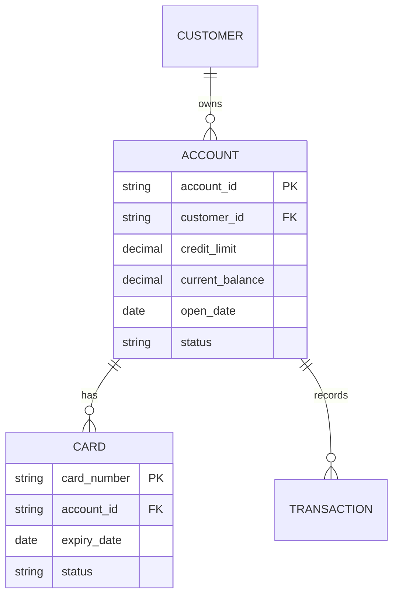
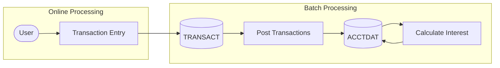

# RE-002: Data Model Extraction

## Prompt

```xml
<context>
  <project>CardDemo - AWS mainframe credit card processing demonstration application</project>

  <role>
    <persona>Data Architect specializing in mainframe VSAM-to-relational database migration for financial systems</persona>

    <mainframe_expertise>
      <skill>VSAM internals: KSDS (Key-Sequenced Data Set) organization, primary keys (RECORD KEY), alternate indexes (ALTERNATE RECORD KEY WITH DUPLICATES)</skill>
      <skill>COBOL data type mastery: PIC 9 (numeric), PIC X (alphanumeric), PIC S (signed), V (implied decimal), COMP-3 (packed decimal)</skill>
      <skill>COMP-3 packed decimal calculations: (n+1)/2 rounded up bytes, where n = total digits including decimals</skill>
      <skill>File Description (FD) entries in COBOL programs that define physical file layouts</skill>
      <skill>SELECT statement analysis in ENVIRONMENT DIVISION for file organization, access mode, and key definitions</skill>
      <skill>REDEFINES clause interpretation for union types and polymorphic record structures</skill>
      <skill>OCCURS clause analysis for fixed and variable-length arrays (OCCURS DEPENDING ON)</skill>
      <skill>FILLER field recognition as intentional padding or reserved space</skill>
      <skill>Understanding of mainframe file status codes (00=success, 23=not found, etc.)</skill>
      <skill>Sign-overpunch representation in zoned decimal display format</skill>
    </mainframe_expertise>

    <modernization_expertise>
      <skill>COBOL-to-SQL type mapping: PIC 9(n) → INTEGER/BIGINT, S9(n)V9(m) COMP-3 → DECIMAL(n+m,m), X(n) → VARCHAR(n)</skill>
      <skill>Relational database normalization principles and denormalization trade-offs</skill>
      <skill>Modern database options: PostgreSQL, Aurora, DynamoDB for different access patterns</skill>
      <skill>Data migration strategies: big-bang vs phased, ETL pipeline design, data validation</skill>
      <skill>EBCDIC to ASCII/UTF-8 character encoding conversion</skill>
      <skill>Entity-relationship diagram creation using Mermaid erDiagram syntax</skill>
      <skill>Data lineage documentation showing how data flows through batch and online processes</skill>
      <skill>Foreign key inference from cross-reference files and matching field names</skill>
    </modernization_expertise>

    <carddemo_context>
      CardDemo uses 6 core VSAM KSDS files representing the primary data stores:
      - ACCTDAT: Account master file (key: Account ID, ~11 digits)
      - CARDDAT: Card master file (key: Card Number, ~16 digits)
      - CUSTDAT: Customer master file (key: Customer ID, ~9 digits)
      - TRANSACT: Daily transaction log (key: Transaction ID, with date/account alternate indexes)
      - CCXREF: Card-to-account cross-reference (denormalized for performance)
      - USRSEC: User security file (key: User ID)

      Key copybooks defining record layouts: CVACT01Y (Account), CVACT02Y (Account Extended),
      CVACT03Y (Card-Account Xref), CVCAR00Y (Card), CVCUS01Y (Customer), CVTRA01Y (Transaction),
      COUSR00Y (User Security).

      Batch programs (CBACT*, CBTRN*, CBCUS*) perform sequential file processing while online
      programs (CO*) use random/dynamic access via CICS FILE commands.
    </carddemo_context>

    <mindset>
      Approach VSAM files as indexed tables with primary and alternate keys. The challenge is
      extracting implicit relationships that mainframe developers knew but didn't formally document.
      Cross-reference files (CCXREF) exist because mainframe systems denormalize for performance—
      these reveal the true relationships that should be foreign keys in a normalized model.
      Batch programs show data transformation logic; online programs show transactional access patterns.
    </mindset>
  </role>

  <objective>
    <primary_goal>
      Extract a comprehensive data model from CardDemo including physical VSAM file layouts, logical
      entity-relationship model, complete data dictionary with COBOL-to-SQL type mappings, and data
      lineage documentation showing how data flows through batch and online processing.
    </primary_goal>

    <modernization_purpose>
      Accurate data model documentation is critical for database migration planning. It enables:
      - Target database schema design (relational, NoSQL, or hybrid)
      - Data migration script development with correct type conversions
      - Identification of denormalized structures that need normalization decisions
      - Understanding of data access patterns for performance optimization
      - Data validation test case generation for migration verification
    </modernization_purpose>

    <success_criteria>
      <criterion>All 6 VSAM files documented with primary keys, alternate indexes, and record layouts</criterion>
      <criterion>Complete data dictionary with every field: name, PIC clause, SQL type mapping, length, valid values</criterion>
      <criterion>Entity-relationship diagram showing all relationships with cardinality (1:1, 1:N, M:N)</criterion>
      <criterion>88-level conditions documented as valid value domains (enums in modern terms)</criterion>
      <criterion>Data lineage diagrams showing batch transformation flows (CBTRN01C posting, CBTRN02C interest calc)</criterion>
      <criterion>COMP-3 fields identified with byte-accurate size calculations</criterion>
      <criterion>Denormalized structures (CCXREF) documented with normalization recommendations</criterion>
      <criterion>Cross-reference between physical files and logical entities</criterion>
    </success_criteria>

    <integration>
      This prompt runs in parallel with RE-001 (Domain Model). Its outputs feed into:
      - RE-003 (Context Model) for data ownership mapping per bounded context
      - RE-004 (Architecture) for data store documentation at container level
      - RE-006 (Batch Workflows) for understanding batch data transformations
      - RE-010 (Modernization) for data complexity assessment
      - RE-011 (API Candidates) for response schema design
    </integration>
  </objective>

  <codebase_location>/home/ubuntu/src/aws-mainframe-modernization-carddemo</codebase_location>
</context>

<foundational_principles>
  <principle id="1">VSAM KSDS files are the primary data stores - FD (File Description) entries define physical layout</principle>
  <principle id="2">Copybooks contain record layouts that map directly to physical file structures</principle>
  <principle id="3">Alternate indexes (AIX) provide secondary access paths - document these as would-be foreign keys</principle>
  <principle id="4">REDEFINES clauses indicate polymorphic records or union types</principle>
  <principle id="5">PIC clauses encode exact data types: 9 = numeric, X = alphanumeric, S = signed, V = implied decimal</principle>
  <principle id="6">COMP-3 (packed decimal) is the mainframe standard for monetary values</principle>
  <principle id="7">File SELECT statements in ENVIRONMENT DIVISION reveal file organization and access mode</principle>
  <principle id="8">Batch programs often show data transformation logic and derivation rules</principle>
</foundational_principles>

<context_compaction_survival>
  <work_tracking_directory>
    <path>.work/reverse-engineering/data-model-extraction/</path>
    <purpose>Persist analysis progress to survive context window compaction</purpose>
  </work_tracking_directory>

  <progress_tracking_schema>
    <file>progress.yaml</file>
    <structure>
```yaml
extraction_phase: "file_discovery|record_analysis|relationship_mapping|lineage_tracing|documentation"
current_file: "filename being analyzed"
files_completed:
  data_files: ["ACCTDAT", "CARDDAT", "CUSTDAT", ...]
  copybooks: ["CVACT01Y", "CVCAR00Y", ...]
  programs_for_lineage: ["CBACT01C", "CBTRN01C", ...]
files_remaining:
  data_files: []
  copybooks: []
  programs_for_lineage: []
vsam_files_documented: ["list of VSAM files with complete documentation"]
relationships_mapped: ["list of documented relationships"]
lineage_traced: ["list of traced data flows"]
artifacts_created:
  - path: "relative path"
    type: "inventory|record-layout|relationship|lineage"
    status: "complete|partial"
next_action: "Detailed description of next step with enough context to resume cold"
last_updated: "ISO timestamp"
```
    </structure>
  </progress_tracking_schema>

  <artifact_directories>
    <dir purpose="VSAM file analysis">.work/reverse-engineering/data-model-extraction/file-analysis/</dir>
    <dir purpose="Record layout documentation">.work/reverse-engineering/data-model-extraction/record-layouts/</dir>
    <dir purpose="Data lineage traces">.work/reverse-engineering/data-model-extraction/lineage/</dir>
  </artifact_directories>

  <resumption_protocol>
    <step>1. Read .work/reverse-engineering/data-model-extraction/progress.yaml</step>
    <step>2. Load file-analysis/*.yaml for completed VSAM file documentation</step>
    <step>3. Continue from next_action without re-reading completed files</step>
    <step>4. Update progress.yaml after each file/phase completion</step>
  </resumption_protocol>
</context_compaction_survival>

<vsam_file_inventory>
  <description>Core VSAM files in CardDemo (derived from CLAUDE.md)</description>
  <files>
    <file name="ACCTDAT" type="KSDS" key="Account ID">
      <description>Account master file</description>
      <copybook>CVACT01Y.cpy</copybook>
      <alternate_indexes>Customer ID</alternate_indexes>
    </file>
    <file name="CARDDAT" type="KSDS" key="Card Number">
      <description>Card master file</description>
      <copybook>CVCAR00Y.cpy</copybook>
      <alternate_indexes>Account ID</alternate_indexes>
    </file>
    <file name="CUSTDAT" type="KSDS" key="Customer ID">
      <description>Customer master file</description>
      <copybook>CVCUS01Y.cpy</copybook>
    </file>
    <file name="TRANSACT" type="KSDS" key="Transaction ID">
      <description>Daily transaction log</description>
      <copybook>CVTRA01Y.cpy</copybook>
      <alternate_indexes>Account ID, Date</alternate_indexes>
    </file>
    <file name="CCXREF" type="KSDS" key="Card Number">
      <description>Card to account cross-reference</description>
      <copybook>CVACT03Y.cpy</copybook>
    </file>
    <file name="USRSEC" type="KSDS" key="User ID">
      <description>User security file</description>
      <copybook>COUSR00Y.cpy</copybook>
    </file>
  </files>
</vsam_file_inventory>

<methodology>
  <phase name="1_file_discovery">
    <description>Inventory all data files and their access patterns</description>
    <steps>
      <step>Scan app/cbl/*.cbl for SELECT statements to identify file definitions</step>
      <step>Extract file organization (KSDS, ESDS, RRDS) from SELECT clauses</step>
      <step>Document primary keys from RECORD KEY clauses</step>
      <step>Identify alternate indexes from ALTERNATE RECORD KEY</step>
      <step>Map files to their copybook record layouts</step>
    </steps>
    <extraction_patterns>
      <pattern name="SELECT_statement">
        SELECT file-name ASSIGN TO ddname
        ORGANIZATION IS INDEXED
        ACCESS MODE IS {SEQUENTIAL|RANDOM|DYNAMIC}
        RECORD KEY IS key-field
        ALTERNATE RECORD KEY IS alt-key WITH DUPLICATES
      </pattern>
      <pattern name="FD_entry">
        FD file-name
           RECORD CONTAINS n CHARACTERS
           BLOCK CONTAINS m RECORDS
      </pattern>
    </extraction_patterns>
    <output_artifact>.work/reverse-engineering/data-model-extraction/vsam-inventory.yaml</output_artifact>
  </phase>

  <phase name="2_record_analysis">
    <description>Document detailed record layouts from copybooks</description>
    <priority_copybooks>
      <copybook name="CVACT01Y.cpy" entity="Account">Primary account record</copybook>
      <copybook name="CVACT02Y.cpy" entity="AccountExtended">Extended account attributes</copybook>
      <copybook name="CVACT03Y.cpy" entity="CardAccountXref">Card-account cross-reference</copybook>
      <copybook name="CVCAR00Y.cpy" entity="Card">Card record</copybook>
      <copybook name="CVCUS01Y.cpy" entity="Customer">Customer record</copybook>
      <copybook name="CVTRA01Y.cpy" entity="Transaction">Transaction record</copybook>
      <copybook name="COUSR00Y.cpy" entity="User">User security record</copybook>
    </priority_copybooks>
    <extraction_targets>
      <target>Field names and business meanings</target>
      <target>PIC clauses with data type analysis</target>
      <target>Field lengths (calculate from PIC)</target>
      <target>OCCURS clauses (arrays/repeating groups)</target>
      <target>REDEFINES (polymorphic structures)</target>
      <target>88-level conditions (valid values/domains)</target>
      <target>COMP-3 fields (monetary amounts)</target>
    </extraction_targets>
    <pic_clause_reference>
      <type pic="9(n)" db_type="INTEGER/DECIMAL" notes="Numeric, n digits"/>
      <type pic="9(n)V9(m)" db_type="DECIMAL(n+m,m)" notes="Implied decimal"/>
      <type pic="S9(n)" db_type="INTEGER" notes="Signed numeric"/>
      <type pic="S9(n)V9(m) COMP-3" db_type="DECIMAL(n+m,m)" notes="Packed decimal, monetary"/>
      <type pic="X(n)" db_type="VARCHAR(n)" notes="Alphanumeric"/>
      <type pic="A(n)" db_type="CHAR(n)" notes="Alphabetic only"/>
    </pic_clause_reference>
    <output_artifact>.work/reverse-engineering/data-model-extraction/file-analysis/{entity}.yaml</output_artifact>
  </phase>

  <phase name="3_relationship_mapping">
    <description>Identify relationships between entities</description>
    <relationship_sources>
      <source>Primary/alternate key declarations</source>
      <source>Cross-reference files (CCXREF)</source>
      <source>Foreign key fields (matching field names across records)</source>
      <source>Program logic that joins data from multiple files</source>
    </relationship_sources>
    <expected_relationships>
      <relationship from="Card" to="Account" type="many-to-one" via="Account ID"/>
      <relationship from="Account" to="Customer" type="many-to-one" via="Customer ID"/>
      <relationship from="Transaction" to="Account" type="many-to-one" via="Account ID"/>
      <relationship from="Transaction" to="Card" type="many-to-one" via="Card Number"/>
      <relationship from="User" to="self" type="hierarchy" via="Admin creates users"/>
    </expected_relationships>
    <output_artifact>.work/reverse-engineering/data-model-extraction/entity-relationships.yaml</output_artifact>
  </phase>

  <phase name="4_lineage_tracing">
    <description>Trace data flow through batch and online programs</description>
    <focus_programs>
      <program name="CBACT01C" flow="Account file refresh/creation"/>
      <program name="CBTRN01C" flow="Transaction posting to accounts"/>
      <program name="CBTRN02C" flow="Interest calculation"/>
      <program name="CBTRN03C" flow="Statement generation"/>
      <program name="COTRN00C" flow="Online transaction entry"/>
      <program name="COACTUPC" flow="Online account updates"/>
    </focus_programs>
    <lineage_elements>
      <element>Source file(s) → READ statements</element>
      <element>Transformation logic → COMPUTE, MOVE, EVALUATE</element>
      <element>Target file(s) → WRITE, REWRITE statements</element>
      <element>Derivation rules → How calculated fields are computed</element>
    </lineage_elements>
    <output_artifact>.work/reverse-engineering/data-model-extraction/data-lineage.yaml</output_artifact>
  </phase>

  <phase name="5_documentation">
    <description>Generate final data model documentation</description>
    <deliverables>
      <deliverable>
        <file>docs/reverse-engineering/02-data-model/DATA-MODEL.md</file>
        <content>
          - Physical data model (VSAM files as tables)
          - Logical data model (normalized entities)
          - Entity-relationship overview
          - File access patterns (batch vs online)
        </content>
      </deliverable>
      <deliverable>
        <file>docs/reverse-engineering/02-data-model/DATA-DICTIONARY.md</file>
        <content>
          - Complete field-level documentation
          - Data types with COBOL-to-SQL mapping
          - Valid value domains (from 88-levels)
          - Constraints and validation rules
        </content>
      </deliverable>
      <deliverable>
        <file>docs/reverse-engineering/02-data-model/DATA-LINEAGE.md</file>
        <content>
          - Data flow diagrams (Mermaid)
          - Batch job data transformations
          - Online transaction data paths
          - Derived field calculations
        </content>
      </deliverable>
      <deliverable>
        <file>docs/reverse-engineering/02-data-model/diagrams/er-diagram.md</file>
        <content>
          - Mermaid ER diagram
          - PlantUML alternative
          - Relationship cardinality documentation
        </content>
      </deliverable>
    </deliverables>
  </phase>
</methodology>

<output_specifications>
  <output_directory>docs/reverse-engineering/02-data-model/</output_directory>

  <format_requirements>
    <requirement>Use Mermaid erDiagram syntax for entity-relationship diagrams</requirement>
    <requirement>Include COBOL-to-SQL type mapping table</requirement>
    <requirement>Document constraints and validation rules from 88-levels</requirement>
    <requirement>Show data lineage with Mermaid flowchart</requirement>
    <requirement>Cross-reference domain model documentation</requirement>
  </format_requirements>

  <er_diagram_template>

  </er_diagram_template>

  <data_dictionary_template>
```markdown
# CardDemo Data Dictionary

## ACCOUNT Entity (ACCTDAT)

| Field Name | COBOL PIC | SQL Type | Length | Description | Valid Values |
|------------|-----------|----------|--------|-------------|--------------|
| ACCT-ID | 9(11) | BIGINT | 11 | Account identifier | Primary Key |
| ACCT-CREDIT-LIMIT | S9(7)V99 COMP-3 | DECIMAL(9,2) | 5 bytes | Credit limit | 0.00 - 9999999.99 |
| ACCT-CURR-BAL | S9(7)V99 COMP-3 | DECIMAL(9,2) | 5 bytes | Current balance | Can be negative |
| ACCT-STATUS | X(1) | CHAR(1) | 1 | Account status | 'A'=Active, 'C'=Closed, 'S'=Suspended |
```
  </data_dictionary_template>

  <lineage_diagram_template>

  </lineage_diagram_template>
</output_specifications>

<critical_reminders>
  <reminder id="1">VSAM KSDS is equivalent to an indexed table - primary key enforces uniqueness</reminder>
  <reminder id="2">Alternate indexes can allow duplicates (WITH DUPLICATES) - handle as non-unique indexes</reminder>
  <reminder id="3">COMP-3 byte calculation: (n+1)/2 rounded up, where n = total digits including decimals</reminder>
  <reminder id="4">REDEFINES does not allocate new storage - it's a different view of same bytes</reminder>
  <reminder id="5">FILLER fields contribute to record length even though unnamed</reminder>
  <reminder id="6">OCCURS DEPENDING ON creates variable-length records</reminder>
  <reminder id="7">Signed numeric (S) may use sign-overpunch in rightmost byte for display format</reminder>
  <reminder id="8">Batch programs often have different record access than online (sequential vs random)</reminder>
  <reminder id="9">File status codes (88-levels on file status) indicate I/O operation results</reminder>
  <reminder id="10">Cross-reference files (CCXREF) are denormalized for performance - normalize in logical model</reminder>
</critical_reminders>

<begin>
  <instruction>
    Check for existing progress:
    1. Read .work/reverse-engineering/data-model-extraction/progress.yaml if it exists
    2. If progress exists and extraction_phase != "complete":
       - Load completed file analyses from file-analysis/*.yaml
       - Resume from next_action
    3. If no progress or starting fresh:
       - Begin with Phase 1: File Discovery
       - Create initial progress.yaml
    4. After completing each file/phase:
       - Update progress.yaml with detailed next_action
       - Write intermediate artifacts immediately
    5. Continue through all phases until documentation is complete
  </instruction>
</begin>
```

## Usage

Execute this prompt with Claude Code to extract the data model from CardDemo. The prompt will:

1. **Discover** all VSAM files and their configurations
2. **Analyze** copybook record layouts for field-level details
3. **Map** relationships between entities
4. **Trace** data lineage through batch and online programs
5. **Document** results in structured markdown files with diagrams

## Expected Outputs

| File | Description |
|------|-------------|
| `DATA-MODEL.md` | Physical and logical data models |
| `DATA-DICTIONARY.md` | Complete field-level documentation with type mappings |
| `DATA-LINEAGE.md` | Data flow diagrams and transformation documentation |
| `diagrams/er-diagram.md` | Entity-relationship diagram in Mermaid |

## Dependencies

- Can run in parallel with RE-001 (Domain Model)

## Dependent Prompts

- RE-003 (Context Model) - uses entity definitions for context boundaries
- RE-004 (Architecture) - uses data store documentation
- RE-010 (Modernization) - uses data complexity assessment
- RE-011 (API Candidates) - uses data structures for API contract design
