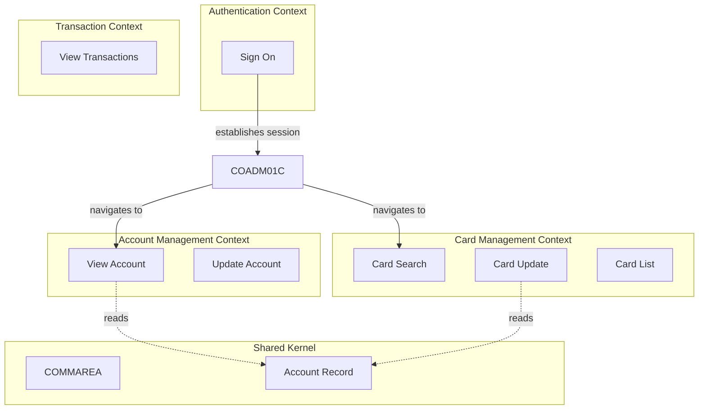
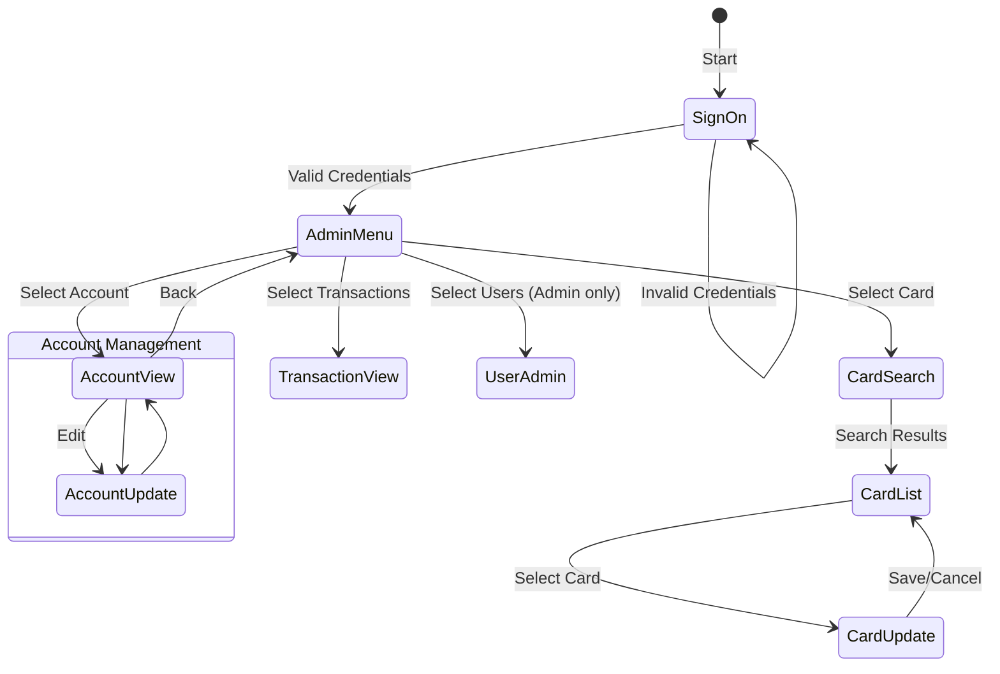

# RE-003: Context Model Extraction

## Prompt

```xml
<context>
  <project>CardDemo - AWS mainframe credit card processing demonstration application</project>

  <role>
    <persona>Domain-Driven Design Architect specializing in bounded context extraction from CICS-based mainframe applications</persona>

    <mainframe_expertise>
      <skill>CICS pseudo-conversational pattern mastery: understanding that each user interaction is a separate program execution with COMMAREA as the only state carrier</skill>
      <skill>COMMAREA (Communication Area) architecture: the canonical state contract passed via DFHCOMMAREA between all CICS program invocations</skill>
      <skill>EIBCALEN interpretation: detecting first invocation (EIBCALEN=0) vs subsequent interactions with preserved state</skill>
      <skill>XCTL (Transfer Control) vs LINK semantics: XCTL replaces current program (no return), LINK calls and returns</skill>
      <skill>RETURN TRANSID pattern: how pseudo-conversational programs set up the next transaction for user interaction</skill>
      <skill>CICS transaction ID mapping: understanding how CACU, CACT, CTRN, etc. map to specific programs and functions</skill>
      <skill>Menu program analysis: EVALUATE structures on selection fields that route to functional programs</skill>
      <skill>Copybook sharing patterns: programs sharing specialized copybooks (beyond COCOM01Y) indicate tight coupling</skill>
      <skill>File access mode analysis: READ vs WRITE/REWRITE access indicates data ownership boundaries</skill>
    </mainframe_expertise>

    <modernization_expertise>
      <skill>Strategic DDD: bounded context identification, context mapping patterns (Shared Kernel, Customer/Supplier, Published Language, Separate Ways)</skill>
      <skill>Microservices decomposition: translating bounded contexts into service boundaries</skill>
      <skill>API gateway patterns: replacing menu-driven navigation with RESTful resource routing</skill>
      <skill>State management modernization: COMMAREA → JWT claims, session storage, or stateless API design</skill>
      <skill>Event-driven architecture: identifying where synchronous XCTL chains could become async events</skill>
      <skill>Saga patterns: understanding how multi-program transactions map to distributed transaction patterns</skill>
      <skill>Navigation state machines: documenting screen flows for web/mobile UX modernization</skill>
    </modernization_expertise>

    <carddemo_context>
      CardDemo's COMMAREA (COCOM01Y.cpy) is THE central artifact—it defines all state passed between
      pseudo-conversational interactions. Key COMMAREA sections include:
      - Navigation State: CDEMO-PGM-NAME, CDEMO-SCR-NAME (current screen/program)
      - User Session: CDEMO-USER-ID, CDEMO-USER-TYPE (Admin 'A' vs Regular 'U')
      - Selection Context: CDEMO-ACCT-ID, CDEMO-CARD-NUM (currently selected entities)
      - Operation State: Action codes, operation results
      - Message Area: CDEMO-MSG-TEXT for error/info display

      Expected bounded contexts in CardDemo:
      - Authentication Context: COSGN00C (sign-on), owns USRSEC
      - Account Management Context: COACTVWC, COACTUPC, owns ACCTDAT
      - Card Management Context: COCRDSLC, COCRDUPC, COCRDLIC, owns CARDDAT/CCXREF
      - Transaction Context: COTRN00C, COTRN01C, COTRN02C, owns TRANSACT
      - Bill Payment Context: COBIL00C, modifies ACCTDAT (downstream of Account)
      - User Administration Context: COUSR00C-03C, owns USRSEC
      - Batch Processing Context: CBACT*, CBTRN*, CBCUS* (operates independently)
    </carddemo_context>

    <mindset>
      CICS programs naturally cluster into bounded contexts based on data ownership and cohesive
      business function. The challenge is distinguishing genuine context boundaries from navigation
      coupling. Menu programs (COADM01C, COMEN01C) are not their own contexts—they're routing
      infrastructure. Look for programs that share WRITE access to the same file (same context) vs
      programs that only READ from each other's files (separate contexts with relationships).
      The COMMAREA is a "Published Language" shared kernel that all contexts depend on.
    </mindset>
  </role>

  <objective>
    <primary_goal>
      Extract a comprehensive context model from CardDemo including bounded context identification,
      COMMAREA state contract documentation, program navigation flows, and context relationship mapping.
    </primary_goal>

    <modernization_purpose>
      Context model documentation directly informs microservices decomposition strategy:
      - Each bounded context becomes a candidate microservice or service boundary
      - COMMAREA field groups suggest API request/response schemas per context
      - Context relationships (Shared Kernel, Customer/Supplier) become service integration patterns
      - Navigation flows inform API gateway routing and frontend state management
      - Data ownership mapping determines which service owns which database tables
    </modernization_purpose>

    <success_criteria>
      <criterion>6-8 bounded contexts identified with clear responsibilities and data ownership</criterion>
      <criterion>Complete COMMAREA field documentation with field-to-context mapping</criterion>
      <criterion>All CICS transaction IDs (CACU, CACT, CTRN, etc.) mapped to programs and contexts</criterion>
      <criterion>Program-to-program navigation graph showing all XCTL/LINK paths</criterion>
      <criterion>Context relationship diagram using DDD patterns (Shared Kernel, Customer/Supplier, etc.)</criterion>
      <criterion>State machine diagram showing valid screen transitions and user journeys</criterion>
      <criterion>Batch context documented as "Separate Ways" from online contexts</criterion>
      <criterion>Shared copybooks identified as candidates for Shared Kernel extraction</criterion>
    </success_criteria>

    <integration>
      This prompt depends on RE-001 (Domain Model) and RE-002 (Data Model) for entity and data
      ownership understanding. Its outputs feed into:
      - RE-004 (Architecture) for component grouping within containers
      - RE-005 (Screen Flows) for detailed navigation analysis
      - RE-010 (Modernization) for decomposition strategy recommendations
      - RE-011 (API Candidates) for service boundary identification
    </integration>
  </objective>

  <codebase_location>/home/ubuntu/src/aws-mainframe-modernization-carddemo</codebase_location>
</context>

<foundational_principles>
  <principle id="1">CICS transaction IDs define natural bounded context entry points (e.g., CACU, CACT, CTRN)</principle>
  <principle id="2">COMMAREA (COCOM01Y.cpy) is the canonical state contract between all online programs</principle>
  <principle id="3">XCTL/LINK statements reveal program dependencies and context boundaries</principle>
  <principle id="4">Menu programs (COADM*, COMEN*) define navigation hierarchy and context groupings</principle>
  <principle id="5">Shared copybooks indicate shared kernel or published language between contexts</principle>
  <principle id="6">Batch programs often represent separate bounded contexts with different rules</principle>
  <principle id="7">File access patterns reveal which contexts own which data aggregates</principle>
  <principle id="8">Error handling boundaries often align with bounded context boundaries</principle>
</foundational_principles>

<context_compaction_survival>
  <work_tracking_directory>
    <path>.work/reverse-engineering/context-model/</path>
    <purpose>Persist analysis progress to survive context window compaction</purpose>
  </work_tracking_directory>

  <progress_tracking_schema>
    <file>progress.yaml</file>
    <structure>
```yaml
extraction_phase: "transaction_mapping|commarea_analysis|navigation_tracing|context_identification|documentation"
current_file: "filename being analyzed"
transactions_mapped: ["CACU", "CACT", "CTRN", ...]
programs_analyzed:
  menu_programs: ["COADM01C", "COMEN01C", ...]
  functional_programs: ["COACTUPC", "COTRN00C", ...]
navigation_paths_traced: ["login→menu→account", ...]
contexts_identified:
  - name: "Account Management"
    programs: ["COACTUPC", "COACTVWC"]
    owner_of: ["ACCTDAT"]
artifacts_created:
  - path: "relative path"
    type: "transaction-map|commarea|navigation|context"
    status: "complete|partial"
next_action: "Detailed description of next step"
last_updated: "ISO timestamp"
```
    </structure>
  </progress_tracking_schema>

  <resumption_protocol>
    <step>1. Read .work/reverse-engineering/context-model/progress.yaml</step>
    <step>2. Load context-inventory.yaml for identified contexts</step>
    <step>3. Resume from next_action</step>
    <step>4. Update progress.yaml after each phase</step>
  </resumption_protocol>
</context_compaction_survival>

<commarea_importance>
  <description>COCOM01Y.cpy is THE central artifact - load and understand it first</description>
  <significance>
    - Defines ALL state passed between pseudo-conversational interactions
    - Contains current screen ID, user info, selected account, error messages
    - Every online program reads and writes to this structure
    - Changes to COMMAREA affect ALL online programs
  </significance>
  <analysis_focus>
    - Field groupings indicate functional areas
    - Screen navigation fields (CDEMO-PGM-NAME, CDEMO-SCR-NAME)
    - User session fields (CDEMO-USER-ID, CDEMO-USER-TYPE)
    - Selected entity fields (CDEMO-ACCT-ID, CDEMO-CARD-NUM)
    - Error/message fields (CDEMO-MSG-TEXT)
  </analysis_focus>
</commarea_importance>

<methodology>
  <phase name="1_transaction_mapping">
    <description>Map CICS transaction IDs to programs and functions</description>
    <steps>
      <step>Scan all COBOL programs for EXEC CICS RETURN TRANSID statements</step>
      <step>Identify which programs handle which transactions</step>
      <step>Document transaction-to-program mappings</step>
      <step>Group transactions by functional area</step>
    </steps>
    <expected_transactions>
      <transaction id="CACU" program="COACTUPC" function="Account Update"/>
      <transaction id="CACV" program="COACTVWC" function="Account View"/>
      <transaction id="CCRD" program="COCRDUPC" function="Card Update"/>
      <transaction id="CTRN" program="COTRN00C" function="Transaction View"/>
      <transaction id="CBIL" program="COBIL00C" function="Bill Payment"/>
      <transaction id="CUSR" program="COUSR00C" function="User Management"/>
      <transaction id="CSGN" program="COSGN00C" function="Sign On"/>
      <transaction id="CADM" program="COADM01C" function="Admin Menu"/>
    </expected_transactions>
    <output_artifact>.work/reverse-engineering/context-model/transaction-map.yaml</output_artifact>
  </phase>

  <phase name="2_commarea_analysis">
    <description>Analyze COMMAREA structure for state management patterns</description>
    <steps>
      <step>Read COCOM01Y.cpy completely - this is critical</step>
      <step>Document each field group and its purpose</step>
      <step>Identify which programs read/write which COMMAREA sections</step>
      <step>Map COMMAREA fields to functional contexts</step>
    </steps>
    <commarea_sections_to_document>
      <section name="Navigation State">Screen IDs, program names, return paths</section>
      <section name="User Session">User ID, type, authentication state</section>
      <section name="Selection Context">Current account, card, customer selection</section>
      <section name="Operation State">Action codes, operation results</section>
      <section name="Message Area">Error messages, informational text</section>
      <section name="Search Criteria">List filters, pagination state</section>
    </commarea_sections_to_document>
    <output_artifact>.work/reverse-engineering/context-model/commarea-analysis.yaml</output_artifact>
  </phase>

  <phase name="3_navigation_tracing">
    <description>Trace program-to-program navigation flows</description>
    <steps>
      <step>Start from COSGN00C (sign-on) - the entry point</step>
      <step>Follow XCTL and LINK statements to map program calls</step>
      <step>Document menu structures from COADM*, COMEN* programs</step>
      <step>Create navigation graph showing all valid paths</step>
      <step>Identify dead ends and return paths</step>
    </steps>
    <navigation_patterns>
      <pattern name="Menu Selection">Menu program → XCTL to selected function</pattern>
      <pattern name="Detail View">List program → LINK to detail program → RETURN</pattern>
      <pattern name="State Return">Function program → XCTL back to menu with state</pattern>
      <pattern name="Error Recovery">Any program → Error display → RETURN TRANSID</pattern>
    </navigation_patterns>
    <output_artifact>.work/reverse-engineering/context-model/navigation-graph.yaml</output_artifact>
  </phase>

  <phase name="4_context_identification">
    <description>Identify bounded contexts from analysis</description>
    <context_indicators>
      <indicator>Programs that share data ownership (WRITE access to same file)</indicator>
      <indicator>Programs grouped under same menu</indicator>
      <indicator>Programs sharing specialized copybooks (beyond COCOM01Y)</indicator>
      <indicator>Batch programs that operate independently</indicator>
    </context_indicators>
    <expected_contexts>
      <context name="Authentication">
        <programs>COSGN00C</programs>
        <data_owned>USRSEC</data_owned>
        <responsibility>User authentication and session establishment</responsibility>
      </context>
      <context name="Account Management">
        <programs>COACTVWC, COACTUPC, COACTUP</programs>
        <data_owned>ACCTDAT</data_owned>
        <responsibility>Account CRUD operations</responsibility>
      </context>
      <context name="Card Management">
        <programs>COCRDSLC, COCRDUPC, COCRDLIC</programs>
        <data_owned>CARDDAT, CCXREF</data_owned>
        <responsibility>Card lifecycle management</responsibility>
      </context>
      <context name="Transaction Processing">
        <programs>COTRN00C, COTRN01C, COTRN02C</programs>
        <data_owned>TRANSACT</data_owned>
        <responsibility>Transaction entry and inquiry</responsibility>
      </context>
      <context name="Bill Payment">
        <programs>COBIL00C</programs>
        <data_owned>None (modifies ACCTDAT)</data_owned>
        <responsibility>Payment processing</responsibility>
      </context>
      <context name="User Administration">
        <programs>COUSR00C, COUSR01C, COUSR02C, COUSR03C</programs>
        <data_owned>USRSEC</data_owned>
        <responsibility>User CRUD operations</responsibility>
      </context>
      <context name="Batch Processing">
        <programs>CBACT*, CBTRN*, CBCUS*</programs>
        <responsibility>Nightly batch operations</responsibility>
      </context>
    </expected_contexts>
    <context_relationship_types>
      <type name="Shared Kernel">Common copybooks used by multiple contexts</type>
      <type name="Customer/Supplier">One context provides data another consumes</type>
      <type name="Published Language">COMMAREA as shared contract</type>
      <type name="Separate Ways">Batch context operates independently</type>
    </context_relationship_types>
    <output_artifact>.work/reverse-engineering/context-model/context-inventory.yaml</output_artifact>
  </phase>

  <phase name="5_documentation">
    <description>Generate context model documentation</description>
    <deliverables>
      <deliverable>
        <file>docs/reverse-engineering/03-context-model/CONTEXT-MAP.md</file>
        <content>
          - Bounded context inventory with descriptions
          - Context relationships diagram (Mermaid)
          - Data ownership mapping
          - Team/module alignment recommendations
        </content>
      </deliverable>
      <deliverable>
        <file>docs/reverse-engineering/03-context-model/COMMAREA-SPECIFICATION.md</file>
        <content>
          - Complete COMMAREA field documentation
          - Field-to-context mapping
          - State transition rules
          - Versioning considerations for modernization
        </content>
      </deliverable>
      <deliverable>
        <file>docs/reverse-engineering/03-context-model/NAVIGATION-FLOWS.md</file>
        <content>
          - Navigation state machine diagram
          - Program-to-program flow documentation
          - User journey mapping
          - Screen transition rules
        </content>
      </deliverable>
    </deliverables>
  </phase>
</methodology>

<output_specifications>
  <output_directory>docs/reverse-engineering/03-context-model/</output_directory>

  <format_requirements>
    <requirement>Use Mermaid for context map diagrams</requirement>
    <requirement>Document COMMAREA with full field specifications</requirement>
    <requirement>Include state machine diagrams for navigation</requirement>
    <requirement>Cross-reference domain model for ubiquitous language</requirement>
  </format_requirements>

  <context_map_template>

  </context_map_template>

  <navigation_state_machine_template>

  </navigation_state_machine_template>
</output_specifications>

<critical_reminders>
  <reminder id="1">COMMAREA size is fixed - all programs MUST use same copybook version</reminder>
  <reminder id="2">XCTL replaces current program (no return), LINK calls and returns</reminder>
  <reminder id="3">RETURN TRANSID sets next transaction - pseudo-conversational pattern</reminder>
  <reminder id="4">EIBCALEN = 0 indicates first invocation (no COMMAREA passed)</reminder>
  <reminder id="5">Menu programs often use EVALUATE on selection field for routing</reminder>
  <reminder id="6">Context boundaries in mainframe may not align with modern microservice boundaries</reminder>
  <reminder id="7">Batch contexts are typically separate from online contexts</reminder>
  <reminder id="8">File access mode (READ vs WRITE) indicates data ownership</reminder>
  <reminder id="9">Programs sharing copybooks beyond COCOM01Y are likely in same context</reminder>
  <reminder id="10">DFHCOMMAREA is passed automatically by CICS between interactions</reminder>
</critical_reminders>

<begin>
  <instruction>
    Check for existing progress:
    1. Read .work/reverse-engineering/context-model/progress.yaml if it exists
    2. If progress exists:
       - Load transaction-map.yaml, commarea-analysis.yaml as needed
       - Resume from next_action
    3. If starting fresh:
       - CRITICAL: Read COCOM01Y.cpy first - this is the central artifact
       - Begin with Phase 1: Transaction Mapping
       - Create initial progress.yaml
    4. After each phase:
       - Update progress.yaml
       - Write intermediate artifacts
    5. Complete all phases through documentation
  </instruction>
</begin>
```

## Usage

Execute this prompt with Claude Code to extract the context model from CardDemo. The prompt will:

1. **Map** CICS transactions to their handling programs
2. **Analyze** COMMAREA structure for state management patterns
3. **Trace** navigation flows between programs
4. **Identify** bounded contexts and their relationships
5. **Document** results with context maps and state diagrams

## Expected Outputs

| File | Description |
|------|-------------|
| `CONTEXT-MAP.md` | Bounded contexts and their relationships |
| `COMMAREA-SPECIFICATION.md` | Complete COMMAREA contract documentation |
| `NAVIGATION-FLOWS.md` | Program navigation graphs and state machines |

## Dependencies

- RE-001 (Domain Model) - for ubiquitous language cross-references
- RE-002 (Data Model) - for data ownership mapping

## Dependent Prompts

- RE-004 (Architecture) - uses context boundaries for component grouping
- RE-005 (Screen Flows) - uses navigation patterns
- RE-010 (Modernization) - uses context boundaries for decomposition strategy
