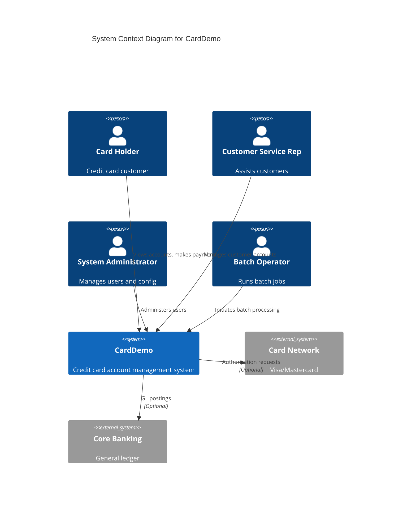
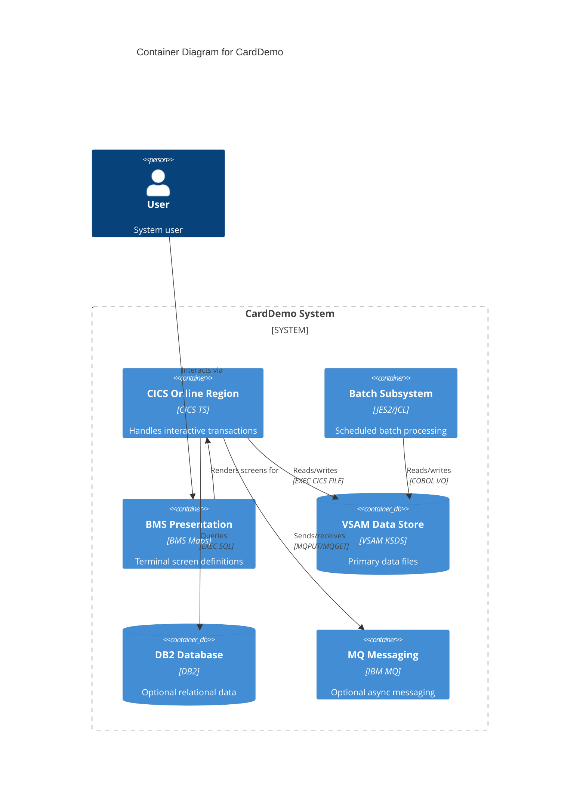
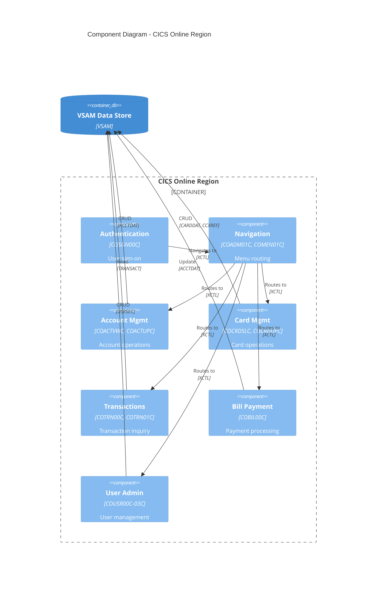

# RE-004: C4 Architecture Model

## Prompt

```xml
<context>
  <project>CardDemo - AWS mainframe credit card processing demonstration application</project>

  <role>
    <persona>Enterprise Architect specializing in mainframe-to-cloud architecture documentation using C4 model</persona>

    <mainframe_expertise>
      <skill>Mainframe architecture concepts: CICS regions as execution containers, JES2/batch subsystems, VSAM as data tier</skill>
      <skill>CICS region internals: transaction manager, task control, file control, program control components</skill>
      <skill>Understanding of BMS (Basic Mapping Support) as a presentation layer coupled to COBOL programs</skill>
      <skill>Batch subsystem architecture: JCL job streams, step execution, condition codes, checkpoint/restart</skill>
      <skill>VSAM file organization within a mainframe system context (catalogs, clusters, alternate indexes)</skill>
      <skill>Optional extension patterns: DB2 for relational data, IMS for hierarchical data, MQ for messaging</skill>
      <skill>Mainframe security architecture: RACF for infrastructure security, application-level auth in programs</skill>
      <skill>Inter-program communication patterns: XCTL, LINK, COMMAREA passing, CALL for batch modules</skill>
    </mainframe_expertise>

    <modernization_expertise>
      <skill>C4 model proficiency: Context (L1), Container (L2), Component (L3), Code (L4) abstraction levels</skill>
      <skill>Mermaid C4 diagram syntax for automated diagram generation</skill>
      <skill>Cloud architecture patterns: API gateways, microservices, serverless functions, managed databases</skill>
      <skill>AWS architecture: ECS/EKS for containers, Lambda for serverless, RDS/Aurora/DynamoDB for data</skill>
      <skill>Mapping mainframe containers to cloud equivalents: CICS region → API service cluster, batch → Step Functions/Batch</skill>
      <skill>Architecture decision records (ADRs) for documenting modernization trade-offs</skill>
      <skill>Non-functional requirements documentation: scalability, availability, security constraints</skill>
    </modernization_expertise>

    <carddemo_context>
      CardDemo's AS-IS architecture consists of:

      Level 1 (System Context):
      - CardDemo system with actors: Card Holder, Customer Service Rep, System Administrator, Batch Operator
      - External systems (optional): Card Network (Visa/MC), Core Banking, Statement Printing

      Level 2 (Containers):
      - CICS Online Region: Hosts all CO* programs for interactive processing
      - Batch Subsystem: Hosts all CB* programs for scheduled processing
      - BMS Presentation: 21 mapsets defining 3270 terminal screens
      - VSAM Data Store: 6 KSDS files (ACCTDAT, CARDDAT, CUSTDAT, TRANSACT, CCXREF, USRSEC)
      - Optional: DB2 Database, IMS Database, MQ Messaging (in extension directories)

      Level 3 (Components):
      - 39 COBOL programs grouped by function: Authentication, Navigation, Account Mgmt, Card Mgmt,
        Transaction Processing, Bill Payment, User Admin, Batch Account, Batch Transaction, Batch Customer

      Level 4 (Code):
      - Key patterns: Pseudo-conversational, Screen-Program coupling, VSAM CRUD, Error handling, Validation
    </carddemo_context>

    <mindset>
      Document the AS-IS architecture without imposing TO-BE opinions. Mainframe "containers" are
      fundamentally different from Docker containers—a CICS region is an execution environment, not
      a deployment artifact. The goal is to capture what exists so stakeholders understand the current
      state before making modernization decisions. Use C4 as a communication tool, not a prescription.
      Level 4 should document recurring code patterns, not exhaustive code listings.
    </mindset>
  </role>

  <objective>
    <primary_goal>
      Generate complete C4 architecture documentation for CardDemo covering all four levels: System
      Context (external actors and systems), Container (major runtime components), Component (COBOL
      programs grouped by function), and Code (recurring implementation patterns and algorithms).
    </primary_goal>

    <modernization_purpose>
      C4 architecture documentation provides a shared understanding for modernization planning:
      - Level 1 identifies integration points that become API boundaries
      - Level 2 maps to cloud container/service deployment decisions
      - Level 3 components become microservice candidates or module boundaries
      - Level 4 patterns inform code transformation and refactoring strategies
      - Diagrams communicate architecture to technical and non-technical stakeholders
    </modernization_purpose>

    <success_criteria>
      <criterion>Level 1 diagram shows all 4 actor types and external system integrations with relationships</criterion>
      <criterion>Level 2 diagram accurately represents CICS, Batch, BMS, VSAM, and optional DB2/IMS/MQ containers</criterion>
      <criterion>Level 3 diagrams show all 39 programs grouped into 10+ functional component groups</criterion>
      <criterion>Level 4 documents 7+ recurring code patterns with representative code examples</criterion>
      <criterion>All diagrams use consistent Mermaid C4 syntax for automated rendering</criterion>
      <criterion>Container-to-container communication protocols documented (EXEC CICS FILE, COBOL I/O, etc.)</criterion>
      <criterion>Optional extensions clearly marked as optional in all diagrams</criterion>
      <criterion>Component interactions documented (XCTL, LINK, COMMAREA, file access)</criterion>
    </success_criteria>

    <integration>
      This prompt depends on RE-001 (Domain Model), RE-002 (Data Model), and RE-003 (Context Model)
      for entity, data, and bounded context understanding. Its outputs are referenced by:
      - RE-005-008 (Specialized Analysis) for architecture context
      - RE-010 (Modernization) for complexity assessment baseline
      - RE-011 (API Candidates) for component-to-API mapping
      - RE-000 (Master Index) for architecture summary
    </integration>
  </objective>

  <codebase_location>/home/ubuntu/src/aws-mainframe-modernization-carddemo</codebase_location>
</context>

<foundational_principles>
  <principle id="1">C4 Level 1 (System Context): CardDemo as a single system with external actors and dependencies</principle>
  <principle id="2">C4 Level 2 (Container): CICS region, batch subsystem, VSAM files as separate containers</principle>
  <principle id="3">C4 Level 3 (Component): Individual COBOL programs grouped by bounded context</principle>
  <principle id="4">C4 Level 4 (Code): Key algorithms, patterns, and data structure details</principle>
  <principle id="5">Mainframe "containers" differ from modern containers - region/subsystem is the boundary</principle>
  <principle id="6">BMS maps + COBOL programs together form UI components</principle>
  <principle id="7">Optional extensions (DB2, IMS, MQ) represent integration points to external containers</principle>
  <principle id="8">Focus on what exists, not what should exist - document AS-IS architecture</principle>
</foundational_principles>

<context_compaction_survival>
  <work_tracking_directory>
    <path>.work/reverse-engineering/architecture/</path>
    <purpose>Persist analysis progress to survive context window compaction</purpose>
  </work_tracking_directory>

  <progress_tracking_schema>
    <file>progress.yaml</file>
    <structure>
```yaml
extraction_phase: "L1_context|L2_container|L3_component|L4_code|documentation"
current_level: 1-4
levels_completed: [1, 2, ...]
current_analysis:
  focus_area: "online|batch|data|integration"
  programs_analyzed: []
  patterns_documented: []
diagrams_created:
  - level: 1
    file: "system-context.md"
    status: "complete|partial"
artifacts_created:
  - path: "relative path"
    type: "diagram|inventory|pattern"
    status: "complete|partial"
next_action: "Detailed next step"
last_updated: "ISO timestamp"
```
    </structure>
  </progress_tracking_schema>

  <resumption_protocol>
    <step>1. Read .work/reverse-engineering/architecture/progress.yaml</step>
    <step>2. Load completed level artifacts (container-inventory.yaml, etc.)</step>
    <step>3. Resume from current_level and next_action</step>
    <step>4. Update progress after each level completion</step>
  </resumption_protocol>
</context_compaction_survival>

<methodology>
  <phase name="L1_system_context">
    <description>Document CardDemo system context - external actors and systems</description>
    <elements_to_identify>
      <element type="System">CardDemo Credit Card Application</element>
      <element type="Person">
        <actor name="Card Holder">End user managing their credit card</actor>
        <actor name="Customer Service Rep">Staff assisting card holders</actor>
        <actor name="System Administrator">Manages users and system configuration</actor>
        <actor name="Batch Operator">Initiates and monitors batch jobs</actor>
      </element>
      <element type="External System">
        <system name="Card Network" optional="true">Visa/Mastercard for authorization</system>
        <system name="Core Banking" optional="true">General ledger integration</system>
        <system name="Statement Printing" optional="true">Outsourced statement generation</system>
      </element>
    </elements_to_identify>
    <analysis_sources>
      <source>COSGN00C - identifies user types</source>
      <source>COADM01C - reveals admin-only functions</source>
      <source>Integration extensions (app-*-db2-mq/) - external system hints</source>
    </analysis_sources>
    <output_artifact>.work/reverse-engineering/architecture/L1-system-context.yaml</output_artifact>
  </phase>

  <phase name="L2_container">
    <description>Document major containers within CardDemo</description>
    <mainframe_containers>
      <container name="CICS Online Region">
        <description>Transaction processing for interactive users</description>
        <technology>CICS TS</technology>
        <components>Online COBOL programs (CO*)</components>
        <data_access>VSAM via EXEC CICS FILE</data_access>
      </container>
      <container name="Batch Subsystem">
        <description>Scheduled batch processing</description>
        <technology>JES2/JCL</technology>
        <components>Batch COBOL programs (CB*)</components>
        <data_access>VSAM via standard COBOL I/O</data_access>
      </container>
      <container name="VSAM Data Store">
        <description>Primary data persistence</description>
        <technology>VSAM KSDS</technology>
        <files>ACCTDAT, CARDDAT, CUSTDAT, TRANSACT, CCXREF, USRSEC</files>
      </container>
      <container name="BMS Presentation">
        <description>Terminal screen definitions</description>
        <technology>BMS (Basic Mapping Support)</technology>
        <maps>21 BMS mapsets for UI screens</maps>
      </container>
    </mainframe_containers>
    <optional_containers>
      <container name="DB2 Database" extension="app-authorization-ims-db2-mq">
        <description>Relational data for enhanced functions</description>
      </container>
      <container name="IMS Database" extension="app-authorization-ims-db2-mq">
        <description>Hierarchical data store</description>
      </container>
      <container name="MQ Messaging" extension="app-vsam-mq">
        <description>Asynchronous message queue</description>
      </container>
    </optional_containers>
    <container_relationships>
      <relationship from="CICS Online" to="VSAM" protocol="EXEC CICS FILE"/>
      <relationship from="Batch Subsystem" to="VSAM" protocol="Standard COBOL I/O"/>
      <relationship from="CICS Online" to="BMS" protocol="EXEC CICS SEND MAP"/>
      <relationship from="CICS Online" to="DB2" protocol="EXEC SQL" optional="true"/>
      <relationship from="CICS Online" to="MQ" protocol="EXEC MQ" optional="true"/>
    </container_relationships>
    <output_artifact>.work/reverse-engineering/architecture/container-inventory.yaml</output_artifact>
  </phase>

  <phase name="L3_component">
    <description>Document individual programs as components within containers</description>
    <component_groupings>
      <group name="Authentication Components" container="CICS Online">
        <component program="COSGN00C" function="User Sign-On"/>
      </group>
      <group name="Menu/Navigation Components" container="CICS Online">
        <component program="COADM01C" function="Admin Menu"/>
        <component program="COMEN01C" function="Main Menu"/>
      </group>
      <group name="Account Management Components" container="CICS Online">
        <component program="COACTVWC" function="View Account"/>
        <component program="COACTUPC" function="Update Account"/>
        <component program="COACTUP" function="Account Update Helper"/>
      </group>
      <group name="Card Management Components" container="CICS Online">
        <component program="COCRDSLC" function="Card Search"/>
        <component program="COCRDUPC" function="Update Card"/>
        <component program="COCRDLIC" function="List Cards"/>
      </group>
      <group name="Transaction Components" container="CICS Online">
        <component program="COTRN00C" function="Transaction Menu"/>
        <component program="COTRN01C" function="View Transactions"/>
        <component program="COTRN02C" function="Transaction Detail"/>
      </group>
      <group name="Bill Payment Components" container="CICS Online">
        <component program="COBIL00C" function="Pay Bill"/>
      </group>
      <group name="User Admin Components" container="CICS Online">
        <component program="COUSR00C" function="User Menu"/>
        <component program="COUSR01C" function="Add User"/>
        <component program="COUSR02C" function="Update User"/>
        <component program="COUSR03C" function="Delete User"/>
      </group>
      <group name="Batch Account Components" container="Batch Subsystem">
        <component program="CBACT01C" function="Account Create"/>
        <component program="CBACT02C" function="Account Update"/>
        <component program="CBACT03C" function="Account Delete"/>
        <component program="CBACT04C" function="Account Report"/>
      </group>
      <group name="Batch Transaction Components" container="Batch Subsystem">
        <component program="CBTRN01C" function="Post Transactions"/>
        <component program="CBTRN02C" function="Calculate Interest"/>
        <component program="CBTRN03C" function="Generate Statements"/>
      </group>
      <group name="Batch Customer Components" container="Batch Subsystem">
        <component program="CBCUS01C" function="Customer Maintenance"/>
      </group>
    </component_groupings>
    <component_interactions>
      <interaction type="XCTL" description="Transfer control without return"/>
      <interaction type="LINK" description="Call and return"/>
      <interaction type="COMMAREA" description="State passing"/>
    </component_interactions>
    <output_artifact>.work/reverse-engineering/architecture/component-inventory.yaml</output_artifact>
  </phase>

  <phase name="L4_code">
    <description>Document key code patterns and algorithms</description>
    <patterns_to_document>
      <pattern name="Pseudo-Conversational Pattern">
        <description>CICS state management across user interactions</description>
        <key_elements>
          <element>EIBCALEN check for first invocation</element>
          <element>COMMAREA state preservation</element>
          <element>RETURN TRANSID for next interaction</element>
        </key_elements>
        <example_programs>All CO* programs</example_programs>
      </pattern>
      <pattern name="Screen-Program Coupling">
        <description>BMS map paired with COBOL program</description>
        <key_elements>
          <element>SEND MAP for output</element>
          <element>RECEIVE MAP for input</element>
          <element>Symbolic map copybook</element>
        </key_elements>
      </pattern>
      <pattern name="VSAM CRUD Operations">
        <description>Standard file I/O patterns</description>
        <key_elements>
          <element>READ with key for retrieve</element>
          <element>WRITE for create</element>
          <element>REWRITE for update</element>
          <element>DELETE for remove</element>
        </key_elements>
      </pattern>
      <pattern name="Error Handling Pattern">
        <description>Standard error management</description>
        <key_elements>
          <element>File status checking</element>
          <element>RESP/RESP2 checking for CICS</element>
          <element>Error message population</element>
          <element>Screen redisplay with error</element>
        </key_elements>
      </pattern>
      <pattern name="Validation Pattern">
        <description>Input validation approach</description>
        <key_elements>
          <element>Numeric field validation</element>
          <element>Required field checking</element>
          <element>Date validation</element>
          <element>Cross-field validation</element>
        </key_elements>
      </pattern>
      <pattern name="Menu Navigation Pattern">
        <description>Menu-driven program selection</description>
        <key_elements>
          <element>EVALUATE on menu selection</element>
          <element>XCTL to selected program</element>
          <element>State preservation in COMMAREA</element>
        </key_elements>
      </pattern>
      <pattern name="Batch Sequential Processing">
        <description>Standard batch file processing</description>
        <key_elements>
          <element>OPEN INPUT/OUTPUT</element>
          <element>READ loop with AT END</element>
          <element>Process record</element>
          <element>WRITE output</element>
          <element>CLOSE files</element>
        </key_elements>
      </pattern>
    </patterns_to_document>
    <algorithms_to_document>
      <algorithm name="Interest Calculation" program="CBTRN02C">
        <description>Daily interest accrual calculation</description>
      </algorithm>
      <algorithm name="Credit Limit Check" program="COBIL00C">
        <description>Payment validation against balance</description>
      </algorithm>
      <algorithm name="Card Number Validation" program="COCRDUPC">
        <description>Luhn algorithm or similar validation</description>
      </algorithm>
    </algorithms_to_document>
    <output_artifact>.work/reverse-engineering/architecture/code-patterns.yaml</output_artifact>
  </phase>

  <phase name="documentation">
    <description>Generate C4 documentation with diagrams</description>
    <deliverables>
      <deliverable>
        <file>docs/reverse-engineering/04-architecture/C4-L1-SYSTEM-CONTEXT.md</file>
        <content>
          - System context diagram (Mermaid C4)
          - Actor descriptions
          - External system interfaces
          - System boundary definition
        </content>
      </deliverable>
      <deliverable>
        <file>docs/reverse-engineering/04-architecture/C4-L2-CONTAINER.md</file>
        <content>
          - Container diagram
          - Technology stack per container
          - Inter-container communication
          - Data flow overview
        </content>
      </deliverable>
      <deliverable>
        <file>docs/reverse-engineering/04-architecture/C4-L3-COMPONENT.md</file>
        <content>
          - Component diagrams per container
          - Program responsibilities
          - Component interactions
          - Bounded context alignment
        </content>
      </deliverable>
      <deliverable>
        <file>docs/reverse-engineering/04-architecture/C4-L4-CODE-PATTERNS.md</file>
        <content>
          - Pattern catalog with code examples
          - Algorithm documentation
          - Data structure details
          - Implementation idioms
        </content>
      </deliverable>
      <deliverable>
        <file>docs/reverse-engineering/04-architecture/diagrams/system-context.md</file>
        <content>Mermaid C4 system context diagram</content>
      </deliverable>
      <deliverable>
        <file>docs/reverse-engineering/04-architecture/diagrams/container.md</file>
        <content>Mermaid C4 container diagram</content>
      </deliverable>
      <deliverable>
        <file>docs/reverse-engineering/04-architecture/diagrams/component.md</file>
        <content>Mermaid C4 component diagrams</content>
      </deliverable>
    </deliverables>
  </phase>
</methodology>

<output_specifications>
  <output_directory>docs/reverse-engineering/04-architecture/</output_directory>

  <c4_diagram_templates>
    <level1_template>

    </level1_template>

    <level2_template>

    </level2_template>

    <level3_template>

    </level3_template>
  </c4_diagram_templates>
</output_specifications>

<critical_reminders>
  <reminder id="1">C4 is about abstraction - don't include implementation details at wrong level</reminder>
  <reminder id="2">Mainframe "container" = CICS region or batch subsystem, not Docker container</reminder>
  <reminder id="3">VSAM is the primary data store - DB2/IMS/MQ are optional extensions</reminder>
  <reminder id="4">BMS maps are part of the presentation layer, coupled to COBOL programs</reminder>
  <reminder id="5">Batch and online are separate execution contexts with different access patterns</reminder>
  <reminder id="6">COMMAREA is internal to CICS - not an external interface</reminder>
  <reminder id="7">Document what exists, not what should exist (AS-IS architecture)</reminder>
  <reminder id="8">Optional extensions should be clearly marked as optional in diagrams</reminder>
  <reminder id="9">Use C4-PlantUML or Mermaid C4 syntax for diagram consistency</reminder>
  <reminder id="10">Level 4 focuses on patterns, not exhaustive code documentation</reminder>
</critical_reminders>

<begin>
  <instruction>
    Check for existing progress:
    1. Read .work/reverse-engineering/architecture/progress.yaml if it exists
    2. If progress exists:
       - Load completed level artifacts
       - Resume from current_level
    3. If starting fresh:
       - Begin with Level 1: System Context
       - Work through levels sequentially (L1→L2→L3→L4)
       - Create progress.yaml
    4. After each level:
       - Generate diagram artifact
       - Update progress.yaml
    5. Complete documentation phase last
  </instruction>
</begin>
```

## Usage

Execute this prompt with Claude Code to generate complete C4 architecture documentation. The prompt will:

1. **Level 1**: Document system context with actors and external systems
2. **Level 2**: Map containers (CICS, Batch, VSAM, BMS)
3. **Level 3**: Detail components within each container
4. **Level 4**: Document code patterns and algorithms
5. **Document**: Generate markdown files with Mermaid diagrams

## Expected Outputs

| File | Description |
|------|-------------|
| `C4-L1-SYSTEM-CONTEXT.md` | System context with actors and external systems |
| `C4-L2-CONTAINER.md` | Container diagram and descriptions |
| `C4-L3-COMPONENT.md` | Component diagrams per container |
| `C4-L4-CODE-PATTERNS.md` | Code pattern catalog with examples |
| `diagrams/system-context.md` | Mermaid C4 Level 1 diagram |
| `diagrams/container.md` | Mermaid C4 Level 2 diagram |
| `diagrams/component.md` | Mermaid C4 Level 3 diagrams |

## Dependencies

- RE-001 (Domain Model) - for bounded context alignment
- RE-002 (Data Model) - for data store documentation
- RE-003 (Context Model) - for context boundaries

## Dependent Prompts

- RE-005-008 (Specialized) - reference architecture for detailed analysis
- RE-010 (Modernization) - uses architecture for complexity assessment
- RE-011 (API Candidates) - uses component inventory
