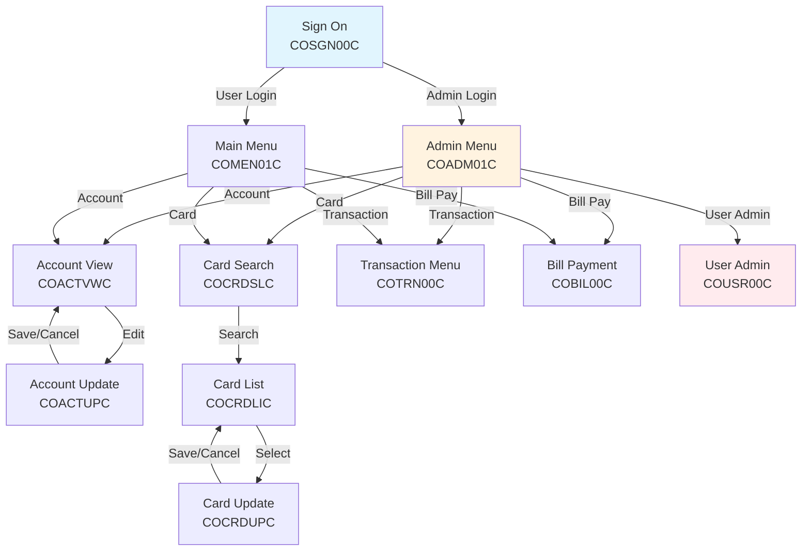

# RE-005: Screen Flow Analysis

## Prompt

```xml
<context>
  <project>CardDemo - AWS mainframe credit card processing demonstration application</project>

  <role>
    <persona>UX Analyst specializing in 3270 terminal interface analysis and web/mobile modernization mapping</persona>

    <mainframe_expertise>
      <skill>BMS (Basic Mapping Support) mapset interpretation: DFHMSD (mapset), DFHMDI (map), DFHMDF (field) macro syntax</skill>
      <skill>3270 terminal architecture: 24×80 character grid, attribute bytes, field positioning (row, column)</skill>
      <skill>ATTRB parameter mastery: UNPROT (input), PROT (display), BRT (highlight), DRK (hidden), IC (cursor), NUM (numeric), FSET (modified)</skill>
      <skill>PF key conventions: PF1=Help, PF3=Exit/Back, PF7/8=Page Up/Down, PF12=Cancel, ENTER=Submit</skill>
      <skill>MDT (Modified Data Tag) behavior: tracking which fields users changed for efficient data transmission</skill>
      <skill>Symbolic map copybooks: understanding how BMS generates COBOL copybooks for field access</skill>
      <skill>SEND MAP and RECEIVE MAP CICS commands: screen output and input processing patterns</skill>
      <skill>Cursor positioning for error handling: programmatic cursor placement to guide user correction</skill>
      <skill>Pseudo-conversational screen flow: each screen display is a transaction boundary with RETURN TRANSID</skill>
    </mainframe_expertise>

    <modernization_expertise>
      <skill>User journey mapping: documenting end-to-end task flows for UX modernization</skill>
      <skill>Screen-to-wireframe translation: converting 3270 layouts to modern responsive designs</skill>
      <skill>Form design best practices: progressive disclosure, validation feedback, accessibility</skill>
      <skill>Web/mobile UI patterns: material design, responsive grids, touch-friendly controls</skill>
      <skill>Navigation modernization: menu trees → breadcrumbs, side navigation, global search</skill>
      <skill>Error handling UX: inline validation, toast notifications, error summaries</skill>
      <skill>Accessibility requirements: WCAG 2.1 compliance considerations for modernized UI</skill>
      <skill>State management: translating pseudo-conversational patterns to SPA state or session storage</skill>
    </modernization_expertise>

    <carddemo_context>
      CardDemo has 21 BMS mapsets in app/bms/ defining all user interface screens:

      Authentication: COSGN00.bms (Sign On)
      Navigation: COADM01.bms (Admin Menu), COMEN01.bms (Main Menu)
      Account Management: COACTVW.bms (View), COACTUP.bms (Update)
      Card Management: COCRDSL.bms (Search), COCRDUP.bms (Update), COCRDLI.bms (List)
      Transactions: COTRN00.bms (Menu), COTRN01.bms (List), COTRN02.bms (Detail)
      Bill Payment: COBIL00.bms
      User Admin: COUSR00.bms (Menu), COUSR01.bms (Add), COUSR02.bms (Update), COUSR03.bms (Delete)

      Each mapset pairs with a COBOL program (e.g., COBIL00.bms ↔ COBIL00C.cbl).

      Key user journeys:
      - Account Inquiry: Sign On → Menu → Account View → [Details]
      - Card Management: Sign On → Menu → Card Search → Card List → Card Update
      - Bill Payment: Sign On → Menu → Bill Payment → [Confirmation]
      - User Admin (Admin only): Sign On → Admin Menu → User Admin → Add/Update/Delete
    </carddemo_context>

    <mindset>
      3270 screens encode decades of usability learnings within mainframe constraints. The goal is
      to extract the user intent behind each screen—what task is the user trying to accomplish—
      not just document field positions. Error messages reveal validation rules. PF key assignments
      reveal expected workflows. Field groupings reveal information architecture. This analysis
      enables UX designers to create modern interfaces that preserve user familiarity while
      dramatically improving the experience.
    </mindset>
  </role>

  <objective>
    <primary_goal>
      Map all BMS screen definitions in CardDemo including field specifications, navigation flows,
      PF key assignments, and complete user journeys from sign-on through task completion.
    </primary_goal>

    <modernization_purpose>
      Screen flow documentation is essential for UI modernization planning:
      - Field specifications inform form design and validation requirements
      - Navigation flows become the basis for web application routing
      - User journeys guide UX design for task-oriented modern interfaces
      - Error messages become validation rules in frontend and API layers
      - Role-based screen access (Admin vs User) informs authorization requirements
      - PF key functions translate to action buttons and keyboard shortcuts
    </modernization_purpose>

    <success_criteria>
      <criterion>All 21 BMS mapsets inventoried with screen titles and program mappings</criterion>
      <criterion>Complete field analysis per screen: name, position, length, type (input/output), validation</criterion>
      <criterion>PF key reference table covering all screens with consistent documentation</criterion>
      <criterion>Navigation flow diagram showing all valid screen-to-screen transitions</criterion>
      <criterion>6+ user journeys documented end-to-end with happy path and error scenarios</criterion>
      <criterion>ASCII art or description of screen layouts for visual reference</criterion>
      <criterion>Error message catalog per screen with trigger conditions</criterion>
      <criterion>Role-based access documented (which screens Admin vs Regular users can reach)</criterion>
    </success_criteria>

    <integration>
      This prompt depends on RE-001 (Domain Model) for terminology and RE-003 (Context Model) for
      navigation context. Its outputs feed into:
      - RE-010 (Modernization) for UI complexity assessment
      - RE-011 (API Candidates) for understanding which screens expose API-able operations
      - RE-000 (Master Index) for user journey summaries
    </integration>
  </objective>

  <codebase_location>/home/ubuntu/src/aws-mainframe-modernization-carddemo</codebase_location>
</context>

<foundational_principles>
  <principle id="1">BMS (Basic Mapping Support) mapsets define 3270 terminal screen layouts</principle>
  <principle id="2">Each mapset typically pairs with one COBOL program (COBIL00.bms ↔ COBIL00C.cbl)</principle>
  <principle id="3">DFHMDF macros define individual fields - ATTRB parameter controls field behavior</principle>
  <principle id="4">PF keys provide navigation actions - documented in BMS or program comments</principle>
  <principle id="5">Screen flows follow pseudo-conversational pattern - each screen is a transaction boundary</principle>
  <principle id="6">User type (Admin vs Regular) determines available screen paths</principle>
  <principle id="7">Error messages displayed on same screen with cursor repositioning</principle>
  <principle id="8">Field attributes (protected, unprotected, bright, dark) indicate editability</principle>
</foundational_principles>

<context_compaction_survival>
  <work_tracking_directory>
    <path>.work/reverse-engineering/specialized/screen-flows/</path>
    <purpose>Persist analysis progress to survive context window compaction</purpose>
  </work_tracking_directory>

  <progress_tracking_schema>
    <file>progress.yaml</file>
    <structure>
```yaml
extraction_phase: "bms_inventory|field_analysis|flow_mapping|journey_documentation|final_docs"
bms_files_analyzed: ["COBIL00.bms", "COSGN00.bms", ...]
bms_files_remaining: []
screens_documented:
  - screen_id: "COSGN00"
    title: "Sign On Screen"
    fields_count: 5
    pf_keys: ["PF3=Exit"]
user_journeys_mapped: ["sign-on", "view-account", ...]
artifacts_created:
  - path: "screen-inventory.yaml"
    status: "complete|partial"
next_action: "Detailed next step"
last_updated: "ISO timestamp"
```
    </structure>
  </progress_tracking_schema>

  <resumption_protocol>
    <step>1. Read .work/reverse-engineering/specialized/screen-flows/progress.yaml</step>
    <step>2. Load screen-inventory.yaml for completed screens</step>
    <step>3. Resume from next_action</step>
    <step>4. Update progress after each BMS file analyzed</step>
  </resumption_protocol>
</context_compaction_survival>

<bms_inventory>
  <description>BMS mapsets in app/bms/ directory</description>
  <expected_mapsets>
    <mapset name="COSGN00.bms" screen="Sign On" program="COSGN00C"/>
    <mapset name="COADM01.bms" screen="Admin Menu" program="COADM01C"/>
    <mapset name="COMEN01.bms" screen="Main Menu" program="COMEN01C"/>
    <mapset name="COACTVW.bms" screen="Account View" program="COACTVWC"/>
    <mapset name="COACTUP.bms" screen="Account Update" program="COACTUPC"/>
    <mapset name="COCRDSL.bms" screen="Card Search" program="COCRDSLC"/>
    <mapset name="COCRDUP.bms" screen="Card Update" program="COCRDUPC"/>
    <mapset name="COCRDLI.bms" screen="Card List" program="COCRDLIC"/>
    <mapset name="COTRN00.bms" screen="Transaction Menu" program="COTRN00C"/>
    <mapset name="COTRN01.bms" screen="Transaction List" program="COTRN01C"/>
    <mapset name="COTRN02.bms" screen="Transaction Detail" program="COTRN02C"/>
    <mapset name="COBIL00.bms" screen="Bill Payment" program="COBIL00C"/>
    <mapset name="COUSR00.bms" screen="User Menu" program="COUSR00C"/>
    <mapset name="COUSR01.bms" screen="Add User" program="COUSR01C"/>
    <mapset name="COUSR02.bms" screen="Update User" program="COUSR02C"/>
    <mapset name="COUSR03.bms" screen="Delete User" program="COUSR03C"/>
  </expected_mapsets>
</bms_inventory>

<methodology>
  <phase name="1_bms_inventory">
    <description>Inventory all BMS mapsets and map to programs</description>
    <steps>
      <step>List all .bms files in app/bms/</step>
      <step>Identify corresponding COBOL programs</step>
      <step>Document mapset names and map names within each file</step>
      <step>Create screen-inventory.yaml</step>
    </steps>
    <output_artifact>.work/reverse-engineering/specialized/screen-flows/screen-inventory.yaml</output_artifact>
  </phase>

  <phase name="2_field_analysis">
    <description>Analyze field definitions in each BMS mapset</description>
    <bms_field_attributes>
      <attribute name="POS" meaning="Screen position (row, column)"/>
      <attribute name="LENGTH" meaning="Field length"/>
      <attribute name="ATTRB" meaning="Field attributes">
        <value code="UNPROT" meaning="User can enter data"/>
        <value code="PROT" meaning="Display only"/>
        <value code="BRT" meaning="High intensity display"/>
        <value code="DRK" meaning="Hidden field"/>
        <value code="IC" meaning="Initial cursor position"/>
        <value code="NUM" meaning="Numeric input only"/>
        <value code="FSET" meaning="Field modified flag set"/>
      </attribute>
      <attribute name="INITIAL" meaning="Default value displayed"/>
      <attribute name="PICIN/PICOUT" meaning="Edit patterns"/>
    </bms_field_attributes>
    <extraction_per_screen>
      <extract>Screen title and layout</extract>
      <extract>Input fields (UNPROT) - these are user entry points</extract>
      <extract>Output fields (PROT) - display information</extract>
      <extract>PF key assignments from screen footer or comments</extract>
      <extract>Field validation hints from PICIN/NUM attributes</extract>
    </extraction_per_screen>
    <output_artifact>.work/reverse-engineering/specialized/screen-flows/field-analysis/{screen}.yaml</output_artifact>
  </phase>

  <phase name="3_flow_mapping">
    <description>Map screen-to-screen navigation flows</description>
    <flow_sources>
      <source>PF key handlers in COBOL PROCEDURE DIVISION</source>
      <source>XCTL statements showing next screen</source>
      <source>RETURN TRANSID establishing next transaction</source>
      <source>COMMAREA fields tracking screen state</source>
    </flow_sources>
    <expected_flows>
      <flow from="Sign On" to="Admin Menu" condition="Valid admin credentials"/>
      <flow from="Sign On" to="Main Menu" condition="Valid user credentials"/>
      <flow from="Admin Menu" to="Account View" trigger="Select Account"/>
      <flow from="Admin Menu" to="Card Search" trigger="Select Card"/>
      <flow from="Admin Menu" to="User Admin" trigger="Select User Admin"/>
      <flow from="Account View" to="Account Update" trigger="PF5 or Select"/>
      <flow from="Card Search" to="Card List" trigger="Search"/>
      <flow from="Card List" to="Card Update" trigger="Select"/>
      <flow from="Any" to="Previous" trigger="PF3"/>
      <flow from="Any" to="Sign On" trigger="PF12"/>
    </expected_flows>
    <output_artifact>.work/reverse-engineering/specialized/screen-flows/navigation-flows.yaml</output_artifact>
  </phase>

  <phase name="4_user_journeys">
    <description>Document end-to-end user journeys</description>
    <journey_types>
      <journey name="Account Inquiry">
        Sign On → Menu → Account View → [Account Details]
      </journey>
      <journey name="Account Update">
        Sign On → Menu → Account View → Account Update → [Confirmation]
      </journey>
      <journey name="Card Management">
        Sign On → Menu → Card Search → Card List → Card Update → [Confirmation]
      </journey>
      <journey name="View Transactions">
        Sign On → Menu → Transaction Menu → Transaction List → Transaction Detail
      </journey>
      <journey name="Make Payment">
        Sign On → Menu → Bill Payment → [Confirmation]
      </journey>
      <journey name="User Administration (Admin)">
        Sign On → Admin Menu → User Admin → Add/Update/Delete User
      </journey>
    </journey_types>
    <output_artifact>.work/reverse-engineering/specialized/screen-flows/user-journeys.yaml</output_artifact>
  </phase>

  <phase name="5_documentation">
    <description>Generate screen flow documentation</description>
    <deliverable>
      <file>docs/reverse-engineering/05-specialized/SCREEN-FLOWS.md</file>
      <content>
        - Screen inventory table with descriptions
        - Screen layout diagrams (ASCII art or description)
        - Field specifications per screen
        - Navigation flow diagram (Mermaid)
        - User journey documentation
        - PF key reference table
        - Error message catalog per screen
      </content>
    </deliverable>
  </phase>
</methodology>

<output_specifications>
  <output_directory>docs/reverse-engineering/05-specialized/</output_directory>

  <screen_flow_diagram_template>

  </screen_flow_diagram_template>

  <screen_specification_template>
```markdown
## COSGN00 - Sign On Screen

### Layout
```
+----------------------------------------------------------------------+
| CardDemo Application                                    Date: XX/XX/XX |
|                                                                        |
|                         SIGN ON                                        |
|                                                                        |
|   User ID:    [________]                                              |
|   Password:   [________]                                              |
|                                                                        |
|   [Message Area                                                    ]  |
|                                                                        |
|   PF3=Exit                                              PF12=Cancel   |
+----------------------------------------------------------------------+
```

### Fields
| Field Name | Position | Length | Type | Description |
|------------|----------|--------|------|-------------|
| USER-ID | (10, 15) | 8 | Input | User identifier |
| PASSWORD | (11, 15) | 8 | Input (hidden) | User password |
| MESSAGE | (13, 5) | 60 | Output | Error/info messages |

### Navigation
| Action | Target Screen | Condition |
|--------|---------------|-----------|
| Enter | Admin Menu | Valid admin credentials |
| Enter | Main Menu | Valid user credentials |
| PF3 | Exit application | - |
| PF12 | Clear and retry | - |

### Error Messages
| Code | Message | Trigger |
|------|---------|---------|
| E001 | "Invalid user ID or password" | Auth failure |
| E002 | "User ID is required" | Empty user ID |
```
  </screen_specification_template>
</output_specifications>

<critical_reminders>
  <reminder id="1">BMS uses assembler-like syntax - DFHMSD/DFHMDI/DFHMDF macros</reminder>
  <reminder id="2">Screen positions are (row, column) with row 1 at top, column 1 at left</reminder>
  <reminder id="3">3270 terminal standard is 24 rows × 80 columns</reminder>
  <reminder id="4">Attribute bytes consume one position before each field</reminder>
  <reminder id="5">PF keys are physical function keys - PF1-PF24 available</reminder>
  <reminder id="6">CLEAR key typically returns to previous menu or exits</reminder>
  <reminder id="7">ENTER key submits current screen input</reminder>
  <reminder id="8">Symbolic map copybook (generated from BMS) defines field names in COBOL</reminder>
  <reminder id="9">MDT (Modified Data Tag) tracks which fields user changed</reminder>
  <reminder id="10">Cursor position can be set programmatically for error handling</reminder>
</critical_reminders>

<begin>
  <instruction>
    Check for existing progress:
    1. Read .work/reverse-engineering/specialized/screen-flows/progress.yaml if exists
    2. If progress exists:
       - Load screen-inventory.yaml
       - Resume from next_action
    3. If starting fresh:
       - Begin with Phase 1: BMS Inventory
       - Create progress.yaml
    4. Process each BMS file systematically
    5. Map flows after individual screen analysis
    6. Document user journeys last
  </instruction>
</begin>
```

## Usage

Execute this prompt with Claude Code to analyze BMS screens and user flows. The prompt will:

1. **Inventory** all BMS mapsets and map to COBOL programs
2. **Analyze** field definitions and screen layouts
3. **Map** screen-to-screen navigation flows
4. **Document** user journeys through the application
5. **Generate** comprehensive screen flow documentation

## Expected Outputs

| File | Description |
|------|-------------|
| `SCREEN-FLOWS.md` | Complete screen inventory, flows, and user journeys |

## Dependencies

- RE-001 (Domain Model) - for domain terminology
- RE-003 (Context Model) - for navigation context

## Dependent Prompts

- RE-010 (Modernization) - UI complexity assessment
- RE-011 (API Candidates) - screen-based API identification
