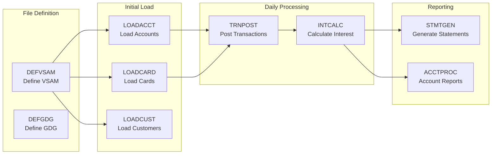
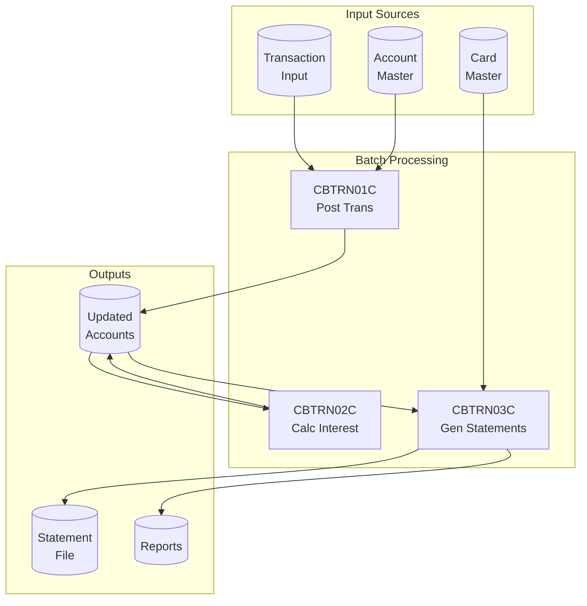

# RE-006: Batch Workflow Analysis

## Prompt

```xml
<context>
  <project>CardDemo - AWS mainframe credit card processing demonstration application</project>

  <role>
    <persona>Batch Processing Architect specializing in JCL-to-cloud-native workflow transformation</persona>

    <mainframe_expertise>
      <skill>JCL (Job Control Language) mastery: JOB cards, EXEC statements, DD statements, PROC invocations</skill>
      <skill>Dataset allocation: DSN parameter, DISP (disposition), DCB attributes, SPACE allocation</skill>
      <skill>Conditional execution: COND parameter, IF/THEN/ELSE/ENDIF constructs, return code handling</skill>
      <skill>GDG (Generation Data Group) patterns: (+1) for new, (0) for current, (-1) for previous generation</skill>
      <skill>JES2/JES3 job scheduling: job classes, priorities, initiators, output routing</skill>
      <skill>Checkpoint/restart mechanisms: CHKPT DD, deferred restart, step restart</skill>
      <skill>VSAM file handling in batch: IDCAMS utility, REPRO, DEFINE CLUSTER, file status codes</skill>
      <skill>COBOL batch program patterns: OPEN, READ loop with AT END, WRITE, CLOSE sequential processing</skill>
      <skill>Intra-job communication: temporary datasets (&&), passed files, condition codes between steps</skill>
      <skill>Control-M or similar scheduler integration: job dependencies, calendars, resource management</skill>
    </mainframe_expertise>

    <modernization_expertise>
      <skill>Event-driven architecture: replacing scheduled batch with real-time event processing</skill>
      <skill>AWS Step Functions: orchestrating multi-step workflows with state management and error handling</skill>
      <skill>AWS Batch: managed batch computing for large-scale data processing</skill>
      <skill>Lambda functions: serverless execution for discrete batch operations</skill>
      <skill>Apache Airflow/MWAA: DAG-based workflow orchestration as JCL alternative</skill>
      <skill>Stream processing: Kafka, Kinesis for continuous data processing replacing daily batch</skill>
      <skill>Cloud scheduling: EventBridge rules, CloudWatch Events for time-based triggers</skill>
      <skill>Idempotency and replay: designing batch operations that can safely re-run</skill>
    </modernization_expertise>

    <carddemo_context>
      CardDemo has 38 JCL files in app/jcl/ covering:

      File Definition Jobs: DEFVSAM (define VSAM clusters), DEFGDG (define GDG bases)

      Initial Data Load Jobs: LOADACCT, LOADCARD, LOADCUST, LOADTRAN (populate files from external sources)

      Daily Processing Jobs:
      - TRNPOST: Execute CBTRN01C to post daily transactions to account balances
      - INTCALC: Execute CBTRN02C to calculate and apply daily interest charges

      Period-End Jobs:
      - STMTGEN: Execute CBTRN03C to generate monthly statements
      - ACCTPROC: Execute CBACT01C-04C for account maintenance and reporting

      Data Exchange Jobs:
      - EXPORT: Execute CBEXPORT to export data in external format (EBCDIC conversion)
      - IMPORT: Execute CBIMPORT to import data from external sources

      Batch programs: CBACT01C (create), CBACT02C (update), CBACT03C (delete), CBACT04C (report),
      CBTRN01C (post), CBTRN02C (interest), CBTRN03C (statements), CBCUS01C (customer maintenance).

      Control-M scheduler file exists in scripts/ for job dependency management.
    </carddemo_context>

    <mindset>
      Batch processes encode critical business operations that must execute reliably with proper
      sequencing. The JCL represents not just "what runs" but "what happens if it fails"—condition
      codes, restart points, and dependent job scheduling are all business requirements. The goal
      is to document these workflows so modernization preserves reliability guarantees while
      enabling real-time processing where appropriate. Some batch legitimately stays batch (large
      volume processing); some should become event-driven (transaction posting).
    </mindset>
  </role>

  <objective>
    <primary_goal>
      Document all JCL job control specifications in CardDemo including job-step details, inter-job
      dependencies, data flow through batch programs, and scheduled workflow sequences with
      restart/recovery procedures.
    </primary_goal>

    <modernization_purpose>
      Batch workflow documentation enables cloud-native transformation decisions:
      - Job dependencies become Step Functions state machine definitions
      - Scheduled jobs become EventBridge rules triggering Lambda or Batch
      - Sequential file processing may become streaming with Kinesis/Kafka
      - GDG patterns inform data versioning and replay requirements
      - Restart/recovery requirements inform idempotency design
      - Batch windows inform real-time vs async processing decisions
    </modernization_purpose>

    <success_criteria>
      <criterion>All 38 JCL files inventoried with job name, purpose, and program executions</criterion>
      <criterion>Job dependency DAG (Directed Acyclic Graph) showing execution order constraints</criterion>
      <criterion>Step-level documentation: program, inputs (DD), outputs (DD), condition codes</criterion>
      <criterion>Data flow diagram showing how files are created, transformed, and consumed across jobs</criterion>
      <criterion>Restart/recovery procedures documented for each critical job</criterion>
      <criterion>Scheduling requirements documented (daily, weekly, month-end, on-demand)</criterion>
      <criterion>Error handling and condition code interpretation documented</criterion>
      <criterion>Modernization recommendations: which jobs should become event-driven vs stay batch</criterion>
    </success_criteria>

    <integration>
      This prompt depends on RE-001 (Domain Model) and RE-002 (Data Model) for understanding
      what batch processes do and what data they transform. Its outputs feed into:
      - RE-010 (Modernization) for batch complexity assessment and migration recommendations
      - RE-000 (Master Index) for batch workflow summaries
    </integration>
  </objective>

  <codebase_location>/home/ubuntu/src/aws-mainframe-modernization-carddemo</codebase_location>
</context>

<foundational_principles>
  <principle id="1">JCL (Job Control Language) defines batch job execution - job streams, steps, and dependencies</principle>
  <principle id="2">DD statements specify file allocations - input, output, and intermediate datasets</principle>
  <principle id="3">EXEC PGM= identifies which COBOL program runs in each step</principle>
  <principle id="4">Condition codes (COND=) control step execution based on previous step results</principle>
  <principle id="5">PROC invocations encapsulate reusable job steps</principle>
  <principle id="6">Batch programs (CB*) operate on entire files sequentially vs online programs (CO*)</principle>
  <principle id="7">Job dependencies form a DAG (Directed Acyclic Graph) for scheduling</principle>
  <principle id="8">GDG (Generation Data Groups) manage versioned datasets across runs</principle>
</foundational_principles>

<context_compaction_survival>
  <work_tracking_directory>
    <path>.work/reverse-engineering/specialized/batch-workflows/</path>
    <purpose>Persist analysis progress to survive context window compaction</purpose>
  </work_tracking_directory>

  <progress_tracking_schema>
    <file>progress.yaml</file>
    <structure>
```yaml
extraction_phase: "jcl_inventory|step_analysis|dependency_mapping|workflow_documentation|final_docs"
jcl_files_analyzed: ["DEFVSAM.jcl", "ACCTDATA.jcl", ...]
jcl_files_remaining: []
jobs_documented:
  - job_name: "DEFVSAM"
    steps: 5
    programs: ["IDCAMS"]
    purpose: "Define VSAM files"
programs_identified: ["CBACT01C", "CBTRN01C", ...]
dependencies_mapped: ["DEFVSAM → LOADDATA → ACCTPOST"]
artifacts_created:
  - path: "jcl-inventory.yaml"
    status: "complete|partial"
next_action: "Detailed next step"
last_updated: "ISO timestamp"
```
    </structure>
  </progress_tracking_schema>

  <resumption_protocol>
    <step>1. Read .work/reverse-engineering/specialized/batch-workflows/progress.yaml</step>
    <step>2. Load jcl-inventory.yaml for completed jobs</step>
    <step>3. Resume from next_action</step>
    <step>4. Update progress after each JCL file analyzed</step>
  </resumption_protocol>
</context_compaction_survival>

<jcl_inventory>
  <description>JCL files in app/jcl/ directory</description>
  <expected_categories>
    <category name="File Definition">
      <job name="DEFVSAM" purpose="Define VSAM clusters"/>
      <job name="DEFGDG" purpose="Define GDG base entries"/>
    </category>
    <category name="Data Loading">
      <job name="LOADACCT" purpose="Initial account data load"/>
      <job name="LOADCARD" purpose="Initial card data load"/>
      <job name="LOADCUST" purpose="Initial customer data load"/>
      <job name="LOADTRAN" purpose="Initial transaction data load"/>
    </category>
    <category name="Account Processing">
      <job name="ACCTPROC" purpose="Account file maintenance">
        <program>CBACT01C - Create accounts</program>
        <program>CBACT02C - Update accounts</program>
        <program>CBACT03C - Delete accounts</program>
        <program>CBACT04C - Account reports</program>
      </job>
    </category>
    <category name="Transaction Processing">
      <job name="TRNPOST" purpose="Post daily transactions">
        <program>CBTRN01C - Transaction posting</program>
      </job>
      <job name="INTCALC" purpose="Calculate interest">
        <program>CBTRN02C - Interest calculation</program>
      </job>
      <job name="STMTGEN" purpose="Generate statements">
        <program>CBTRN03C - Statement generation</program>
      </job>
    </category>
    <category name="Customer Processing">
      <job name="CUSTPROC" purpose="Customer maintenance">
        <program>CBCUS01C - Customer maintenance</program>
      </job>
    </category>
    <category name="Data Export/Import">
      <job name="EXPORT" purpose="Export data to external format">
        <program>CBEXPORT - Data export</program>
      </job>
      <job name="IMPORT" purpose="Import data from external format">
        <program>CBIMPORT - Data import</program>
      </job>
    </category>
  </expected_categories>
</jcl_inventory>

<methodology>
  <phase name="1_jcl_inventory">
    <description>Inventory all JCL files and categorize by function</description>
    <steps>
      <step>List all .jcl files in app/jcl/</step>
      <step>Identify job names from JOB cards</step>
      <step>Document primary purpose of each job</step>
      <step>Categorize by function (definition, load, processing, reporting)</step>
    </steps>
    <jcl_parsing_elements>
      <element syntax="//jobname JOB">Job definition</element>
      <element syntax="//stepname EXEC PGM=pgmname">Step execution</element>
      <element syntax="//stepname EXEC PROC=procname">Procedure call</element>
      <element syntax="//ddname DD">Dataset definition</element>
      <element syntax="/*">End of job or inline data</element>
    </jcl_parsing_elements>
    <output_artifact>.work/reverse-engineering/specialized/batch-workflows/jcl-inventory.yaml</output_artifact>
  </phase>

  <phase name="2_step_analysis">
    <description>Analyze individual job steps and their I/O</description>
    <analysis_per_job>
      <analyze>Step names and sequence</analyze>
      <analyze>Programs executed (PGM=)</analyze>
      <analyze>Input files (DD with DISP=SHR or OLD)</analyze>
      <analyze>Output files (DD with DISP=(NEW,CATLG))</analyze>
      <analyze>Condition codes (COND= parameter)</analyze>
      <analyze>Restart points (checkpoint/restart)</analyze>
    </analysis_per_job>
    <dd_statement_analysis>
      <dd_type name="Input">DISP=SHR, DISP=OLD</dd_type>
      <dd_type name="Output">DISP=(NEW,CATLG,DELETE), DISP=(MOD,CATLG)</dd_type>
      <dd_type name="Temporary">DSN=&&TEMP</dd_type>
      <dd_type name="SYSOUT">SYSOUT=* (print output)</dd_type>
      <dd_type name="SYSIN">* (inline control cards)</dd_type>
    </dd_statement_analysis>
    <output_artifact>.work/reverse-engineering/specialized/batch-workflows/job-details/{jobname}.yaml</output_artifact>
  </phase>

  <phase name="3_dependency_mapping">
    <description>Map inter-job and inter-step dependencies</description>
    <dependency_types>
      <type name="Data Dependency">Job B reads file created by Job A</type>
      <type name="Sequence Dependency">Job B must run after Job A completes</type>
      <type name="Conditional Dependency">Job B runs only if Job A succeeds/fails</type>
      <type name="Resource Dependency">Jobs share same file (must serialize)</type>
    </dependency_types>
    <dependency_sources>
      <source>Dataset names in DD statements (matching DSN=)</source>
      <source>GDG references (+1 vs 0 vs -1)</source>
      <source>Scheduler control cards (if present)</source>
      <source>Control-M files in scripts/</source>
    </dependency_sources>
    <output_artifact>.work/reverse-engineering/specialized/batch-workflows/dependencies.yaml</output_artifact>
  </phase>

  <phase name="4_workflow_documentation">
    <description>Document complete batch workflow sequences</description>
    <workflow_types>
      <workflow name="Daily Batch Cycle">
        <sequence>
          1. Transaction input validation
          2. Transaction posting (CBTRN01C)
          3. Account balance updates
          4. Interest calculation (CBTRN02C)
        </sequence>
      </workflow>
      <workflow name="Month-End Processing">
        <sequence>
          1. Statement generation (CBTRN03C)
          2. Account aging
          3. Report generation (CBACT04C)
        </sequence>
      </workflow>
      <workflow name="Data Refresh">
        <sequence>
          1. VSAM file backup
          2. Data export (CBEXPORT)
          3. External processing
          4. Data import (CBIMPORT)
        </sequence>
      </workflow>
    </workflow_types>
    <output_artifact>.work/reverse-engineering/specialized/batch-workflows/workflows.yaml</output_artifact>
  </phase>

  <phase name="5_documentation">
    <description>Generate batch workflow documentation</description>
    <deliverable>
      <file>docs/reverse-engineering/05-specialized/BATCH-WORKFLOWS.md</file>
      <content>
        - JCL job inventory with descriptions
        - Job dependency diagram (Mermaid)
        - Step-level detail for each job
        - Data flow through batch processes
        - Scheduling requirements
        - Error handling and restart procedures
        - Modernization considerations (event-driven alternatives)
      </content>
    </deliverable>
  </phase>
</methodology>

<output_specifications>
  <output_directory>docs/reverse-engineering/05-specialized/</output_directory>

  <job_dependency_diagram_template>

  </job_dependency_diagram_template>

  <job_specification_template>
```markdown
## TRNPOST - Transaction Posting Job

### Purpose
Posts daily transactions from the transaction input file to account master records.

### JCL Overview
```jcl
//TRNPOST  JOB (ACCT),'TRANSACTION POST',CLASS=A
//*
//STEP010  EXEC PGM=CBTRN01C
//STEPLIB  DD  DSN=CARDDEMO.LOADLIB,DISP=SHR
//TRANSACT DD  DSN=CARDDEMO.TRANSACT,DISP=SHR
//ACCTDAT  DD  DSN=CARDDEMO.ACCTDAT,DISP=OLD
//SYSOUT   DD  SYSOUT=*
//SYSPRINT DD  SYSOUT=*
```

### Steps
| Step | Program | Description | Inputs | Outputs |
|------|---------|-------------|--------|---------|
| STEP010 | CBTRN01C | Post transactions | TRANSACT | ACCTDAT (updated) |

### Dependencies
| Depends On | Type | Description |
|------------|------|-------------|
| LOADACCT | Data | ACCTDAT must exist |
| (Online Day) | Timing | Run after online cutoff |

### Condition Codes
| Code | Meaning | Action |
|------|---------|--------|
| 0 | Success | Continue |
| 4 | Warning | Review SYSPRINT |
| 8+ | Error | Restart required |

### Restart Instructions
1. Fix input data causing error
2. Run TRNREST job to reset pointers
3. Resubmit TRNPOST

### Modernization Notes
- Could become event-driven with transaction streaming
- Interest calculation could run continuously vs batch
```
  </job_specification_template>

  <data_flow_diagram_template>

  </data_flow_diagram_template>
</output_specifications>

<critical_reminders>
  <reminder id="1">JCL columns matter: // in columns 1-2 for JCL statements</reminder>
  <reminder id="2">Continuation: // in columns 1-2, parameter continues after comma</reminder>
  <reminder id="3">Comments: //* in columns 1-3</reminder>
  <reminder id="4">COND=(0,NE) means skip if any prior step RC != 0</reminder>
  <reminder id="5">DISP=(status,normal-end,abnormal-end) controls dataset disposition</reminder>
  <reminder id="6">GDG(0) = current generation, GDG(+1) = new generation, GDG(-1) = previous</reminder>
  <reminder id="7">STEPLIB/JOBLIB provide program libraries - critical for execution</reminder>
  <reminder id="8">Inline data follows DD * until /* delimiter</reminder>
  <reminder id="9">REGION parameter controls memory allocation per step</reminder>
  <reminder id="10">TIME parameter prevents runaway jobs - document expected durations</reminder>
</critical_reminders>

<begin>
  <instruction>
    Check for existing progress:
    1. Read .work/reverse-engineering/specialized/batch-workflows/progress.yaml if exists
    2. If progress exists:
       - Load jcl-inventory.yaml
       - Resume from next_action
    3. If starting fresh:
       - Begin with Phase 1: JCL Inventory
       - Create progress.yaml
    4. Analyze JCL files systematically
    5. Map dependencies after individual job analysis
    6. Document workflows and modernization considerations
  </instruction>
</begin>
```

## Usage

Execute this prompt with Claude Code to analyze batch processing workflows. The prompt will:

1. **Inventory** all JCL jobs and categorize by function
2. **Analyze** job steps, programs, and I/O
3. **Map** inter-job dependencies
4. **Document** complete batch workflow sequences
5. **Generate** comprehensive workflow documentation with diagrams

## Expected Outputs

| File | Description |
|------|-------------|
| `BATCH-WORKFLOWS.md` | Complete batch job inventory, dependencies, and workflows |

## Dependencies

- RE-001 (Domain Model) - for business process understanding
- RE-002 (Data Model) - for file/dataset documentation

## Dependent Prompts

- RE-010 (Modernization) - batch complexity and modernization assessment
