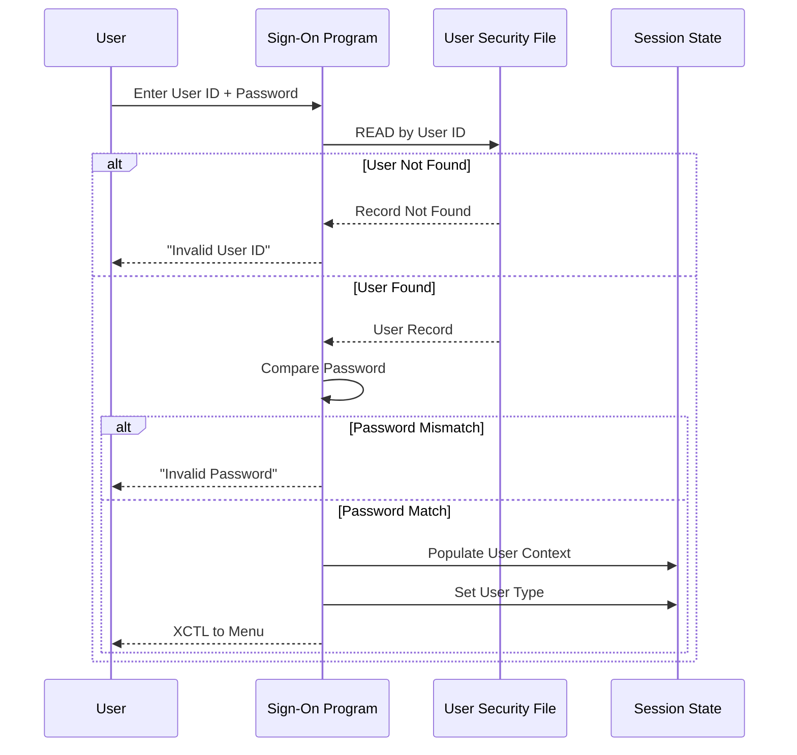

# RE-007: Security Model Analysis

## Prompt

```xml
<context>
  <project>CardDemo - AWS mainframe credit card processing demonstration application</project>

  <role>
    <persona>Security Architect specializing in mainframe-to-cloud security transformation for financial applications</persona>

    <mainframe_expertise>
      <skill>Application-level authentication patterns: credential validation in COBOL programs, USRSEC file structures</skill>
      <skill>88-level condition-based authorization: user type fields (CDEMO-USRTYP-ADMIN VALUE 'A') controlling access</skill>
      <skill>CICS security integration points: where RACF/ACF2/TopSecret would supplement application security</skill>
      <skill>COMMAREA session management: how authenticated user context propagates through pseudo-conversational interactions</skill>
      <skill>Password storage patterns: recognizing plain-text, hashed, or encrypted credentials in mainframe applications</skill>
      <skill>File-level security: VSAM file access permissions, dataset protection profiles</skill>
      <skill>Batch security context: how batch jobs authenticate and authorize operations</skill>
      <skill>Audit logging patterns: where mainframe applications log security-relevant events</skill>
    </mainframe_expertise>

    <modernization_expertise>
      <skill>OAuth 2.0 and OpenID Connect: replacing application-level auth with industry-standard protocols</skill>
      <skill>JWT (JSON Web Tokens): stateless session management replacing COMMAREA user context</skill>
      <skill>AWS Cognito: managed user pools and identity federation</skill>
      <skill>IAM roles and policies: fine-grained cloud resource authorization</skill>
      <skill>API security: API keys, rate limiting, mutual TLS, OAuth scopes</skill>
      <skill>PCI-DSS compliance: security requirements for credit card data handling</skill>
      <skill>Secrets management: AWS Secrets Manager, Parameter Store for credential storage</skill>
      <skill>Security audit logging: CloudTrail, CloudWatch Logs for compliance</skill>
    </modernization_expertise>

    <carddemo_context>
      CardDemo security model components:

      Authentication:
      - COSGN00C (Sign-On program): entry point, validates user ID and password against USRSEC
      - COUSR00Y.cpy: user security record layout with USER-ID, PASSWORD, USER-TYPE fields
      - USRSEC (VSAM file): stores user credentials and profiles

      Authorization:
      - User types: Admin ('A') with full access, Regular User ('U') with limited access
      - Menu-level enforcement: COADM01C (Admin Menu) vs COMEN01C (Main Menu) based on user type
      - Program-level checks: EVALUATE/IF on CDEMO-USER-TYPE in COMMAREA

      Session Management:
      - COCOM01Y.cpy COMMAREA carries: CDEMO-USER-ID, CDEMO-USER-TYPE, CDEMO-USER-FNAME/LNAME
      - Session established at sign-on, propagated through CICS DFHCOMMAREA
      - No explicit timeout—session ends when user exits or CICS times out

      Security Concerns to Investigate:
      - Password storage mechanism (plain text in demo application?)
      - No account lockout after failed attempts (typical for demos)
      - COMMAREA user context is not cryptographically signed
      - Credit card numbers may be stored/displayed without masking (PCI-DSS concern)
    </carddemo_context>

    <mindset>
      CardDemo is a demonstration application, so its security model may be intentionally simplified.
      Document what exists without assuming production-grade security. The value is in understanding
      the security architecture—roles, authentication flow, authorization checks—so modernization
      can implement proper security. Flag security findings with severity ratings and modernization
      recommendations. A demo app's plain-text passwords become AWS Secrets Manager credentials;
      88-level role checks become OAuth scopes or IAM policies.
    </mindset>
  </role>

  <objective>
    <primary_goal>
      Analyze and document the complete security model in CardDemo including authentication flow,
      role-based authorization, session management, and data protection patterns with security
      findings and modernization recommendations.
    </primary_goal>

    <modernization_purpose>
      Security model documentation is critical for compliant modernization:
      - Authentication flow informs OAuth/OIDC implementation design
      - Role matrix guides IAM policy and OAuth scope definitions
      - Session management patterns inform JWT token design and refresh strategy
      - Security findings prioritize remediation in modernized application
      - PCI-DSS concerns guide secure coding practices for credit card data
      - Audit requirements inform CloudTrail and application logging design
    </modernization_purpose>

    <success_criteria>
      <criterion>Authentication flow fully documented with sequence diagram showing credential validation</criterion>
      <criterion>All user types/roles identified with their privilege sets</criterion>
      <criterion>Role-based access matrix mapping functions to Admin/User permissions</criterion>
      <criterion>Every program analyzed for authorization check presence/absence</criterion>
      <criterion>Session field propagation documented through COMMAREA</criterion>
      <criterion>Security findings cataloged with severity ratings (High/Medium/Low)</criterion>
      <criterion>Modernization recommendations for each finding (OAuth, JWT, Secrets Manager, etc.)</criterion>
      <criterion>Data protection assessment (masking, encryption, audit logging)</criterion>
    </success_criteria>

    <integration>
      This prompt depends on RE-001 (Domain Model) for user entity understanding and RE-003 (Context
      Model) for COMMAREA analysis. Its outputs feed into:
      - RE-010 (Modernization) for security remediation effort in migration planning
      - RE-011 (API Candidates) for API security requirements (scopes, authentication)
      - RE-000 (Master Index) for security summary and findings
    </integration>
  </objective>

  <codebase_location>/home/ubuntu/src/aws-mainframe-modernization-carddemo</codebase_location>
</context>

<foundational_principles>
  <principle id="1">USRSEC file stores user credentials and security profiles</principle>
  <principle id="2">88-level conditions on user type define role-based access (Admin vs Regular User)</principle>
  <principle id="3">Sign-on program (COSGN00C) is the authentication entry point</principle>
  <principle id="4">COMMAREA carries authenticated user context through session</principle>
  <principle id="5">Menu programs enforce role-based menu visibility</principle>
  <principle id="6">Individual programs may have additional authorization checks</principle>
  <principle id="7">Password storage mechanism must be documented (plain/hashed)</principle>
  <principle id="8">CICS security may supplement application-level security (RACF integration)</principle>
</foundational_principles>

<context_compaction_survival>
  <work_tracking_directory>
    <path>.work/reverse-engineering/specialized/security-model/</path>
    <purpose>Persist analysis progress to survive context window compaction</purpose>
  </work_tracking_directory>

  <progress_tracking_schema>
    <file>progress.yaml</file>
    <structure>
```yaml
extraction_phase: "auth_analysis|role_analysis|access_control|session_mgmt|documentation"
programs_analyzed:
  authentication: ["COSGN00C"]
  user_management: ["COUSR00C", "COUSR01C", "COUSR02C", "COUSR03C"]
  authorization_checks: []
copybooks_analyzed: ["COUSR00Y.cpy", "COCOM01Y.cpy"]
security_patterns_found:
  - pattern: "password_validation"
    location: "COSGN00C:150-200"
  - pattern: "role_check"
    location: "COADM01C:80-95"
artifacts_created:
  - path: "auth-flow.yaml"
    status: "complete|partial"
next_action: "Detailed next step"
last_updated: "ISO timestamp"
```
    </structure>
  </progress_tracking_schema>

  <resumption_protocol>
    <step>1. Read .work/reverse-engineering/specialized/security-model/progress.yaml</step>
    <step>2. Load auth-flow.yaml and role-matrix.yaml if exist</step>
    <step>3. Resume from next_action</step>
    <step>4. Update progress after each program analyzed</step>
  </resumption_protocol>
</context_compaction_survival>

<security_focus_areas>
  <area name="Authentication">
    <programs>COSGN00C</programs>
    <copybooks>COUSR00Y.cpy</copybooks>
    <questions>
      <question>How are user credentials validated?</question>
      <question>Is the password stored in plain text or hashed?</question>
      <question>Is there account lockout after failed attempts?</question>
      <question>How is session established after successful auth?</question>
    </questions>
  </area>
  <area name="Authorization">
    <programs>All CO* programs</programs>
    <copybooks>COCOM01Y.cpy (user type field)</copybooks>
    <questions>
      <question>What roles/user types exist?</question>
      <question>Which functions are restricted by role?</question>
      <question>Where are authorization checks performed?</question>
      <question>Can authorization be bypassed?</question>
    </questions>
  </area>
  <area name="Session Management">
    <programs>All CICS programs</programs>
    <copybooks>COCOM01Y.cpy</copybooks>
    <questions>
      <question>How is user identity maintained across transactions?</question>
      <question>Is there session timeout?</question>
      <question>How is logout handled?</question>
      <question>Can sessions be hijacked (COMMAREA tampering)?</question>
    </questions>
  </area>
  <area name="Data Protection">
    <programs>All programs accessing sensitive data</programs>
    <questions>
      <question>Is sensitive data (SSN, card numbers) masked in display?</question>
      <question>Are audit trails maintained?</question>
      <question>Is data encrypted at rest?</question>
    </questions>
  </area>
</security_focus_areas>

<methodology>
  <phase name="1_authentication_analysis">
    <description>Analyze authentication flow in COSGN00C</description>
    <steps>
      <step>Read COUSR00Y.cpy to understand user record structure</step>
      <step>Analyze COSGN00C sign-on logic flow</step>
      <step>Document credential validation process</step>
      <step>Identify password storage mechanism</step>
      <step>Check for security features (lockout, complexity, expiry)</step>
    </steps>
    <extraction_targets>
      <target>User ID field and validation</target>
      <target>Password field and comparison logic</target>
      <target>Failed login handling</target>
      <target>Successful login actions (COMMAREA population)</target>
      <target>Error messages for authentication failures</target>
    </extraction_targets>
    <output_artifact>.work/reverse-engineering/specialized/security-model/auth-flow.yaml</output_artifact>
  </phase>

  <phase name="2_role_analysis">
    <description>Identify roles and their privileges</description>
    <steps>
      <step>Find user type field in COUSR00Y.cpy</step>
      <step>Extract 88-level conditions defining user types</step>
      <step>Analyze menu programs for role-based visibility</step>
      <step>Document which functions each role can access</step>
    </steps>
    <expected_roles>
      <role code="A" name="Administrator">
        <privileges>
          - User management (add, update, delete users)
          - All regular user functions
          - System administration functions
        </privileges>
      </role>
      <role code="U" name="Regular User">
        <privileges>
          - Account inquiry
          - Card management (own cards)
          - Transaction viewing
          - Bill payment
        </privileges>
      </role>
    </expected_roles>
    <output_artifact>.work/reverse-engineering/specialized/security-model/role-matrix.yaml</output_artifact>
  </phase>

  <phase name="3_access_control_mapping">
    <description>Map authorization checks throughout the application</description>
    <steps>
      <step>Search all programs for user type checks</step>
      <step>Document each authorization decision point</step>
      <step>Identify any programs without authorization checks</step>
      <step>Map function-to-role access matrix</step>
    </steps>
    <search_patterns>
      <pattern>IF CDEMO-USER-TYPE = 'A'</pattern>
      <pattern>IF CDEMO-USRTYP-ADMIN</pattern>
      <pattern>EVALUATE CDEMO-USER-TYPE</pattern>
    </search_patterns>
    <output_artifact>.work/reverse-engineering/specialized/security-model/access-controls.yaml</output_artifact>
  </phase>

  <phase name="4_session_management_analysis">
    <description>Analyze session lifecycle and security</description>
    <steps>
      <step>Trace COMMAREA user fields through transactions</step>
      <step>Identify session establishment in COSGN00C</step>
      <step>Look for session validation in other programs</step>
      <step>Document logout/session termination</step>
    </steps>
    <session_fields_in_commarea>
      <field name="CDEMO-USER-ID">Authenticated user identifier</field>
      <field name="CDEMO-USER-TYPE">User role (Admin/User)</field>
      <field name="CDEMO-USER-FNAME">User first name (display)</field>
      <field name="CDEMO-USER-LNAME">User last name (display)</field>
    </session_fields_in_commarea>
    <output_artifact>.work/reverse-engineering/specialized/security-model/session-mgmt.yaml</output_artifact>
  </phase>

  <phase name="5_documentation">
    <description>Generate security model documentation</description>
    <deliverable>
      <file>docs/reverse-engineering/05-specialized/SECURITY-MODEL.md</file>
      <content>
        - Authentication flow diagram
        - User roles and privileges matrix
        - Authorization check locations
        - Session management analysis
        - Security findings and recommendations
        - Modernization security considerations
      </content>
    </deliverable>
  </phase>
</methodology>

<output_specifications>
  <output_directory>docs/reverse-engineering/05-specialized/</output_directory>

  <auth_flow_diagram_template>

  </auth_flow_diagram_template>

  <role_matrix_template>
```markdown
## Role-Based Access Matrix

| Function | Program | Admin | User | Notes |
|----------|---------|:-----:|:----:|-------|
| Sign On | COSGN00C | ✓ | ✓ | Entry point |
| Admin Menu | COADM01C | ✓ | ✗ | Admin-only menu |
| Main Menu | COMEN01C | ✓ | ✓ | User menu |
| View Account | COACTVWC | ✓ | ✓ | |
| Update Account | COACTUPC | ✓ | ✗ | Admin only |
| Card Search | COCRDSLC | ✓ | ✓ | |
| Card Update | COCRDUPC | ✓ | ✓ | Own cards only for users |
| View Transactions | COTRN01C | ✓ | ✓ | |
| Bill Payment | COBIL00C | ✓ | ✓ | |
| User Admin | COUSR00C | ✓ | ✗ | Admin only |
| Add User | COUSR01C | ✓ | ✗ | Admin only |
| Update User | COUSR02C | ✓ | ✗ | Admin only |
| Delete User | COUSR03C | ✓ | ✗ | Admin only |
```
  </role_matrix_template>

  <security_findings_template>
```markdown
## Security Findings

### Finding SEC-001: Password Storage
**Severity**: High
**Location**: COUSR00Y.cpy, COSGN00C
**Description**: [Document how passwords are stored]
**Recommendation**: [Recommendation for modernization]

### Finding SEC-002: Session Management
**Severity**: Medium
**Location**: COCOM01Y.cpy, all programs
**Description**: [Document session handling approach]
**Recommendation**: [Recommendation for modernization]

### Finding SEC-003: Authorization Consistency
**Severity**: Low
**Location**: Various programs
**Description**: [Document any inconsistencies]
**Recommendation**: [Recommendation for improvement]
```
  </security_findings_template>
</output_specifications>

<critical_reminders>
  <reminder id="1">Mainframe passwords may be stored in plain text - document actual implementation</reminder>
  <reminder id="2">CICS provides transaction-level security (RACF) separate from application security</reminder>
  <reminder id="3">COMMAREA is passed in memory - not encrypted or signed</reminder>
  <reminder id="4">88-level conditions on user type field are the primary authorization mechanism</reminder>
  <reminder id="5">Menu visibility != authorization - check if programs have internal auth checks</reminder>
  <reminder id="6">PF keys may bypass menu authorization if programs don't validate</reminder>
  <reminder id="7">Batch programs may have different security model than online programs</reminder>
  <reminder id="8">Audit logging may not exist in demo application - note absence</reminder>
  <reminder id="9">Credit card numbers (PCI-DSS) may be stored/displayed without masking</reminder>
  <reminder id="10">Document assumptions when security mechanisms aren't explicit in code</reminder>
</critical_reminders>

<begin>
  <instruction>
    Check for existing progress:
    1. Read .work/reverse-engineering/specialized/security-model/progress.yaml if exists
    2. If progress exists:
       - Load completed artifacts
       - Resume from next_action
    3. If starting fresh:
       - Read COUSR00Y.cpy first (user record structure)
       - Read COCOM01Y.cpy for session fields
       - Begin with Phase 1: Authentication Analysis
       - Create progress.yaml
    4. Analyze security systematically
    5. Document findings with severity ratings
    6. Include modernization recommendations
  </instruction>
</begin>
```

## Usage

Execute this prompt with Claude Code to analyze the security model. The prompt will:

1. **Analyze** authentication flow in COSGN00C
2. **Identify** user roles and their privileges
3. **Map** authorization checks throughout the application
4. **Document** session management patterns
5. **Generate** security findings with recommendations

## Expected Outputs

| File | Description |
|------|-------------|
| `SECURITY-MODEL.md` | Complete security analysis with findings and recommendations |

## Dependencies

- RE-001 (Domain Model) - for user entity understanding
- RE-003 (Context Model) - for COMMAREA analysis

## Dependent Prompts

- RE-010 (Modernization) - security modernization requirements
- RE-011 (API Candidates) - API security considerations
