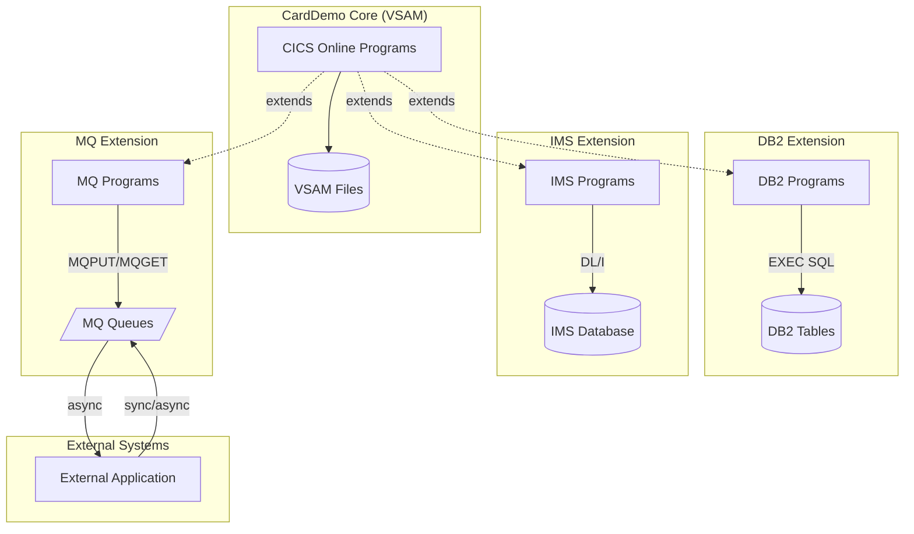
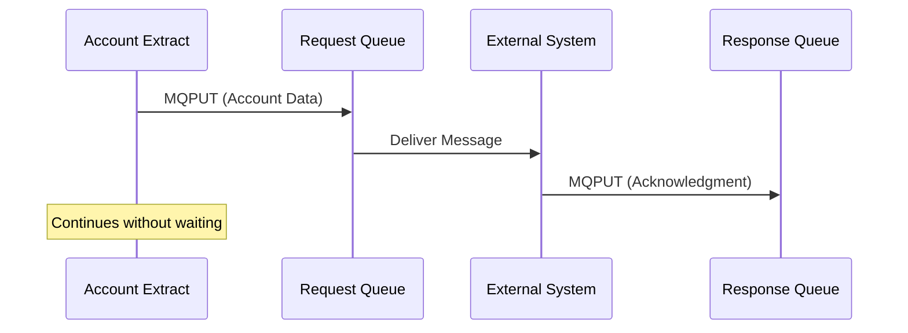

# RE-008: Integration Patterns Analysis

## Prompt

```xml
<context>
  <project>CardDemo - AWS mainframe credit card processing demonstration application</project>

  <role>
    <persona>Integration Architect specializing in mainframe middleware modernization to cloud-native integration patterns</persona>

    <mainframe_expertise>
      <skill>EXEC SQL programming: embedded SQL in COBOL for DB2 access (SELECT, INSERT, UPDATE, DELETE, cursors)</skill>
      <skill>SQLCODE and SQLCA interpretation: return code handling for DB2 operations (0=success, 100=not found, negative=error)</skill>
      <skill>DCLGEN copybooks: DB2 table declarations generated for COBOL programs</skill>
      <skill>Host variable binding: COBOL-to-DB2 data type mapping with null indicators</skill>
      <skill>IMS DL/I programming: hierarchical database access via CALL 'CBLTDLI' (GU, GN, GNP, ISRT, REPL, DLET)</skill>
      <skill>IMS PCB/PSB structures: Program Communication Blocks defining database views</skill>
      <skill>IBM MQ programming: MQCONN, MQOPEN, MQPUT, MQGET, MQCLOSE, MQDISC API patterns</skill>
      <skill>MQ message formats: understanding copybook-defined message structures for queue payloads</skill>
      <skill>CICS MQ integration: EXEC MQ commands vs batch MQ API calls</skill>
      <skill>Synchronous vs asynchronous patterns: request/response queues vs fire-and-forget messaging</skill>
    </mainframe_expertise>

    <modernization_expertise>
      <skill>REST API design: replacing DB2/IMS queries with RESTful resource endpoints</skill>
      <skill>GraphQL: flexible queries as alternative to cursor-based DB2 access patterns</skill>
      <skill>Event-driven architecture: MQ patterns → Amazon EventBridge, SNS, SQS, Kafka</skill>
      <skill>Amazon Aurora/RDS: managed relational databases replacing DB2</skill>
      <skill>Amazon DynamoDB: NoSQL alternative for hierarchical IMS-like data access</skill>
      <skill>Amazon MQ/SQS/SNS: managed messaging services replacing IBM MQ</skill>
      <skill>API Gateway: exposing integration points as managed APIs</skill>
      <skill>AWS AppSync: managed GraphQL as IMS replacement for complex queries</skill>
    </modernization_expertise>

    <carddemo_context>
      CardDemo base application uses VSAM only, but has three optional extension directories
      demonstrating enterprise integration patterns:

      app-authorization-ims-db2-mq/:
      - Purpose: Authorization processing with IMS hierarchical DB and DB2 relational data
      - Patterns: DL/I calls for customer hierarchy, EXEC SQL for authorization history, MQ for auth requests
      - Programs: Authorization-related extensions to base programs

      app-transaction-type-db2/:
      - Purpose: Transaction type management using DB2 lookup tables
      - Patterns: EXEC SQL SELECT for transaction type codes and descriptions
      - DCLGEN copybooks for table declarations

      app-vsam-mq/:
      - Purpose: Account data extraction with MQ messaging
      - Patterns: VSAM read → MQ message → external system
      - Message formats defined in copybooks

      These extensions show how the base VSAM application integrates with enterprise
      middleware—the same integration points that become cloud service integrations.
    </carddemo_context>

    <mindset>
      Extensions are optional but valuable—they demonstrate how a mainframe application grows to
      integrate with enterprise systems. The base VSAM-only CardDemo represents a standalone system;
      the extensions show evolution toward a connected enterprise. Document both what exists and
      what the integration patterns reveal about potential modernization paths. DB2 queries become
      API calls; MQ messages become events; IMS hierarchies inform NoSQL schema design.
    </mindset>
  </role>

  <objective>
    <primary_goal>
      Analyze and document all integration patterns in CardDemo extension directories including
      DB2 SQL patterns, IMS DL/I hierarchical access, and MQ messaging with message format
      specifications and modernization pathway recommendations.
    </primary_goal>

    <modernization_purpose>
      Integration pattern documentation guides middleware modernization decisions:
      - DB2 SQL patterns inform relational database migration (Aurora, RDS)
      - IMS hierarchical patterns inform NoSQL design (DynamoDB) or graph databases
      - MQ patterns become EventBridge rules, SQS queues, or SNS topics
      - Message formats become API schemas or event payload specifications
      - Integration points are natural API boundary candidates
      - Async patterns inform event-driven architecture design
    </modernization_purpose>

    <success_criteria>
      <criterion>All three extension directories inventoried with programs and copybooks</criterion>
      <criterion>DB2 patterns documented: tables accessed, SQL operations, cursor usage, SQLCODE handling</criterion>
      <criterion>IMS patterns documented: segments accessed, DL/I calls, PCB status code handling</criterion>
      <criterion>MQ patterns documented: queue names, message formats (copybook-defined), request/response flows</criterion>
      <criterion>Integration architecture diagram showing all external connectivity</criterion>
      <criterion>COBOL-to-modern type mappings for message/query payloads</criterion>
      <criterion>Modernization recommendations per integration type (DB2→Aurora, IMS→DynamoDB, MQ→EventBridge)</criterion>
      <criterion>If no extensions found, document base VSAM-only architecture and potential integration points</criterion>
    </success_criteria>

    <integration>
      This prompt depends on RE-001 (Domain Model) and RE-002 (Data Model) for entity understanding.
      Its outputs feed into:
      - RE-010 (Modernization) for integration complexity assessment
      - RE-011 (API Candidates) for identifying integration points as API candidates
      - RE-000 (Master Index) for integration architecture summary
    </integration>
  </objective>

  <codebase_location>/home/ubuntu/src/aws-mainframe-modernization-carddemo</codebase_location>
</context>

<foundational_principles>
  <principle id="1">CardDemo has optional extensions demonstrating DB2, IMS DB, and IBM MQ integration</principle>
  <principle id="2">EXEC SQL statements indicate DB2 integration points</principle>
  <principle id="3">DL/I calls indicate IMS DB integration</principle>
  <principle id="4">MQPUT/MQGET or EXEC MQ indicate IBM MQ messaging</principle>
  <principle id="5">Integration extensions are in separate directories (app-*-db2-mq/, etc.)</principle>
  <principle id="6">Base VSAM application can run independently of extensions</principle>
  <principle id="7">Integration patterns reveal potential modernization targets (API, event-driven)</principle>
  <principle id="8">DCLGEN copybooks define DB2 table-to-COBOL mappings</principle>
</foundational_principles>

<context_compaction_survival>
  <work_tracking_directory>
    <path>.work/reverse-engineering/specialized/integrations/</path>
    <purpose>Persist analysis progress to survive context window compaction</purpose>
  </work_tracking_directory>

  <progress_tracking_schema>
    <file>progress.yaml</file>
    <structure>
```yaml
extraction_phase: "extension_discovery|db2_analysis|ims_analysis|mq_analysis|documentation"
extensions_found:
  - name: "app-authorization-ims-db2-mq"
    status: "analyzed|pending"
  - name: "app-transaction-type-db2"
    status: "analyzed|pending"
  - name: "app-vsam-mq"
    status: "analyzed|pending"
db2_patterns_found:
  - type: "SELECT"
    program: "program_name"
    table: "table_name"
ims_patterns_found: []
mq_patterns_found: []
artifacts_created:
  - path: "db2-inventory.yaml"
    status: "complete|partial"
next_action: "Detailed next step"
last_updated: "ISO timestamp"
```
    </structure>
  </progress_tracking_schema>

  <resumption_protocol>
    <step>1. Read .work/reverse-engineering/specialized/integrations/progress.yaml</step>
    <step>2. Load completed analysis artifacts</step>
    <step>3. Resume from next_action</step>
    <step>4. Update progress after each extension analyzed</step>
  </resumption_protocol>
</context_compaction_survival>

<extension_directories>
  <extension name="app-authorization-ims-db2-mq">
    <description>Authorization processing with IMS hierarchical DB and DB2 relational data, messaging via MQ</description>
    <expected_patterns>
      <pattern type="DB2">Authorization tables, history logging</pattern>
      <pattern type="IMS">Customer hierarchy, account relationships</pattern>
      <pattern type="MQ">Authorization request/response messaging</pattern>
    </expected_patterns>
  </extension>
  <extension name="app-transaction-type-db2">
    <description>Transaction type management using DB2 tables</description>
    <expected_patterns>
      <pattern type="DB2">Transaction type lookup tables</pattern>
    </expected_patterns>
  </extension>
  <extension name="app-vsam-mq">
    <description>Account data extraction with MQ messaging</description>
    <expected_patterns>
      <pattern type="VSAM">Source account data</pattern>
      <pattern type="MQ">Account data export messages</pattern>
    </expected_patterns>
  </extension>
</extension_directories>

<methodology>
  <phase name="1_extension_discovery">
    <description>Inventory all integration extension directories</description>
    <steps>
      <step>List directories matching pattern app-*-db2*, app-*-ims*, app-*-mq*</step>
      <step>Inventory COBOL programs in each extension</step>
      <step>Inventory copybooks specific to each extension</step>
      <step>Identify which base programs are extended</step>
    </steps>
    <output_artifact>.work/reverse-engineering/specialized/integrations/extension-inventory.yaml</output_artifact>
  </phase>

  <phase name="2_db2_analysis">
    <description>Analyze DB2 integration patterns</description>
    <steps>
      <step>Search for EXEC SQL statements</step>
      <step>Identify DCLGEN copybooks (table definitions)</step>
      <step>Document SQL operations (SELECT, INSERT, UPDATE, DELETE)</step>
      <step>Map COBOL variables to DB2 columns</step>
      <step>Identify host variable declarations (SQLCA, SQLDA)</step>
    </steps>
    <db2_patterns>
      <pattern name="Single Row SELECT">
        EXEC SQL
          SELECT column1, column2
          INTO :host-var1, :host-var2
          FROM table_name
          WHERE key_column = :key-var
        END-EXEC
      </pattern>
      <pattern name="Cursor Processing">
        EXEC SQL DECLARE cursor-name CURSOR FOR
          SELECT ... FROM ... WHERE ...
        END-EXEC
        EXEC SQL OPEN cursor-name END-EXEC
        EXEC SQL FETCH cursor-name INTO :vars END-EXEC
        EXEC SQL CLOSE cursor-name END-EXEC
      </pattern>
      <pattern name="Insert">
        EXEC SQL
          INSERT INTO table_name (col1, col2)
          VALUES (:var1, :var2)
        END-EXEC
      </pattern>
      <pattern name="SQLCODE Checking">
        IF SQLCODE NOT = 0
           [error handling]
        END-IF
      </pattern>
    </db2_patterns>
    <output_artifact>.work/reverse-engineering/specialized/integrations/db2-inventory.yaml</output_artifact>
  </phase>

  <phase name="3_ims_analysis">
    <description>Analyze IMS DB integration patterns</description>
    <steps>
      <step>Search for CALL 'CBLTDLI' (DL/I calls)</step>
      <step>Identify DBD/PSB references</step>
      <step>Document segment layouts</step>
      <step>Map hierarchical relationships</step>
    </steps>
    <ims_patterns>
      <pattern name="Get Unique">
        CALL 'CBLTDLI' USING GU, PCB, IO-AREA, SSA
      </pattern>
      <pattern name="Get Next">
        CALL 'CBLTDLI' USING GN, PCB, IO-AREA
      </pattern>
      <pattern name="Get Next Within Parent">
        CALL 'CBLTDLI' USING GNP, PCB, IO-AREA
      </pattern>
      <pattern name="Insert">
        CALL 'CBLTDLI' USING ISRT, PCB, IO-AREA
      </pattern>
      <pattern name="Status Code Check">
        IF PCB-STATUS-CODE NOT = SPACES
           [error handling]
        END-IF
      </pattern>
    </ims_patterns>
    <output_artifact>.work/reverse-engineering/specialized/integrations/ims-inventory.yaml</output_artifact>
  </phase>

  <phase name="4_mq_analysis">
    <description>Analyze IBM MQ messaging patterns</description>
    <steps>
      <step>Search for EXEC MQ or CALL MQCONN/MQPUT/MQGET</step>
      <step>Identify queue names and queue managers</step>
      <step>Document message formats</step>
      <step>Map request/response patterns</step>
    </steps>
    <mq_patterns>
      <pattern name="Connect">
        CALL 'MQCONN' USING QMGR-NAME, HCONN, COMPCODE, REASON
      </pattern>
      <pattern name="Open Queue">
        CALL 'MQOPEN' USING HCONN, OBJDESC, OPTIONS, HOBJ, COMPCODE, REASON
      </pattern>
      <pattern name="Put Message">
        CALL 'MQPUT' USING HCONN, HOBJ, MSGDESC, PUTOPTS, MSGLEN, MSGDATA, COMPCODE, REASON
      </pattern>
      <pattern name="Get Message">
        CALL 'MQGET' USING HCONN, HOBJ, MSGDESC, GETOPTS, BUFLEN, BUFFER, MSGLEN, COMPCODE, REASON
      </pattern>
      <pattern name="CICS MQ">
        EXEC MQ PUT QNAME(queue-name) MSG(message-data)
      </pattern>
    </mq_patterns>
    <message_patterns>
      <pattern name="Request/Response">Synchronous call with reply queue</pattern>
      <pattern name="Fire and Forget">Asynchronous one-way message</pattern>
      <pattern name="Publish/Subscribe">Topic-based distribution</pattern>
    </message_patterns>
    <output_artifact>.work/reverse-engineering/specialized/integrations/mq-inventory.yaml</output_artifact>
  </phase>

  <phase name="5_documentation">
    <description>Generate integration patterns documentation</description>
    <deliverable>
      <file>docs/reverse-engineering/05-specialized/INTEGRATION-PATTERNS.md</file>
      <content>
        - Extension directory overview
        - DB2 integration patterns with SQL examples
        - IMS DB patterns with DL/I examples
        - MQ messaging patterns with message formats
        - Integration architecture diagram
        - Modernization recommendations (API, event-driven alternatives)
      </content>
    </deliverable>
  </phase>
</methodology>

<output_specifications>
  <output_directory>docs/reverse-engineering/05-specialized/</output_directory>

  <integration_architecture_template>

  </integration_architecture_template>

  <db2_documentation_template>
```markdown
## DB2 Integration

### Tables Accessed
| Table Name | Program | Operations | Purpose |
|------------|---------|------------|---------|
| AUTH_HIST | AUTHPROC | INSERT | Authorization history logging |
| TRAN_TYPE | TRANTYPB | SELECT | Transaction type lookup |

### SQL Pattern Examples

#### Single Row Select
**Program**: TRANTYPB
**Purpose**: Look up transaction type description
```cobol
EXEC SQL
    SELECT TRAN_TYPE_DESC
    INTO :WS-TRAN-TYPE-DESC
    FROM TRAN_TYPE
    WHERE TRAN_TYPE_CD = :WS-TRAN-TYPE-CD
END-EXEC.

IF SQLCODE = 0
    [process description]
ELSE IF SQLCODE = 100
    MOVE 'UNKNOWN' TO WS-TRAN-TYPE-DESC
ELSE
    [error handling]
END-IF.
```

### DCLGEN Copybooks
| Copybook | Table | Description |
|----------|-------|-------------|
| DCLTRANTYPE | TRAN_TYPE | Transaction type table declaration |
```
  </db2_documentation_template>

  <mq_documentation_template>
```markdown
## MQ Integration

### Queues Used
| Queue Name | Direction | Message Type | Purpose |
|------------|-----------|--------------|---------|
| ACCT.REQUEST.Q | Output | Account Extract | Export account data |
| ACCT.RESPONSE.Q | Input | Confirmation | Receive acknowledgment |

### Message Format
**Queue**: ACCT.REQUEST.Q
**Program**: ACCTEXTC
```
01 ACCT-EXTRACT-MSG.
   05 MSG-TYPE           PIC X(8) VALUE 'ACCTEXTR'.
   05 ACCOUNT-ID         PIC 9(11).
   05 CUSTOMER-ID        PIC 9(9).
   05 CREDIT-LIMIT       PIC S9(7)V99 COMP-3.
   05 CURRENT-BALANCE    PIC S9(7)V99 COMP-3.
   05 EXTRACT-TIMESTAMP  PIC X(26).
```

### Integration Pattern

  </mq_documentation_template>
</output_specifications>

<critical_reminders>
  <reminder id="1">Extensions are optional - base VSAM application works without them</reminder>
  <reminder id="2">EXEC SQL requires pre-compilation (DBRM creation)</reminder>
  <reminder id="3">SQLCODE checking is mandatory after every SQL statement</reminder>
  <reminder id="4">IMS DL/I calls use function codes (GU, GN, GNP, ISRT, REPL, DLET)</reminder>
  <reminder id="5">IMS status codes in PCB indicate success/failure</reminder>
  <reminder id="6">MQ completion codes (COMPCODE) and reason codes indicate results</reminder>
  <reminder id="7">Queue manager connection (MQCONN) required before queue operations</reminder>
  <reminder id="8">CICS MQ API differs from batch MQ API (EXEC MQ vs CALL MQ*)</reminder>
  <reminder id="9">Message formats are typically defined in copybooks</reminder>
  <reminder id="10">Document both synchronous and asynchronous patterns</reminder>
</critical_reminders>

<begin>
  <instruction>
    Check for existing progress:
    1. Read .work/reverse-engineering/specialized/integrations/progress.yaml if exists
    2. If progress exists:
       - Load completed analysis artifacts
       - Resume from next_action
    3. If starting fresh:
       - First check if extension directories exist
       - Begin with Phase 1: Extension Discovery
       - Create progress.yaml
    4. If no extensions found:
       - Document that base application uses VSAM only
       - Note potential integration points for modernization
    5. Analyze each integration type systematically
    6. Include modernization recommendations (REST API, event streaming)
  </instruction>
</begin>
```

## Usage

Execute this prompt with Claude Code to analyze integration patterns. The prompt will:

1. **Discover** integration extension directories
2. **Analyze** DB2 SQL patterns and table access
3. **Analyze** IMS DL/I patterns and hierarchical data
4. **Analyze** MQ messaging patterns and message formats
5. **Generate** integration documentation with modernization recommendations

## Expected Outputs

| File | Description |
|------|-------------|
| `INTEGRATION-PATTERNS.md` | DB2, IMS, MQ integration patterns and architecture |

## Dependencies

- RE-001 (Domain Model) - for entity understanding
- RE-002 (Data Model) - for base VSAM data model comparison

## Dependent Prompts

- RE-010 (Modernization) - integration complexity assessment
- RE-011 (API Candidates) - integration points as API candidates
