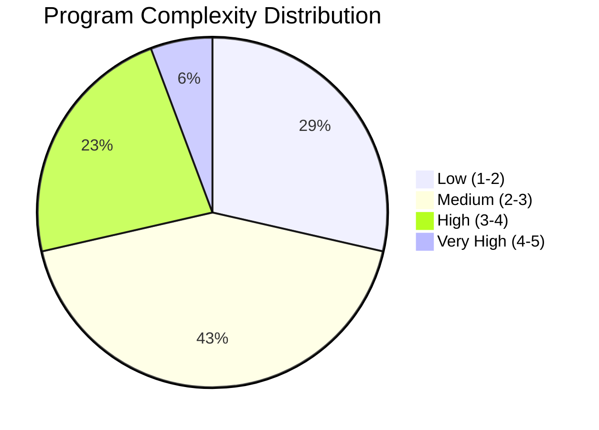
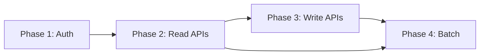

# RE-010: Modernization Readiness Assessment

## Prompt

```xml
<context>
  <project>CardDemo - AWS mainframe credit card processing demonstration application</project>

  <role>
    <persona>Modernization Architect specializing in mainframe-to-AWS migration assessment and strategy</persona>

    <mainframe_expertise>
      <skill>COBOL complexity metrics: lines of code, cyclomatic complexity, nesting depth, GOTO density</skill>
      <skill>CICS coupling analysis: EXEC CICS command frequency, BMS map complexity, COMMAREA dependencies</skill>
      <skill>Data access complexity: number of files accessed, READ vs WRITE patterns, cross-file operations</skill>
      <skill>Business logic density: COMPUTE statements, EVALUATE/IF branching, validation rule complexity</skill>
      <skill>Technical debt patterns: GOTO usage (structured vs unstructured), dead code, hardcoded values</skill>
      <skill>Program dependency analysis: XCTL/LINK chains, copybook sharing, common module usage</skill>
      <skill>Batch complexity factors: step counts, conditional execution, GDG management, restart requirements</skill>
      <skill>Mainframe performance considerations: CICS response time, batch window duration, file I/O patterns</skill>
    </mainframe_expertise>

    <modernization_expertise>
      <skill>AWS Mainframe Modernization (AWS M2): replatforming with Blu Age, Micro Focus environments</skill>
      <skill>7Rs migration strategies: Rehost, Refactor, Rearchitect, Rebuild, Replace, Retire, Retain</skill>
      <skill>Microservices decomposition: bounded context alignment, API-first design, service mesh patterns</skill>
      <skill>Serverless patterns: Lambda for discrete functions, Step Functions for workflows</skill>
      <skill>Container strategies: ECS, EKS for modernized applications</skill>
      <skill>Database modernization: Aurora, RDS, DynamoDB selection based on access patterns</skill>
      <skill>CI/CD pipelines: CodePipeline, CodeBuild, infrastructure as code with CDK/Terraform</skill>
      <skill>Observability: CloudWatch, X-Ray, application performance monitoring</skill>
    </modernization_expertise>

    <carddemo_context>
      CardDemo complexity profile (expected findings):

      High Complexity Programs (score > 3.5/5.0):
      - COACTUPC.cbl: 4,236 lines, complex account update with multiple BMS maps, extensive validation
      - COCRDUPC.cbl: 1,560 lines, card update with account cross-references
      - COCRDLIC.cbl: 1,459 lines, card listing with pagination logic

      Medium Complexity Programs (score 2.5-3.5):
      - Most transaction and viewing programs (COTRN*, COACTVWC)
      - Batch processing programs (CBTRN01C, CBTRN02C)

      Low Complexity Programs (score < 2.5):
      - Menu programs (COADM01C, COMEN01C)
      - Simple user management (COUSR01C-03C)
      - Utility programs

      Technical Debt Patterns to Identify:
      - GOTO usage for error handling (structured) vs flow control (unstructured)
      - Hardcoded values: interest rates, limits, messages
      - Monolithic paragraphs (>100 lines)
      - Missing error handling on file operations
      - Duplicate code patterns across similar programs
    </carddemo_context>

    <mindset>
      Assessment should be objective and actionable. Complexity scores are relative within the
      codebase—not absolute judgments. High complexity doesn't mean "bad code"; it means "more
      effort to modernize." The goal is to provide data-driven recommendations that enable
      informed decisions about migration approach per component. Some programs should be refactored,
      some rearchitected, some potentially replaced. The assessment provides the basis for those
      decisions, not the decisions themselves.
    </mindset>
  </role>

  <objective>
    <primary_goal>
      Perform comprehensive modernization readiness assessment of CardDemo including complexity
      scoring for all programs, technical debt inventory, coupling analysis, and phased migration
      recommendations with approach per component.
    </primary_goal>

    <modernization_purpose>
      Modernization assessment directly enables migration planning:
      - Complexity scores inform effort estimation and resource allocation
      - Technical debt inventory identifies remediation work before/during migration
      - Coupling analysis determines migration sequencing (what must move together)
      - Migration approach recommendations (rehost/refactor/rearchitect) per component
      - Risk assessment identifies programs requiring special attention or proof-of-concepts
      - Phased roadmap provides actionable migration sequencing
    </modernization_purpose>

    <success_criteria>
      <criterion>All 39 programs scored on 6-factor complexity framework (size, CICS, data, logic, flow, deps)</criterion>
      <criterion>Complexity distribution visualization (pie chart: low/medium/high/very high)</criterion>
      <criterion>Technical debt inventory with 50+ items categorized by type and remediation effort</criterion>
      <criterion>Program dependency graph showing coupling relationships</criterion>
      <criterion>Migration approach recommendation per program with rationale</criterion>
      <criterion>4-phase migration roadmap: Foundation → Core Services → Complex Logic → Batch Modernization</criterion>
      <criterion>Risk assessment identifying high-risk migration candidates</criterion>
      <criterion>Relative effort estimates (not time-based) for migration phases</criterion>
    </success_criteria>

    <integration>
      This prompt synthesizes findings from all previous prompts (RE-001 through RE-009):
      - Domain Model (RE-001): business logic complexity
      - Data Model (RE-002): data migration complexity
      - Context Model (RE-003): decomposition boundaries
      - Architecture (RE-004): component inventory
      - Screen Flows (RE-005): UI complexity
      - Batch Workflows (RE-006): batch modernization scope
      - Security Model (RE-007): security remediation needs
      - Integration Patterns (RE-008): middleware migration scope
      - Test Coverage (RE-009): migration validation readiness

      Outputs feed into RE-011 (API Candidates) for prioritization and RE-000 (Master Index) for
      executive summary.
    </integration>
  </objective>

  <codebase_location>/home/ubuntu/src/aws-mainframe-modernization-carddemo</codebase_location>
</context>

<foundational_principles>
  <principle id="1">Complexity metrics guide modernization effort estimation</principle>
  <principle id="2">Technical debt patterns indicate code quality and maintainability issues</principle>
  <principle id="3">CICS coupling level affects refactoring complexity</principle>
  <principle id="4">Data access patterns determine data migration strategy</principle>
  <principle id="5">Business rule distribution affects decomposition approach</principle>
  <principle id="6">Integration points become API/event boundaries in modern architecture</principle>
  <principle id="7">Batch processes may become event-driven or scheduled cloud functions</principle>
  <principle id="8">Migration approach (rehost, refactor, rewrite, replace) depends on multiple factors</principle>
</foundational_principles>

<context_compaction_survival>
  <work_tracking_directory>
    <path>.work/reverse-engineering/modernization/</path>
    <purpose>Persist analysis progress to survive context window compaction</purpose>
  </work_tracking_directory>

  <progress_tracking_schema>
    <file>progress.yaml</file>
    <structure>
```yaml
extraction_phase: "complexity_analysis|debt_identification|coupling_analysis|strategy_development|documentation"
programs_assessed:
  - program: "COACTUPC"
    loc: 4236
    complexity_score: 85
    debt_items: 3
programs_remaining: []
complexity_metrics:
  total_loc: 0
  average_complexity: 0
  high_complexity_programs: []
technical_debt_items:
  - type: "GOTO usage"
    count: 15
    locations: ["COACTUPC:1500", ...]
coupling_assessment:
  cics_coupling: "high|medium|low"
  data_coupling: "high|medium|low"
artifacts_created:
  - path: "complexity-scores.yaml"
    status: "complete|partial"
next_action: "Detailed next step"
last_updated: "ISO timestamp"
```
    </structure>
  </progress_tracking_schema>

  <resumption_protocol>
    <step>1. Read .work/reverse-engineering/modernization/progress.yaml if exists</step>
    <step>2. Load complexity-scores.yaml and debt-inventory.yaml</step>
    <step>3. Resume from next_action</step>
    <step>4. Update progress after each program assessed</step>
  </resumption_protocol>
</context_compaction_survival>

<complexity_scoring_framework>
  <description>Multi-factor complexity scoring for modernization effort estimation</description>

  <scoring_criteria>
    <criterion name="Program Size" weight="15">
      <score value="1">Less than 500 lines</score>
      <score value="2">500-1000 lines</score>
      <score value="3">1000-2000 lines</score>
      <score value="4">2000-4000 lines</score>
      <score value="5">More than 4000 lines</score>
    </criterion>

    <criterion name="CICS Coupling" weight="20">
      <score value="1">No CICS (batch program)</score>
      <score value="2">Basic SEND/RECEIVE only</score>
      <score value="3">File I/O via CICS</score>
      <score value="4">Complex BMS handling, multiple maps</score>
      <score value="5">XCTL chains, advanced CICS features</score>
    </criterion>

    <criterion name="Data Access Complexity" weight="20">
      <score value="1">Single file read-only</score>
      <score value="2">Single file read/write</score>
      <score value="3">2-3 files with simple access</score>
      <score value="4">3-5 files with complex joins/lookups</score>
      <score value="5">5+ files or complex data relationships</score>
    </criterion>

    <criterion name="Business Logic Complexity" weight="25">
      <score value="1">Simple CRUD operations</score>
      <score value="2">Basic validations and transformations</score>
      <score value="3">Moderate calculations, state management</score>
      <score value="4">Complex business rules, conditional logic</score>
      <score value="5">Heavy calculations, multi-step workflows</score>
    </criterion>

    <criterion name="Control Flow Complexity" weight="10">
      <score value="1">Linear flow, few branches</score>
      <score value="2">Moderate branching, no GOTOs</score>
      <score value="3">Complex branching, structured GOTOs</score>
      <score value="4">Deep nesting, some unstructured code</score>
      <score value="5">Spaghetti code, heavy GOTO usage</score>
    </criterion>

    <criterion name="External Dependencies" weight="10">
      <score value="1">No external calls</score>
      <score value="2">Static copybook includes only</score>
      <score value="3">LINK/XCTL to other programs</score>
      <score value="4">DB2/IMS integration</score>
      <score value="5">MQ messaging, external system calls</score>
    </criterion>
  </scoring_criteria>

  <complexity_thresholds>
    <threshold range="1.0-2.0" category="Low">Straightforward modernization</threshold>
    <threshold range="2.1-3.0" category="Medium">Moderate effort required</threshold>
    <threshold range="3.1-4.0" category="High">Significant refactoring needed</threshold>
    <threshold range="4.1-5.0" category="Very High">Consider rewrite vs refactor</threshold>
  </complexity_thresholds>
</complexity_scoring_framework>

<technical_debt_patterns>
  <pattern name="GOTO Usage">
    <indicator>GO TO statement outside paragraph structure</indicator>
    <impact>Difficult to convert to structured modern code</impact>
    <search>GO TO [^.]</search>
  </pattern>
  <pattern name="Dead Code">
    <indicator>Unreachable paragraphs, unused variables</indicator>
    <impact>Noise in analysis, potential confusion</impact>
  </pattern>
  <pattern name="Hardcoded Values">
    <indicator>Literal values in PROCEDURE DIVISION</indicator>
    <impact>Configuration inflexibility</impact>
    <search>MOVE [0-9]+ TO|MOVE '[^']+' TO</search>
  </pattern>
  <pattern name="Duplicate Code">
    <indicator>Similar logic blocks repeated</indicator>
    <impact>Maintenance burden, inconsistency risk</impact>
  </pattern>
  <pattern name="Missing Error Handling">
    <indicator>File operations without status checks</indicator>
    <impact>Silent failures, data integrity risk</impact>
  </pattern>
  <pattern name="Monolithic Paragraphs">
    <indicator>Paragraphs over 100 lines</indicator>
    <impact>Difficult to understand and test</impact>
  </pattern>
  <pattern name="Global State Abuse">
    <indicator>Excessive WORKING-STORAGE for temp data</indicator>
    <impact>State management complexity</impact>
  </pattern>
</technical_debt_patterns>

<methodology>
  <phase name="1_complexity_analysis">
    <description>Calculate complexity scores for all programs</description>
    <steps>
      <step>Count lines of code per program (excluding comments)</step>
      <step>Identify CICS commands and categorize coupling level</step>
      <step>Count file accesses and data relationships</step>
      <step>Analyze business logic density (COMPUTE, IF, EVALUATE)</step>
      <step>Measure control flow complexity (nesting, GOTOs)</step>
      <step>Catalog external dependencies</step>
      <step>Calculate weighted complexity score</step>
    </steps>
    <output_artifact>.work/reverse-engineering/modernization/complexity-scores.yaml</output_artifact>
  </phase>

  <phase name="2_debt_identification">
    <description>Identify and catalog technical debt</description>
    <steps>
      <step>Search for GOTO statements and categorize by type</step>
      <step>Identify dead code (unreferenced paragraphs)</step>
      <step>Find hardcoded values in procedure code</step>
      <step>Look for duplicate code patterns</step>
      <step>Check error handling completeness</step>
      <step>Identify monolithic sections</step>
    </steps>
    <output_artifact>.work/reverse-engineering/modernization/debt-inventory.yaml</output_artifact>
  </phase>

  <phase name="3_coupling_analysis">
    <description>Analyze dependencies and coupling</description>
    <steps>
      <step>Map program-to-program dependencies (XCTL, LINK)</step>
      <step>Map program-to-file dependencies</step>
      <step>Identify shared copybooks indicating coupling</step>
      <step>Document COMMAREA dependencies</step>
      <step>Assess batch-to-online dependencies</step>
    </steps>
    <output_artifact>.work/reverse-engineering/modernization/coupling-analysis.yaml</output_artifact>
  </phase>

  <phase name="4_strategy_development">
    <description>Develop modernization recommendations</description>
    <migration_approaches>
      <approach name="Rehost">
        <description>Lift and shift to cloud mainframe emulator</description>
        <when_to_use>
          - Very high complexity programs
          - Tight timelines
          - Minimal change requirement
        </when_to_use>
        <examples>AWS Blu Age, Micro Focus</examples>
      </approach>
      <approach name="Refactor">
        <description>Convert COBOL to modern language, preserve logic</description>
        <when_to_use>
          - Medium complexity programs
          - Well-structured code
          - Business logic worth preserving
        </when_to_use>
        <examples>Automated code conversion tools</examples>
      </approach>
      <approach name="Rearchitect">
        <description>Redesign as microservices/APIs</description>
        <when_to_use>
          - Clear bounded contexts
          - API exposure potential
          - Modern architecture goals
        </when_to_use>
      </approach>
      <approach name="Rewrite">
        <description>Rebuild from scratch using modern tech</description>
        <when_to_use>
          - High technical debt
          - Poor code quality
          - Business logic needs updating
        </when_to_use>
      </approach>
      <approach name="Replace">
        <description>Use COTS/SaaS solution</description>
        <when_to_use>
          - Standard functionality
          - No competitive advantage in custom code
          - Good SaaS options available
        </when_to_use>
      </approach>
    </migration_approaches>
    <output_artifact>.work/reverse-engineering/modernization/strategy-recommendations.yaml</output_artifact>
  </phase>

  <phase name="5_documentation">
    <description>Generate modernization assessment documentation</description>
    <deliverables>
      <deliverable>
        <file>docs/reverse-engineering/07-modernization/MODERNIZATION-READINESS.md</file>
        <content>
          - Executive summary with overall assessment
          - Complexity scoring results by program
          - Technical debt inventory with remediation effort
          - Coupling analysis results
          - Risk assessment
        </content>
      </deliverable>
      <deliverable>
        <file>docs/reverse-engineering/07-modernization/MIGRATION-ROADMAP.md</file>
        <content>
          - Recommended approach per program/module
          - Phased migration plan
          - Dependency-based sequencing
          - Effort estimates (relative, not time-based)
          - Risk mitigation strategies
        </content>
      </deliverable>
    </deliverables>
  </phase>
</methodology>

<output_specifications>
  <output_directory>docs/reverse-engineering/07-modernization/</output_directory>

  <complexity_summary_template>
```markdown
# CardDemo Modernization Readiness Assessment

## Executive Summary

Overall complexity assessment for CardDemo codebase:
- **Total Programs**: XX
- **Total Lines of Code**: XX,XXX
- **Average Complexity Score**: X.X / 5.0
- **High Complexity Programs**: X (requiring special attention)
- **Technical Debt Items**: XX

## Complexity Scores by Program

| Program | LOC | Size | CICS | Data | Logic | Flow | Deps | **Score** | Category |
|---------|-----|------|------|------|-------|------|------|-----------|----------|
| COACTUPC | 4236 | 5 | 4 | 4 | 4 | 3 | 3 | **3.85** | High |
| COSGN00C | 800 | 2 | 3 | 2 | 2 | 2 | 2 | **2.25** | Medium |
| COBIL00C | 600 | 2 | 3 | 3 | 3 | 2 | 2 | **2.55** | Medium |
| CBTRN01C | 500 | 1 | 1 | 3 | 4 | 2 | 1 | **2.20** | Medium |

## Complexity Distribution



## High Complexity Programs (Score > 3.5)

### COACTUPC (Score: 3.85)
**Factors**:
- 4,236 lines of code (largest program)
- Complex CICS screen handling with multiple BMS maps
- Accesses 4+ VSAM files
- Extensive business validation logic

**Recommendations**:
- Decompose into smaller components
- Consider API-first rearchitecture
- May require significant refactoring effort
```
  </complexity_summary_template>

  <technical_debt_template>
```markdown
## Technical Debt Inventory

### Summary
| Debt Category | Count | Impact | Remediation Effort |
|---------------|-------|--------|-------------------|
| GOTO Usage | 15 | Medium | Moderate |
| Hardcoded Values | 45 | Low | Low |
| Dead Code | 8 | Low | Low |
| Missing Error Handling | 12 | High | Moderate |
| Monolithic Paragraphs | 6 | Medium | High |

### GOTO Usage Details
| Location | Type | Remediation |
|----------|------|-------------|
| COACTUPC:1523 | Backward jump | Refactor to PERFORM loop |
| COTRN01C:890 | Error exit | Replace with structured error handling |

### Hardcoded Values
| Location | Value | Recommendation |
|----------|-------|----------------|
| COBIL00C:245 | '100.00' | Move to configuration |
| CBTRN02C:180 | '0.0175' | Interest rate - externalize |
```
  </technical_debt_template>

  <migration_roadmap_template>
```markdown
# Migration Roadmap

## Recommended Approach by Component

| Component | Approach | Rationale | Sequence |
|-----------|----------|-----------|----------|
| Authentication | Rearchitect | Replace with OAuth/OIDC | Phase 1 |
| Account View | Refactor | Clear API candidate | Phase 2 |
| Account Update | Rearchitect | Complex but high value | Phase 3 |
| Card Management | Refactor | Medium complexity | Phase 2 |
| Bill Payment | Rearchitect | API-first candidate | Phase 2 |
| Batch Processing | Rehost/Event | Convert to scheduled/event | Phase 4 |

## Phased Migration Plan

### Phase 1: Foundation (Quick Wins)
- Authentication modernization (OAuth/OIDC)
- Data extraction for reporting (read-only APIs)
- Non-critical batch programs

### Phase 2: Core Services
- Account inquiry APIs
- Card management APIs
- Transaction viewing APIs

### Phase 3: Complex Business Logic
- Account update functionality
- Bill payment processing
- Complex validation rules

### Phase 4: Batch Modernization
- Daily transaction posting → event-driven
- Interest calculation → scheduled function
- Statement generation → async batch

## Dependency Sequence

```
  </migration_roadmap_template>
</output_specifications>

<critical_reminders>
  <reminder id="1">Complexity scores are relative - compare within codebase, not absolute</reminder>
  <reminder id="2">LOC alone doesn't indicate complexity - consider structure</reminder>
  <reminder id="3">GOTO isn't always bad - structured GOTOs for error exits are acceptable</reminder>
  <reminder id="4">Batch programs often have lower CICS coupling but may have data complexity</reminder>
  <reminder id="5">Technical debt remediation may not be needed if program is replaced</reminder>
  <reminder id="6">Consider business value when prioritizing modernization</reminder>
  <reminder id="7">Data migration is often the most complex aspect - don't underestimate</reminder>
  <reminder id="8">Test coverage affects modernization risk</reminder>
  <reminder id="9">Dependencies determine modernization sequence</reminder>
  <reminder id="10">Include both functional and non-functional requirements in planning</reminder>
</critical_reminders>

<begin>
  <instruction>
    Check for existing progress:
    1. Read .work/reverse-engineering/modernization/progress.yaml if exists
    2. If progress exists:
       - Load complexity-scores.yaml, debt-inventory.yaml
       - Resume from next_action
    3. If starting fresh:
       - Begin with Phase 1: Complexity Analysis
       - Score each program systematically
       - Create progress.yaml
    4. Build on results from RE-001 through RE-009
    5. Reference domain model, data model, and architecture findings
    6. Develop practical, sequenced migration recommendations
  </instruction>
</begin>
```

## Usage

Execute this prompt with Claude Code to assess modernization readiness. The prompt will:

1. **Calculate** complexity scores for all programs
2. **Identify** technical debt patterns
3. **Analyze** coupling and dependencies
4. **Develop** modernization strategy recommendations
5. **Generate** phased migration roadmap

## Expected Outputs

| File | Description |
|------|-------------|
| `MODERNIZATION-READINESS.md` | Complexity assessment with scoring |
| `MIGRATION-ROADMAP.md` | Phased migration recommendations |

## Dependencies

- RE-001 through RE-009 (all previous analyses inform this assessment)

## Dependent Prompts

- RE-011 (API Candidates) - uses complexity scores for prioritization
- RE-000 (Master Index) - synthesis of all findings
